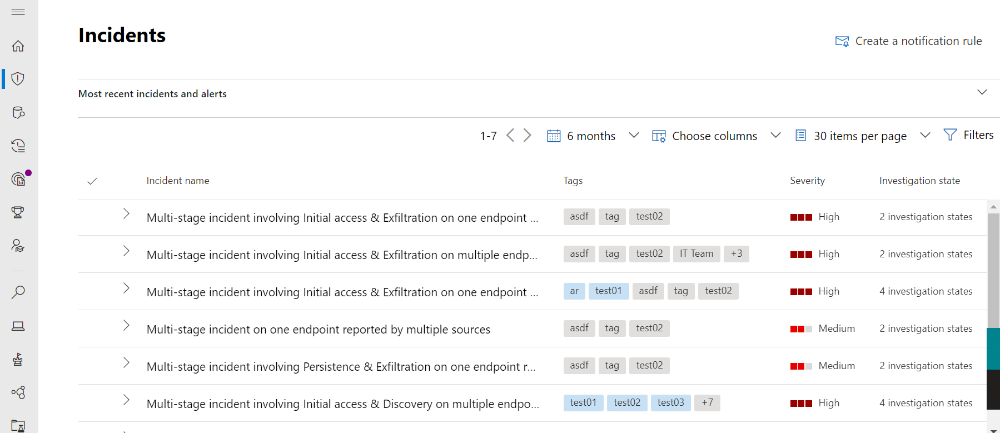

# Microsoft 365 security center overview

[!INCLUDE [Microsoft 365 Defender rebranding](../includes/microsoft-defender.md)]

**Applies to:**
- [Microsoft 365 Defender](https://go.microsoft.com/fwlink/?linkid=2118804)

> Want to experience Microsoft 365 Defender? You can [evaluate it in a lab environment](https://aka.ms/mtp-trial-lab) or [run your pilot project in production](https://aka.ms/m365d-pilotplaybook).

The new Microsoft 365 security center ([https://security.microsoft.com](https://security.microsoft.com)) integrates Microsoft 365 services and endpoints, so that devices, email, identities, and app security can be managed from a single location. This center emphasizes quick access to information, simpler layouts, and clarity across a single security center.

The Microsoft 365 security center combines these centers into one:

1. **Microsoft Defender for Office 365**
1. **Microsoft Defender for Endpoint**
1. **Microsoft 365 Defender**

If you need information about what's changed from the Office 365 Security & Compliance center or the Microsoft Defender Security Center, see:

- [Defender for Office 365 in the Microsoft 365 security center](microsoft-365-security-center-mdo.md)
- [Defender for Endpoint in the Microsoft 365 security center](microsoft-365-security-center-mde.md)
- [Microsoft 365 Defender](https://docs.microsoft.com/en-us/microsoft-365/security/mtp/microsoft-threat-protection?view=o365-worldwide)

> [!NOTE]
> You can now *manage and rotate* DomainKeys Identified Mail (DKIM) keys through the Microsoft 365 security center: https://security.microsoft.com/threatpolicy, or navigate to **Policy & rules > Threat policies > DKIM**.

## What to expect

The Microsoft 365 security center emphasizes *unity, clarity, and common goals* as it merges Microsoft Defender for Office 365 and Microsoft Defender for Endpoint. The merge was based on the priorities listed below, and made without sacrificing the capabilities that each security suite brought to the combination:

- common building blocks
- common terminology
- common entities
- parity

## Efficiency gains

Streamlining security centers creates a single pane for investigating any incidents taking place in Office 365. A primary example is the **Incidents** node on the quick launch of the Microsoft 365 security center.

As an example, double-clicking on an incident name with **High** severity brings you to a page that demonstrates the advantage of converging centers.

> [!TIP]
> The converged **Users** tab is a good place to begin your inquiries. This single page surfaces information for users from converged workloads (Microsoft Defender for Endpoint, Microsoft Defender for Identity, and MCAS, if you leverage it) and a range of sources such as on-premises Active Directory, Azure Active Directory, synced, local, and third-party users.

Incident information shows user/identity specifics and at-risk devices, beside affected mailboxes. It also relates any **Investigation information** and gathered **Evidence**. This makes it easier for admins and security operation teams to pivot from one high-risk alert to the affected users and mailboxes. Looking at the **Incident** tabs at the top of this page, there are other key security pivots available from this single location.

> [!IMPORTANT]
> Along the top of any page for a specific Incident, you'll see the **Summary**, **Alerts**, **Devices**, **Users**, **Mailboxes**, **Investigations**, and **Evidence** tabs.

Selecting **Investigations** opens  a page that features a graphic of the analysis taking place and lists a status (such as **pending approval**) for remediation. Take time to select specific incidents in your environment, drill down into these tabs, and practice building a profile for different kinds of threats. Familiarity will benefit any later pressing investigations.

## Improved processes

The layout has been merged wherever centers overlap. Common controls and content either appear in the same place, or are condensed into one feed of data making it easier to find. For example, unified settings.

**Unified settings**

### Integrated permissions & roles

 Selecting either of **Roles** or **Device groups** drops admins deeper into the **Permissions** section (but take a second to look at the other nodes here).

- **Roles** allow admins to create and bundle permissions, and then add user groups to them. Role creation is done on the General tab. Members of the security team can access parts of the center to do work, once they're added here. After creation, the Role wizard also reminds you that user groups can be added to this Role 'at a later phase' using the **Assigned user groups** tab.

- **Device Groups** work the same way. On the same **General** flyout where you create the Device Group, you can select the **User access** tab to grant Azure AD user groups access to a device group.

### Integrated reports

Reports are also unified in the Microsoft 365 security center. Admins can start with a general security report, and branch into specific reports about endpoints, email & collaboration. The links here are dynamically generated based upon workload configuration.

## Office 365 Cloud App Security and other security integrations

As admins and operations teams work, they will find other points where features from different security centers have merged. It's important to explore the new portal to build familiarity and highlight any issues that can be reported through giving feedback on the home page. You can also quickly access self-help, and Microsoft for help, if assistance is called for.

 If you use **Office 365 Cloud App Security**, you can leverage its features for discovering Shadow IT apps, controlling app permissions to Office 365, and more by going to **Policies & rules > Manage advanced alerts**. 
 **Microsoft 365 security center** now shows analysis from Office 365 Cloud App Security in the new **Incidents & Alerts** section. Because this info is included in the converged analysis, it creates a more complete narrative for admins and operations teams. 

### Related information

[Watch 'Intro to unified portal'](https://msit.microsoftstream.com/video/2300a1ff-0400-b9eb-d203-f1eb3fc369fd?App=msteamsBot&refId=f:5540385164873375231&referrer=https:%2F%2Fstatics.teams.cdn.office.net%2F)

[Give us your Microsoft 365 Defender feedback](https://www.microsoft.com/en-us/videoplayer/embed/RE4K5Ci)

[The Action center](https://docs.microsoft.com/microsoft-365/security/mtp/mtp-action-center)

[Email & collaboration alerts](https://docs.microsoft.com/microsoft-365/compliance/alert-policies#default-alert-policies)

[Hunt for threats across devices, emails, apps, and identities](https://docs.microsoft.com/microsoft-365/security/mtp/advanced-hunting-query-emails-devices)

[Custom detection rules](https://docs.microsoft.com/windows/security/threat-protection/microsoft-defender-atp/custom-detection-rules)

**Attack Simulator** [Create a phishing attack simulation](https://docs.microsoft.com/microsoft-365/security/office-365-security/attack-simulation-training) and [create a payload for training your people](https://docs.microsoft.com/microsoft-365/security/office-365-security/attack-simulation-training-payloads)
