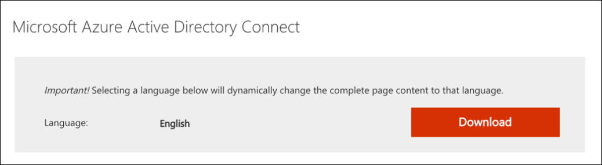
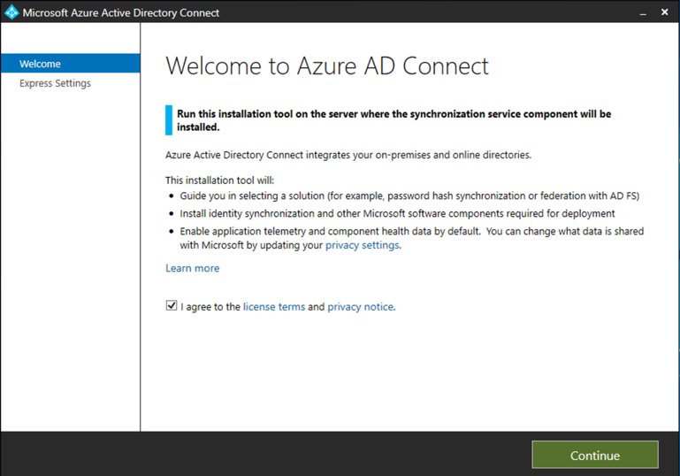
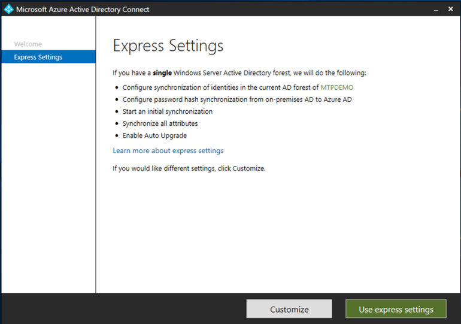
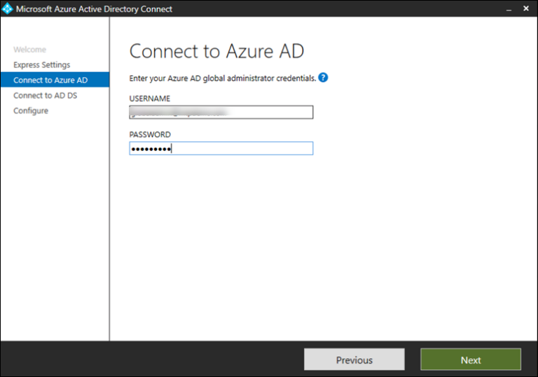
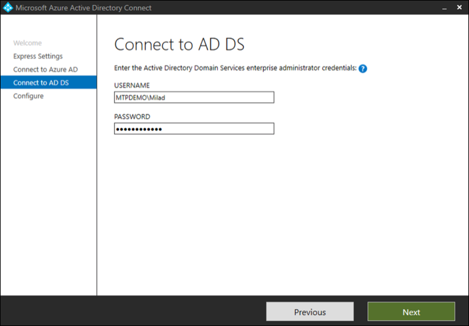
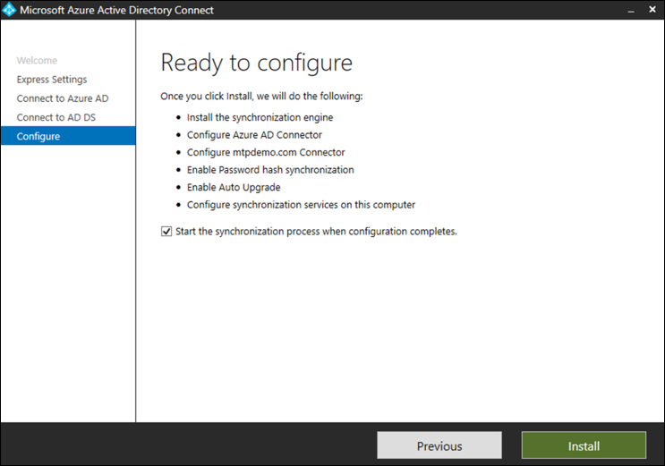
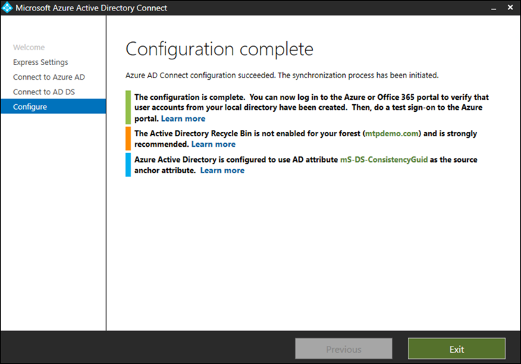

# Prepare your Microsoft Threat Protection trial lab environment

**Applies to:**
- Microsoft Threat Protection

Creating a Microsoft Threat Protection trial lab environment and deploying it is a three-phase process:

 
<table border="0" width="100%" align="center">
  <tr style="text-align:center;">
    <td align="center" style="width:25%; border:0;" bgcolor="#d5f5e3">
      <a href= "https://docs.microsoft.com/microsoft-365/security/mtp/prepare-mtpeval"> 
        
       Phase 1: Prepare </a> 
    </td>
     <td align="center"  >
      <a href="https://docs.microsoft.com/microsoft-365/security/mtp/setup-mtpeval">
        
       Phase 2: Setup </a> 
        </td>
    <td align="center">
      <a href="https://docs.microsoft.com/microsoft-365/security/mtp/config-mtpeval">
        
       Phase 3: Configure & Onboard</a> 
</td>
  </tr>
  <tr>
    <td style="width:25%; border:0;">
   
    </td>
    <td valign="top" style="width:25%; border:0;">
    
</td>
    <td valign="top" style="width:25%; border:0;">

</td>    
  </tr>
</table>

You're currently in the preparation phase.

Preparation is key to any successful deployment. This section will guide you through what you need to consider as you prepare to create a trial lab environment for your Microsoft Threat Protection deployment.

## Prerequisites
Learn about the licensing, hardware and software requirements, and other configuration settings to provision and use Microsoft Threat Protection. See the minimum requirements for [Microsoft Threat Protection](https://docs.microsoft.com/microsoft-365/security/mtp/prerequisites?view=o365-worldwide), [Microsoft Defender ATP](https://docs.microsoft.com/windows/security/threat-protection/microsoft-defender-atp/minimum-requirements), [Office 365 ATP](https://docs.microsoft.com/office365/servicedescriptions/office-365-advanced-threat-protection-service-description), [Azure ATP](https://docs.microsoft.com/azure-advanced-threat-protection/atp-prerequisites), [Microsoft Cloud App Security](https://docs.microsoft.com/azure-advanced-threat-protection/atp-prerequisites).

## Stakeholders and sign-off
The following section serves to identify all the stakeholders that are involved in the project and who may need to sign-off, review, or stay informed, even for an evaluation or proof of concept dry-run.

>[!NOTE]
>Not all organizations might have the security organization maturity to have such roles. In such case, consult with your leadership team on review and approval accountabilities.

Add stakeholders
to the table below as appropriate for your organization.

-   SO = Sign-off on this project

-   R = Review this project and provide input

-   I = Informed of this project

| Name                 | Role                                                                                                                                                                                                          | Action |
|----------------------|---------------------------------------------------------------------------------------------------------------------------------------------------------------------------------------------------------------|--------|
| Enter name and email | **Chief Information Security Officer (CISO)** *An executive representative who serves as sponsor inside the organization for the new technology deployment.*                                                  | SO     |
| Enter name and email | **Head of Cyber Defense Operations Center (CDOC)** *A representative from the CDOC team in charge of defining how this change is aligned with the processes in the customers security operations team.*       | SO     |
| Enter name and email | **Security Architect** *A representative from the Security team in charge of defining how this change is aligned with the core Security architecture in the organization.*                         | R      |
| Enter name and email | **Workplace Architect** *A representative from the IT team in charge of defining how this change is aligned with the core workplace architecture in the organization.*                             | R      |
| Enter name and email | **Security Analyst** *A representative from the CDOC team who can provide input on the detection capabilities, user experience, and overall usefulness of this change from a security operations perspective.* | I      |

## Prepare your Azure Active Directory
Skip this step if you have already enabled synchronization between Active Directory and Azure Active Directory on premises. Review existing best practices documentation from Azure Active Directory. The following steps are optimized to evaluate Microsoft Threat Protection.

1. Go to the [Azure Active Directory](https://portal.azure.com/#blade/Microsoft_AAD_IAM/ActiveDirectoryMenuBlade) portal > **Azure AD Connect**. 
   

2. Click **Download** from **Microsoft Azure Active Directory Connect** and transfer it to your Domain Controller.
  

3. On the domain controller, follow the Azure Active Directory Connect wizard. Read the license terms and privacy notice and select the checkbox if you agree. Click **Continue**.
  

4. Navigate to **Express Settings**.
  

5. Enter your global administrator credentials. Click **Next**.
  

6. Enter your Active Directory Domain Services enterprise administrator credentials. Click **Next**.
  

7. Click **Install** to confirm the configuration.
  

8. Congratulations, you have successfully configured Azure Active Directory Connect.
  

You can now [add users and groups to Active Directory](https://docs.microsoft.com/azure-advanced-threat-protection/atp-playbook-setup-lab#bkmk_hydrate) and [configure a SAM-R policy](https://docs.microsoft.com/azure-advanced-threat-protection/atp-playbook-setup-lab#configure-sam-r-capabilities-from-contosodc).  

## Configuration order
The table below indicates the order Microsoft recommends for configuring the Microsoft Threat Protection components for your trial lab environment deployment.

| Component                               | Description                                                                                                                                                                                                                                                                                                                                                                                                                                                                                                                                                                                                                                                                                              | Configuration order rank |
|-----------------------------------------|----------------------------------------------------------------------------------------------------------------------------------------------------------------------------------------------------------------------------------------------------------------------------------------------------------------------------------------------------------------------------------------------------------------------------------------------------------------------------------------------------------------------------------------------------------------------------------------------------------------------------------------------------------------------------------------------------------|---------------------|
| Office 365 Advanced Threat Protection| Office 365 ATP safeguards your organization against malicious threats posed by email messages, links (URLs), and collaboration tools.   [Learn more.](https://docs.microsoft.com/microsoft-365/security/office-365-security/office-365-atp?view=o365-worldwide)                                                                                                                                                                                                                                             | 1                   |
|Azure Advanced Threat Protection|Azure ATP uses Active Directory signals to identify, detect, and investigate advanced threats, compromised identities, and malicious insider actions directed at your organization.   [Learn more](https://docs.microsoft.com/azure-advanced-threat-protection/).| 2 |
|Microsoft Cloud App Security| Microsoft Cloud App Security is a Cloud Access Security Broker (CASB) that operates on multiple clouds. It provides rich visibility, control over data travel, and sophisticated analytics to identify and combat cyberthreats across all your cloud services.   [Learn more](https://docs.microsoft.com/cloud-app-security/).                                                                                                                                                                                                                                                                                                                                                                       |3                   |
|Microsoft Defender Advanced Threat Protection | Microsoft Defender ATP endpoint detection and response capabilities provide advanced attack detections that are near real-time and actionable. Security analysts can prioritize alerts effectively, gain visibility into the full scope of a breach, and take response actions to remediate threats.   [Learn more.](https://docs.microsoft.com/windows/security/threat-protection/microsoft-defender-atp/microsoft-defender-advanced-threat-protection)                                     |4                   |                                                                                                                                                                                                                                    

## Next step
  [Phase 2: Setup](setup-mtpeval.md)  Set up your Microsoft Threat Protection trial lab environment

