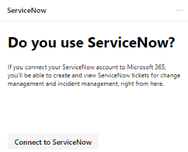
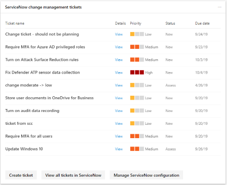

# Create and track ServiceNow tickets in the Microsoft 365 security center

[!INCLUDE [Microsoft 365 Defender rebranding](../includes/microsoft-defender.md)]

>[!CAUTION]
>**The preview period for the ServiceNow connector is ending** 
>This capability will no longer available by the end of November 2020. Thank you for your feedback and continued support while we determine next steps.

The [Microsoft 365 security center](overview-security-center.md) has been enhanced with the ability to natively create and track tickets in ServiceNow. [Learn more about ServiceNow](https://www.servicenow.com/)

In the security center, security administrators can send a [Microsoft Secure Score](microsoft-secure-score.md) improvement action directly to ServiceNow and create a ticket. Both incident management and change management tickets can be created. Track tickets in the security center home page and ServiceNow.

- [**Learn about prerequisites, data exchange, and troubleshooting**](tickets.md)
- **Manage ServiceNow tickets in the compliance center** (not available)

## Connect Microsoft 365 security center to ServiceNow

Navigate to the Microsoft 365 security center home page to see the ServiceNow connection card.

Select "Connect to ServiceNow" to go to the ServiceNow setup page. Follow the instructions to authorize the Microsoft 365 Connector app.

> [!NOTE]
> Before you authorize the connection between Microsoft 365 security center and ServiceNow, make sure you use the integration user login and password you created in the installation steps. Do not use your personal credentials.

After you've followed the directions and authorized the connection, view the connection status in the Microsoft 365 security center connection page and in the ServiceNow Microsoft 365 Ticketing Connector App experience. Now you're all set to start creating tasks!

### Troubleshooting

Learn common errors you may come across in the connection process, and how to mitigate them, in the [troubleshooting section](tickets.md#troubleshooting).

## Create a task and share it to ServiceNow

Once the integration is set up, create ServiceNow tasks based on specific [Microsoft Secure Score](microsoft-secure-score.md) improvement actions. Go to any Secure Score improvement action in the Microsoft 365 security center, and select **Share**. One of the dropdown options is ServiceNow.

A task is generated where you can set the priority and edit the name, description, or due date. Once all the required fields are filled in, send the task to ServiceNow.

The task is visible in ServiceNow as a Microsoft 365 Security and Configuration Change Request.

## Track tickets

Once ServiceNow change management and incident management tickets have been created, they're displayed on cards in the Microsoft 365 security center home page. From these cards, you can create a ticket, view all tickets, or manage the ServiceNow configuration.

  

To reprovision or manage your ServiceNow integration in the Microsoft 365 security center, select **Manage ServiceNow configuration** on either of the cards. From there, remove the current ServiceNow connection and customize ticket state names.

With ServiceNow tickets visible in the Microsoft 365 security center, your tasks live in a place where they can be tracked and acted upon alongside your other security dashboard items.

## Resources

- [Learn about prerequisites, data exchange, and troubleshooting](tickets.md)
- [Microsoft Secure Score](microsoft-secure-score.md)
