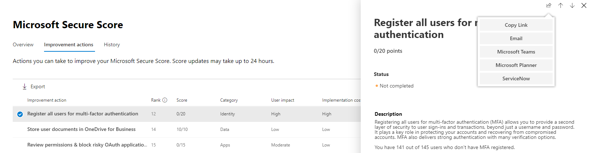

# Manage tickets through ServiceNow

Microsoft 365 security center is being enhanced with the ability to natively create and track tickets in ServiceNow. Security administrators can send a [Microsoft Secure Score](microsoft-secure-score.md) improvement action directly to ServiceNow and create a ticket. Both incident management and change management tickets can be created.

## Prerequisites

Have access to the Microsoft 365 security center and a ServiceNow instance with:  

* Kingston or higher version
* Have admin HI credentials
* Have admin privileges on your target vendor instance

ServiceNow recommends that users keep default settings in your ServiceNow instance. Having customizations could cause errors when completing the installation checklist and integration with the Microsoft 365 security center.

## Data exchange

When you connect the Microsoft 365 security center to ServiceNow, Microsoft receives the following additional data:

* ServiceNow instance name
* ServiceNow client ID
* ServiceNow client secret
* ServiceNow access & refresh tokens

When you create a ServiceNow ticket from the Microsoft 365 security center, the following data is sent to ServiceNow:

* User ID that initiates the ticket creation
* Task name
* Task description
* Priority
* Due date
* Recommendation source (User recommendation or Microsoft recommendation)
* Recommendation category (Devices, Data, Apps, Identity, Infrastructure)

## Connect Microsoft 365 security center to ServiceNow

Navigate to the Microsoft 365 security center home page to see the ServiceNow connection card.

Select "Connect to ServiceNow" to go to the ServiceNow setup page. Follow the instructions to authorize the Microsoft 365 Connector app.

> [!NOTE]
> Before you authorize the connection between Microsoft 365 security center and ServiceNow, make sure you use the integration user login and password you created in the installation steps. Do not use your personal credentials.

After you have followed the directions and authorizing the connection, view the connection status on both the Microsoft 365 security center connection page and in the ServiceNow Microsoft 365 Ticketing Connector App experience. Now you are all set to start creating tasks!

## Create a task and share it to ServiceNow

Once the integration is set up, create ServiceNow tasks based on specific Microsoft Secure Score improvement actions. Go to any improvement action in Secure Score in the Microsoft 365 security center portal, and select the "share" icon. One of the dropdown options is ServiceNow.

A task is generated where you can set the priority and edit the name, description, or due date. Once all the required fields are filled in, send the task to ServiceNow.

The task is visible in ServiceNow as a Microsoft 365 Security and Configuration Change Request.

## Track tickets

Once ServiceNow change management and incident management tickets have been created, they are displayed on cards in the Microsoft 365 security center home page. From these cards, you can create a ticket, view all tickets, or manage the ServiceNow configuration.

  

To re-provision or manage your ServiceNow integration in the Microsoft 365 security center, select **Manage ServiceNow configuration** on either of the cards. From there, remove the current ServiceNow connection and customize ticket state names.

With ServiceNow tickets visible in the Microsoft 365 security center, your tasks live in a place where they can be tracked and acted upon alongside your other security dashboard items.

## Troubleshooting

### You receive an error in the first step of the installation checklist (OAuth creation)

**Error Message**: Read operation against 'oauth_entity' from scope 'x_mioms_m365ticket' has been refused due to the table's cross-scope access policy

The app assumes any admin on the ServiceNow instance can create and read OAuth entities. This error could be caused due to a customization on your instance of ServiceNow, which restricts who can create/read OAuth entities.

**ServiceNow recommends that users keep default functionality.**

Set the "application registries" table configurations to default:

* Label = Application Registeries
* Name = oauth_entity
* Accessible from = All application scopes
* Can read = check box selected

### How to validate the OAuth entity created for Microsoft 365 Security & Compliance connector

Go to application registries table (**Menu > System OAuth > Application Registry**) in ServiceNow and find the OAuth entity created by you, with the name that you assigned it.

### Logging in as the integration user

Before you authorize the connection between Microsoft 365 security center and ServiceNow, make sure you use the integration user login and password you created in the installation steps. Do not use your personal credentials.

1. Go the authorization page in ServiceNow.
2. If you are signed in with your personal credentials, select the **Not You** link in the upper right-hand corner.
3. Log in to ServiceNow as the integration user you created previously from the installation checklist.  
4. Select **Allow** in the ServiceNow page that asks whether the Security + Compliance Connector can connect to your ServiceNow account.
5. Proceed with the setup steps.

### How to validate the Integration User created with the installation checklist for Microsoft 365 Security & Compliance connector

Go to Users Table **(Menu > User Administration > Users**) in ServiceNow and find the Integration user created by you, with the name that you assigned it.

### Your company has single sign-on enabled which prevents you from connecting to ServiceNow through the Microsoft 365 security center

If your company has enabled single sign-on and you receive an error or login is unsuccessful, follow one of the two solutions.

#### Log into ServiceNow as the integration user

1. Navigate back to the authorization page in ServiceNow.
2. Select the **Not You** link in the upper right-hand corner.
3. Log in to ServiceNow as the integration user you created previously from the installation checklist.  
4. Select **Allow** in the ServiceNow page that asks whether the Security + Compliance Connector can connect to your ServiceNow account.
5. Proceed with the setup steps.

#### Create a security admin user

1. Create a user with security admin privileges in Azure Active Directory. The user needs to have the same name and email address as the integration user you created from the Installation Checklist. You can remove the security admin role once login and connection has been completed.
2. Log in to the Microsoft 365 security center as this user and follow the setup steps.

### IP filtering

If you have enabled IP filtering, you may need to explicitly allow IP addresses. See [IP Address Access Control](https://docs.servicenow.com/bundle/orlando-platform-administration/page/administer/login/task/t_AccessControl.html) for information on how to allow IP ranges in ServiceNow. See [Azure IP Ranges and Service Tags - Public Cloud](https://www.microsoft.com/en-us/download/details.aspx?id=56519) for a list of IP addresses to allow.

### Installation is complete but don't see tickets and can't share

If the installation and setup steps have been completed, but you don't see the ServiceNow cards on the home page and can't share to ServiceNow from Microsoft Secure Score, check the status of the provisioning page at https://security.microsoft.com/ticketProvisioning. Select **Authorize** and return to the home page. The cards should appear.

