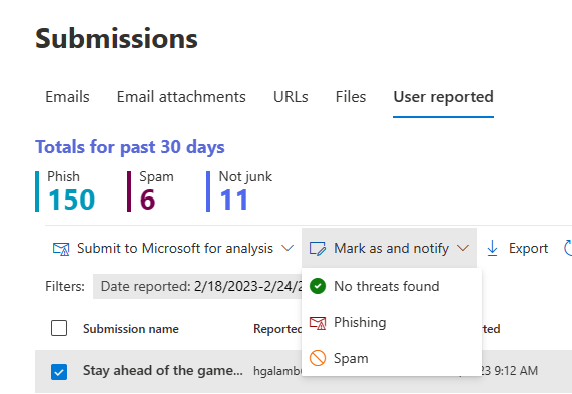
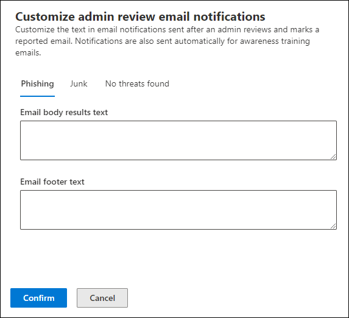

# Admin review for reported messages

[!INCLUDE [Microsoft 365 Defender rebranding](../includes/microsoft-defender-for-office.md)]

> [!NOTE]
> The information in this article relates to a preview product that may be substantially modified before it's commercially released. This document is provided for evaluation and exploration purposes only.

**Applies to**
- [Microsoft Defender for Office 365 plan 1 and plan 2](defender-for-office-365.md)
- [Microsoft 365 Defender](../defender/microsoft-365-defender.md)

In Microsoft 365 organizations with Exchange Online mailboxes and Microsoft Defender for Office 365, admins can now send templated messages back to end users after they review reported messages. The templates can be customized for your organization and based on your admin's verdict as well.

The feature is designed to give feedback to your users but doesn't change the verdicts of messages in the system. To help Microsoft update and improve its filters, you need to submit messages for analysis using [Admin submission](admin-submission.md).

You will only be able to mark and notify users of review results if the message was reported as a [false positives or false negatives](report-false-positives-and-false-negatives.md).

## What do you need to know before you begin?

- You open the Microsoft 365 Defender portal at <https://security.microsoft.com/>. To go directly to the **Submissions** page, use <https://security.microsoft.com/reportsubmission>.

- To modify the configuration for User submissions, you need to be a member of one of the following role groups:
  - Organization Management or Security Administrator in the [Microsoft 365 Defender portal](permissions-microsoft-365-security-center.md).
  - Organization Management in [Exchange Online](/Exchange/permissions-exo/permissions-exo#role-groups).

- You'll also need access to Exchange Online PowerShell. If the account that you're trying to use doesn't have access to Exchange Online PowerShell, you'll receive an error that says *Specify an email address in your domain*. For more information about enabling or disabling access to Exchange Online PowerShell, see the following topics:
  - [Enable or disable access to Exchange Online PowerShell](/powershell/exchange/disable-access-to-exchange-online-powershell)
  - [Client Access Rules in Exchange Online](/exchange/clients-and-mobile-in-exchange-online/client-access-rules/client-access-rules)

## Notify users from within the portal

1. In the Microsoft 365 Defender portal, go directly to the **Submissions** page <https://security.microsoft.com/reportsubmission>.

2. Click **User reported messages**, and then select the message you want to mark and notify. 

3. Select the **Mark as and notify** drop-down, and then select **No threats found**, **Phishing**, or **Junk**.  

> [!div class="mx-imgBorder"]
> 

The reported message will be marked as either false positive or false negative, and an email will be automatically sent from within the portal notifying the user who reported the message. 

## Customize the messages used to notify users

1. In the Microsoft 365 Defender portal, go to **Email & Collaboration** \> **Policies & Rules** \> **Threat policies** page \> **Others** section \> **User reported message settings**.

2. On the **User submissions** page, if you want to specify the sender display name, check the box for **Specify Office 365 email address to use as sender** under the **Email notifications for admin review results** section, and enter in the name you wish to use. The email address that will be visible in Outlook and all the replies will go there.

3. If you want to customize any of the templates, click **Customize email notification** at the bottom of the page. In the flyout that opens, you can customize only the following:
    - Phishing
    - Junk
    - No threats found
    - Footer

> [!div class="mx-imgBorder"]
> 

4. When you're finished, click **Save**. To clear these values, click **Discard** on the User submissions page.
