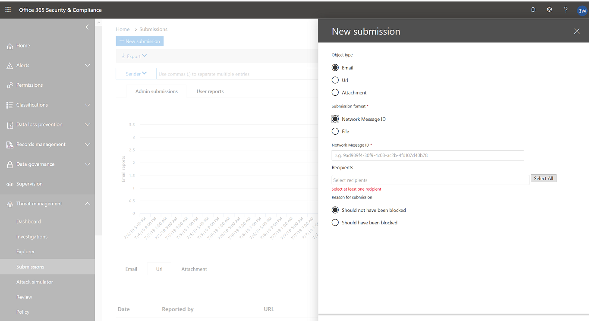

# How to submit suspected spam, phish, URLs, and files to Microsoft for Office 365 scanning

Admins can send emails by using file or network message ID, URLs, and files for scanning by Microsoft in Office 365.
The updated submissions section still includes user reported messages and available to all customers using EOP.

When you submit an email, you will get information about any policies that may have allowed the incoming email into your tenant, as well as examination of any URLs and attachments in the mail. Policies that may have allowed a mail include an individual user's safe sender list as well as tenant level policies such as Exchange mail flow rules (also known as transport rules).

## How to direct suspicious content to Microsoft for Office 365 scanning

To submit content to Microsoft click the **New submission** button in the top left hand side of the submissions page. A flyout on the right side of the page appears with the option to submit either an email, URL, or file.

### Submit a questionable email to Microsoft

1. To submit an email, select **email** and specify the email **network message ID** or upload the email file.

2. Specify the recipient(s) that you would like to run the policy check against. The policy check will determine if the email bypassed scanning due to user or tenant level policies.

3. Specify if the email should have been blocked or not. If the email should have been blocked, specify if it should have been blocked as Spam, Phishing, or Malware. If you are not sure what type it might be, use your best judgement.

   - If the filter was bypassed due to policies upon submission, you'll see information about that policy.

   - If the filter was not bypassed due to one or more policies, the scan will complete in several minutes. You'll see additional information about the submission by clicking on the status link. This includes the results of the policy check and the rescan verdict. Note this does not run the email through the Office 365 ATP full filtering stack again but runs a partial rescan based on certain attributes of the mail, URL, or file.

4. Click the **Submit** button.

### Send a suspect URL to Microsoft

1. To submit a URL select **URL** from the flyout. Type in the full URL including the protocol (**https://**).

   If you selected **Should have been filtered**, specify if the URL is phishing or malware.

2. Click the **Submit** button.

### Submit a suspected file to Microsoft

1. To submit a file select **File** from the flyout and upload the file you would like to scan.

2. Click the **Submit** button.

## Related topics

[Office 365 Advanced Threat Protection Plan 2](office-365-ti.md)

[Protect against threats in Office 365](protect-against-threats.md)

[View reports for Office 365 Advanced Threat Protection](view-reports-for-atp.md)
