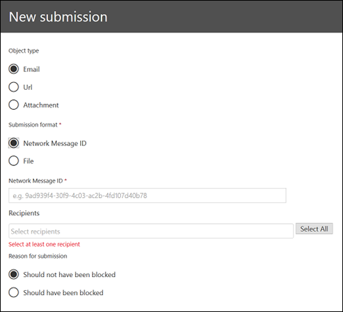
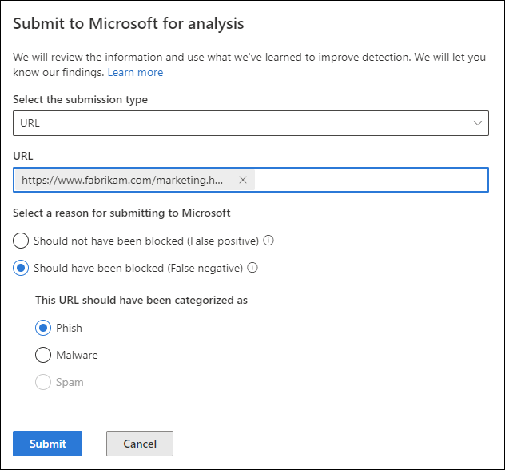
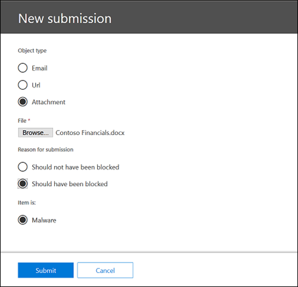
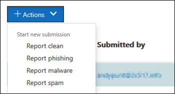

# Use Admin Submission to submit suspected spam, phish, URLs, and files to Microsoft

[!INCLUDE [Microsoft 365 Defender rebranding](../includes/microsoft-defender-for-office.md)]

**Applies to**
- [Exchange Online Protection](exchange-online-protection-overview.md)
- [Microsoft Defender for Office 365 plan 1 and plan 2](defender-for-office-365.md)

In Microsoft 365 organizations with mailboxes in Exchange Online, admins can use the Submissions portal in the Security & Compliance Center to submit email messages, URLs, and attachments to Microsoft for scanning.

When you submit an email message, you will get:

1. **Email authentication check**: Details on whether email authentication passed or failed when it was delivered.
2. **Policy hits**: Information about any policies that may have allowed or blocked the incoming email into your tenant, overriding our service filter verdicts.
3. **Payload reputation/detonation**: Examination of any URLs and attachments in the message.
4. **Grader analysis**: Review done by human graders in order to confirm whether or not messages are malicious.

> [!IMPORTANT]
> Payload reputation/detonation and grader analysis are not done in all tenants. Information is blocked from going outside the organization when data is not supposed to leave the tenant boundary for compliance purposes.

For other ways to submit email messages, URLs, and attachments to Microsoft, see [Report messages and files to Microsoft](report-junk-email-messages-to-microsoft.md).

## What do you need to know before you begin?

- You open the Security & Compliance Center at <https://protection.office.com/>. To go directly to the **Submission** page, use <https://protection.office.com/reportsubmission>.

- To submit messages and files to Microsoft, you need to be a member of one of the following role groups:

  - **Organization Management** or **Security Reader** in the [Security & Compliance Center](permissions-in-the-security-and-compliance-center.md).

  - **Organization Management** in [Exchange Online](/Exchange/permissions-exo/permissions-exo#role-groups).

    Note that membership in this role group is required to [View user submissions to the custom mailbox](#view-user-submissions-to-the-custom-mailbox) as described later in this article.

- For more information about how users can submit messages and files to Microsoft, see [Report messages and files to Microsoft](report-junk-email-messages-to-microsoft.md).

## Report suspicious content to Microsoft

1. In the Security & Compliance Center, go to **Threat management** \> **Submissions**, verify that you're on the **Admin submissions** tab, and then click **New submission**.

2. Use **New submission** flyout that appears to submit the message, URL, or attachment as described in the following sections.

### Submit a questionable email to Microsoft

1. In the **Object type** section, select **Email**. In the **Submission format** section, use one of the following options:

   - **Network Message ID**: This is a GUID value that's available in the **X-MS-Exchange-Organization-Network-Message-Id** header in the message, or in the **X-MS-Office365-Filtering-Correlation-Id** header in quarantined messages.

   - **File**: Click **Choose file**. In the dialog that opens, find and select the .eml or .msg file, and then click **Open**.

   > [!NOTE]
   > Admins with Defender for Office 365 Plan 1 or Plan 2 are able to submit messages as old as 30 days. Other admins will only be able to go back 7 days.

2. In the **Recipients** section, specify one or more recipients that you would like to run a policy check against. The policy check will determine if the email bypassed scanning due to user or organization policies.

3. In the **Reason for submission** section, select one of the following options:

   - **Should not have been blocked**

   - **Should have been blocked**: Select **Spam**, **Phishing**, or **Malware**. If you're not sure, use your best judgment.

4. When you're finished, click the **Submit** button.

   

### Send a suspect URL to Microsoft

1. In the **Object type** section, select **URL**. In the box that appears, enter the full URL (for example, `https://www.fabrikam.com/marketing.html`).

2. In the **Reason for submission** section, select one of the following options:

   - **Should not have been blocked**

   - **Should have been blocked**: Select **Phishing** or **Malware**.

3. When you're finished, click the **Submit** button.

   

### Submit a suspected file to Microsoft

1. In the **Object type** section, select **Attachment**.

2. Click **Choose File**. In the dialog that opens, find and select the file, and then click **Open**.

3. In the **Reason for submission** section, select one of the following options:

   - **Should not have been blocked**

   - **Should have been blocked**: **Malware** is the only choice, and is automatically selected..

4. When you're finished, click the **Submit** button.

   

## View items Submitted for analysis

In the Security & Compliance Center, go to **Threat management** \> **Submissions**, verify that you're on the **Submitted for analysis** tab

Near the top of the page, you can enter a start date, an end date, and (by default) you can filter by **Submission ID** (a GUID value that's assigned to every submission) by entering a value in the box and clicking . You can enter multiple values separated by commas.

To change the filter criteria, click the **Submission ID** button and choose one of the following values:

- **Sender**
- **Subject/URL/File name**
- **Submitted by**
- **Submission type**
- **Status**

To export the results, click **Export** near the top of the page and select **Chart data** or **Table**. In the dialog that appears, save the .csv file.

Below the graph, there are three tabs: **Email** (default), **URL**, and **Attachment**.

### View admin email submissions

Click the **Email** tab.

You can click the **Column options** button near the bottom of the page to add or remove columns from the view:

- **Date**
- **Submission ID**: A GUID value that's assigned to every submission.
- **Submitted by**\*
- **Subject**\*
- **Sender**
- **Sender IP**\*
- **Submission type**
- **Delivery reason**
- **Status**\*

  \* If you click this value, detailed information is displayed in a flyout.

#### Admin submission rescan details

Messages that are submitted in admin submissions are rescanned and results shown in the details flyout:

- If there was a failure in the sender's email authentication at the time of delivery.
- Information about any policy hits that could have affected or overridden the verdict of a message.
- Current detonation results to see if the URLs or files contained in the message were malicious or not.
- Feedback from graders.

If an override was found, the rescan should complete in several minutes. If there wasn't a problem in email authentication or delivery wasn't affected by an override, then the feedback from graders could take up to a day.

### View admin URL submissions

Click the **URL** tab.

You can click the **Column options** button near the bottom of the page to add or remove columns from the view:

- **Date**
- **Submission ID**
- **Submitted by**\*
- **URL**\*
- **Submission type**
- **Status**\*

  \* If you click this value, detailed information is displayed in a flyout.

### View admin attachment submissions

Click the **Attachments** tab.

You can click the **Column options** button near the bottom of the page to add or remove columns from the view:

- **Date**
- **Submission ID**
- **Submitted by**\*
- **File name**\*
- **Submission type**
- **Status**\*

  \* If you click this value, detailed information is displayed in a flyout.

## View user submissions to Microsoft

If you've deployed the [Report Message add-in](enable-the-report-message-add-in.md), the [Report Phishing add-in](enable-the-report-phish-add-in.md), or people use the [built-in reporting in Outlook on the web](report-junk-email-and-phishing-scams-in-outlook-on-the-web-eop.md), you can see what users are reporting on the **User submissions** tab.

1. In the Security & Compliance Center, go to **Threat management** \> **Submissions**.

2. Select the **User submissions** tab, and then click **New submission**.

You can click the **Column options** button near the bottom of the page to add or remove columns from the view:

- **Submitted on**
- **Submitted by**\*
- **Subject**\*
- **Sender**
- **Sender IP**\*
- **Submission type**

\* If you click this value, detailed information is displayed in a flyout.

Near the top of the page, you can enter a start date, an end date, and (by default) you can filter by **Sender** by entering a value in the box and clicking . You can enter multiple values separated by commas.

To change the filter criteria, click the **Sender** button and choose one of the following values:

- **Sender domain**
- **Subject**
- **Submitted by**
- **Submission type**
- **Sender IP**

To export the results, click **Export** near the top of the page and select **Chart data** or **Table**. In the dialog that appears, save the .csv file.

## View user submissions to the custom mailbox

**If** you've [configured a custom mailbox](user-submission.md) to receive user reported messages, you can view and also submit messages that were delivered to the reporting mailbox.

1. In the Security & Compliance Center, go to **Threat management** \> **Submissions**.

2. Select the **Custom mailbox** tab.

You can click the **Column options** button near the bottom of the page to add or remove columns from the view:

- **Submitted on**
- **Submitted by**\*
- **Subject**\*
- **Sender**
- **Sender IP**\*
- **Submission type**

Near the top of the page, you can enter a start date, an end date, and you can filter by **Submitted by** by entering a value in the box and clicking . You can enter multiple values separated by commas.

To export the results, click **Export** near the top of the page and select **Chart data** or **Table**. In the dialog that appears, save the .csv file.

> [!NOTE]
> If organizations are configured to send to custom mailbox only, reported messages will not be sent for rescan and results in the User reported messages portal will always be empty.

## Undo user submissions

Once a user submits a suspicious email to the custom mailbox, the user and admin don't have an option to undo the submission. If the user would like to recover the email, it will be available for recovery in the Deleted Items or Junk Email folders.

### Submit messages to Microsoft from the custom mailbox

If you've configured the custom mailbox to intercept user-reported messages without sending the messages to Microsoft, you can find and send specific messages to Microsoft for analysis. This effectively moves a user submission to an admin submission.

On the **Custom mailbox** tab, select a message in the list, click the **Action** button, and make one of the following selections:

- **Report clean**
- **Report phishing**
- **Report malware**
- **Report spam**

