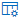

# Use the Submissions portal to submit suspected spam, phish, URLs, legitimate email getting blocked, and email attachments to Microsoft

[!INCLUDE [MDO Trial banner](../includes/mdo-trial-banner.md)]

**Applies to**
- [Exchange Online Protection](exchange-online-protection-overview.md)
- [Microsoft Defender for Office 365 plan 1 and plan 2](defender-for-office-365.md)

In Microsoft 365 organizations with Exchange Online mailboxes, admins can use the Submissions portal in the Microsoft 365 Defender portal to submit email messages, URLs, and attachments to Microsoft for scanning.

When you submit an email message for analysis, you will get:

- **Email authentication check**: Details on whether email authentication passed or failed when it was delivered.
- **Policy hits**: Information about any policies that may have allowed or blocked the incoming email into your tenant, overriding our service filter verdicts.
- **Payload reputation/detonation**: Up-to-date examination of any URLs and attachments in the message.
- **Grader analysis**: Review done by human graders in order to confirm whether or not messages are malicious.

> [!IMPORTANT]
> Payload reputation/detonation and grader analysis are not done in all tenants. Information is blocked from going outside the organization when data is not supposed to leave the tenant boundary for compliance purposes.

For other ways to submit email messages, URLs, and attachments to Microsoft, see [Report messages and files to Microsoft](report-junk-email-messages-to-microsoft.md).

Watch this short video to learn how to use admin submissions in Microsoft Defender for Office 365 to submit messages to Microsoft for evaluation.
> [!VIDEO https://www.microsoft.com/en-us/videoplayer/embed/RWBLPn]

## What do you need to know before you begin?

- You open the Microsoft 365 Defender portal at <https://security.microsoft.com/>. To go directly to the **Submissions** page, use <https://security.microsoft.com/reportsubmission>.

- To submit messages and files to Microsoft, you need to have one of following roles:
  - **Security Administrator** or **Security Reader** in the [Microsoft 365 Defender portal](permissions-microsoft-365-security-center.md).

    Note that one of these roles is required to [View user submissions to the custom mailbox](#view-user-submissions-to-microsoft) as described later in this article.

- Admins can submit messages as old as 30 days if it is still available in the mailbox and not purged by the user or another admin.

- Admin submissions are throttled at the following rates:
  - Maximum submissions in any 15 minutes period: 150 submissions
  - Same submissions in a 24 hour period: 3 submissions
  - Same submissions in a 15 minute period: 1 submission

- For more information about how users can submit messages and files to Microsoft, see [Report messages and files to Microsoft](report-junk-email-messages-to-microsoft.md).

## Report questionable email to Microsoft

1. In the Microsoft 365 Defender portal at <https://security.microsoft.com>, go to the **Submissions** page at **Actions & submissions** \> **Submissions**. To go directly to the **Submissions** page, use <https://security.microsoft.com/reportsubmission>.

2. On the **Submissions** page, verify that the **Emails** tab is selected.

3. On the **Emails** tab, click  **Submit to Microsoft for analysis**.

4. In the **Submit to Microsoft for analysis** flyout that appears, enter the following information:

   - **Select the submission type**: Verify the value **Email** is selected.

   - **Add the network message ID or upload the email file**: Select one of the following options:

     - **Add the email network message ID**: This is a GUID value that's available in the **X-MS-Exchange-Organization-Network-Message-Id** header in the message or in the **X-MS-Office365-Filtering-Correlation-Id** header in quarantined messages.

     - **Upload the email file (.msg or .eml)**: Click **Browse files**. In the dialog that opens, find and select the .eml or .msg file, and then click **Open**.

   - **Choose a recipient who had an issue**: Specify the recipient that you would like to run a policy check against. The policy check will determine if the email bypassed scanning due to user or organization policies.

   - **Select a reason for submitting to Microsoft**: Verify **Should not have been blocked (False positive)** is selected.

     - **The email should have been categorized as**: Select **Phish**, **Malware**, or **Spam**. If you're not sure, use your best judgment.

     - **Block all emails from this sender or domain**: Select this option to create a block entry for the sender in the Tenant Allow/Block List. For more information about the Tenant Allow/Block List, see [Manage your allows and blocks in the Tenant Allow/Block List](manage-tenant-allow-block-list.md).

       After you select this option, the following settings are available:

       - By default, **Sender** is selected but you can select **Domain** instead.

       - **Remove block entry after**: The default value is **30 days**, but you can select from the following values:
           - **1 day**
           - **7 days**
           - **30 days**
           - **90 days**
           - **Never expire**
           - **Specific date**

       - **Block entry note**: Enter optional information about why you're allowing this email.

   When you're finished, click **Submit**, and then click **Done**.

:::image type="content" source="../../media/admin-submission-email-block.png" alt-text="Submit a false negative (bad) email to Microsoft for analysis on the Submissions page in the Defender portal." lightbox="../../media/admin-submission-email-block.png":::

> [!NOTE]
> For messages that were incorrectly blocked by [spoof intelligence](learn-about-spoof-intelligence.md), a block entry for the domain pair is not created in the Tenant Allow/Block List.
>
> For messages that were incorrectly blocked by [domain or user impersonation protection](set-up-anti-phishing-policies.md#impersonation-settings-in-anti-phishing-policies-in-microsoft-defender-for-office-365), a block entry for the domain or sender is not created in the Tenant Allow/Block List. Instead, the domain or sender is added to the **Trusted senders and domains section** in the [anti-phishing policy](configure-mdo-anti-phishing-policies.md#use-the-microsoft-365-defender-portal-to-modify-anti-phishing-policies) that detected the message.

## Report questionable email attachments to Microsoft

1. In the Microsoft 365 Defender portal at <https://security.microsoft.com>, go to the **Submissions** page at **Actions & submissions** \> **Submissions**. To go directly to the **Submissions** page, use <https://security.microsoft.com/reportsubmission>.

2. On the **Submissions** page, select the **Email attachments** tab.

3. On the **Email attachments** tab, click  **Submit to Microsoft for analysis**.

4. On the **Submit to Microsoft for analysis** flyout that appears, enter the following information:

   - **Select the submission type**: Verify the value **Email attachment** is selected.

   - **File**: Click **Browse files** to find and select the file to submit.

   - **Select a reason for submitting to Microsoft**: Verify **Should have been blocked (False negative)** is selected.

     - **The email should have been categorized as**: Select **Phish** or **Malware**. If you're not sure, use your best judgment.

     - **Block this file**: Select this option to create a block entry for the sender in the Tenant Allow/Block List. For more information about the Tenant Allow/Block List, see [Manage your allows and blocks in the Tenant Allow/Block List](manage-tenant-allow-block-list.md).

       After you select this option, the following settings are available:

       - **Remove block entry after**: The default value is **30 days**, but you can select from the following values:
           - **1 day**
           - **7 days**
           - **30 days**
           - **90 days**
           - **Never expire**
           - **Specific date**

       - **Block entry note**: Enter optional information about why you're allowing this email.

   When you're finished, click **Submit**, and then click **Done**.

:::image type="content" source="../../media/admin-submission-file-block.png" alt-text="Submit a false negative (bad) email attachment to Microsoft for analysis on the Submissions page in the Defender portal." lightbox="../../media/admin-submission-file-block.png":::

## Report questionable URLs to Microsoft

1. In the Microsoft 365 Defender portal at <https://security.microsoft.com>, go to the **Submissions** page at **Actions & submissions** \> **Submissions**. To go directly to the **Submissions** page, use <https://security.microsoft.com/reportsubmission>.

2. On the **Submissions** page, select the **URLs** tab.

3. On the **URLs** tab, click  **Submit to Microsoft for analysis**.

4. In the **Submit to Microsoft for analysis** flyout that appears, enter the following information:

   - **Select the submission type**: Verify the value **URL** is selected.

   - **URL**: Enter the full URL (for example, `https://www.fabrikam.com/marketing.html`), and then select it in the box that appears.

   - **Select a reason for submitting to Microsoft**: Verify **Should have been blocked (False negative)** is selected.

     - **The email should have been categorized as**: Select **Phish** or **Malware**. If you're not sure, use your best judgment.

     - **Block this URL**: Select this option to create a block entry for the sender in the Tenant Allow/Block List. For more information about the Tenant Allow/Block List, see [Manage your allows and blocks in the Tenant Allow/Block List](manage-tenant-allow-block-list.md).

       After you select this option, the following settings are available:

       - **Remove block entry after**: The default value is **30 days**, but you can select from the following values:
           - **1 day**
           - **7 days**
           - **30 days**
           - **90 days**
           - **Never expire**
           - **Specific date**

       - **Block entry note**: Enter optional information about why you're allowing this email.

   When you're finished, click **Submit**, and then click **Done**.

:::image type="content" source="../../media/admin-submission-url-block.png" alt-text="Submit a false negative (bad) URL to Microsoft for analysis on the Submissions page in the Defender portal." lightbox="../../media/admin-submission-url-block.png":::

## Report good email to Microsoft

1. In the Microsoft 365 Defender portal at <https://security.microsoft.com>, go to the **Submissions** page at **Actions & submissions** \> **Submissions**. To go directly to the **Submissions** page, use <https://security.microsoft.com/reportsubmission>.

2. On the **Submissions** page, verify that the **Emails** tab is selected.

3. On the **Emails** tab, click  **Submit to Microsoft for analysis**.

4. In the **Submit to Microsoft for analysis** flyout that appears, enter the following information:

   - **Select the submission type**: Verify the value **Email** is selected.

   - **Add the network message ID or upload the email file**: Select one of the following options:

     - **Add the email network message ID**: This is a GUID value that's available in the **X-MS-Exchange-Organization-Network-Message-Id** header in the message or in the **X-MS-Office365-Filtering-Correlation-Id** header in quarantined messages.

     - **Upload the email file (.msg or .eml)**: Click **Browse files**. In the dialog that opens, find and select the .eml or .msg file, and then click **Open**.

   - **Choose a recipient who had an issue**: Specify the recipient that you would like to run a policy check against. The policy check will determine if the email was blocked due to user or organization policies.

   - **Select a reason for submitting to Microsoft**: Select **Should not have been blocked (False positive)**, and then configure the following settings:

     - **Allow emails with similar attributes (URL, sender, etc.)**: Turn on this setting .

         - **Remove allow entry after**: The default value is **30 days**, but you can select from the following values:
           - **1 day**
           - **7 days**
           - **30 days**
           - **Specific date**: The maximum value is 30 days from today.

           For spoofed senders, this value is meaningless, because entries for spoofed senders never expire.

         - **Allow entry note**: Enter optional information about why you're allowing this email.

           For spoofed senders, any value you enter here is not shown in the allow entry on the **Spoofed senders** tab on the **Tenant Allow/Block List**.

   When you're finished, click **Submit**, and then click **Done**.

   :::image type="content" source="../../media/admin-submission-email-allow.png" alt-text="Submit a false positive (good) email to Microsoft for analysis on the Submissions page in the Defender portal." lightbox="../../media/admin-submission-email-allow.png":::

After a few moments, the allow entry will appear on the **Domains & addresses** or **Spoofed senders** tab on the **Tenant Allow/Block List** page.

> [!NOTE]
>
> - When you override the verdict in the spoof intelligence insight, the spoofed sender becomes a manual allow or block entry that only appears on the **Spoofed senders** tab in the Tenant Allow/Block List.
> - If the sender has not already been blocked, submitting the email message to Microsoft won't create an allow entry in the Tenant Allow/Block List.
> - Allows are added during mail flow, based on which filters determined the message to be malicious. For example, if the sender and a URL in the message were determined to be bad, an allow entry is created for the sender, and an allow entry is created for the URL.
> - When that entity (domain or email address, URL, file) is encountered again, all filters associated with that entity are skipped.
> - During mail flow, if messages from the domain or email address pass other checks in the filtering stack, the messages will be delivered. For example, if [email authentication](email-validation-and-authentication.md) passes, a message from a sender in the allow entry will be delivered.

## Report good email attachments to Microsoft

1. In the Microsoft 365 Defender portal at <https://security.microsoft.com>, go to the **Submissions** page at **Actions & submissions** \> **Submissions**. To go directly to the **Submissions** page, use <https://security.microsoft.com/reportsubmission>.

2. On the **Submissions** page, select the **Email attachments** tab.

3. On the **Email attachments** tab, click  **Submit to Microsoft for analysis**.

4. On the **Submit to Microsoft for analysis** flyout that appears, enter the following information:

   - **Select the submission type**: Verify the value **Email attachment** is selected.

   - **File**: Click **Browse files** to find and select the file to submit.

   - **Select a reason for submitting to Microsoft**: Select **Should not have been blocked (False positive)**, and then configure the following settings:

     - **Allow this file**: Turn on this setting .

         - **Remove allow entry after**: The default value is **30 days**, but you can select from the following values:
           - **1 day**
           - **7 days**
           - **30 days**
           - **Specific date**: The maximum value is 30 days from today.

         - **Allow entry note**: Enter optional information about why you're allowing this file.

   When you're finished, click **Submit**, and then click **Done**.

   :::image type="content" source="../../media/admin-submission-file-allow.png" alt-text="Submit a false positive (good) email attachment to Microsoft for analysis on the Submissions page in the Defender portal." lightbox="../../media/admin-submission-file-allow.png":::

After a few moments, an allow entry will appear on the **Files** tab on the **Tenant Allow/Block List** page.

> [!NOTE]
> When the file is encountered again, it's not sent for [Safe Attachments](safe-attachments.md) detonation or file reputation checks, and all other file-based filters are skipped. During mail flow, if messages containing the file pass other non-file checks in the filtering stack, the messages will be delivered.

## Report good URLs to Microsoft

1. In the Microsoft 365 Defender portal at <https://security.microsoft.com>, go to the **Submissions** page at **Actions & submissions** \> **Submissions**. To go directly to the **Submissions** page, use <https://security.microsoft.com/reportsubmission>.

2. On the **Submissions** page, select the **URLs** tab

3. On the **URLs** tab, click  **Submit to Microsoft for analysis**.

4. In the **Submit to Microsoft for analysis** flyout that appears, enter the following information:

   - **Select the submission type**: Verify the value **URL** is selected.

   - **URL**: Enter the full URL (for example, `https://www.fabrikam.com/marketing.html`), and then select it in the box that appears. You can also provide a top level domain (for example, `https://www.fabrikam.com/*`), and then select it in the box that appears. 

   - **Select a reason for submitting to Microsoft**: Select **Should not have been blocked (False positive)**, and then configure the following settings:

     - **Allow this URL**: Turn on this setting .

         - **Remove allow entry after**: The default value is **30 days**, but you can select from the following values:
           - **1 day**
           - **7 days**
           - **30 days**
           - **Specific date**: The maximum value is 30 days from today.

         - **Allow entry note**: Enter optional information about why you're allowing this URL.

   When you're finished, click **Submit**, and then click **Done**.

   :::image type="content" source="../../media/admin-submission-url-allow.png" alt-text="Submit a false positive (good) URL to Microsoft for analysis on the Submissions page in the Defender portal." lightbox="../../media/admin-submission-url-allow.png":::

After a few moments, an allow entry will appear on the **URL** tab on the **Tenant Allow/Block List** page. For more information about the Tenant Allow/Block List, see [Manage your allows and blocks in the Tenant Allow/Block List](manage-tenant-allow-block-list.md).

> [!NOTE]
>
> - When the URL is detected again, it's not sent for [Safe Links](safe-links.md) detonation or URL reputation checks, and all other URL-based filters are skipped.
> - During mail flow, if messages containing the URL pass other non-URL checks in the filtering stack, the messages will be delivered.

## View email admin submissions to Microsoft

1. In the Microsoft 365 Defender portal at <https://security.microsoft.com>, go to the **Submissions** page at **Actions & submissions** \> **Submissions**. To go directly to the **Submissions** page, use <https://security.microsoft.com/reportsubmission>.

2. On the **Submissions** page, verify that the **Emails** tab is selected.

   - You can sort the entries by clicking on an available column header.

   - Click  **Customize columns** to select the columns that you want to view. The default values are marked with an asterisk (\*):
     - **Submission name**\*
     - **Sender**\*
     - **Recipient**
     - **Date submitted**\*
     - **Reason for submitting**\*
     - **Status**\*
     - **Result**\*
     - **Filter verdict**
     - **Delivery/Block reason**
     - **Submission ID**
     - **Network Message ID/Object ID**
     - **Direction**
     - **Sender IP**
     - **Bulk compliant level (BCL)**
     - **Destination**
     - **Policy action**
     - **Submitted by**
     - **Phish simulation**
     - **Tags**\*
     - **Allow**

     When you're finished, click **Apply**.

     :::image type="content" source="../../media/admin-submission-email-customize-columns.png" alt-text="Customize columns option for email admin submissions." lightbox="../../media/admin-submission-email-customize-columns.png":::

   - To filter the entries, click  **Filter**. The following values are available in the **Filter** flyout that appears:
     - **Date submitted**: **Start date** and **End date** values.
     - **Submission ID**: A GUID value that's assigned to every submission.
     - **Network Message ID**
     - **Sender**
     - **Recipient**
     - **Name**
     - **Submitted by**
     - **Reason for submitting**: The values **Not junk**, **Phish**, **Malware**, and **Spam**.
     - **Status**: The values **Pending** and **Completed**.
     - **Tags**: The default value is **All** or select a [user tag](user-tags.md) from the drop-down list.

     When you're finished, click **Apply**. To clear existing filters, click  **Clear filters** in the **Filter** flyout.

     :::image type="content" source="../../media/admin-submission-email-filters.png" alt-text="Filter options for email admin submissions." lightbox="../../media/admin-submission-email-filters.png":::

   - To group the entries, click  **Group** and select one of the following values from the dropdown list:
     - **None**
     - **Reason**
     - **Status**
     - **Result**
     - **Tags**

   - To export the entries, click  **Export**. In the dialog that appears, save the .csv file.

## View email attachment admin submissions to Microsoft

1. In the Microsoft 365 Defender portal at <https://security.microsoft.com>, go to the **Submissions** page at **Actions & submissions** \> **Submissions**. To go directly to the **Submissions** page, use <https://security.microsoft.com/reportsubmission>.

2. On the **Submissions** page, verify that the **Email attachments** tab is selected.

   - You can sort the entries by clicking on an available column header.

   - Click  **Customize columns** to select the columns that you want to view. The default values are marked with an asterisk (\*):
     - **Attachment filename**\*
     - **Date submitted**\*
     - **Reason for submitting**\*
     - **Status**\*
     - **Result**\*
     - **Filter verdict**
     - **Delivery/Block reason**
     - **Submission ID**
     - **Object ID**
     - **Policy action**
     - **Submitted by**
     - **Tags**\*
     - **Allow**

     When you're finished, click **Apply**.

     :::image type="content" source="../../media/admin-submission-file-customize-columns.png" alt-text="Customize column options for email attachment admin submissions.":::

   - To filter the entries, click  **Filter**. The following values are available in the **Filter** flyout that appears:
     - **Date submitted**: **Start date** and **End date**.
     - **Submission ID**: A GUID value that's assigned to every submission.
     - **Attachment filename**
     - **Submitted by**
     - **Reason for submitting**
     - **Status**
     - **Tags**: The default value is **All** or select a [user tag](user-tags.md) from the drop-down list.

     When you're finished, click **Apply**.

     :::image type="content" source="../../media/admin-submission-file-filters.png" alt-text="Filter options for email attachment admin submissions.":::

   - To group the entries, click  **Group** and select one of the following values from the drop-down list:
     - **None**
     - **Reason**
     - **Status**
     - **Result**
     - **Tags**

   - To export the entries, click  **Export**. In the dialog that appears, save the .csv file.

## View URLs admin submissions to Microsoft

1. In the Microsoft 365 Defender portal at <https://security.microsoft.com>, go to the **Submissions** page at **Actions & submissions** \> **Submissions**. To go directly to the **Submissions** page, use <https://security.microsoft.com/reportsubmission>.

2. On the **Submissions** page, verify that the **URLs** tab is selected.

   - You can sort the entries by clicking on an available column header.

   - Click  **Customize columns** to select the columns that you want to view. The default values are marked with an asterisk (\*):
     - **URL**\*
     - **Date submitted**\*
     - **Reason for submitting**\*
     - **Status**\*
     - **Result**\*
     - **Filter verdict**
     - **Delivery/Block reason**
     - **Submission ID**
     - **Object ID**
     - **Policy action**
     - **Submitted by**
     - **Tags**\*
     - **Allow**

     When you're finished, click **Apply**.

     :::image type="content" source="../../media/admin-submission-url-customize-columns.png" alt-text="Customize column options for URL admin submissions.":::

   - To filter the entries, click  **Filter**. The following values are available in the **Filter** flyout that appears:
     - **Date submitted**: **Start date** and **End date**.
     - **Submission ID**: A GUID value that's assigned to every submission.
     - **URL**
     - **Submitted by**
     - **Reason for submitting**
     - **Status**
     - **Tags**: The default value is **All** or select a [user tag](user-tags.md) from the drop-down list.

     When you're finished, click **Apply**. To clear existing filters, click  **Clear filters** in the **Filter** flyout.

     :::image type="content" source="../../media/admin-submission-url-filters.png" alt-text="Filter options for URL admin submissions.":::

   - To group the entries, click  **Group** and select one of the following values from the dropdown list:
     - **None**
     - **Reason**
     - **Status**
     - **Result**
     - **Tags**

   - To export the entries, click  **Export**. In the dialog that appears, save the .csv file.

## Admin submission result details

Messages that are submitted in admin submissions are reviewed by Microsoft and results shown in the submissions detail flyout:

- If there was a failure in the sender's email authentication at the time of delivery.
- Information about any policy hits that could have affected or overridden the verdict of a message.
- Current detonation results to see if the URLs or files contained in the message were malicious or not.
- Feedback from graders.

If an override was found, the result should be available in several minutes. If there wasn't a problem in email authentication or delivery wasn't affected by an override, then the feedback from graders could take up to a day.

## View user submissions to Microsoft

If you've deployed the [Report Message add-in](enable-the-report-message-add-in.md), the [Report Phishing add-in](enable-the-report-phish-add-in.md), or people use the [built-in reporting in Outlook on the web](report-junk-email-and-phishing-scams-in-outlook-on-the-web-eop.md), you can see what users are reporting on the **User reported message** tab.

1. In the Microsoft 365 Defender portal at <https://security.microsoft.com>, go to the **Submissions** page at **Actions & submissions** \> **Submissions**. To go directly to the **Submissions** page, use <https://security.microsoft.com/reportsubmission>.

2. On the **Submissions** page, select the **User reported messages** tab.

   - Click  **Customize columns** to select the columns that you want to view. The default values are marked with an asterisk (\*):
     - **Email subject**\*
     - **Reported by**\*
     - **Date reported**\*
     - **Sender**\*
     - **Reported reason**\*
     - **Result**\*
     - **Message reported ID**
     - **Network Message ID**
     - **Sender IP**
     - **Reported from**
     - **Phish simulation**
     - **Converted to admin submission**
     - **Tags**\*
     - **Marked as**\*
     - **Marked by**
     - **Date marked**

     When you're finished, click **Apply**.

   - To filter the entries, click  **Filter**. The following values are available in the **Filter** flyout that appears:
     - **Date reported**: **Start date** and **End date**.
     - **Reported by**
     - **Email subject**
     - **Message reported ID**
     - **Network Message ID**
     - **Sender**
     - **Reported reason**: The values **Not junk**, **Phish**, or **Spam**.
     - **Reported from**: The values **Microsoft add-in** or **Third party add-in**.
     - **Phish simulation**: The values **Yes** or **No**.
     - **Converted to admin submission**: The values **Yes** or **No**.
     - **Tags**: The default value is **All** or select a [user tag](user-tags.md) from the drop-down list.

     When you're finished, click **Apply**. To clear existing filters, click  **Clear filters** in the **Filter** flyout.

     > :::image type="content" source="../../media/admin-submission-user-reported-filters.png" alt-text="Filter options for user submissions." lightbox="../../media/admin-submission-user-reported-filters.png":::

   - To group the entries, click  **Group** and select one of the following values from the dropdown list:
     - **None**
     - **Reason**
     - **Sender**
     - **Reported by**
     - **Result**
     - **Reported from**
     - **Phish simulation**
     - **Converted to admin submission**
     - **Tags**

   - To export the entries, click  **Export**. In the dialog that appears, save the .csv file.

   - To notify users, see [Admin Review for Reported messages](admin-review-reported-message.md)

> [!NOTE]
> If organizations are configured to send user reported messages to the [custom mailbox only](user-submission.md), reported messages will appear in **User reported messages** but their results will always be empty (as they would not have been rescanned).

## Undo user submissions

Once a user submits a suspicious email to the custom mailbox, the user and admin don't have an option to undo the submission. If the user would like to recover the email, it's available for recovery in their Deleted Items or Junk Email folders.

## Convert user reported messages from the custom mailbox into an admin submission

If you've configured the custom mailbox to intercept user-reported messages without sending the messages to Microsoft, you can find and send specific messages to Microsoft for analysis.

On the **User reported messages** tab, select a message in the list, click  **Submit to Microsoft for analysis**, and then select one of the following values from the dropdown list:

- **Report clean**
- **Report phishing**
- **Report malware**
- **Report spam**
- **Trigger investigation**

  :::image type="content" source="../../media/admin-submission-user-reported-submit-button-options.png" alt-text="The New options on the Action button" lightbox="../../media/admin-submission-user-reported-submit-button-options.png":::

If the message is reported to Microsoft, the **Converted to admin submission** value turns from **no** to **yes**. You can directly access the admin submission by clicking **View the converted admin submission** from the overflow menu inside the submission flyout of the respective user reported message.

:::image type="content" source="../../media/view-converted-admin-submission.png" alt-text="Option to view a created admin submission from a user reported message.":::

## View associated alert for user and admin email submissions

> [!IMPORTANT]
> The information in this section applies only to Defender for Office 365 Plan 2 or higher.
>
> Currently, user submissions generate alerts only for messages that are reported as phishing.

For each user reported phishing message and admin email submission, a corresponding alert is generated.

To view the corresponding alert for a user reported phishing message, select the **User reported messages** tab, and then double-click the message to open the submission flyout. Click  **More options** and then select  **View alert**.

:::image type="content" source="../../media/alert-from-user-submission.png" alt-text="Option to view the related alert from a user reported phishing message.":::

To view the corresponding alert for admin email submissions, select the **Emails** tab, and then double-click the message to open the submission flyout. Select **View alert** on the **Open email entity** option.

:::image type="content" source="../../media/alert-from-admin-submission.png" alt-text="Option to view the related alert from an admin submission.":::
