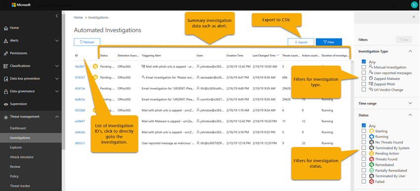
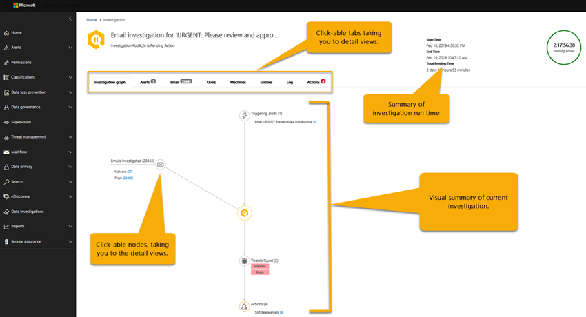
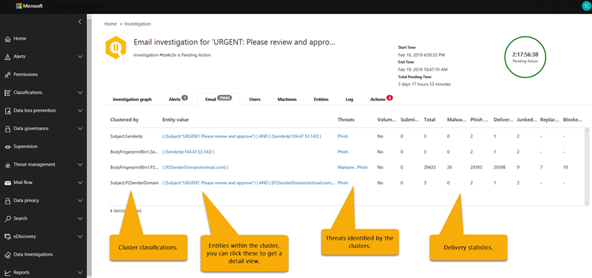
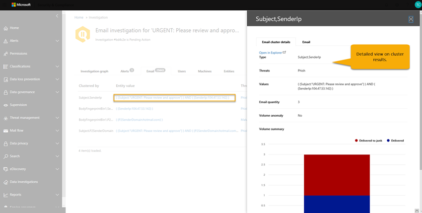
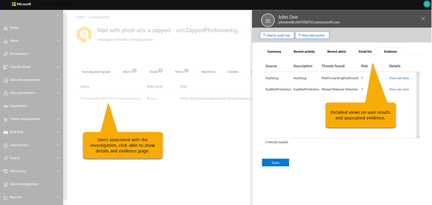
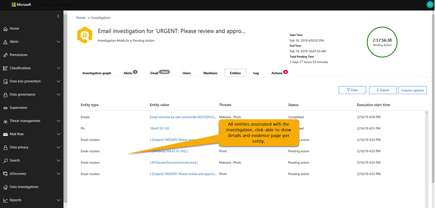
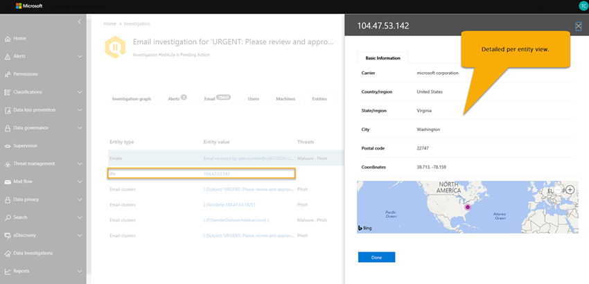

# Details and results of an automated investigation in Microsoft 365

[!INCLUDE [Microsoft 365 Defender rebranding](../includes/microsoft-defender-for-office.md)]

When an [automated investigation](office-365-air.md) occurs in [Microsoft Defender for Office 365](office-365-atp.md), details about that investigation are available during and after the automated investigation process. If you have the necessary permissions, you can view those details in the Microsoft 365 security center. Investigation details provide you with up-to-date status, and the ability to approve any pending actions.

## Investigation status

The investigation status indicates the progress of the analysis and actions. As the investigation runs, status changes to indicate whether threats were found, and whether actions have been approved.

|Status|Description|
|---|---|
|**Starting**|The investigation has been triggered and waiting to start running​.|
|**Running**|The investigation process has started and is underway. This state also occurs when [pending actions](air-review-approve-pending-completed-actions.md#approve-or-reject-pending-actions) are approved.|
|**No Threats Found**|The investigation has finished and no threats (user account, email message, URL, or file) were identified. 
 **TIP**: If you suspect something was missed (such as a false negative), you can take action using [Threat Explorer](threat-explorer.md)​.|
|**Threats Found**|The automated investigation found issues, but there are no specific remediation actions to resolve those issues. 
 The **Threats Found** status can occur when some type of user activity was identified but no cleanup actions are available. Examples include any of the following user activities: <ul><li>A [data loss prevention](https://docs.microsoft.com/Microsoft-365/compliance/data-loss-prevention-policies) (DLP) event</li><li>An email sending anomaly</li><li>Sent malware</li><li>Sent phish</li></ul> 
 The investigation found no malicious URLs, files, or email messages to remediate, and no mailbox activity to fix, such as turning off forwarding rules or delegation. 
 **TIP**: If you suspect something was missed (such as a false negative), you can investigate and take action using [Threat Explorer](threat-explorer.md)​.|
|**Terminated By System**|The investigation stopped. An investigation can stop for several reasons:​ <ul><li>The investigation's pending actions expired. Pending actions time out after awaiting approval for one week.</li><li>There are too many actions. For example, if there are too many users clicking on malicious URLs, it can exceed the investigation's ability to run all the analyzers, so the investigation halts​.</li></ul> 
 **TIP**: If an investigation halts before actions were taken, try using [Threat Explorer](threat-explorer.md) to find and address threats.|
|**Pending Action**|The investigation has found a threat, such as a malicious email, a malicious URL, or a risky mailbox setting​, and an action to remediate that threat is [awaiting approval](air-review-approve-pending-completed-actions.md). 
 The **Pending Action** state is triggered when any threat with a corresponding action is found. However, the list of pending actions can increase as an investigation runs. Check the [investigation log](#playbook-log) to see if other items are still pending completion.​|
|**Remediated**|The investigation finished and all remediation actions were approved (this is noted as fully remediated). 
 **NOTE**: Approved remediation actions can have errors that prevent the actions from being taken. Regardless of whether remediation actions are successfully completed, the investigation status does not change. Check the [investigation log](#playbook-log) for detailed results.​|
|**Partially Remediated**|The investigation resulted in remediation actions, and some were approved and completed​. Other actions are still [pending](air-review-approve-pending-completed-actions.md).|
|**Failed**|At least one investigation analyzer ran into a problem where it could not complete properly​. 
 **NOTE**: If an investigation fails after remediation actions were approved, the remediation actions might still have succeeded. Check the [investigation log](#playbook-log) for detailed results.​​|
|**Queued By Throttling**|An investigation is being held in a queue. When other investigations complete, queued investigations begin. Throttling helps avoid poor service performance.  
 **TIP**: Pending actions can limit how many new investigations can run. Make sure to [approve (or reject) pending actions](air-review-approve-pending-completed-actions.md#approve-or-reject-pending-actions).|
|**Terminated By Throttling**|If an investigation is held in the queue too long, it stops. 
 **TIP**: You can [start an investigation from Threat Explorer](automated-investigation-response-office.md#example-a-security-administrator-triggers-an-investigation-from-threat-explorer).|
|

## View details of an investigation

1. Go to the Security & Compliance Center (<https://protection.office.com>) and sign in.

2. Do one of the following actions:

    - Go to **Threat management** \> **Dashboard**. This takes you to the [Security Dashboard](security-dashboard.md). Your AIR widgets appear across the top of the [Security Dashboard](security-dashboard.md). Select a widget, such as **Investigations summary**.

    - Go to **Threat management** \> **Investigations**.

    Either method takes you to a list of investigations.

    

3. In the list of investigations, select an item in the **ID** column. This opens investigation details page, starting with the investigation graph in view.

    

   Use the various tabs to learn more about the investigation.

## View details about an alert related to an investigation

Certain kinds of alerts trigger automated investigation in Microsoft 365. To learn more, see [alert policies that trigger automated investigations](office-365-air.md#which-alert-policies-trigger-automated-investigations).

Use the following procedure to view details about an alert that is associated with an automated investigation.

1. Go to the Security & Compliance Center (<https://protection.office.com>) and sign in.

2. Go to **Threat management** \> **Investigations**.

3. In the list of investigations, select an item in the **ID** column.

4. With details of an investigation open, select the **Alerts** tab. Any alerts that triggered the investigation are listed here.

5. Select an item in the list. A flyout opens, with details about the alert and links to additional information and actions.

6. Review the information on the flyout, and, depending on the particular alert, take an action, such as **Resolve**, **Suppress**, or **Notify users**.

    - **Resolve** is equivalent to closing an alert

    - **Suppress** causes a policy to not trigger alerts for a specified period of time

    - **Notify users** starts an email with users' email addresses already entered, and enables your security operations team to type a message to those users. (This is similar to sending a message to recipients using [Threat Explorer](threat-explorer.md).)

## How to use the various tabs

The following sections walk you through the various tabs on the automated investigations page and how you can use the information.

### Automated investigations page

The automated investigations page shows your organization's investigations and their current states.

You can:

- Navigate directly to an investigation (select an **Investigation ID**).

- Apply filters. Choose from **Investigation Type**, **Time range**, **Status**, or a combination of these.

- Export the data to a .csv file.

### Investigation graph

When you open a specific investigation, you see the investigation graph page. This page shows all the different entities: email messages, users (and their activities), and devices that were automatically investigated as part of the alert that was triggered.

You can:

- Get a visual overview of the current investigation.
- View a summary of the investigation duration.
- Select a node in the visualization to view details for that node.
- Select a tab across the top to view details for that tab.

### Alert investigation

On the **Alerts** tab for an investigation, you can see alerts relevant to the investigation. Details include the alert that triggered the investigation and other correlated alerts, such as risky sign-in, [DLP policy](https://docs.microsoft.com/Microsoft-365/compliance/data-loss-prevention-policies) violations, etc., that are correlated to the investigation. From this page, a security analyst can also view additional details on individual alerts.

You can:

- Get a visual overview of the current triggering alert and any associated alerts.
- Select an alert in the list to open a fly-out page that shows full alert details.

### Email investigation

On the **Email** tab for an investigation, you can see the original emails and the clusters of similar email identified as part of the investigation. The **Email** tab also shows email items related to the investigation, such as the user-reported email details, the original email reported, the email message(s) zapped due to malware/phish, etc.

With email investigation, you can:

- Get a visual overview of the current clustering results and threats found.
- Click a cluster entity or a threat list to open a fly-out page that shows the full alert details.
- Further investigate the email cluster by clicking the **Open in Explorer** link at the top of the **Email cluster details** tab

Given the sheer volume of email that users in an organization send and receive, plus the multi-user nature of email communications and attacks, the following process can take a significant amount of time:

1. Clustering email messages based on similar attributes from a message header, body, URL, and attachments.
2. Separating malicious email from the good email.
3. Taking action on malicious email messages.

AIR automates this process, saving your organization's security team time and effort.

#### Types of email clusters

Three different types of email clusters can be identified during the email analysis step: similarity clusters (all investigations), indicator clusters (all investigations), and mailbox/user clusters. The following table describes these types of email clusters.

|Email cluster|Description|
|---|---|
|Similarity clusters|Email messages identified by hunting for emails with similar sender and content attributes. These clusters are evaluated for malicious content based on the original detection findings. Email clusters that contain enough malicious email detections are considered malicious.|
|Indicator clusters|Email messages that are identified by hunting for the same indicator entity (file hash or URL) from the original email. When the original file/URL entity is identified as malicious, AIR applies the indicator verdict to the entire cluster of email messages containing that entity. A file identified as malware means that the cluster of email messages containing that file are treated as malware email messages.|
|Mailbox/user clusters|Email messages related to the user involved in a user compromise investigation. These email clusters are for further analysis by the security operations team and will not generate email remediation actions. 
 The compromised user security playbook  reviews the emails being sent by the user being analyzed in order to understand the potential impact of the emails being sent from the mailbox.|

> [!NOTE]
> The goal of clustering is to hunt and find other related email messages that are sent by the same sender as part of an attack or a campaign.  In some cases, legitimate email might trigger an investigation (for example, a user reports a marketing email).  In these scenarios, the email clustering should identify that email clusters are not malicious – when it appropriately does so, it will **not** indicate a threat, nor will it recommend email removal.

#### Email classifications

As email messages are analyzed, they are classified as *malicious*, *suspicious*, or *clean* (as in, *not identified as a threat*):

- *Malicious emails* sent from the mailbox/user  indicate potential compromise of the mailbox/account. Other users/mailboxes that are potentially impacted by malicious email as part of a compromise are shown.

- *Suspicious emails* sent by the mailbox/user indicate the potential for a compromised account or unwanted email activity. These messages include any spam/bulk email sent from the mailbox.

- *Clean emails* (emails that are considered not a threat) sent by the mailbox/user can provide your security operations team with a view of legitimate user emails sent. However, these emails can also include data exfiltration if the email account is compromised.

#### More about email counts

The email count identified on the email tab currently represents the sum total of all email messages that shown on the **Email** tab. Because email messages are present in multiple clusters, the actual total count of email messages identified (and affected by remediation actions) is the count of unique email messages present across all of the clusters and original recipients' email messages.

Both [Explorer](threat-explorer.md) and AIR count email messages on a per-recipient basis, because the security verdicts, actions, and delivery locations vary on a per-recipient basis. Thus, an original email sent to three users counts as a total of three email messages instead of one email.

There might be cases where an email gets counted two or more times, such as when an email has multiple actions on it, or when there are multiple copies of the email when all the actions occur.

For example, a malware email that is detected at delivery can result in both a blocked (quarantined) email and a replaced email (threat file replaced with a warning file, then delivered to user's mailbox). Because there are literally two copies of the email in the system, both might be counted in cluster counts.

> [!IMPORTANT]
> Here are a few points to keep in mind:
>
> - Email counts are calculated at the time of the investigation, and some counts are recalculated when you open investigation flyouts (based on an underlying query).
>
> - The email counts shown for the email clusters on the **Email** tab and the email quantity value shown on cluster flyout are calculated at the time of investigation, and do not change.
>
> - The email count shown at the bottom of the **Email** tab of the email cluster flyout and the count of email messages shown in Explorer reflect email messages received after the investigation's initial analysis.

Thus, an email cluster that shows an original quantity of 10 email messages would show an email list total of 15 when five more email messages arrive between the investigation analysis phase and when the admin reviews the investigation. Likewise, old investigations might start showing higher counts than Explorer queries show, because data in Microsoft Defender for Office 365 Plan 2 expires after 7 days for trials and after 30 days for paid licenses.

Showing both count historical and current counts in different views is done to indicate the email impact at the time of investigation and the current impact up until the time that remediation is run.

> [!NOTE]
> In the context of email, you might see a volume anomaly threat surface as part of the investigation. A volume anomaly indicates a spike in similar email messages around the investigation event time compared to earlier timeframes. This spike in email traffic with similar characteristics (e.g. subject and sender domain, body similarity and sender IP) is typical of the start of email campaigns or attacks.
> However, bulk, spam, and legitimate email campaigns commonly share these characteristics.
>
> Volume anomalies represent a potential threat, and accordingly could be less severe compared to malware or phish threats that are identified using anti-virus engines, detonation or malicious reputation.

### User investigation

On the **Users** tab, you can see all the users identified as part of the investigation. User accounts appear in the investigation when there is an event or indication that those user accounts might be affected or compromised.

For example, in the following image, AIR has identified indicators of compromise and anomalies based on a new inbox rule that was created. Additional details (evidence) of the investigation are available through detailed views within this tab. Indicators of compromise and anomalies might also include anomaly detections from [Microsoft Cloud App Security](https://docs.microsoft.com/cloud-app-security).

You can:

- Get a visual overview of identified user results and risks found.

- Select a user to open a fly-out page that shows the full alert details.

### Machine investigation

On the **Machines** tab, you can see all the machines identified as part of the investigation.

As part of some playbooks, AIR correlates email threats to devices (for example, Zapped malware). For example, an investigation passes a malicious file hash across to [Microsoft Defender for Endpoint](https://docs.microsoft.com/windows/security/threat-protection/microsoft-defender-atp/microsoft-defender-advanced-threat-protection
) to investigate. This allows for automated investigation of relevant machines for your users, to help ensure that threats are addressed both in the cloud and across your endpoints.

You can:

- Get a visual overview of the current machines and threats found.

- Select a machine to open a view that into the related [Microsoft Defender for Endpoint investigations](https://docs.microsoft.com/windows/security/threat-protection/microsoft-defender-atp/automated-investigations) in the Microsoft Defender Security Center.

### Entity investigation

On the **Entities** tab, you can see the entities identified and analyzed as part of the investigation.

Here, you can see the investigated entities and details of the types of entities, such as email messages, clusters, IP addresses, users, and more. You can also see how many entities were analyzed, and the threats that were associated with each.

You can:

- Get a visual overview of the investigation entities and threats found.

- Select an entity to open a fly-out page that shows the related entity details.

### Playbook log

On the **Log** tab, you can see all the playbook steps that have occurred during the investigation. The log captures a complete inventory of all analyzers and actions completed by Office 365 auto-investigation capabilities as part of AIR. It provides a clear view of all the steps taken, including the action itself, a description, and the duration of the actual from start to finish.

You can:

- Get see a visual overview of the playbook steps taken.
- Export the results to a CSV file.
- Filter the view.

### Recommended actions

On the **Actions** tab, you can see all the playbook actions that are recommended for remediation after the investigation has completed. Actions capture the steps Microsoft recommends you take at the end of an investigation. You can take remediation actions here by selecting one or more actions.

Selecting **Approve** allows remediation to begin. (Appropriate permissions are needed - the **Search And Purge** role is required to run actions from Explorer and AIR).

For example, a Security Reader can view actions, but not approve them.

> [!IMPORTANT]
> You do not have to approve every action. If you do not agree with the recommended action or your organization does not choose certain types of actions, then you can choose to **Reject** the actions or simply ignore them and take no action.
> Approving and/or rejecting all actions lets the investigation fully close (status becomes remediated), while leaving some actions incomplete results in the investigation status changing to a partially remediated state.

You can:

- Get a visual overview of the playbook-recommended actions.
- Select a single action or multiple actions.
- Approve or reject recommended actions with comments.
- Export the results to a CSV file.
- Filter the view.

## Next steps

- [Review and approve pending actions](air-review-approve-pending-completed-actions.md#approve-or-reject-pending-actions)
