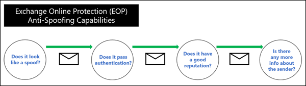
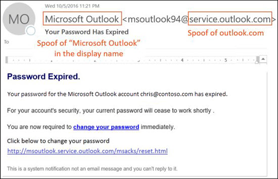
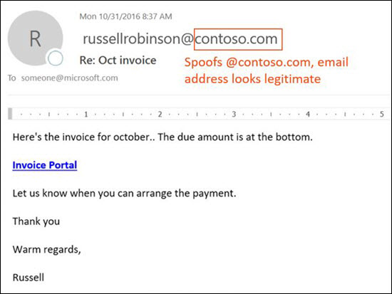
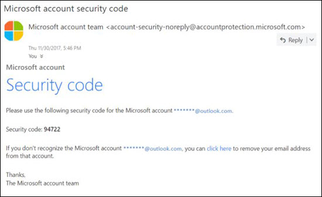

# Anti-spoofing protection in EOP

[!INCLUDE [Microsoft 365 Defender rebranding](../includes/microsoft-defender-for-office.md)]

**Applies to**
- [Exchange Online Protection](exchange-online-protection-overview.md)
- [Microsoft Defender for Office 365 plan 1 and plan 2](office-365-atp.md)
- [Microsoft 365 Defender](../mtp/microsoft-threat-protection.md)

In Microsoft 365 organizations with mailboxes in Exchange Online or standalone Exchange Online Protection (EOP) organizations without Exchange Online mailboxes, EOP includes features to help protect your organization from spoofed (forged) senders.

When it comes to protecting its users, Microsoft takes the threat of phishing seriously. Spoofing is a common technique that's used by attackers. **Spoofed messages appear to originate from someone or somewhere other than the actual source**. This technique is often used in phishing campaigns that are designed to obtain user credentials. The anti-spoofing technology in EOP specifically examines forgery of the From header in the message body (used to display the message sender in email clients). When EOP has high confidence that the From header is forged, the message is identified as spoofed.

The following anti-spoofing technologies are available in EOP:

- **Email authentication**: An integral part of any anti-spoofing effort is the use of email authentication (also known as email validation) by SPF, DKIM, and DMARC records in DNS. You can configure these records for your domains so destination email systems can check the validity of messages that claim to be from senders in your domains. For inbound messages, Microsoft 365 requires email authentication for sender domains. For more information, see [Email authentication in Microsoft 365](email-validation-and-authentication.md).

  EOP analyzes and blocks messages that can't be authenticated by the combination of standard email authentication methods and sender reputation techniques.

  

- **Spoof intelligence insight**: Review spoofed messages from senders in internal and external domains during the last 7 days, and allow or block those senders. For more information, see [Spoof intelligence insight in EOP](learn-about-spoof-intelligence.md).

- **Allow or block spoofed senders in the Tenant Allow/Block List**: When you override the verdict in the spoof intelligence insight, the spoofed sender becomes a manual allow or block entry that only appears on the **Spoof** tab in the Tenant Allow/Block List. You can also manually create allow or block entries for spoof senders before they're detected by spoof intelligence. For more information, see [Manage the Tenant Allow/Block List in EOP](tenant-allow-block-list.md).

- **Anti-phishing policies**: In EOP, anti-phishing policies contain the following anti-spoofing settings:
  - Turn spoof intelligence on or off.
  - Turn unauthenticated sender identification in Outlook on or off.
  - Specify the action for blocked spoofed senders.

  For more information, see [Spoof settings in anti-phishing policies](set-up-anti-phishing-policies.md#spoof-settings).

  **Note**: Anti-phishing policies in Microsoft Defender for Office 365 contain addition protections, including **impersonation** protection. For more information, see [Exclusive settings in anti-phishing policies in Microsoft Defender for Office 365](set-up-anti-phishing-policies.md#exclusive-settings-in-anti-phishing-policies-in-microsoft-defender-for-office-365).

- **Spoof detections report**: For more information, see [Spoof Detections report](view-email-security-reports.md#spoof-detections-report).

  **Note**: Defender for Office 365 organizations can also use Real-time detections (Plan 1) or Threat Explorer (Plan 2) to view information about phishing attempts. For more information, see [Microsoft 365 threat investigation and response](office-365-ti.md).

## How spoofing is used in phishing attacks

Spoofing messages have the following negative implications for users:

- **Spoofed messages deceive users**: A spoofed message might trick the recipient into clicking a link and giving up their credentials, downloading malware, or replying to a message with sensitive content (known as a business email compromise or BEC).

  The following message is an example of phishing that uses the spoofed sender msoutlook94@service.outlook.com:

  

  This message didn't come from service.outlook.com, but the attacker spoofed the **From** header field to make it look like it did. This was an attempt to trick the recipient into clicking the **change your password** link and giving up their credentials.

  The following message is an example of BEC that uses the spoofed email domain contoso.com:

  

  The message looks legitimate, but the sender is spoofed.

- **Users confuse real messages for fake ones**: Even users who know about phishing might have difficulty seeing the differences between real messages and spoofed messages.

  The following message is an example of a real password reset message from the Microsoft Security account:

  

  The message really did come from Microsoft, but users have been conditioned to be suspicious. Because it's difficult to the difference between a real password reset message and a fake one, users might ignore the message, report it as spam, or unnecessarily report the message to Microsoft as phishing.

## Different types of spoofing

Microsoft differentiates between two different types of spoofed messages:

- **Intra-org spoofing**: Also known as _self-to-self_ spoofing. For example:

  - The sender and recipient are in the same domain:
    > From: chris@contoso.com   To: michelle@contoso.com

  - The sender and the recipient are in subdomains of the same domain:
    > From: laura@marketing.fabrikam.com   To: julia@engineering.fabrikam.com

  - The sender and recipient are in different domains that belong to the same organization (that is, both domains are configured as [accepted domains](/exchange/mail-flow-best-practices/manage-accepted-domains/manage-accepted-domains) in the same organization):
    > From: sender @ microsoft.com   To: recipient @ bing.com

    Spaces are used in the email addresses to prevent spambot harvesting.

  Messages that fail [composite authentication](email-validation-and-authentication.md#composite-authentication) due to intra-org spoofing contain the following header values:

  `Authentication-Results: ... compauth=fail reason=6xx`

  `X-Forefront-Antispam-Report: ...CAT:SPOOF;...SFTY:9.11`

  - `reason=6xx` indicates intra-org spoofing.

  - SFTY is the safety level of the message. 9 indicates phishing, .11 indicates intra-org spoofing.

- **Cross-domain spoofing**: The sender and recipient domains are different, and have no relationship to each other (also known as external domains). For example:
    > From: chris@contoso.com   To: michelle@tailspintoys.com

  Messages that fail [composite authentication](email-validation-and-authentication.md#composite-authentication) due to cross-domain spoofing contain the following headers values:

  `Authentication-Results: ... compauth=fail reason=000/001`

  `X-Forefront-Antispam-Report: ...CAT:SPOOF;...SFTY:9.22`

  - `reason=000` indicates the message failed explicit email authentication. `reason=001` indicates the message failed implicit email authentication.

  - SFTY is the safety level of the message. 9 indicates phishing, .22 indicates cross-domain spoofing.

For more information about the Category and composite authentication (compauth) values that are related to spoofing, see [Anti-spam message headers in Microsoft 365](anti-spam-message-headers.md).

For more information about DMARC, see [Use DMARC to validate email in Microsoft 365](use-dmarc-to-validate-email.md).

## Problems with anti-spoofing protection

Mailing lists (also known as discussion lists) are known to have problems with anti-spoofing due to the way they forward and modify messages.

For example, Gabriela Laureano (glaureano@contoso.com) is interested in bird watching, joins the mailing list birdwatchers@fabrikam.com, and sends the following message to the list:

> **From:** "Gabriela Laureano" \<glaureano@contoso.com\>   **To:** Birdwatcher's Discussion List \<birdwatchers@fabrikam.com\>   **Subject:** Great viewing of blue jays at the top of Mt. Rainier this week 
 Anyone want to check out the viewing this week from Mt. Rainier?

The mailing list server receives the message, modifies its content, and replays it to the members of list. The replayed message has the same From address (glaureano@contoso.com), but a tag is added to the subject line, and a footer is added to the bottom of the message. This type of modification is common in mailing lists, and may result in false positives for spoofing.

> **From:** "Gabriela Laureano" \<glaureano@contoso.com\>   **To:** Birdwatcher's Discussion List \<birdwatchers@fabrikam.com\>   **Subject:** [BIRDWATCHERS] Great viewing of blue jays at the top of Mt. Rainier this week 
 Anyone want to check out the viewing this week from Mt. Rainier? 
 This message was sent to the Birdwatchers Discussion List. You can unsubscribe at any time.

To help mailing list messages pass anti-spoofing checks, do following steps based on whether you control the mailing list:

- Your organization owns the mailing list:

  - Check the FAQ at DMARC.org: [I operate a mailing list and I want to interoperate with DMARC, what should I do?](https://dmarc.org/wiki/FAQ#I_operate_a_mailing_list_and_I_want_to_interoperate_with_DMARC.2C_what_should_I_do.3F).

  - Read the instructions at this blog post: [A tip for mailing list operators to interoperate with DMARC to avoid failures](/archive/blogs/tzink/a-tip-for-mailing-list-operators-to-interoperate-with-dmarc-to-avoid-failures).

  - Consider installing updates on your mailing list server to support ARC, see <http://arc-spec.org>.

- Your organization doesn't own the mailing list:

  - Ask the maintainer of the mailing list to configure email authentication for the domain that the mailing list is relaying from.

    When enough senders reply back to domain owners that they should set up email authentication records, it spurs them into taking action. While Microsoft also works with domain owners to publish the required records, it helps even more when individual users request it.

  - Create inbox rules in your email client to move messages to the Inbox. You can also ask your admins to configure overrides as discussed in the [Use spoof intelligence to configure permitted senders of unauthenticated email](email-validation-and-authentication.md#use-spoof-intelligence-to-configure-permitted-senders-of-unauthenticated-email).

  - Create a support ticket with Microsoft 365 to create an override for the mailing list to treat it as legitimate. For more information, see [Contact support for business products - Admin Help](../../admin/contact-support-for-business-products.md).

If all else fails, you can report the message as a false positive to Microsoft. For more information, see [Report messages and files to Microsoft](report-junk-email-messages-to-microsoft.md).

You may also contact your admin who can raise it as a support ticket with Microsoft. The Microsoft engineering team will investigate why the message was marked as a spoof.

## Considerations for anti-spoofing protection

If you're an admin who currently sends messages to Microsoft 365, you need to ensure that your email is properly authenticated. Otherwise, it might be marked as spam or phishing. For more information, see [Solutions for legitimate senders who are sending unauthenticated email](email-validation-and-authentication.md#solutions-for-legitimate-senders-who-are-sending-unauthenticated-email).

Senders in an individual user's (or admin's) Safe Senders list will bypass parts of the filtering stack, including spoof protection. For more information, see [Outlook Safe Senders](create-safe-sender-lists-in-office-365.md#use-outlook-safe-senders).

Admins should avoid (when possible) using allowed sender lists or allowed domain lists. These senders bypass all spam, spoofing, and phishing protection, and also sender authentication (SPF, DKIM, DMARC). For more information, see [Use allowed sender lists or allowed domain lists](create-safe-sender-lists-in-office-365.md#use-allowed-sender-lists-or-allowed-domain-lists).