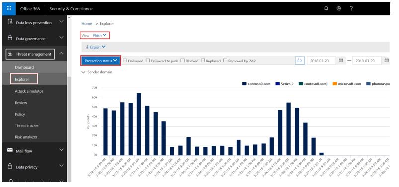
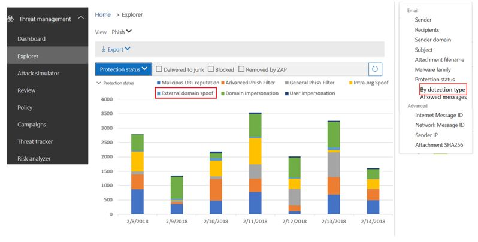
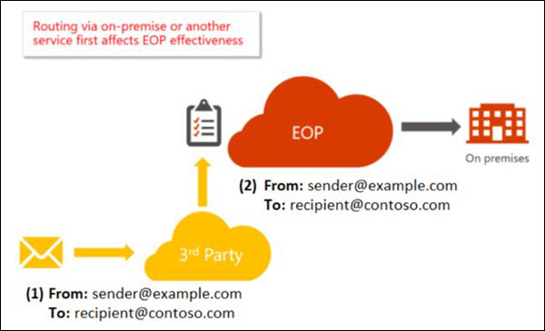
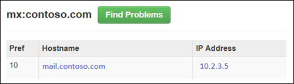
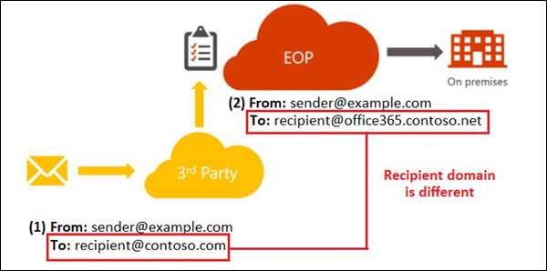
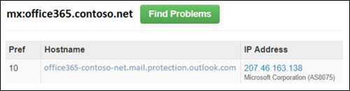
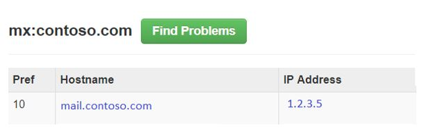

# Anti-spoofing protection in Office 365

If you're an Office 365 customer with mailboxes in Exchange Online or a standalone Exchange Online Protection (EOP) customer without Exchange Online mailboxes, EOP includes features to help protect your organization from spoofed (forged) senders.

When it comes to protecting its users, Microsoft takes the threat of phishing seriously. Spoofing is a common technique that's used by attackers. The message appears to originate from someone or somewhere other than the actual source. This technique is often used in phishing campaigns that are designed to obtain user credentials. The anti-spoofing technology in EOP specifically examines forgery of the **From** header in the message body (used to display the message sender in email clients). When EOP has high confidence that the **From** header is forged, the message is identified as spoofed.

The following anti-spoofing technologies are available in EOP:

- **Spoof intelligence**: Review spoofed messages from senders in internal and external domains, and allow or block those senders. For more information, see [Learn more about spoof intelligence](learn-about-spoof-intelligence.md).

- **Anti-phishing policies**: Basic anti-phishing policies are available in EOP, and more advanced anti-phishing policies are available in Advanced Threat Protection (ATP). For more information, see [Anti-phishing protection in Office 365](anti-phishing-protection.md).

- **Email authentication**: An integral part of any anti-spoofing effort is the use of email authentication (also known as email validation) by using SPF, DKIM, and DMARC. For more information, see [Email authentication in Office 365](email-validation-and-authentication.md).

The rest of this topic describes 
This article describes how Office 365 mitigates against phishing attacks that use forged sender domains, that is, domains that are spoofed. It accomplishes this by analyzing the messages and blocking the ones that cannot be authenticated using standard email authentication methods, nor other sender reputation techniques. This change was implemented to reduce the number of phishing attacks to which organizations in Office 365 are exposed.

Microsoft's anti-spoofing technology was originally deployed to Office 365 Enterprise E5 organizations or organizations with an ATP add-on. In October, 2018 anti-spoofing protection was included in EOP. Additionally, because of the way all of our filters learn from each other, Outlook.com users may also be affected.

## How spoofing is used in phishing attacks

Spoofing messages have two negative implications for real life users:

- **Spoofed messages deceive users**: A spoofed message might trick the recipient into clicking a link and and giving up their credentials, downloading malware, or replying to a message with sensitive content (known as a business email compromise or BEC).

  The following message is an example of phishing that uses the spoofed sender msoutlook94@service.outlook.com:

  

  This message didn't actually come from service.outlook.com, but the attacker spoofed the **From** header field to make it look like it did. This was an attempt to trick the recipient into clicking the **change your password** link and giving up their credentials.

  The following message is an example of BEC that uses the spoofed email domain contoso.com:

  

  The message looks legitimate, but the sender is actually spoofed.

- **Users confuse real messages for fake ones**: Even users who know about phishing might have difficulty seeing the differences between real messages and spoofed messages.

  The following message is an example of a real password reset message from the Microsoft Security account:

  

  The message really did come from Microsoft, but users have been conditioned to be suspicious. Because it's difficult to the difference between a real password reset message and a fake one, users might ignore the message, report it as spam, or unnecessarily report the message to Microsoft as phishing.

## Viewing reports of how many messages were marked as spoofed

Once your anti-spoofing policy is enabled, you can use threat investigation and response capabilities to get numbers around how many messages are marked as phish. To do this, go into the Security & Compliance Center (SCC) under Threat Management \> Explorer, set the View to Phish, and group by Sender Domain or Protection Status:



You can interact with the various reports to see how many were marked as phishing, including messages marked as SPOOF. To learn more, see [Get started with Office 365 Threat investigation and response](office-365-ti.md).

You can't yet split out which messages were marked due to spoofing as opposed to other types of phishing (general phishing, domain or user impersonation, and so on). However, later, you will be able to do this through the Security & Compliance Center. Once you do, you can use this report as a starting place to identify sending domains that may be legitimate that are being marked as spoof due to failing authentication.

The following screenshot is a proposal for how this data will look, but may change when released:



For non-ATP and E5 customers, these reports will be available later under the Threat Protection Status (TPS) reports, but will be delayed by at least 24 hours. This page will be updated as they are integrated into the Security & Compliance Center.

### Predicting how many messages will be marked as spoof

Once Office 365 updates its settings to let you turn the anti-spoofing enforcement Off, or on with Basic or High enforcement, you will be given the ability to see how message disposition will change at the various settings. That is, if anti-spoofing is Off, you will be able to see how many messages will be detected as Spoof if you turn to Basic; or, if it's Basic, you will be able to see how many more messages will be detected as Spoof if you turn it to High.

This feature is currently under development. As more details are defined, this page will be updated both with screenshots of the Security & Compliance Center, and with PowerShell examples.


### Legitimate scenarios to disable anti-spoofing

Anti-spoofing better protects customers from phishing attacks, and therefore disabling anti-spoofing protection is strongly discouraged. By disabling it, you may resolve some short-term false positives, but long term you will be exposed to more risk. The cost for setting up email authentication for the source email system, or making adjustments in the phishing policies, are usually one-time events or require only minimal, periodic maintenance. However, the cost to recover from a phishing attack where data has been exposed, or assets have been compromised is much higher.

For this reason, it is better to work through anti-spoofing false positives than to disable anti-spoof protection.

However, there is a legitimate scenario where anti-spoofing should be disabled, and that is when there are additional mail-filtering products in the message routing, and Office 365 is not the first hop in the email path:



The other server may be an Exchange on-premises mail server, a mail filtering device such as Ironport, or another cloud hosted service.

If the MX record of the recipient domain does not point to Office 365, then there is no need to disable anti-spoofing because Office 365 looks up your receiving domain's MX record and suppresses anti-spoofing if it points to another service. If you don't know if your domain has another server in front, you can use a website like MX Toolbox to look up the MX record. It might say something like the following:



This domain has an MX record that does not point to Office 365, so Office 365 would not apply anti-spoofing enforcement.

However, if the MX record of the recipient domain  *does*  point to Office 365, even though there is another service in front of Office 365, then you should disable anti-spoofing. The most common example is through the use of a recipient rewrite:



The domain contoso.com's MX record points to the on-premises server, while the domain @office365.contoso.net's MX record points to Office 365 because it contains \*.protection.outlook.com, or \*.eo.outlook.com in the MX record:



Be sure to differentiate when a recipient domain's MX record does not point to Office 365, and when it has undergone a recipient rewrite. It is important to tell the difference between these two cases.

If you are unsure whether or not your receiving domain has undergone a recipient-rewrite, sometimes you can tell by looking at the message headers.

a) First, look at the headers in the message for the recipient domain in the Authentication-Results header:

```text
Authentication-Results: spf=fail (sender IP is 1.2.3.4)
  smtp.mailfrom=fabrikam.com; office365.contoso.net; dkim=fail
  (body hash did not verify) header.d=simple.fabrikam.com;
  office365.contoso.net; dmarc=none action=none
  header.from=fabrikam.com; compauth=fail reason=001
```

The recipient domain is found in the bold red text above, in this case office365.contoso.net. This may be different that the recipient in the To: header:

To: Example Recipient \<recipient @ contoso.com\>

Perform an MX-record lookup of the actual recipient domain. If it contains \*.protection.outlook.com, mail.messaging.microsoft.com, \*.eo.outlook.com, or mail.global.frontbridge.com, that means that the MX points to Office 365.

If it does not contain those values, then it means that the MX does not point to Office 365. One tool you can use to verify this is MX Toolbox.

For this particular example, the following says that contoso.com, the domain that looks like the recipient since it was the To: header, has MX record points to an on-prem server:



However, the actual recipient is office365.contoso.net whose MX record does point to Office 365:


Therefore, this message has likely undergone a recipient-rewrite.

b) Second, be sure to distinguish between common use cases of recipient rewrites. If you are going to rewrite the recipient domain to \*.onmicrosoft.com, instead rewrite it to \*.mail.onmicrosoft.com.

Once you have identified the final recipient domain that is routed behind another server and the recipient domain's MX record actually points to Office 365 (as published in its DNS records), you may proceed to disable anti-spoofing.

Remember, you don't want to disable anti-spoofing if the domain's first hop in the routing path is Office 365, only when it's behind one or more services.

### How to disable anti-spoofing

If you already have an Anti-phishing policy created, set the *EnableAntispoofEnforcement* parameter to $false:

```powershell
$name = "<name of policy>"
Set-AntiphishPolicy -Identity $name -EnableAntiSpoofEnforcement $false
```

If you don't know the name of the policy (or policies) to disable, you can display them:

```powershell
Get-AntiphishPolicy | Format-List Name
```

If you don't have any existing anti-phishing policies, you can create one and then disable it (even if you don't have a policy, anti-spoofing is still applied; later on in 2018, a default policy will be created for you and you can then disable that instead of creating one). You will have to do this in multiple steps:

```powershell
$org = Get-OrganizationConfig
$name = "My first anti-phishing policy for " + $org.Name
# Note: If the name is more than 64 characters, you will need to choose a smaller one
```

```powershell
# Next, create a new anti-phishing policy with the default values
New-AntiphishPolicy -Name $Name
# Select the domains to scope it to
# Multiple domains are specified in a comma-separated list
$domains = "domain1.com, domain2.com, domain3.com"
# Next, create the anti-phishing rule, scope it to the anti-phishing rule
New-AntiphishRule -Name $name -AntiphishPolicy -RecipientDomainIs $domains
# Finally, scope the anti-phishing policy to the domains
Set-AntiphishPolicy -Identity $name -EnableAntispoofEnforcement $false
```

Disabling anti-spoofing is only available via cmdlet (later it will be available in the Security & Compliance Center). If you do not have access to PowerShell, create a support ticket.

Remember, this should only be applied to domains that undergo indirect routing when sent to Office 365. Resist the temptation to disable anti-spoofing because of some false positives, it will be better in the long run to work through them.

### Information for individual users

Individual users are limited in how they can interact with the anti-spoofing safety tip. However, there are several things you can do to resolve common scenarios.

### Common scenario: Discussion lists

Discussion lists are known to have problems with anti-spoofing due to the way they forward the message and modify its contents yet retain the original From: address.

For example, suppose Gabriela Laureano (glaureano @ contoso.com) is interested in bird watching and joins the discussion list birdwatchers @ fabrikam.com. When she send a message to the discussion list, it looks like this:

> **From:** Gabriela Laureano \<glaureano @ contoso.com\> <br/> **To:** Birdwatcher's Discussion List \<birdwatchers @ fabrikam.com\> <br/> 
**Subject:** Great viewing of blue jays at the top of Mt. Rainier this week <br/><br/>Anyone want to check out the viewing this week from Mt. Rainier?

When the email list receives the message, they format the message, modify its contents, and replay it to the rest of the members on the discussion list which, is made up of participants from many different email receivers.

> **From:** Gabriela Laureano \<glaureano @ contoso.com\> <br/> **To:** Birdwatcher's Discussion List \<birdwatchers @ fabrikam.com\> <br/> **Subject:** [BIRDWATCHERS] Great viewing of blue jays at the top of Mt. Rainier this week <br/><br/> Anyone want to check out the viewing this week from Mt. Rainier? <br/><br/> 
This message was sent to the Birdwatchers Discussion List. You can unsubscribe at any time.

In this example, the replayed message has the same From: address (glaureano @ contoso.com) but the original message has been modified by adding a tag to the Subject line, and a footer to the bottom of the message. This type of message modification is common in mailing lists, and may result in false positives.

If you or someone in your organization is an administrator of the mailing list, you may be able to configure it to pass anti-spoofing checks.

- Check the FAQ at DMARC.org: [I operate a mailing list and I want to interoperate with DMARC, what should I do?](https://dmarc.org/wiki/FAQ#I_operate_a_mailing_list_and_I_want_to_interoperate_with_DMARC.2C_what_should_I_do.3F)

- Read the instructions at this blog post: [A tip for mailing list operators to interoperate with DMARC to avoid failures](https://blogs.msdn.microsoft.com/tzink/2017/03/22/a-tip-for-mailing-list-operators-to-interoperate-with-dmarc-to-avoid-failures/)

- Consider installing updates on your mailing list server to support ARC, see [https://arc-spec.org](https://arc-spec.org/)

If you don't own the mailing list:

- You can request the maintainer of the mailing list to implement one of the previous options (they should also have email authentication set up for the domain the mailing list is relaying from).

- You can create mailbox rules in your email client to move messages to the Inbox. You can also request your organization's administrators to set up allow rules, or overrides as discussed in the [Managing legitimate senders who are sending unauthenticated email](#managing-legitimate-senders-who-are-sending-unauthenticated-email)section in this topic.

- You can create a support ticket with Office 365 to create an override for the mailing list to treat it as legitimate.

### Other scenarios

1. If neither of the above common scenarios applies to your situation, report the message as a false positive back to Microsoft. For more information, see the section [How can I report spam or non-spam messages back to Microsoft?](#how-can-i-report-spam-or-non-spam-messages-back-to-microsoft) later in this article.

2. You may also contact your email administrator who can raise it as a support ticket with Microsoft. The Microsoft engineering team will investigate why the message was marked as a spoof.

3. Additionally, if you know who the sender is and are confident they are not being maliciously spoofed, you may reply back to the sender indicating that they are sending messages from a mail server that does not authenticate. This sometimes results in the original sender contacting their IT administrator who will set up the required email authentication records.

   When enough senders reply back to domain owners that they should set up email authentication records, it spurs them into taking action. While Microsoft also works with domain owners to publish the required records, it helps even more when individual users request it.

4. Optionally, add the sender to your Safe Senders list. However, be aware that if a phisher spoofs that account, it will be delivered to your mailbox. Therefore, this option should be used sparingly.

## How senders to Microsoft should prepare for anti-spoofing protection

If you are an administrator who currently sends messages to Microsoft, either Office 365 or Outlook.com, you should ensure that your email is properly authenticated otherwise it may be marked as spam or phish.

### Customers of Office 365

If you are an Office 365 customer and you use Office 365 to send outbound email:

- For your domains, [Set up SPF in Office 365 to help prevent spoofing](set-up-spf-in-office-365-to-help-prevent-spoofing.md)

- For your primary domains, [Use DKIM to validate outbound email sent from your custom domain in Office 365](use-dkim-to-validate-outbound-email.md)

- [Consider setting up DMARC records](use-dmarc-to-validate-email.md) for your domain to determine who are your legitimate senders

Microsoft does not provide detailed implementation guidelines for each of SPF, DKIM, and DMARC. However, there is a lot of information published online. There are also 3rd party companies dedicated to helping your organization set up email authentication records.

### Administrators of domains that are not Office 365 customers

If you are a domain administrator but are not an Office 365 customer:

- You should set up SPF to publish your domain's sending IP addresses, and also set up DKIM (if available) to digitally sign messages. You may also consider setting up DMARC records.

- If you have bulk senders who are transmitting email on your behalf, you should work with them to send email in a way such that the sending domain in the From: address (if it belongs to you) aligns with the domain that passes SPF or DMARC.

- If you have on-premises mail servers, or send from a Software-as-a-service provider, or from a cloud-hosting service like Microsoft Azure, GoDaddy, Rackspace, Amazon Web Services, or similar, you should ensure that they are added to your SPF record.

- If you are a small domain that is hosted by an ISP, you should set up your SPF record according to the instructions that is provided to you by your ISP. Most ISPs provide these types of instructions and can be found on the company's support pages.

- Even if you have not had to publish email authentication records before, and it worked fine, you must still publish email authentication records to send to Microsoft. By doing so, you are helping in the fight against phishing, and reducing the possibility that either you, or organizations you send to, will get phished.

### What if you don't know who sends email as your domain?

Many domains do not publish SPF records because they do not know who all their senders are. That's okay, you do not need to know who all of them are. Instead, you should get started by publishing an SPF record for the ones you do know of, especially where your corporate traffic is located, and publish a neutral SPF policy, `?all`:

```text
fabrikam.com IN TXT "v=spf1 include:spf.fabrikam.com ?all"
```

The neutral SPF policy means that any email that comes out of your corporate infrastructure will pass email authentication at all other email receivers. Email that comes from senders you don't know about will fall back to neutral, which is almost the same as publishing no SPF record at all.

When sending to Office 365, email that comes from your corporate traffic will be marked as authenticated, but the email that comes from sources you don't know about may still be marked as spoof (depending upon whether or not Office 365 can implicitly authenticate it). However, this is still an improvement from all email being marked as spoof by Office 365.

Once you've gotten started with an SPF record with a fallback policy of ?all, you can gradually include more and more sending infrastructure and then publish a stricter policy.

### What if you are the owner of a mailing list?

See the [Common scenario: Discussion lists](#common-scenario-discussion-lists) section earlier in this topic.

### What if you are an infrastructure provider such as an Internet Service Provider (ISP), Email Service Provider (ESP), or cloud hosting service?

If you host a domain's email, and it sends email, or provide hosting infrastructure that can send email, you should do the following:

- Ensure your customers have documentation detailing what to publish in their SPF records

- Consider signing DKIM-signatures on outbound email even if the customer doesn't explicitly set it up (sign with a default domain). You can even double-sign the email with DKIM signatures (once with the customer's domain if they have set it up, and a second time with your company's DKIM signature)

Deliverability to Microsoft is not guaranteed even if you authenticate email originating from your platform, but at least it ensures that Microsoft does not junk your email because it is not authenticated. For more details around how Outlook.com filters email, see the [Outlook.com Postmaster page](https://postmaster.live.com/pm/postmaster.aspx).

For more details on service providers best practices, see [M3AAWG Mobile Messaging Best Practices for Service Providers](https://www.m3aawg.org/sites/default/files/M3AAWG-Mobile-Messaging-Best-Practices-Service-Providers-2015-08.pdf).

