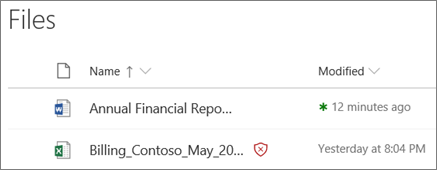
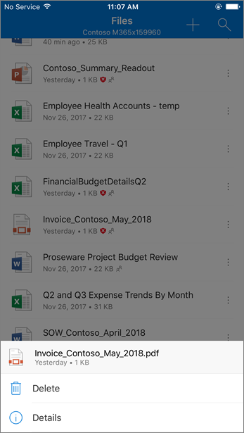
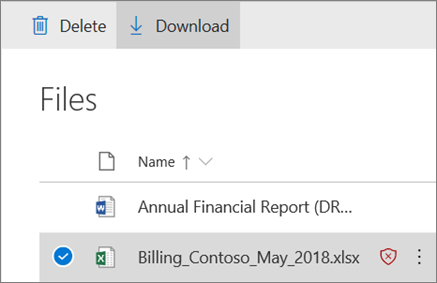

# Safe Attachments for SharePoint, OneDrive, and Microsoft Teams

[!INCLUDE [Microsoft 365 Defender rebranding](../includes/microsoft-defender-for-office.md)]

**Applies to**
- [Microsoft Defender for Office 365 plan 1 and plan 2](office-365-atp.md)
- [Microsoft 365 Defender](../mtp/microsoft-threat-protection.md)

Safe Attachments for SharePoint, OneDrive, and Microsoft Teams in [Microsoft Defender for Office 365](office-365-atp.md) provides an additional layer of protection for files that have already been scanned at upload time by the [common virus detection engine in Microsoft 365](virus-detection-in-spo.md). Safe Attachments for SharePoint, OneDrive, and Microsoft Teams helps detect and block existing files that are identified as malicious in team sites and document libraries.

Safe Attachments for SharePoint, OneDrive, and Microsoft Teams is not enabled by default. To turn it on, see [Turn on Safe Attachments for SharePoint, OneDrive, and Microsoft Teams](turn-on-atp-for-spo-odb-and-teams.md).

## How Safe Attachments for SharePoint, OneDrive, and Microsoft Teams works

When Safe Attachments for SharePoint, OneDrive, and Microsoft Teams is enabled and identifies a file as malicious, the file is locked using direct integration with the file stores. The following image shows an example of a malicious file detected in a library.

Although the blocked file is still listed in the document library and in web, mobile, or desktop applications, people can't open, copy, move, or share the file. But they can delete the blocked file.

Here's an example of what a blocked file looks like on a mobile device:

By default, people can download a blocked file. Here's what downloading a blocked file looks like on a mobile device:

SharePoint Online admins can prevent people from downloading malicious files. For instructions, see [Use SharePoint Online PowerShell to prevent users from downloading malicious files](turn-on-atp-for-spo-odb-and-teams.md#step-2-recommended-use-sharepoint-online-powershell-to-prevent-users-from-downloading-malicious-files).

To learn more about the user experience when a file has been detected as malicious, see [What to do when a malicious file is found in SharePoint Online, OneDrive, or Microsoft Teams](https://support.microsoft.com/office/01e902ad-a903-4e0f-b093-1e1ac0c37ad2).

## View information about malicious files detected by Safe Attachments for SharePoint, OneDrive, and Microsoft Teams

Files that are identified as malicious by Microsoft Defender for Office 365 will show up in [reports for Microsoft Defender for Office 365](view-reports-for-atp.md) and in [Explorer (and real-time detections)](threat-explorer.md).

As of May 2018, when a file is identified as malicious by Microsoft Defender for Office 365, the file is also available in quarantine. For more information, see [Use the Security & Compliance Center to manage quarantined files](manage-quarantined-messages-and-files.md#microsoft-defender-for-office-365-only-use-the-security--compliance-center-to-manage-quarantined-files).

## Keep these points in mind

- Defender for Office 365 will not scan every single file in SharePoint Online, OneDrive for Business, or Microsoft Teams. This is by design. Files are scanned asynchronously. The process uses sharing and guest activity events along with smart heuristics and threat signals to identify malicious files.

- Make sure your SharePoint sites are configured to use the [Modern experience](https://docs.microsoft.com/sharepoint/guide-to-sharepoint-modern-experience). Defender for Office 365 protection applies whether the Modern experience or the Classic view is used; however, visual indicators that a file is blocked are available only in the Modern experience.

- Safe Attachments for SharePoint, OneDrive, and Microsoft Teams is part of your organization's overall threat protection strategy, which includes anti-spam and anti-malware protection in Exchange Online Protection (EOP), as well as Safe Links and Safe Attachments in Microsoft Defender for Office 365. To learn more, see [Protect against threats in Office 365](protect-against-threats.md).
