# Safe Links in Microsoft Defender for Office 365

[!INCLUDE [Microsoft 365 Defender rebranding](../includes/microsoft-defender-for-office.md)]

> [!IMPORTANT]
> This article is intended for business customers who have [Microsoft Defender for Office 365](office-365-atp.md). If you're using Outlook.com, Microsoft 365 Family, or Microsoft 365 Personal, and you're looking for information about Safelinks in Outlook, see [Advanced Outlook.com security](https://support.microsoft.com/office/882d2243-eab9-4545-a58a-b36fee4a46e2).

Safe Links is a feature in [Defender for Office 365](office-365-atp.md) that provides URL scanning and rewriting of inbound email messages in mail flow, and time-of-click verification of URLs and links in email messages and other locations. Safe Links scanning occurs in addition to the regular [anti-spam and anti-malware protection](anti-spam-and-anti-malware-protection.md) in inbound email messages in Exchange Online Protection (EOP). Safe Links scanning can help protect your organization from malicious links that are used in phishing and other attacks.

Safe Links protection is available in the following locations:

- **Email messages**: Safe Links protection for links in email messages is controlled by Safe Links policies. There is no default Safe Links policy, **so to get the protection of Safe Links in email messages, you need to create one or more Safe Links policies**. For instructions, see [Set up Safe Links policies in Microsoft Defender for Office 365](set-up-atp-safe-links-policies.md).

  For more information about Safe Links protection for email messages, see the [Safe Links settings for email messages](#safe-links-settings-for-email-messages) section later in this article.

- **Microsoft Teams** (currently in TAP Preview): Safe Links protection for links in Teams conversations, group chats, or from channels is also controlled by Safe Links policies. There is no default Safe Links policy, **so to get the protection of Safe Links in Teams, you need to create one or more Safe Links policies**.

  For more information about Safe Links protection in Teams, see the [Safe Links settings for Microsoft Teams](#safe-links-settings-for-microsoft-teams) section later in this article.

- **Office 365 apps**: Safe Links protection for Office 365 apps is available in supported desktop, mobile, and web aps. You **configure** Safe Links protection for Office 365 apps in the global setting that are **outside** of Safe Links policies. For instructions, see [Configure global settings for Safe Links settings in Microsoft Defender for Office 365](configure-global-settings-for-safe-links.md).

  But, Safe Links protection for Office 365 apps is only **applied** to users who are included in active Safe Links policies. If a user isn't included in an active Safe Links policy, the user doesn't get Safe Links protection in supported Office 365 apps.

  For more information about Safe Links protection in Office 365 apps, see the [Safe Links settings for Office 365 apps](#safe-links-settings-for-office-365-apps) section later in this article.

This article includes detailed descriptions of the following types of Safe Links settings:

- **Settings in Safe Links policies**: These settings apply only to the users who are included in the specific policies, and the settings might be different between policies. These settings include:

  - [Safe Links settings for email messages](#safe-links-settings-for-email-messages)
  - [Safe Links settings for Microsoft Teams](#safe-links-settings-for-microsoft-teams)
  - ["Do not rewrite the following URLs" lists in Safe Links policies](#do-not-rewrite-the-following-urls-lists-in-safe-links-policies)

- **Global Safe Links settings**: These settings are configured globally, not in Safe Links policies. But, the settings apply only to users who are included in active Safe Links policies. These settings include:

  - [Safe Links settings for Office 365 apps](#safe-links-settings-for-office-365-apps)
  - ["Block the following URLs" list for Safe Links](#block-the-following-urls-list-for-safe-links)

The following table describes scenarios for Safe Links in Microsoft 365 and Office 365 organizations that include Defender for Office 365 (in other words, lack of licensing is never an issue in the examples).

****

|Scenario|Result|
|---|---|
|Jean is a member of the marketing department. Safe Links protection for Office 365 apps is turned on in the global settings for Safe Links, and a Safe Links policy that applies to members of the marketing department exists. Jean opens a PowerPoint presentation in an email message, and then clicks a URL in the presentation.|Jean is protected by Safe Links. 
 Jean is included in a Safe Links policy, and Safe Links protection for Office 365 apps is turned on. 
 For more information about the requirements for Safe Links protection in Office 365 apps, see the [Safe Links settings for Office 365 apps](#safe-links-settings-for-office-365-apps) section later in this article.|
|Chris's Microsoft 365 E5 organization has no Safe Links policies configured. Chris receives an email from an external sender that contains a URL to a malicious website that he ultimately clicks.|Chris is not protected by Safe Links. 
 An admin must create at least one Safe Links policy for anyone to get Safe Links protection in inbound email messages. Chris must be included in the conditions of policy to get Safe Links protection.|
|In Pat's organization, no admins have created any Safe Links policies, but Safe Links protection for Office 365 apps is turned on. Pat opens a Word document and clicks a URL in the file.|Pat is not protected by Safe Links. 
 Although Safe Links protection for Office 365 apps is turned on globally, Pat is not included in any active Safe Links policies, so the protection can't be applied.|
|In Lee's organization, `https://tailspintoys.com` is configured in the **Block the following URLs** list in the global settings for Safe Links. A Safe Links policy that includes Lee already exists. Lee receives an email message that contains the URL `https://tailspintoys.com/aboutus/trythispage`. Lee clicks the URL.|The URL might be automatically blocked for Lee; it depends on the URL entry in the list and the email client Lee used. For more information, see the ["Block the following URLs" list for Safe Links](#block-the-following-urls-list-for-safe-links) section later in this article.|
|Jamie and Julia both work for contoso.com. A long time ago, admins configured Safe Links policies that apply to both of Jamie and Julia. Jamie sends an email to Julia, not knowing that the email contains a malicious URL.|Julia is protected by Safe Links **if** the Safe Links policy that applies to her is configured to apply to messages between internal recipients. For more information, see the [Safe Links settings for email messages](#safe-links-settings-for-email-messages) section later in this article.|

## Safe Links settings for email messages

Safe Links scans incoming email for known malicious hyperlinks. Scanned URLs are rewritten using the Microsoft standard URL prefix: `https://nam01.safelinks.protection.outlook.com`. After the link is rewritten, it's analyzed for potentially malicious content.

After Safe Links rewrites a URL, the URL remains rewritten even if the message is *manually* forwarded or replied to (both to internal and external recipients). Additional links that are added to the forwarded or replied to message are not rewritten. However, in the case of *automatic* forwarding by Inbox rules or SMTP forwarding, the URL will not be rewritten in the message that's intended for the final recipient *unless* that recipient is also protected by Safe Links or the URL had already been rewritten in a previous communication. 

The settings in Safe Links policies that apply to email messages are described in the following list:

- **Select the action for unknown potentially malicious URLs in messages**: Enables or disables Safe Links scanning in email messages. The recommended value is **On**. Turning on this setting results in the following actions.

  - Safe Links scanning is enabled in Outlook (C2R) on Windows.
  - URLs are rewritten and users are routed through Safe Links protection when they click URLs in messages.
  - When clicked, URLs are checked against a list of known malicious URLs and the ["Block the following URLs" list](#block-the-following-urls-list-for-safe-links).
  - URLs that don't have a valid reputation are detonated asynchronously in the background.

- **Apply real-time URL scanning for suspicious links and links that point to files**: Enables real-time scanning of links, including links in email messages that point to downloadable content. The recommended value is enabled.

  - **Wait for URL scanning to complete before delivering the message**:

    - Enabled: Messages that contain URLs are held until scanning is finished. Messages are delivered only after the URLs are confirmed to be safe. This is the recommended value.
    - Disabled: If URL scanning can't complete, deliver the message anyway.

- **Apply Safe Links to email messages sent within the organization**: Enables or disables Safe Links scanning on messages sent between internal senders and internal recipients within the same Exchange Online organization. The recommended value is enabled.

- **Do not track user clicks**: Enables or disables storing Safe Links click data for URLs clicked in email messages. The recommend value is to leave this setting unselected (to track user clicks).

  URL click tracking for links in email messages sent between internal senders and internal recipients is currently not supported.

- **Do not allow users to click through to original URL**: Allows or blocks users from clicking through the [warning page](#warning-pages-from-safe-links) to the original URL. The recommend value is enabled.

- **Do not rewrite the following URLs**: Leaves URLs as they are. Keeps a custom list of safe URLs that don't need scanning. The list is unique for each Safe Links policy. For more information about the **Do not rewrite the following URLs** list, see the ["Do not rewrite the following URLs" lists in Safe Links policies](#do-not-rewrite-the-following-urls-lists-in-safe-links-policies) section later in this article.

For more information about the recommended values for Standard and Strict policy settings for Safe Links policies, see [Safe Links policy settings](recommended-settings-for-eop-and-office365-atp.md#safe-links-policy-settings).

- **Recipient filters**: You need to specify the recipient conditions and exceptions that determine who the policy applies to. You can use these properties for conditions and exceptions:

  - **The recipient is**
  - **The recipient domain is**
  - **The recipient is a member of**

  You can only use a condition or exception once, but the condition or exception can contain multiple values. Multiple values of the same condition or exception use OR logic (for example, _\<recipient1\>_ or _\<recipient2\>_). Different conditions or exceptions use AND logic (for example, _\<recipient1\>_ and _\<member of group 1\>_).

- **Priority**: If you create multiple policies, you can specify the order that they're applied. No two policies can have the same priority, and policy processing stops after the first policy is applied.

  For more information about the order of precedence and how multiple policies are evaluated and applied, see [Order and precedence of email protection](how-policies-and-protections-are-combined.md).

### How Safe Links works in email messages

At a high level, here's how Safe Links protection works on URLs in email messages:

1. All email goes through EOP, where internet protocol (IP) and envelope filters, signature-based malware protection, anti-spam and anti-malware filters before the message is delivered to the recipient's mailbox.

2. The user opens the message in their mailbox and clicks on a URL in the message.

3. Safe Links immediately checks the URL before opening the website:

   - If the URL is included in the **Block the following URLs** list, a [blocked URL warning](#blocked-url-warning) opens.

   - If the URL points to a website that has been determined to be malicious, a [malicious website warning](#malicious-website-warning) page (or a different warning page) opens.

   - If the URL points to a downloadable file, and the **Apply real-time URL scanning for suspicious links and links that point to files** setting is enabled in the policy that applies to the user, the downloadable file is checked.

   - If the URL is determined to be safe, the website opens.

## Safe Links settings for Microsoft Teams

> [!IMPORTANT]
> As of March 2020, this feature is in Preview and is available only to members of the Microsoft Teams Technology Adoption Program (TAP). For information about the release schedule, check out the [Microsoft 365 roadmap](https://www.microsoft.com/microsoft-365/roadmap?rtc=1&filters=&searchterms=Safe%2CLinks%2CProtection%2Cfor%2CMicrosoft%2CTeams).

You enable or disable Safe Links protection for Microsoft Teams in Safe Links policies. Specifically, you use the **Select the action for unknown or potentially malicious URLs within Microsoft Teams** setting. The recommended value is **On**.

The following settings in Safe Links policies that apply to links in email messages also apply to links in Teams:

- **Apply real-time URL scanning for suspicious links and links that point to files**
- **Do not track user clicks**
- **Do not allow users to click through to original URL**

These settings are explained in the previous [Safe Links settings for email messages](#safe-links-settings-for-email-messages) section.

After you turn on Safe Links protection for Microsoft Teams, URLs in Teams are checked against a list of known malicious links when the protected user clicks the link (time-of-click protection). URLs are not rewritten. If a link is found to be malicious, users will have the following experiences:

- If the link was clicked in a Teams conversation, group chat, or from channels, the warning page as shown in the screenshot below will appear in the default web browser.
- If the link was clicked from a pinned tab, the warning page will appear in the Teams interface within that tab. The option to open the link in a web browser is disabled for security reasons.
- Depending on how the **Do not allow users to click through to original URL** setting in the policy is configured, the user will or will not be allowed to click through to the original URL (**Continue anyway (not recommended)** in the screenshot). We recommend that you enable the **Do not allow users to click through to original URL** setting so users can't click through to the original URL.

If the user who sent the link isn't included in a Safe Links policy where Teams protection is enabled, the user is free to click through to the original URL on their computer or device.

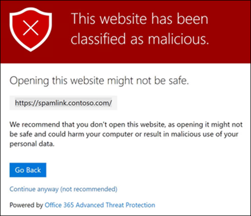

Clicking the **Go Back** button on the warning page will return the user to their original context or URL location. However, clicking on the original link again will cause Safe Links to rescan the URL, so the warning page will reappear.

### How Safe Links works in Teams

At a high level, here's how Safe Links protection works for URLs in Microsoft Teams:

1. A user starts the Teams app.

2. Microsoft 365 verifies that the user's organization includes Microsoft Defender for Office 365, and that the user is included in an active Safe Links policy where protection for Microsoft Teams is enabled.

3. URLs are validated at the time of click for the user in chats, group chats, channels, and tabs.

## Safe Links settings for Office 365 apps

Safe Links protection for Office 365 apps checks links in Office documents, not links in email messages (but it can check links in attached Office documents in email messages after the document is opened).

Safe Links protection for Office 365 apps has the following client requirements:

- Microsoft 365 Apps or Microsoft 365 Business Premium.
  - Current versions of Word, Excel, and PowerPoint on Windows, Mac, or in a web browser.
  - Office apps on iOS or Android devices.
  - Visio on Windows.
  - OneNote in a web browser.

- Office 365 apps are configured to use modern authentication. For more information, see [How modern authentication works for Office 2013, Office 2016, and Office 2019 client apps](https://docs.microsoft.com/microsoft-365/enterprise/modern-auth-for-office-2013-and-2016).

- Users are signed in using their work or school accounts. For more information, see [Sign in to Office](https://support.microsoft.com/office/b9582171-fd1f-4284-9846-bdd72bb28426).

You configure Safe Links protection for Office 365 apps in the global settings for Safe Links, not in Safe Links policies. But, in order for Safe Links protection for Office 365 apps to be applied, the user who opens the Office document and clicks the link must be included in an active Safe Links policy.

The following Safe Links settings are available for Office 365 apps:

- **Office 365 applications**: Enables or disables Safe Links scanning in supported Office 365 apps. The default and recommended value is **On**.

- **Do not track when users click Safe Links**: Enables or disables storing Safe Links click data for URLs clicked in the desktop versions Word, Excel, PowerPoint, and Visio. The recommended value is **Off**, which means user clicks are tracked.

- **Do not let users click through safe links to original URL**: Allows or blocks users from clicking through the [warning page](#warning-pages-from-safe-links) to the original URL in in the desktop versions Word, Excel, PowerPoint, and Visio. The default and recommended value is **On**.

To configure the Safe Links settings for Office 365 apps, see [Configure Safe Links protection for Office 365 apps](configure-global-settings-for-safe-links.md#configure-safe-links-protection-for-office-365-apps-in-the-security--compliance-center).

For more information about the recommended values for Standard and Strict policy settings, see [Global settings for Safe Links](recommended-settings-for-eop-and-office365-atp.md#global-settings-for-safe-links).

### How Safe Links works in Office 365 apps

At a high level, here's how Safe Links protection works for URLs in Office 365 apps. The supported Office 365 apps are described in the previous section.

1. A user signs in using their work or school account in an organization that includes Microsoft 365 Apps or Microsoft 365 Business Premium.

2. The user opens and clicks on a link an Office document in a supported Office app.

3. Safe Links immediately checks the URL before opening the target website:

   - If the URL is included in the list that skips Safe Links scanning (the **Block the following URLs** list) a [blocked URL warning](#blocked-url-warning) page opens.

   - If the URL points to a website that has been determined to be malicious, a [malicious website warning](#malicious-website-warning) page (or a different warning page) opens.

   - If the URL points to a downloadable file, and the Safe Links policy that applies to the user is configured to scan links to downloadable content (**Apply real-time URL scanning for suspicious links and links that point to files**), the downloadable file is checked.

   - If the URL is considered safe, the user is taken to the website.

   - If Safe Links scanning is unable to complete, Safe Links protection does not trigger. In Office desktop clients, the user will be warned before they proceed to the destination website.

> [!NOTE]
> It may take several seconds at the beginning of each session to verify that the user has Safe Links for Office enabled.

## "Block the following URLs" list for Safe Links

The **Block the following URLs** list defines the links that are always blocked by Safe Links scanning in the following locations:

- Email messages.
- Documents in Office 365 apps in Windows and Mac.
- Documents in Office for iOS and Android.

When a user in an active Safe Links policy clicks a blocked link in a supported app, they're taken to the [Blocked URL warning](#blocked-url-warning) page.

You configure the list of URLs in the global settings for Safe Links. For instructions, see [Configure the "Block the following URLs" list](configure-global-settings-for-safe-links.md#configure-the-block-the-following-urls-list-in-the-security--compliance-center).

**Notes**:

- For a truly universal list of URLs that are blocked everywhere, see [Manage the Tenant Allow/Block List](tenant-allow-block-list.md).

- Limits:
  - The maximum number of entries is 500.
  - The maximum length of an entry is 128 characters.
  - All of the entries can't exceed 10,000 characters.

- Don't include a forward slash (`/`) at the end of the URL. For example, use `https://www.contoso.com`, not `https://www.contoso.com/`.

- A domain only-URL (for example `contoso.com` or `tailspintoys.com`) will block any URL that contains the domain.

- You can block a subdomain without blocking the full domain. For example, `toys.contoso.com*` blocks any URL that contains the subdomain, but it doesn't block URLs that contain the full domain `contoso.com`.

- You can include up to three wildcards (`*`) per URL entry.

### Entry syntax for the "Block the following URLs" list

Examples of the values that you can enter and their results are described in the following table:

****

|Value|Result|
|---|---|
|`contoso.com` 
 or 
 `*contoso.com*`|Blocks the domain, subdomains, and paths. For example, `https://www.contoso.com`, `https://sub.contoso.com`, and `https://contoso.com/abc` are blocked.|
|`https://contoso.com/a`|Blocks `https://contoso.com/a` but not additional subpaths like `https://contoso.com/a/b`.|
|`https://contoso.com/a*`|Blocks `https://contoso.com/a` and additional subpaths like `https://contoso.com/a/b`.|
|`https://toys.contoso.com*`|Blocks a subdomain (`toys` in this example) but allow clicks to other domain URLs (like `https://contoso.com` or `https://home.contoso.com`).|
|

## "Do not rewrite the following URLs" lists in Safe Links policies

> [!NOTE]
> If your organization use Safe Links policies, the **Do not rewrite the following URLs** lists are the only supported method for third party phishing tests.

Each Safe Links policy contains a **Do not rewrite the following URLs** list that you can use to specify URLs that are not rewritten by Safe Links scanning. In other words, the list allows users who are included in the policy to access the specified URLs that would otherwise be blocked by Safe Links. You can configure different lists in different Safe Links policies. Policy processing stops after the first (likely, the highest priority) policy is applied to the user. So, only one **Do not rewrite the following URLs** list is applied to a user who is included in multiple active Safe Links policies.

To add entries to the list in new or existing Safe Links policies, see [Create Safe Links policies](set-up-atp-safe-links-policies.md#use-the-security--compliance-center-to-create-safe-links-policies) or [Modify Safe Links policies](set-up-atp-safe-links-policies.md#use-the-security--compliance-center-to-modify-safe-links-policies).

**Notes**:

- The following clients don't recognize the **Do not rewrite the following URLs** lists in Safe Links policies. Users included in the polices can be blocked from accessing the URLs based on the results of Safe Links scanning in these clients:

  - Microsoft Teams
  - Office web apps

  For a truly universal list of URLs that are allowed everywhere, see [Manage the Tenant Allow/Block List](tenant-allow-block-list.md).

- Consider adding commonly used internal URLs to the list to improve the user experience. For example, if you have on-premises services, such as Skype for Business or SharePoint, you can add those URLs to exclude them from scanning.

- If you already have **Do not rewrite the following URLs** entries in your Safe Links policies, be sure to review the lists and add wildcards as required. For example, your list has an entry like `https://contoso.com/a` and you later decide to include subpaths like `https://contoso.com/a/b`. Instead of adding a new entry, add a wildcard to the existing entry so it becomes `https://contoso.com/a/*`.

- You can include up to three wildcards (`*`) per URL entry. Wildcards explicitly include prefixes or subdomains. For example, the entry `contoso.com` is not the same as `*.contoso.com/*`, because `*.contoso.com/*` allows people to visit subdomains and paths in the specified domain.

### Entry syntax for the "Do not rewrite the following URLs" list

Examples of the values that you can enter and their results are described in the following table:

****

|Value|Result|
|---|---|
|`contoso.com`|Allows access to `https://contoso.com` but not subdomains or paths.|
|`*.contoso.com/*`|Allows access to a domain, subdomains, and paths (for example, `https://www.contoso.com`, `https://www.contoso.com`, `https://maps.contoso.com`, or `https://www.contoso.com/a`). 
 This entry is inherently better than `*contoso.com*`, because it doesn't allow potentially fraudulent sites, like `https://www.falsecontoso.com` or `https://www.false.contoso.completelyfalse.com`|
|`https://contoso.com/a`|Allows access to `https://contoso.com/a`, but not subpaths like `https://contoso.com/a/b`|
|`https://contoso.com/a/*`|Allows access to `https://contoso.com/a` and subpaths like `https://contoso.com/a/b`|
|

## Warning pages from Safe Links

This section contains examples of the various warning pages that are triggered by Safe Links protection when you click a URL.

Note that several warning pages have been updated. If you're not already seeing the updated pages, you will soon. The updated pages include a new color scheme, more detail, and the ability to proceed to a site despite the given warning and recommendations.

### Scan in progress notification

The clicked URL is being scanned by Safe Links. You might need to wait a few moments before trying the link again.

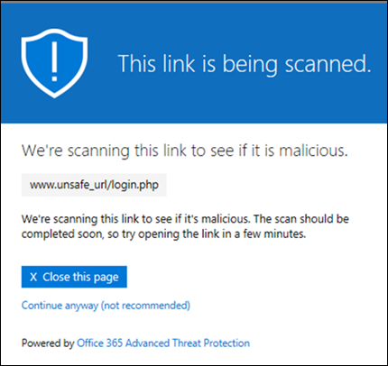

The original notification page looked like this:

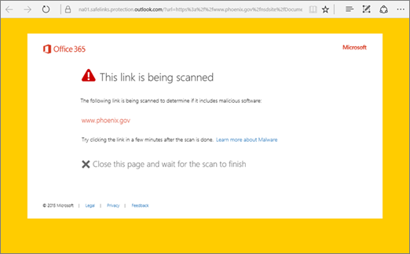

### Suspicious message warning

The clicked URL was in an email message that's similar to other suspicious messages. We recommend that you double-check the email message before proceeding to the site.

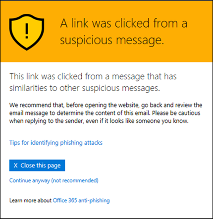

### Phishing attempt warning

The clicked URL was in an email message that has been identified as a phishing attack. As a result, all URLs in the email message are blocked. We recommend that you do not proceed to the site.

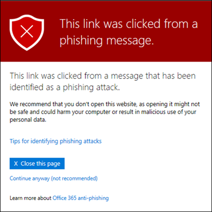

### Malicious website warning

The clicked URL points to a site that has been identified as malicious. We recommend that you do not proceed to the site.

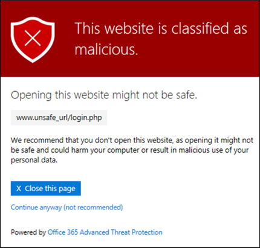

The original warning page looked like this:

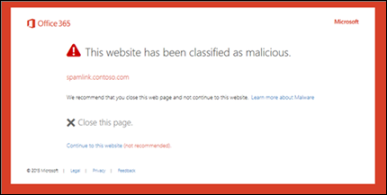

### Blocked URL warning

The clicked URL has been manually blocked by an admin in your organization (the **Block the following URLs** list in the global settings for Safe Links). The link was not scanned by Safe Links because it was manually blocked.

There are several reasons why an admin would manually block specific URLs. If you think the site should not be blocked, contact your admin.

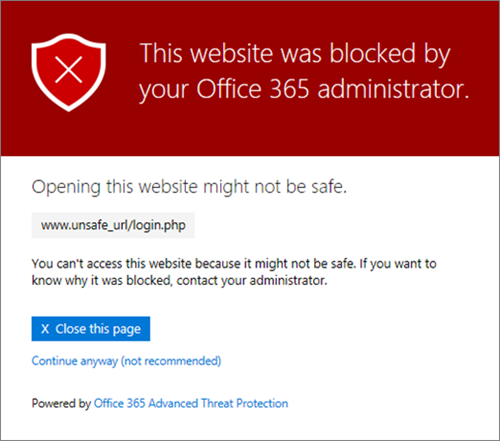

The original warning page looked like this:

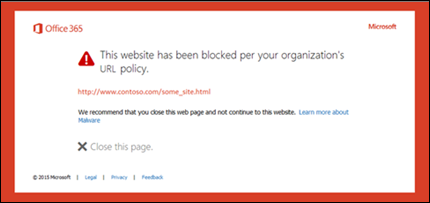

### Error warning

Some kind of error has occurred, and the URL can't be opened.

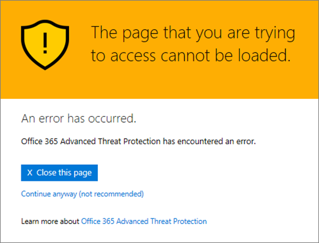

The original warning page looked like this:

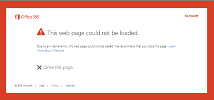
