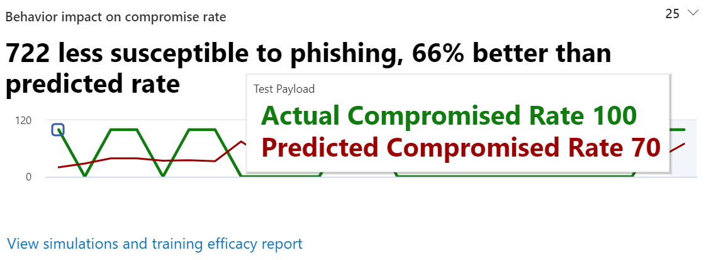

# Gain insights through Attack simulation training

<<<<<<< HEAD

Within Attack simulation training, Microsoft provides you with insights based on outcomes of simulations and training employees went through. These insights will help inform you on progress your employees are doing on threat readiness, as well as recommend next steps to better prepare your employees and your environment for attacks.
=======
Within Attack simulation training, Microsoft provides you with insights based on outcomes of simulations and trainings that employees went through. These insights will help keep you informed on the threat readiness progress of your employees, as well as recommend next steps to better prepare your employees and your environment for attacks.
>>>>>>> master

We are continuously working on expanding the insights that are available to you. Behavior impact and recommended actions are currently available. To start, head over to [Attack simulation training in the Microsoft 365 security center](https://security.microsoft.com/attacksimulator?viewid=overview).

## Behavior impact on compromise rate

On the **Overview** tab of Attack simulation training, you'll find the **behavior impact on compromise rate** card. This card shows how employees dealt with the simulations you ran in contrast to the **predicted compromise rate**. You can use these insights to track progress in employees threat readiness by running multiple simulations against the same groups of employees.

In the graph you can see:

- **Predicted compromise rate** which reflects the average compromise rate for simulations using the same type of payload across other Microsoft 365 tenants that use Attack simulation training.
- **Actual compromise rate** reflects the percentage of employees that fell for the simulation.

Additionally, `<number> less susceptible to phishing` reflects the difference between actual number of employees compromised by the attack and the predicted compromise rate. This number of employees is less likely to be compromised by similar attacks in the future, while `<percent%> better than predicted rate` indicates how employees did overall in contrast with the predicted compromise rate.

> [!div class="mx-imgBorder"]
> 

To see a more detailed report, click **View simulations and training efficacy report**. This report provides the same information with additional context from the simulation itself (for example, simulation technique and total users targeted).

## Recommended actions

On the [**Simulations** tab](https://security.microsoft.com/attacksimulator?viewid=simulations), selecting a simulation will take you to the simulation details, where you'll find the **Recommended actions** section.

The recommended actions section details recommendations as available in [Microsoft Secure Score](https://docs.microsoft.com/microsoft-365/security/mtp/microsoft-secure-score). These recommendations are based on the payload used in the simulation, and will help you protect your employees and your environment. Clicking on each improvement action will take you to its details.

> [!div class="mx-imgBorder"]
> 

## Related Links

[Get started using Attack simulation training](attack-simulation-training-get-started.md)

[Create a phishing attack simulation](attack-simulation-training.md)

[create a payload for training your people](attack-simulation-training-payloads.md)
