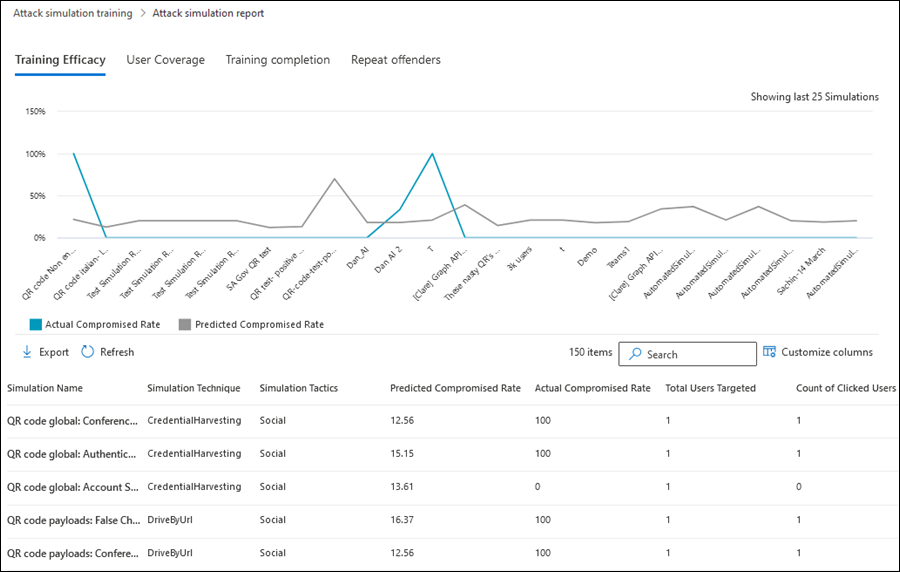
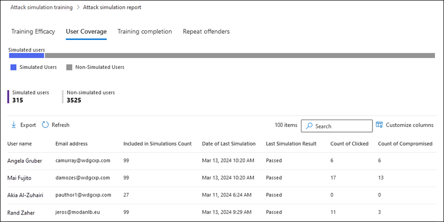
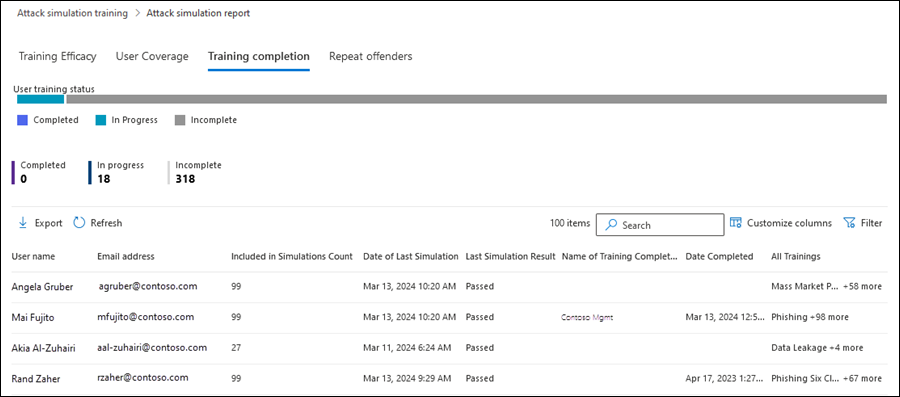
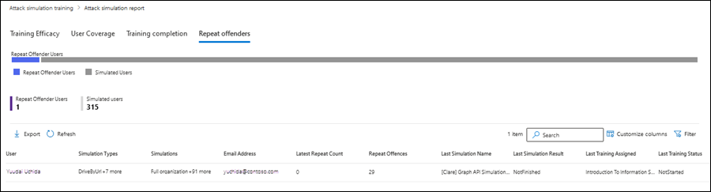

# Gain insights through Attack simulation training

**Applies to**
 [Microsoft Defender for Office 365 plan 2](defender-for-office-365.md)

In Attack simulation training in Microsoft Defender for Office Plan 2 or Microsoft 365 E5, Microsoft provides insights from the outcomes of simulations and trainings that your users experienced. These insights help to keep you informed on the threat readiness progress of your users, as well as recommended next steps to better prepare your users for future attacks.

Insights from Attack simulation training are available on the **Overview** tab. To go there, open the Microsoft 365 Defender portal at <https://security.microsoft.com/>, and then go to **Email & collaboration** \> **Attack simulation training** and verify that the **Overview** tab is selected (it's the default). To go directly to the **Overview** tab on the **Attack simulation training** page, use <https://security.microsoft.com/attacksimulator>.

The rest of this article describes the information that's available on the **Overview** tab of Attack simulation training.

## Recent simulations

The **Recent simulations** card on the **Overview** tab shows the last three simulations that you've created or run in your organization.

You can select a simulation to view details.

Selecting **View all simulations** takes you to the **Simulations** tab.

Selecting **Launch a simulation** is the same action as clicking  **Launch a simulation** on the **Simulations** tab as described in [Simulate a phishing attack in Defender for Office 365](attack-simulation-training.md).

## Behavior impact on compromise rate

The **Behavior impact on compromise rate** card on the **Overview** tab shows how your users responded to your simulations as compared to the historical data in Microsoft 365. You can use these insights to track progress in users threat readiness by running multiple simulations against the same groups of users.

The chart shows the following information:

- **Predicted compromise rate**\*: The average compromise rate for Attack simulation training simulations that use the same type of payload across all other Microsoft 365 organizations.
- **Actual compromise rate**\*: The actual percentage of users that fell for the simulation.
- **x users less susceptible to phishing**: The difference between the actual number of users compromised by the simulated attack and the predicted compromise rate. This number of users is less likely to be compromised by similar attacks in the future.
- **x% better than predicted rate**: Indicates how users did overall in contrast with the predicted compromise rate.

\* If you hover over a data point in the chart, the actual percentage values are shown.

To see a more detailed report, click **View simulations and training efficacy report**. This report is explained [later in this article](#training-efficacy-tab-for-the-attack-simulation-report).

## Simulation coverage

The **Simulation coverage** card on the **Overview** tab shows the percentage of users in your organization who've received a simulation (**Simulated users**) vs. those who haven't received a simulation (**Non-simulated users**). You can hover over a section in the chart to see the actual number of users in each category.

Selecting **Launch simulation for non-simulated users** starts the simulation creation wizard where the users who didn't receive the simulation are automatically selected on the **Target user** page. For more information, see [Simulate a phishing attack in Defender for Office 365](attack-simulation-training.md).

Selecting **View simulation coverage report** takes you to the [User coverage tab for the Attack simulation report](#user-coverage-tab-for-the-attack-simulation-report)

## Training completion

The **Training completion** card on the **Overview** tab organizes the percentages of users who received trainings based on the results of simulations into the following categories:

- **Completed**
- **In progress**
- **Incomplete**

You can hover over a section in the chart to see the actual number of users in each category.

Selecting **View training completion report** takes you to the [Training completion tab for the Attack simulation report](#training-completion-tab-for-the-attack-simulation-report).

## Repeat offenders

The **Repeat offenders** card on the **Overview** tab shows the information about repeat offenders. A _repeat offender_ is a user who was compromised by consecutive simulations. The default number of consecutive simulations is two, but you can change the value on the **Settings** tab of Attack simulation training at <https://security.microsoft.com/attacksimulator?viewid=setting>.

The chart organizes repeat offender data by [simulation type](attack-simulation-training.md#select-a-social-engineering-technique):

- **All**
- **Malware attachment**
- **Link to malware**
- **Credential harvest**
- **Link in attachments**
- **Drive-by URL**

Selecting **View repeat offender report** takes you to the [Repeat offenders tab for the Attack simulation report](#repeat-offenders-tab-for-the-attack-simulation-report).

## Recommendations

The **Recommendations** card on the **Overview** tab has links to recommended actions. If you 

## Attack simulation report

You can open the **Attack simulation report** from the **Overview** tab by clicking on the **View ... report** buttons that are available in many of the cards that are described in this article. To go directly to the report, use <https://security.microsoft.com/attacksimulationreport>

### Training efficacy tab for the Attack simulation report

On the **Attack simulation report** page, the **Training efficacy** tab is selected by default. This tab provides the same information that's available in the **Behavior impact on compromise rate** card, with additional context from the simulation itself.

The chart shows the **Predicted compromise rate** and **Actual compromised rate**. If you hover over a section in the chart, the actual percentage values for are shown.

The details table below the chart shows the following information:

- **Simulation name**
- **Simulation technique**
- **Simulation tactics**
- **Predicted compromised rate**
- **Actual compromised rate**
- **Total users targeted**
- **Count of clicked users**

You can sort the results by clicking on an available column header.

Click **Customize columns** to remove the columns that are shown. When you're finished, click **Apply**.

Use  **Search** box to filter the results by **Simulation name** or **Simulation Technique**. Wildcards aren't supported.

If you click the  **Export report** button, report generation progress is shown as a percentage of complete. In the dialog that opens, you can choose to open the .csv file, save the .csv file, and remember the selection.

### User coverage tab for the Attack simulation report

On the **User coverage** tab, the chart shows the **Simulated users** and **Non-simulated users**. If you hover over a data point in the chart, the actual values are shown.

The details table below the chart shows the following information:

- **Username**
- **Email address**
- **Included in simulation**
- **Date of last simulation**
- **Last simulation result**
- **Count of clicked**
- **Count of compromised**

You can sort the results by clicking on an available column header.

Click **Customize columns** to remove the columns that are shown. When you're finished, click **Apply**.

Use  **Search** box to filter the results by **Username** or **Email address**. Wildcards aren't supported.

If you click the  **Export report** button, report generation progress is shown as a percentage of complete. In the dialog that opens, you can choose to open the .csv file, save the .csv file, and remember the selection.

### Training completion tab for the Attack simulation report

On the **Training completion** tab, the chart shows the number of **Completed**, **In progress**, and **Incomplete** simulations. If you hover over a section in the chart, the actual values are shown.

The details table below the chart shows the following information:

- **Username**
- **Email address**
- **Included in simulation**
- **Date of last simulation**
- **Last simulation result**
- **Name of most recent training completed**
- **Date completed**
- **All trainings**

You can sort the results by clicking on an available column header.

Click **Customize columns** to remove the columns that are shown. When you're finished, click **Apply**.

Click  **Filter** to filter the chart and details table by one or more of the following values:

- **Completed**
- **In progress**
- **All**

When you're finished configuring the filters, click **Apply**, **Cancel**, or **Clear filters**.

Use  **Search** box to filter the results by **Username** or **Email address**. Wildcards aren't supported.

If you click the  **Export report** button, report generation progress is shown as a percentage of complete. In the dialog that opens, you can choose to open the .csv file, save the .csv file, and remember the selection.

### Repeat offenders tab for the Attack simulation report

A _repeat offender_ is a user who was compromised by consecutive simulations. The default number of consecutive simulations is two, but you can change the value on the **Settings** tab of Attack simulation training at <https://security.microsoft.com/attacksimulator?viewid=setting>.

On the **Repeat offenders** tab, the chart organizes repeat offender data by [simulation type](attack-simulation-training.md#select-a-social-engineering-technique):

- **All**
- **Credential harvest**
- **Malware attachment**
- **Link in attachment**
- **Link to malware**
- **Drive-by URL**

If you hover over a data point in the chart, the actual values are shown.

The details table below the chart shows the following information:

- **User**
- **Repeat count**
- **Simulation types**
- **Simulations**

You can sort the results by clicking on an available column header.

Click **Customize columns** to remove the columns that are shown. When you're finished, click **Apply**.

Click  **Filter** to filter the chart and details table by some or all of the simulation type values:

- **Credential harvest**
- **Malware attachment**
- **Link in attachment**
- **Link to malware**
- **Drive-by URL**

When you're finished configuring the filters, click **Apply**, **Cancel**, or **Clear filters**.

Use  **Search** box to filter the results by any of the column values. Wildcards aren't supported.

If you click the  **Export report** button, report generation progress is shown as a percentage of complete. In the dialog that opens, you can choose to open the .csv file, save the .csv file, and remember the selection.

## Recommended actions

On the [**Simulations** tab](https://security.microsoft.com/attacksimulator?viewid=simulations), selecting a simulation will take you to the simulation details, where you'll find the **Recommended actions** section.

The recommended actions section details recommendations as available in [Microsoft Secure Score](../defender/microsoft-secure-score.md). These recommendations are based on the payload used in the simulation, and will help you protect your users and your environment. Clicking on each improvement action will take you to its details.

> [!div class="mx-imgBorder"]
> 

## Related Links

[Get started using Attack simulation training](attack-simulation-training-get-started.md)

[Create a phishing attack simulation](attack-simulation-training.md)

[create a payload for training your people](attack-simulation-training-payloads.md)
