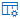
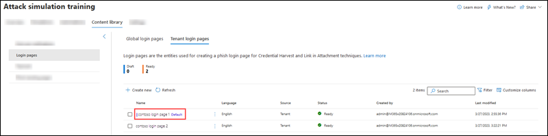

# Login pages in Attack simulation training

**Applies to**
 [Microsoft Defender for Office 365 plan 2](defender-for-office-365.md)

In Attack simulation training in Microsoft 365 E5 or Microsoft Defender for Office 365 Plan 2, login pages are shown to users in simulations that use **Credential Harvest** and **Link in Attachment** [social engineering techniques](attack-simulation-training-simulations.md#select-a-social-engineering-technique).

To see the available login pages, open the Microsoft 365 Defender portal at <https://security.microsoft.com>, go to **Email & collaboration** \> **Attack simulation training** \> **Content library** tab \> and then select **Login pages**. To go directly to the **Content library** tab where you can select **Login pages**, use <https://security.microsoft.com/attacksimulator?viewid=contentlibrary>.

**Login pages** in the **Content library** tab has two tabs:

- **Global login pages** tab: Contains the built-in, non-modifiable login pages. There are four built-in login pages localized into 12+ languages:
  - **GitHub login page**
  - **LinkedIn login page**
  - **Microsoft login page**
  - **Non-branded login page**

- **Tenant login pages** tab: Contains the custom login pages that you've created.

The following information is shown for each login page:

- **Name**
- **Language**
- **Source**: For built-in login pages, the value is **Global**. For custom login pages, the value is **Tenant**.
- **Status**: **Ready** or **Draft**.
- **Created by**: For built-in login pages, the value is **Microsoft**. For custom login pages, the value is the UPN of the user who created the login page.
- **Last modified**

Click a column header to sort by that column. To remove columns, click  **Customize columns**.

To find a login page in the list, use the  **Search** box to find the name of the login page.

Click  **Filter** to filter the login pages by **Language** or **Status**.

When you select a login page from the list by clicking anywhere in the row other than the check box next to the name, a details flyout appears with the following information:

-  **Edit** is available only in custom login pages on the **Tenant login pages** tab.
-  **Mark as default** to make this login page the default selection in **Credential harvest** or **Link in attachment** [payloads](attack-simulation-training-payloads.md) or [payload automations](attack-simulation-training-payload-automations.md). If the login page is already the default,  **Mark as default** isn't available.
- **Preview** tab: View the login page as users will see it. **Page 1** and **Page 2** links are available at the bottom of the page for two-page login pages.
- **Details** tab: View details about the login page:
  - **Description**
  - **Status**: **Ready** or **Draft**.
  - **Login page source**: For built-in login pages, the value is **Global**. For custom login pages, the value is **Tenant**.
  - **Modified by**
  - **Language**
  - **Last modified**

## Create login pages

1. In the Microsoft 365 Defender portal at <https://security.microsoft.com>, go to **Email & collaboration** \> **Attack simulation training** \> **Content library** tab \> and then select **Login pages**. To go directly to the **Content library** tab where you can select **Login pages**, use <https://security.microsoft.com/attacksimulator?viewid=contentlibrary>.

   On the **Tenant login pages** tab, click  **Create new** to start the new login page wizard.

   > [!NOTE]
   >  **Create new** is also available during the payload selection step of creating a simulation or simulation automation. For more information, see [Create a simulation: Select a payload and login page](attack-simulation-training-simulations.md#select-a-payload-and-login-page) and [Create a simulation automation: Select a payload and login page](attack-simulation-training-simulation-automations.md#select-a-payload-and-login-page).
   >
   > At any point during the new login page wizard, you can click **Save and close** to save your progress and continue configuring the login page later. You can pick up where you left off by selecting the login page on the **Tenant login pages** tab in **Login pages**, and then clicking  **Edit**. The partially-completed login page will have the **Status** value **Draft**.

2. On the **Define details for login page** page, configure the following settings:
   - **Name**: Enter a unique name.
   - **Description**: Enter an optional description.

   When you're finished on the **Define details for login page** page, click **Next**.

3. On the **Configure login page** page, configure the following settings:

   - **Select a language**: The available values are: **Chinese (Simplified)**, **Chinese (Traditional)**, **English**, **French**, **German**, **Italian**, **Japanese**, **Korean**, **Portuguese**, **Russian**, **Spanish**, and **Dutch**.

   - **Make this the default login page**: If you select this option, the login page will be the default selection in **Credential harvest** or **Link in attachment** [payloads](attack-simulation-training-payloads.md) or [payload automations](attack-simulation-training-payload-automations.md).

   - **Create a two-page login**: If you don't select this option, the login page is one page. If you select this option, **Page 1** and **Page 2** tabs appear for you to configure separately.

   - Login page content area: Two tabs are available:
     - **Text** tab: A rich text editor is available to create the login page. To see the typical font and formatting settings, toggle **Formatting controls** to  **On**.

       The following controls are also available on the **Text** tab:

       - **Dynamic tag**: Select from the following tags:

          |Tag name|Tag value|
          |---|---|
          |**Insert User name**|`${userName}`|
          |**Insert First name**|`${firstName}`|
          |**Insert Last name**|`${lastName}`|
          |**Insert UPN**|`${upn}`|
          |**Insert Email**|`${emailAddress}`|
          |**Insert Department**|`${department}`|
          |**Insert Manager**|`${manager}`|
          |**Insert Mobile phone**|`${mobilePhone}`|
          |**Insert City**|`${city}`|
          |**Insert Date**|`${date|MM/dd/yyyy|offset}`|

       - **Use from default**: Select an available template to start with. You can modify the text and layout in the editing area. To reset the login page back to the default text and layout of the template, click **Reset to default**.

       - **Add compromise button**: Available on one-page logins or on **Page 2** of two-page logins. Click this link to add the compromise button to the login page. The default text on the button is **Submit**, but you can change it.

       - **Add Next button**: Available only on **Page 1** of two-page logins. Click this link to add the 'Next' button to the login page. The default text on the button is **Next**, but you can change it.

     - **Code** tab: You can view and modify the HTML code directly.

   You can preview the results by clicking the **Preview email** button at the top of the page.

   When you're finished on the **Review login page** page, click **Next**.

4. On the **Review login page** page, you can review the details of your login page.

   You can select **Edit** in each section to modify the settings within the section. Or you can click **Back** or select the specific page in the wizard.

   When you're finished on the **Review login page** page, click **Submit**.

5. On the **New login page \<Name\> created** page, you can use the links to create a new login page, launch a simulation, or view all login pages.

   When you're finished on the **New login page \<Name\> created** page, click **Done**.

6. Back on the **Tenant login pages** tab in **Login pages**, the login page that you created is now listed.

## Modify login pages

You can't modify built-in login pages on the **Global login pages** tab. You can only modify custom login pages on the **Tenant login pages** tab.

To modify an existing custom login page on the **Tenant login pages** tab, do one of the following steps:

- Select the login page from the list by clicking the check box next to the name. Click the  **Edit** icon that appears.
- Click **⋮** (**Actions**) between the **Name** and **Language** values of the login page in the list, and then select  **Edit**.
- Select the login page from the list by clicking anywhere in the row other than the check box next to the name. In the details flyout that opens, click  **Edit**.

The login page wizard opens with the settings and values of the selected login page. The steps are the same as described in the [Create login pages](#create-login-pages) section.

## Copy login pages

To copy an existing login page on the **Tenant login pages** or **Global login pages** tabs, do one of the following steps:

- Select the login page from the list by clicking the check box next to the name, and then click the  **Create a copy** icon that appears.
- Click **⋮** (**Actions**) between the **Name** and **Language** values of the login page in the list, and then select  **Create a copy**.

The login page wizard opens with the settings and values of the selected login page. The steps are the same as described in the [Create login pages](#create-login-pages) section.

> [!NOTE]
> When you copy a built-in login page on the **Global login pages** tab, be sure to change the **Name** value. This step ensures the copy is saved as a custom login page on the **Tenant login pages** tab.
>
> The **Use from default** control on the **Configure login page** page in the login page wizard allows you to copy the contents of a built-in login page.
>
> When you're creating or editing a login page, the **Use from default** control on the **Text** tab of the **Configure login page** step in the login page wizard also allows you to copy the contents of a built-in notification.

## Remove login pages

You can't remove built-in login pages from the **Global login pages** tab. You can only remove custom login pages from the **Tenant login pages** tab.

To remove an existing custom login page from the **Tenant login pages** tab, do one of the following steps:

- Select the login page from the list by clicking the check box next to the name, and then click the  **Delete** icon that appears.
- Click **⋮** (**Actions**) between the **Name** and **Language** values of the login page in the list, and then select  **Delete**.

## Make a login page the default

The default login page is the default selection that's used in **Credential harvest** or **Link in attachment** [payloads](attack-simulation-training-payloads.md) or [payload automations](attack-simulation-training-payload-automations.md).

To make a login page the default on the **Tenant login pages** or **Global login pages** tabs, do one of the following steps:

- Click **⋮** (**Actions**) between the **Name** and **Language** values of the login page in the list, and then select  **Mark as default**.
- Select the login page from the list by clicking anywhere in the row other than the check box next to the name. In the details flyout that opens, click  **Mark as default**.
- Select **Make this the default login page** on the **Configure login page** page in the wizard when you [create or modify a login page](#create-login-pages).

> [!NOTE]
> The previous procedures are not available if the login page is already the default.
>
> The default login page is also marked in the list, although you might need to widen the **Name** column to see it:
>
> 

## Related links

[Get started using Attack simulation training](attack-simulation-training-get-started.md)

[Create a phishing attack simulation](attack-simulation-training-simulations.md)

[Simulation automations for Attack simulation training](attack-simulation-training-simulation-automations.md)
