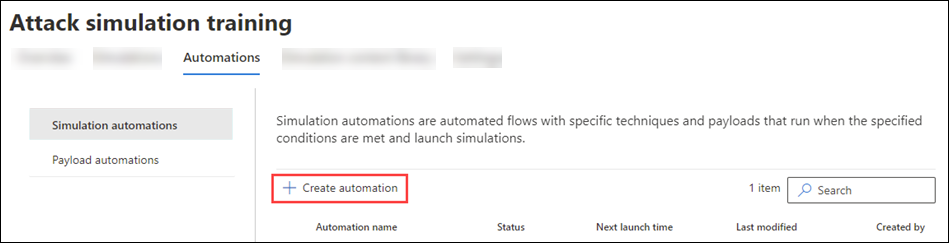

# Payload automations for Attack simulation training

**Applies to**
 [Microsoft Defender for Office 365 plan 2](defender-for-office-365.md)

In Attack simulation training in Microsoft 365 E5 or Microsoft Defender for Office 365 Plan 2, payload automations (also known as _payload harvesting_) collect information from real-world phishing messages that were reported by users in your organization. Although the numbers of these messages are likely low in your organization, you can specific the conditions to look for in phishing attacks (for example, recipients, social engineering technique, sender information, etc.). Attack simulation training will then mimic the messages and payloads used in the attack to automatically launch harmless simulations to targeted users.

To create a payload automation, do the following steps:

1. In the Microsoft 365 Defender portal at <https://security.microsoft.com/>, go to **Email & collaboration** \> **Attack simulation training** \> **Payload automations** tab.

   To go directly to the **Payload automations** tab, use <https://security.microsoft.com/attacksimulator?viewid=payloadautomation>.

2. On the **Payload automations** tab, select  **Create simulation**.

   

3. The creation wizard opens. The rest of this article describes the pages and the settings they contain.

> [!NOTE]
> At any point during the simulation creation wizard, you can click **Save and close** to save your progress and continue configuring the simulation later. The incomplete simulation has the **Status** value **Draft** on the **Simulations** tab. You can pick up where you left off by selecting the simulation and clicking  **Edit** simulation.## Name and describe the simulation.

## Automation name

On the **Automation name** page, configure the following settings:

- **Name**: Enter a unique, descriptive name for the simulation.
- **Description**: Enter an optional detailed description for the simulation.

When you're finished, click **Next**.

## Run conditions

On the **Run conditions** page, select the conditions of the real phishing attack that determines when the automation will run.

You can use each condition only once. Multiple conditions use AND logic (\<Condition1\> and \<Condition2\>).

 **Add condition**.

- **No. of users targeted in the campaign**: Configure the following settings:
  - **Equal to**, **Less than**, **Greater than**, **Less than or equal to**, or **Greater than or equal to**.
  - **Enter value**: The number of users that were targeted by the phishing campaign.
- **Campaigns with a specific phish technique**: Select one of the available values:
  - **Credential harvest**
  - **Malware attachment**
  - **Link in attachment**
  - **Link to malware**
  - **Drive-by URL**
- **Specific sender domain**: Enter a sender email domain value (for example, contoso.com).
- **Specific sender name**: Enter a sender name value.
- **Specific sender email**: Enter a sender email address.
- **Specific user and group recipients**: Start typing the name or email address of the user or group. When it appears, select it.

To remove a condition after you've added it, click .

When you're finished, click **Next**.

## Review automation

On the **Review automation** page, you can review the details of your payload automation.

You can select **Edit** in each section to modify the settings within the section. Or you can click **Back** or select the specific page in the wizard.

When you're finished, click **Submit**.
