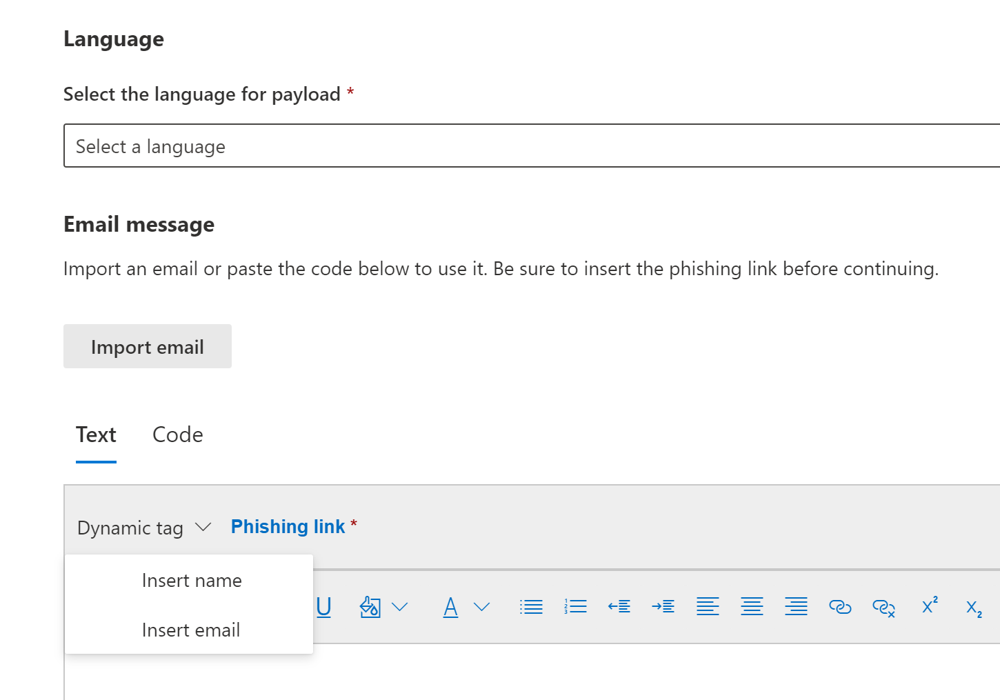
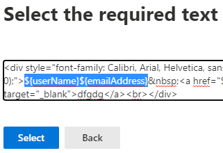

# Create a custom payload for Attack simulation training

Microsoft offer a robust payload catalog for various social engineering techniques to pair with your attack simulation training. However, you might want to create custom payloads that will work better for your organization. The following describes how to create a payload in attack simulation training through Microsoft Defender for Office 365.

[!INCLUDE [Prerelease information](../includes/prerelease.md)]

You can create a payload by clicking on **Create a payload** in either the [dedicated **Payloads** tab](https://security.microsoft.com/attacksimulator?viewid=payload) or within the [simulation creation wizard](attack-simulation-training.md#selecting-a-payload).

The first step in the wizard will have you select a payload type. **Currently only email is available**.

Next, select an associated technique. See more details on techniques at [Selecting a social engineering technique](attack-simulation-training.md#selecting-a-social-engineering-technique).

In the next step name your payload. Optionally, you can give it a description.

## Configure payload

Now it's time to build your payload. Input the sender's name, email and the email's subject in the **Sender details** section. Pick a phishing URL from the the provided list. This URL will later be embedded into the body of the message.

> [!TIP]
> You can choose an internal email for your payload's sender, which will make the payload appear as coming from another employee of the company. This will increase susceptibility to the payload and will help educate employees on the risk of internal threats.

A rich text editor is available to create your payload. You can also import an email you've created beforehand. As you structure the body of the email, take advantage of the **dynamic tags** to personalize the email to your targets. Click on **Phishing link** to add the previously selected phishing URL into the body of the email.

> [!TIP]
> To save yourself some time, toggle on the option to **replace all links in the email message with the phishing link**.

Once you're done building the payload to your liking, click **Next**.

## Adding indicators

Indicators will help employees going through the attack simulation understand clue they can look for in future attacks. To start, click **Add indicator**.

Select an indicator you'd like to use from the drop-down list. This list is curated to contain the most common clues that appear in phishing email messages. Once selected, make sure the indicator placement is set to **From the body of the email** and click on **Select text**. Highlight the portion of your payload where this indicator appears and click **Select**.

Add a custom description to describe the indicator and click within the indicator preview frame to see a preview of your indicator. Once done, click **Add**. Repeat these steps until you've covered all indicators in your payload.

## Review payload

You're done building your payload. Now it's time to review the details and see a preview of your payload. The preview will include all indicators you've created. You can edit each part of the payload from this step. Once satisfied, **Submit** your payload. 

> [!IMPORTANT]
> Payloads you've created will have **Tenant** set as their source. When selecting payloads, make sure you don't have **Tenant** filtered out.