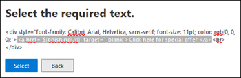
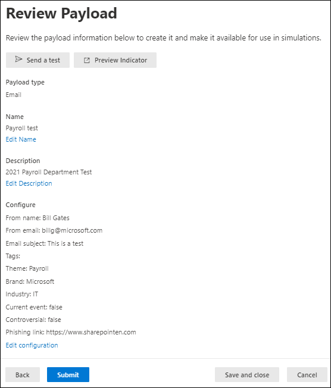

# Create custom payloads for Attack simulation training in Defender for Office 365

**Applies to**
 [Microsoft Defender for Office 365 plan 2](defender-for-office-365.md)

In Attack simulation training, a _payload_ is the phishing email message and webpages that are presented to users in simulations. Attack simulation training in Microsoft 365 E5 or Microsoft Defender for Office 365 Plan 2 offers a robust built-in payload catalog for the available social engineering techniques. However, you might want to create custom payloads that will work better for your organization.

This article describes how to create your own payloads in Attack simulation training. You can create custom payloads in the following locations:

- The **Payloads** tab: In the Microsoft 365 Defender portal at <https://security.microsoft.com/>, go to **Email & collaboration** \> **Attack simulation training** \> **Payloads** tab. To go directly to the **Payloads** tab, use <https://security.microsoft.com/attacksimulator?viewid=payload>.
- During simulation creation: You can create custom payloads on the **Select a payload** page (the third page) of the simulation creation wizard. For more information, see [Simulate a phishing attack in Defender for Office 365](attack-simulation-training.md).

For getting started information about Attack simulation training, see [Get started using Attack simulation training](attack-simulation-training-get-started.md).

> [!NOTE]
> Certain trademarks, logos, symbols, insignias and other source identifiers receive heightened protection under local, state and federal statutes and laws. Unauthorized use of such indicators can subject the users to penalties, including criminal fines. Though not an extensive list, this includes the Presidential, Vice Presidential, and Congressional seals, the CIA, the FBI, Social Security, Medicare and Medicaid, the United States Internal Revenue Service, and the Olympics. Beyond these categories of trademarks, use and modification of any third-party trademark carries an inherent amount of risk. Using your own trademarks and logos in a payload would be less risky, particularly where your organization permits the use. If you have any further questions about what is or is not appropriate to use when creating or configuring a payload, you should consult with your legal advisors.

## Create a payload

After you click  **Create a payload** from the **Payloads** tab of Attack simulation training or on the **[Select a payload](attack-simulation-training.md#select-a-payload)** page of the simulation creation wizard, the payload creation wizard starts and is described in this section.

### Select a payload type

On the **Select type** page, the only value that you can currently select is **Email**.

Click **Next**.

### Select a social engineering technique

On the **Select technique** page, the available options are the same as on the [Select technique](attack-simulation-training.md#select-a-social-engineering-technique) page in the simulation creation wizard:

- **Credential harvest**
- **Malware attachment**
- **Link in attachment**
- **Link to malware**
- **Drive-by URL**

When you're finished, click **Next**.

### Name and describe the payload

On the **Payload name** page, configure the following settings:

- **Name**: Enter a unique, descriptive name for the payload.
- **Description**: Enter an optional detailed description for the payload.

When you're finished, click **Next**.

## Configure the payload

Many of the available setting

On the **Configure payload** page, it's time to build your payload. Many of the available settings are determined by the selection you made on the **Select technique** page (for example, links vs. attachments).

- **Sender details** section: Configure the following settings:
  - **From name**
  - **Use first name as display name**: By default, this setting is not selected.
  - **From email**: If you choose an internal email address for your payload's sender, the payload will appear to come from a fellow employee. This sender email address will increase a user's susceptibility to the payload, and will help educate employees on the risk of internal threats.
  - **Email subject**

- **Attachment details** section: This section is available only if you selected **Malware attachment**, **Link in attachment**, or **Link to malware** on the **Select technique** page. Configure the following settings:
  - **Name your attachment**
  - **Select an attachment type**: Currently, the only available value is **Docx**.

- **Link for attachment** section: This section is available only if you selected **Link to malware** on the **Select technique** page. In the **Select a URL you want to be your malware attachment link** box, select one of the available URLs (the same URLs that are described for the **Phishing link** section).

  Later, you'll embed the URL in the body of the message.

- **Phishing link** section: This section is available only if you selected **Credential harvest**, **Link in attachment**, or **Drive-by URL** on the **Select technique** page.

  For **Credential harvest** or **Drive-by URL**, the name of the box is **Select a URL you want to be your phishing link**. Later, you'll embed the URL in the body of the message.

  For **Link in attachment**, the name of the box is **Select a URL in this attachment that you want to be your phishing link**. Later, you'll embed the URL in the attachment.

  Select one of the available URL values:
  
  - <https://www.mcsharepoint.com>
  - <https://www.attemplate.com>
  - <https://www.doctricant.com>
  - <https://www.mesharepoint.com>
  - <https://www.officence.com>
  - <https://www.officenced.com>
  - <https://www.officences.com>
  - <https://www.officentry.com>
  - <https://www.officested.com>
  - <https://www.prizegives.com>
  - <https://www.prizemons.com>
  - <https://www.prizewel.com>
  - <https://www.prizewings.com>
  - <https://www.shareholds.com>
  - <https://www.sharepointen.com>
  - <https://www.sharepointin.com>
  - <https://www.sharepointle.com>
  - <https://www.sharesbyte.com>
  - <https://www.sharession.com>
  - <https://www.sharestion.com>
  - <https://www.templateau.com>
  - <https://www.templatent.com>
  - <https://www.templatern.com>
  - <https://www.windocyte.com>

  > [!NOTE]
  > A URL reputation service might identify one or more of these URLs as unsafe. Check the availability of the URL in your supported web browsers before you use the URL in a simulation. For more information, see [Phishing simulation URLs blocked by Google Safe Browsing](attack-simulation-training-faq.md#phishing-simulation-urls-blocked-by-google-safe-browsing).

- **Attachment content** section: This section is available only if you selected **Link in attachment** on the **Select technique** page.

  A rich text editor is available for you to create the content in your file attachment payload.

  Use the **Phishing link** control to add the previously selected phishing URL into the attachment.

- Common settings:
  - **Add tag(s)**
  - **Theme**: The available values are: **Account Activation**, **Account Verification**, **Billing**, **Clean up Mail**, **Document Received**, **Expense**, **Fax**, **Finance Report**, **Incoming Messages**, **Invoice**, **Item Received**, **Login Alert**, **Mail Received**, **Other**, **Password**, **Payment**, **Payroll**, **Personalized Offer**, **Quarantine**, **Remote Work**, **Review Message**, **Security Update**, **Service Suspended**, **Signature Required**, **Upgrade Mailbox Storage**, **Verify mailbox**, or **Voicemail**.
  - **Brand**: The available values are: **American Express**, **Capital One**, **DHL**, **DocuSign**, **Dropbox**, **Facebook**, **First American**, **Microsoft**, **Netflix**, **Scotiabank**, **SendGrid**, **Stewart Title**, **Tesco**, **Wells Fargo**, **Syrinx Cloud**, or **Other**.
  - **Industry**: The available values are: **Banking**, **Business services**, **Consumer services**, **Education**, **Energy**, **Construction**, **Consulting**, **Financial services**, **Government**, **Hospitality**, **Insurance**, **Legal**, **Courier services**, **IT**, **Healthcare**, **Manufacturing**, **Retail**, **Telecom**, **Real estate**, or **Other**.
  - **Current event**: The available values are **Yes** or **No**.
  - **Controversial**: The available values are **Yes** or **No**.

- **Language** section: Select the language for the payload. The available values are: **English**, **Spanish**, **German**, **Japanese**, **French**, **Portuguese**, **Dutch**, **Italian**, **Swedish**, **Chinese (Simplified)**, **Norwegian Bokmål**, **Polish**, **Russian**, **Finnish**, **Korean**, **Turkish**, **Hungarian**, **Hebrew**, **Thai**, **Arabic**, **Vietnamese**, **Slovak**, **Greek**, **Indonesian**, **Romanian**, **Slovenian**, **Croatian**, **Catalan**, or **Other**.

- **Email message** section:

  - You can click **Import email** and then **Choose file** to import an existing plain text message file.

  - On the **Text** tab, a rich text editor is available for you to create your email message payload.

    - Use the **Dynamic tag** control to personalize the email message for each user by inserting the available tags:
      - **Insert name**: The value that's added in the message body is `${userName}`.
      - **Insert email**: The value that's added in the message body is `${emailAddress}`.

      

      **Phishing link** control: This control is available only if you selected **Credential harvest**, **Link in attachment**, or **Drive-by URL** on the **Select technique** page. Use this control to insert the URL that you previously selected in the **Phishing link** section.

      **Malware attachment link** control: This control is available only if you selected **Link to malware** on the **Select technique** page. Use this control to insert the URL that you previously selected in the **Link for attachment** section.

      If you click **Phishing link** or **Malware attachment link**, a dialog opens that asks you to name the link. When you're finished, click **Confirm**.

      The value that's added in the message body (visible on the **Code** tab) is `<a href="${phishingUrl}" target="_blank">Name value you specified</a>`.

  - On the **Code** tab, you can view and modify the HTML code directly. Formatting and other controls like **Dynamic tag** and **Phishing link** or **Malware attachment link** aren't available.

  - The **Replace all links in the email message with the phishing link** toggle can save time by replacing all links in the message with the previously selected **Phishing link** or **Link for attachment** URL. To do this, toggle the setting to on .

When you're finished, click **Next**.

## Add indicators to phishing clues

> [!NOTE]
> Indicators are not available if you selected **Malware attachment** or **Link to malware** on the **Select technique** page.

Indicators help employees going through the attack simulation to identify the tell-tale signs of phishing messages.

On the **Add indicators** page, click **Add indicator**. On the flyout that appears, configure the following settings:

- **Indicator name** and **Indicator location**: These values are interrelated. Where you can place the indicator depends on the indicator itself. The available values are described in the following table:

   

  ****

  |Indicator name|Indicator location|
  |---|---|
  |**Attachment type**|Message body|
  |**Distracting detail**|Message body|
  |**Domain spoofing**|Message body 
 From email address|
  |**Generic greeting**|Message body|
  |**Humanitarian appeals**|Message body|
  |**Inconsistency**|Message body|
  |**Lack of sender details**|Message body|
  |**Legal language**|Message body|
  |**Limited time offer**|Message body|
  |**Logo imitation or dated branding**|Message body|
  |**Mimics a work or business process**|Message body|
  |**No/minimal branding**|Message body|
  |**Poses as friend, colleague, supervisor, or authority figure**|Message body|
  |**Request for sensitive information**|Message body|
  |**Security indicators and icons**|Message body 
 Message subject|
  |**Sender display name and email address**|From name 
 From email address|
  |**Sense of urgency**|Message body 
 Message subject|
  |**Spelling and grammar irregularities**|Message body 
 Message subject|
  |**Threatening language**|Message body 
 Message subject|
  |**Too good to be true offers**|Message body|
  |**Unprofessional looking design or formatting**|Message body|
  |**URL hyperlinking**|Message body|
  |**You're special**|Message body|
  |
  
  This list is curated to contain the most common clues that appear in phishing messages.

  If you select the email message subject or the message body as the location for the indicator, a **Select text** button is available. Click this button to select the text in the message subject or message body where you want the indicator to appear. When you're finished, click **Select**.

  

  - **Indicator description**: You can accept the default description for the indicator, or you can customize it.

  - **Indicator preview**: To see what the current indicator looks like, click within this section.

  When you're finished, click **Add**

Repeat the steps in this section to add multiple indicators.

To edit an existing indicator, select it from the list and then click  **Edit payload**.

To delete an existing indicator, select it from the list and then click  **Delete**.

When you're finished, click **Next**.

## Review payload

On the **Review payload** page, you can review the details of your payload.

Click the  **Send a test** button to send a copy of the payload email to yourself (the currently logged in user) for inspection.

Click the  **Preview indicator** button open the payload in a preview flyout. The preview includes all payload indicators that you've created.

On the main **Review payload** page, you can select **Edit** in each section to modify the settings within the section. Or you can click **Back** or select the specific page in the wizard.

When you're finished, click **Submit**. On the confirmation page that appears, click **Done**.

> [!IMPORTANT]
> Payloads that you created will have the value **Tenant** for the **Source** property. When you create simulations and select payloads, make sure that you don't filter out the **Source** value **Tenant**.

## Related links

[Get started using Attack simulation training](attack-simulation-training-get-started.md)

[Create a phishing attack simulation](attack-simulation-training.md)

[Gain insights through Attack simulation training](attack-simulation-training-insights.md)
