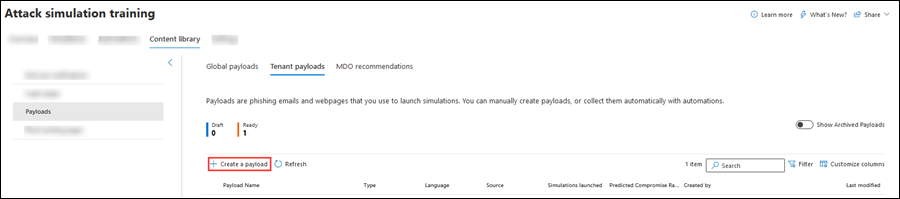

# Payloads in Attack simulation training in Defender for Office 365

[!INCLUDE [MDO Trial banner](../includes/mdo-trial-banner.md)]

**Applies to**
 [Microsoft Defender for Office 365 plan 2](defender-for-office-365.md)

In Attack simulation training, a _payload_ is the phishing email message and links or attachment content that's are presented to users in simulations. Attack simulation training in Microsoft 365 E5 or Microsoft Defender for Office 365 Plan 2 offers a robust built-in payload catalog for the available social engineering techniques. However, you might want to create custom payloads that will work better for your organization.

To see the available payloads, open the Microsoft 365 Defender portal at <https://security.microsoft.com>, go to **Email & collaboration** \> **Attack simulation training** \> **Simulation content library** tab \> and then select **Payloads**. To go directly to the **Simulation content library** tab where you can select **Payloads**, use <https://security.microsoft.com/attacksimulator?viewid=simulationcontentlibrary>.

**Payloads** in the **Simulation content library** tab has two tabs:

- **Global payloads**: Contains the built-in, non-modifiable payloads.
- **Tenant payloads**: Contains the custom payloads that you've created.

The following information is shown for each payload:

- **Payload name**
- **Type**: Currently, this value is always **Social engineerings**.
- **Language**: If the payload contains multiple translations, the first two languages are shown directly. To see the remaining languages, hover over the numeric icon (for example, **+10**).
- **Source**: For built-in payloads, the value is **Global**. For custom payloads, the value is **Tenant**.
- **Simulations launched**: The number of launched simulations that use the payload.
- **Compromised rate (%)**: For built-in payloads, this value is the predicted average compromise rate for Attack simulation training simulations that use the same type of payload across all other Microsoft 365 organizations.
- **Created by**: For built-in payloads, the value is **Microsoft**. For custom payloads, the value is the UPN of the user who created the payload.
- **Last modified**
- **Technique**: One of the available [social engineering techniques](attack-simulation-training.md#select-a-social-engineering-technique):
  - **Credential harvest**
  - **Malware attachment**
  - **Link in attachment**
  - **Link to malware**
  - **Drive-by URL**
  - **OAuth consent grant**
- **Status**: The value is **Ready** or **Draft**. On the **Global payloads** tab, the value is always **Ready**.

To find a payload in the list, use the  **Search** box to find the name of the payload.

Click  to filter the payloads by one or of the following values:

- **Complexity**: **High**, **Medium**, and **Low**.
- **Language**
- **Add tag(s)**
- **Theme**
- **Brand**
- **Industry**
- **Current event**: **Yes** or **No**.
- **Controversial**: **Yes** or **No**.

To remove one or more columns that are displayed, click  **Customize columns**. By default, the only column that's not shown is **Platform**, and that value is currently always **Email**.

When you select a payload from the list, a details flyout appears with the following information:

- **Overview** tab: View the payload as users will see it. Payload properties are also visible:
  - **Payload description**
  - **From name**
  - **From email**
  - **Email subject**
  - **Source**: For built-in payloads, the value is **Global**. For custom payloads, the value is **Tenant**.
  - **Theme**
  - **Brand**
  - **Industry**
  - **Controversial**
  - **Current event**
  - **Tags**

- **Simulations launched** tab:
  - **Simulation name**
  - **Click rate**
  - **Compromised rate**
  - **Action**

## Create payloads

> [!NOTE]
> Certain trademarks, logos, symbols, insignias and other source identifiers receive heightened protection under local, state and federal statutes and laws. Unauthorized use of such indicators can subject the users to penalties, including criminal fines. Though not an extensive list, this includes the Presidential, Vice Presidential, and Congressional seals, the CIA, the FBI, Social Security, Medicare and Medicaid, the United States Internal Revenue Service, and the Olympics. Beyond these categories of trademarks, use and modification of any third-party trademark carries an inherent amount of risk. Using your own trademarks and logos in a payload would be less risky, particularly where your organization permits the use. If you have any further questions about what is or is not appropriate to use when creating or configuring a payload, you should consult with your legal advisors.

1. In the Microsoft 365 Defender portal at <https://security.microsoft.com>, go to **Email & collaboration** \> **Attack simulation training** \> **Simulation content library** tab \> **Payloads** \> **Tenant payloads** tab. To go directly to the **Simulation content library** tab where you can select **Payloads** and the **Tenant payloads** tab, use <https://security.microsoft.com/attacksimulator?viewid=simulationcontentlibrary>.

   Click  **Create a payload** on the **Tenant payloads** tab in **Payloads** to start the create payload wizard.

   

   > [!NOTE]
   >  **Create a payload** is also available on the **Select payload and login page** step of the simulation creation wizard. For more information, see [Create a simulation: Select a payload and login page](attack-simulation-training.md#select-a-payload-and-login-page).
   >
   > At any point during the creation wizard, you can click **Save and close** to save your progress and continue configuring the payload later. You can pick up where you left off by selecting the notification on the **Tenant payloads** tab in **Payloads**, and then clicking  **Edit payload**. The partially-completed payload will have the **Status** value **Draft**.

2. On the **Select type** page, the only value that you can currently select is **Email**.

   Click **Next**.

3. On the **Select technique** page, the available options are the same as on the **Select technique** page in the simulation creation wizard:

   - **Credential harvest**
   - **Malware attachment**
   - **Link in attachment**
   - **Link to malware**
   - **Drive-by URL**
   - **OAuth Consent Grant**

   For more information, see [Simulate a phishing attack with Attack simulation training in Defender for Office 365](attack-simulation-training.md).

   When you're finished, click **Next**.

4. On the **Payload name** page, configure the following settings:

   - **Name**: Enter a unique, descriptive name for the payload.
   - **Description**: Enter an optional detailed description for the payload.

   When you're finished, click **Next**.

5. On the **Configure payload** page, it's time to build your payload. Many of the available settings are determined by the selection you made on the **Select technique** page (for example, links vs. attachments).

   - **Sender details** section: Configure the following settings:
     - **From name**
     - **Use first name as display name**: By default, this setting is not selected.
     - **From email**: If you choose an internal email address for your payload's sender, the payload will appear to come from a fellow employee. This sender email address will increase a user's susceptibility to the payload, and will help educate employees on the risk of internal threats.
     - **Email subject**
     - **Add External tag to email**: By default, this setting is not selected.

   - **Attachment details** section: This section is available only if you selected **Malware attachment**, **Link in attachment**, or **Link to malware** on the **Select technique** page. Configure the following settings:
     - **Name your attachment**
     - **Select an attachment type**: Currently, the only available value is **Docx**.

   - **Link for attachment** section: This section is available only if you selected **Link to malware** on the **Select technique** page. In the **Select a URL you want to be your malware attachment link** box, select one of the available URLs (the same URLs that are described for the **Phishing link** section).

     Later, you'll embed the URL in the body of the message.

   - **Phishing link** section: This section is available only if you selected **Credential harvest**, **Link in attachment**, **Drive-by URL**, or **OAuth Consent Grant** on the **Select technique** page.

     For **Credential harvest**, **Drive-by URL**, or **OAuth Consent Grant**, the name of the box is **Select a URL you want to be your phishing link**. Later, you'll embed the URL in the body of the message.

     For **Link in attachment**, the name of the box is **Select a URL in this attachment that you want to be your phishing link**. Later, you'll embed the URL in the attachment.

     Select one of the available URL values:
  
     - <https://www.mcsharepoint.com>
     - <https://www.attemplate.com>
     - <https://www.doctricant.com>
     - <https://www.mesharepoint.com>
     - <https://www.officence.com>
     - <https://www.officenced.com>
     - <https://www.officences.com>
     - <https://www.officentry.com>
     - <https://www.officested.com>
     - <https://www.prizegives.com>
     - <https://www.prizemons.com>
     - <https://www.prizewel.com>
     - <https://www.prizewings.com>
     - <https://www.shareholds.com>
     - <https://www.sharepointen.com>
     - <https://www.sharepointin.com>
     - <https://www.sharepointle.com>
     - <https://www.sharesbyte.com>
     - <https://www.sharession.com>
     - <https://www.sharestion.com>
     - <https://www.templateau.com>
     - <https://www.templatent.com>
     - <https://www.templatern.com>
     - <https://www.windocyte.com>

     > [!NOTE]
     > A URL reputation service might identify one or more of these URLs as unsafe. Check the availability of the URL in your supported web browsers before you use the URL in a simulation. For more information, see [Phishing simulation URLs blocked by Google Safe Browsing](attack-simulation-training-faq.md#phishing-simulation-urls-blocked-by-google-safe-browsing).

   - **Attachment content** section: This section is available only if you selected **Link in attachment** on the **Select technique** page.

     A rich text editor is available for you to create the content in your file attachment payload.

     Use the **Phishing link** control to add the previously selected phishing URL into the attachment.

   - Common settings on the **Configure payload** page:

     - **Add tag(s)**
  
     - **Theme**: The available values are: **Account Activation**, **Account Verification**, **Billing**, **Clean up Mail**, **Document Received**, **Expense**, **Fax**, **Finance Report**, **Incoming Messages**, **Invoice**, **Item Received**, **Login Alert**, **Mail Received**, **Other**, **Password**, **Payment**, **Payroll**, **Personalized Offer**, **Quarantine**, **Remote Work**, **Review Message**, **Security Update**, **Service Suspended**, **Signature Required**, **Upgrade Mailbox Storage**, **Verify mailbox**, or **Voicemail**.
  
     - **Brand**: The available values are: **American Express**, **Capital One**, **DHL**, **DocuSign**, **Dropbox**, **Facebook**, **First American**, **Microsoft**, **Netflix**, **Scotiabank**, **SendGrid**, **Stewart Title**, **Tesco**, **Wells Fargo**, **Syrinx Cloud**, or **Other**.
  
     - **Industry**: The available values are: **Banking**, **Business services**, **Consumer services**, **Education**, **Energy**, **Construction**, **Consulting**, **Financial services**, **Government**, **Hospitality**, **Insurance**, **Legal**, **Courier services**, **IT**, **Healthcare**, **Manufacturing**, **Retail**, **Telecom**, **Real estate**, or **Other**.

     - **Current event**: The available values are **Yes** or **No**.

     - **Controversial**: The available values are **Yes** or **No**.

   - **Language** section: Select the language for the payload. The available values are: **English**, **Spanish**, **German**, **Japanese**, **French**, **Portuguese**, **Dutch**, **Italian**, **Swedish**, **Chinese (Simplified)**, **Norwegian Bokmål**, **Polish**, **Russian**, **Finnish**, **Korean**, **Turkish**, **Hungarian**, **Hebrew**, **Thai**, **Arabic**, **Vietnamese**, **Slovak**, **Greek**, **Indonesian**, **Romanian**, **Slovenian**, **Croatian**, **Catalan**, or **Other**.

   - **Email message** section:

     - You can click **Import email** and then **Choose file** to import an existing plain text message file.

     - On the **Text** tab, a rich text editor is available for you to create your email message payload.

       - Use the **Dynamic tag** control to personalize the email message for each user by inserting the available tags:
         - **Insert user name**: The value that's added in the message body is `${userName}`.
         - **Insert first name**: The value that's added in the message body is `${firstName}`.
         - **Insert last name**: The value that's added in the message body is `${lastName}`.
         - **Insert UPN**: The value that's added in the message body is `${upn}`.
         - **Insert email**: The value that's added in the message body is `${emailAddress}`.
         - **Insert Department**: The value that's added in the message body is `${department}`.
         - **Insert Manager**: The value that's added in the message body is `${manager}`.
         - **Insert Mobile phone**: The value that's added in the message body is `${mobilePhone}`.
         - **Insert City**: The value that's added in the message body is `${city}`.
         - **Insert date**: The value that's added in the message body is `${date|MM/dd/yyyy|offset}`.

         :::image type="content" source="../../media/attack-sim-training-payloads-configure-payload-email-message.png" alt-text="The Email message section on the Configure payload page in the payload creation wizard in Attack simulation training in Microsoft Defender for Office 365" lightbox="../../media/attack-sim-training-payloads-configure-payload-email-message.png":::

       - **Phishing link** control: This control is available only if you selected **Credential harvest**, **Link in attachment**, **Drive-by URL**, or **OAuth Consent Grant** on the **Select technique** page. Use this control to name and insert the URL that you previously selected in the **Phishing link** section.

       - **Malware attachment link** control: This control is available only if you selected **Link to malware** on the **Select technique** page. Use this control to name and insert the URL that you previously selected in the **Link for attachment** section.

       When you click **Phishing link** or **Malware attachment link**, a dialog opens that asks you to name the link. When you're finished, click **Confirm**.

       The value that's added in the message body (visible on the **Code** tab) is `<a href="${phishingUrl}" target="_blank">Name value you specified</a>`.

     - On the **Code** tab, you can view and modify the HTML code directly. Formatting and other controls like **Dynamic tag** and **Phishing link** or **Malware attachment link** aren't available.

     - The **Replace all links in the email message with the phishing link** toggle is available only if you selected **Credential harvest**, **Link to malware**, **Drive-by URL**, or **OAuth Consent Grant** on the **Select technique** page. This toggle can save time by replacing all links in the message with the previously selected **Phishing link** or **Link for attachment** URL. To do this, toggle the setting to on .

   When you're finished, click **Next**.

6. The **Add indicators** page is available only if you selected **Credential harvest**, **Link in attachment**, **Drive-by URL**, or **OAuth Consent Grant** on the **Select technique** page.

   Indicators help employees identify the tell-tale signs of phishing messages.

   On the **Add indicators** page, click **Add indicator**. In the flyout that appears, configure the following settings:

   - **Select and indicator you would like to use** and **Where do you want to place this indicator on the payload?**:

     These values are interrelated. Where you can place the indicator depends on the type of indicator. The available values are described in the following table:

     |Indicator type|Indicator location|
     |---|---|
     |**Attachment type**|Message body|
     |**Distracting detail**|Message body|
     |**Domain spoofing**|Message body    From email address|
     |**Generic greeting**|Message body|
     |**Humanitarian appeals**|Message body|
     |**Inconsistency**|Message body|
     |**Lack of sender details**|Message body|
     |**Legal language**|Message body|
     |**Limited time offer**|Message body|
     |**Logo imitation or dated branding**|Message body|
     |**Mimics a work or business process**|Message body|
     |**No/minimal branding**|Message body|
     |**Poses as friend, colleague, supervisor, or authority figure**|Message body|
     |**Request for sensitive information**|Message body|
     |**Security indicators and icons**|Message body    Message subject|
     |**Sender display name and email address**|From name    From email address|
     |**Sense of urgency**|Message body    Message subject|
     |**Spelling and grammar irregularities**|Message body    Message subject|
     |**Threatening language**|Message body    Message subject|
     |**Too good to be true offers**|Message body|
     |**Unprofessional looking design or formatting**|Message body|
     |**URL hyperlinking**|Message body|
     |**You're special**|Message body|
  
     This list is curated to contain the most common clues that appear in phishing messages.

     If you select the email message subject or the message body as the location for the indicator, a **Select text** button appears. Click this button to select the text in the message subject or message body where you want the indicator to appear. When you're finished, click **Select**.

     :::image type="content" source="../../media/attack-sim-training-payloads-add-indicators-select-location.png" alt-text="The Selected text location in the message body to add to an indicator in the payload creation wizard in Attack simulation training" lightbox="../../media/attack-sim-training-payloads-add-indicators-select-location.png":::

     - **Indicator description**: You can accept the default description for the indicator or you can customize it.

     - **Indicator preview**: To see what the current indicator looks like, click anywhere within the section.

     When you're finished, click **Add**

   Repeat these steps to add multiple indicators.

   Back on the **Add indicators** page, you can review the indicators you selected:

   - To edit an existing indicator, select it from the list and then click  **Edit indicator**.

   - To delete an existing indicator, select it from the list and then click  **Delete**.

   - To move indicators up or down in the list, select the indicator from the list, and then click  **Move up** or  **Move down**.

   When you're finished, click **Next**.

7. On the **Review payload** page, you can review the details of your payload.

   Click the  **Send a test** button to send a copy of the payload email to yourself (the currently logged in user) for inspection.

   Click the  **Preview indicator** button open the payload in a preview flyout. The preview includes all payload indicators that you've created.

   On the main **Review payload** page, you can select **Edit** in each section to modify the settings within the section. Or you can click **Back** or select the specific page in the wizard.

   When you're finished, click **Submit**. On the confirmation page that appears, click **Done**.

   :::image type="content" source="../../media/attack-sim-training-payloads-review-payload.png" alt-text="The Review payload page in Attack simulation training in the Microsoft 365 Defender portal" lightbox="../../media/attack-sim-training-payloads-review-payload.png":::

## Modify payloads

You can't modify built-in payloads on the **Global payloads** tab. You can only modify custom payloads on the **Tenant payloads** tab.

To modify an existing payload on the **Tenant payloads** tab, do one of the following steps:

- Select the payload from the list by clicking the check box. Click the  **Edit payload** icon that appears.
- Select the payload from the list by clicking anywhere in the row except the check box. In the details flyout that opens, click **Edit payload**.

The payload wizard opens with the settings and values of the selected payload. The steps are the same as described in the [Create payloads](#create-payloads) section.

## Copy payloads

To copy an existing payload on the **Tenant payloads** or **Global payloads** tabs, select the payload from the list by clicking the check box, and then click the  **Copy payload** icon that appears.

The create payload wizard opens with the settings and values of the selected payload. The steps are the same as described in the [Create payloads](#create-payloads) section.

> [!NOTE]
> When you copy a built-in payload on the **Global payloads** tab, be sure to change the **Name** value. If you don't, the payload will appear on the **Tenant payloads** page with the same name as the built-in payload.

## Send a test

On the **Tenant payloads** or **Global payloads** tabs, you can send a copy of the payload email to yourself (the currently logged in user) for inspection.

Select the payload from the list by clicking the check box, and then click the  **Send a test** button that appears.

## Related links

[Get started using Attack simulation training](attack-simulation-training-get-started.md)

[Create a phishing attack simulation](attack-simulation-training.md)

[Gain insights through Attack simulation training](attack-simulation-training-insights.md)
