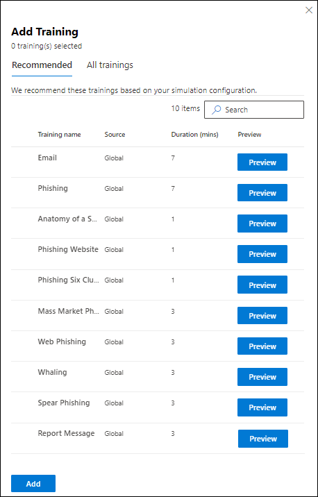
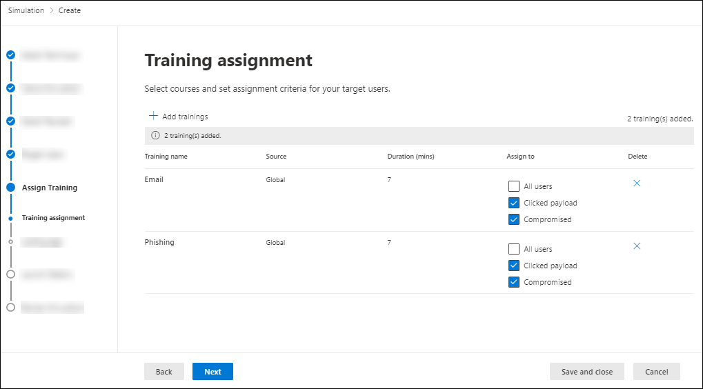

# Simulation automations for Attack simulation training

**Applies to**
 [Microsoft Defender for Office 365 plan 2](defender-for-office-365.md)

For getting started information about Attack simulation training, see [Get started using Attack simulation training](attack-simulation-training-get-started.md).

To create a simulation automation, do the following steps:

1. In the Microsoft 365 Defender portal at <https://security.microsoft.com/>, go to **Email & collaboration** \> **Attack simulation training** \> **Simulation automations** tab.

   To go directly to the **Simulation automations** tab, use <https://security.microsoft.com/attacksimulator?viewid=simulationautomation>.

2. On the **Simulation automations** tab, select  **Create simulation**.

   

3. The creation wizard opens. The rest of this article describes the pages and the settings they contain.

> [!NOTE]
> At any point during the simulation creation wizard, you can click **Save and close** to save your progress and continue configuring the simulation later. The incomplete simulation has the **Status** value **Draft** on the **Simulations** tab. You can pick up where you left off by selecting the simulation and clicking  **Edit** simulation.## Name and describe the simulation.

## Name and describe the simulation automation

On the **Automation name** page, configure the following settings:

- **Name**: Enter a unique, descriptive name for the simulation.
- **Description**: Enter an optional detailed description for the simulation.

When you're finished, click **Next**.

## Select one or more social engineering techniques

On the **Select social engineering techniques** page, select one or more of the available social engineering techniques, which were curated from the [MITRE ATT&CK® framework](https://attack.mitre.org/techniques/enterprise/). Different payloads are available for different techniques. The following social engineering techniques are available:

- **Credential harvest**: Attempts to collect credentials by taking users to a well-known looking website with input boxes to submit a username and password.
- **Malware attachment**: Adds a malicious attachment to a message. When the user opens the attachment, arbitrary code is run that will help the attacker compromise the target's device.
- **Link in attachment**: A type of credential harvest hybrid. An attacker inserts a URL into an email attachment. The URL within the attachment follows the same technique as credential harvest.
- **Link to malware**: Runs some arbitrary code from a file hosted on a well-known file sharing service. The message sent to the user will contain a link to this malicious file. Opening the file and help the attacker compromise the target's device.
- **Drive-by URL**: The malicious URL in the message takes the user to a familiar-looking website that silently runs and/or installs code code on the user's device.

If you click the **View details** link in the description, a details flyout opens that describes the technique and the simulation steps that result from the technique.

When you're finished, click **Next**.

## Select payloads

On the **Select payloads** page, select one of the following options:

- **Manually select**
- **Randomize**

If you select **Randomize**, there's nothing to configure on this page, so click **Next** to continue.

If you select **Manually select**, you need to select one ore more payloads from the list. The following details are displayed to help you choose:

- **Payload name**
- **Technique**: You need to select as one payload per technique that you selected on the previous page.
- **Language**: The language of the payload content. Microsoft's payload catalog (global) provides payloads in 10+ languages which can also be filtered.
- **Click rate**: How many people have clicked on this payload.
- **Predicted compromise rate**: Historical data for the payload across Microsoft 365 that predicts the percentage of people who will get compromised by this payload.
- **Simulations launched** counts the number of times this payload was used in other simulations.

In the  **Search** box, you can type part of the payload name and press Enter to filter the results.

If you click **Filter**, the following filters are available:

- **Complexity**: Calculated based on the number of indicators in the payload that indicate a possible attack (spelling errors, urgency, etc.). More indicators are easier to identify as an attack and indicate lower complexity. The available values are:
  - **Low**
  - **Medium**
  - **High**
- **Source**: Indicates whether the payload was created in your organization or is a part of Microsoft's pre-existing payload catalog. Valid values are:
  - **Global**
  - **Tenant**
  - **All**
- **Language**: The available values are: **English**, **Spanish**, **German**, **Japanese**, **French**, **Portuguese**, **Dutch**, **Italian**, **Swedish**, **Chinese (Simplified)**, **Norwegian Bokmål**, **Polish**, **Russian**, **Finnish**, **Korean**, **Turkish**, **Hungarian**, **Hebrew**, **Thai**, **Arabic**, **Vietnamese**, **Slovak**, **Greek**, **Indonesian**, **Romanian**, **Slovenian**, **Croatian**, **Catalan**, and **Other**.
- **Add tag(s)**
- **Filter by theme**: The available values are: **Account activation**, **Account verification**, **Billing**, **Clean up mail**, **Document received**, **Expense**, **Fax**, **Finance report**, **Incoming messages**, **Invoice**, **Items received**, **Login alert**, **Mail received**, **Password**, **Payment**, **Payroll**, **Personalized offer**, **Quarantine**, **Remote work**, **Review message**, **Security update**, **Service suspended**, **Signature required**, **Upgrade mailbox storage Verify mailbox**, **Voicemail**, and **Other**.
- **Filter by brand**: The available values are: **American Express**, **Capital One**, **DHL**, **DocuSign**, **Dropbox**, **Facebook**, **First American**, **Microsoft**, **Netflix**, **Scotiabank**, **SendGrid**, **Stewart Title**, **Tesco**, **Wells Fargo**, **Syrinx Cloud**, and **Other**.
- **Filter by industry**: The available values are: **Banking**, **Business services**, **Consumer services**, **Education**, **Energy**, **Construction**, **Consulting**, **Financial services**, **Government**, **Hospitality**, **Insurance**, **Legal**, **Courier services**, **IT**, **Healthcare**, **Manufacturing**, **Retail**, **Telecom**, **Real estate**, and **Other**.
- **Current event**: The available values are **Yes** or **No**.
- **Controversial**: The available values are **Yes** or **No**.

When you're finished configuring the filters, click **Apply**, **Cancel**, or **Clear filters**.

If you select a payload from the list by clicking on the name, details about the payload are shown in a flyout:

- The **Overview** contains an example and other details about the payload.
- The **Simulations launched** tab contains the **Simulation name**, **Click rate**, **Compromised rate**, and **Action**.

When you're finished, click **Next**.

## Target users

On the **Target users** page, select who will receive the simulation. Configure one of the following settings:

- **Include all users in your organization**: The affected users are show in lists of 10. You can use the **Next** and **Previous** buttons directly below the list of users to scroll through the list. You can also use the  **Search** icon on the page to find affected users.
- **Include only specific users and groups**: Choose one of the following options:
  -  **Add users**: In the **Add users** flyout that appears, you can find users and groups based on the following criteria:
    - **Users or groups**: In the  **Search for users and groups** box, you can type part of the **Name** or **Email address** of the user or group, and then press Enter. You can select some or all of the results. When you're finished, click **Add x users**.

      > [!NOTE]
      > Clicking the **Add filters** button to return to the **Filter users by categories** options will clear any users or groups that you selected in the search results.

    - **Filter users by categories**: Select from none, some, or all of the following options:
      - **Suggested user groups**: Select from the following values:
        - **All suggested user groups**
        - **Users not targeted by a simulation in the last three months**
        - **Repeat offenders**
      - **Department**: Use the following options:
        - **Search**: In the  **Search by Department** box, you can type part of the Department value, and then press Enter. You can select some or all of the results.
        - Select **All Department**
        - Select existing Department values.
      - **Title**: Use the following options:
        - **Search**: In the  **Search by Title** box, you can type part of the Title value, and then press Enter. You can select some or all of the results.
        - Select **All Title**
        - Select existing Title values.

      

      After you identify your criteria, the affected users are shown in the **User list** section that appears, where you can select some or all of the discovered recipients.

      When you're finished, click **Apply(x)**, and then click **Add x users**.

  Back on the main **Target users** page, you can use the  **Search** box to find affected users. You can also click  **Delete** to remove specific users.

-  **Import**: In the dialog that opens, specify a CSV file that contains one email address per line.

  After you find an select the CSV file, the list of users are imported and shown on the **Targeted users** page. You can use the  **Search** box to find affected users. You can also click  **Delete** to remove specific users.

When you're finished, click **Next**.

## Assign training

On the **Assign training** page, you can assign trainings for the simulation. We recommend that you assign training for each simulation, as employees who go through training are less susceptible to similar attacks. The following settings are available:

- **Select training content preference**: Choose one of the following options:
  - **Microsoft training experience**: This is the default value that has the following associated options to configure:
    - Select one of the following options:
      - **Assign training for me**: This is the default and recommended value. We assign training based on a user's previous simulation and training results, and you can review the selections in the next steps of the wizard.
      - **Select training courses and modules myself**: If you select this value, you'll still be able to see the recommended content as well as all available courses and modules in the next step of the wizard.
    - **Due date**: Choose one of the following values:
      - **30 days after simulation ends**: This is the default value.
      - **15 days after simulation ends**
      - **7 days after simulation ends**
  - **Redirect to a custom URL**: This value has the following associated options to configure:
    - **Custom training URL** (required)
    - **Custom training name** (required)
    - **Custom training description**
    - **Custom training duration (in minutes)**: The default value is 0, which means there is no specified duration for the training.
    - **Due date**: Choose one of the following values:
      - **30 days after simulation ends**: This is the default value.
      - **15 days after simulation ends**
      - **7 days after simulation ends**
  - **No training**: If you select this value, the only option on the page is the **Next** button that takes you to the [**Landing page**](#landing-page) page.

### Training assignment

> [!NOTE]
> The **Training assignment** page is available only if you selected **Microsoft training experience** \> **Select training courses and modules myself** on the previous page.

On the **Training assignment** page, select the trainings that you want to add to the simulation by clicking  **Add trainings**.

On the **Add training** flyout that appears, you can select the trainings to use on the following tabs that are available:

- **Recommended** tab: Shows the recommended built-in trainings based on the simulation configuration. These are the same trainings that would have been assigned if you selected **Assign training for me** on the previous page.
- **All trainings** tab: Shows all built-in trainings that are available.

  The following information is shown for each training:

  - **Training name**
  - **Source**: The value is **Global**.
  - **Duration (mins)**
  - **Preview**: Click the **Preview** button to see the training.

  In the  **Search** box, you can type part of the training name and press Enter to filter the results on the current tab.

  Select all trainings that you want to include from the current tab, and then click **Add**.

Back on the main **Training assignment** page, the trainings that you selected are shown. The following information is shown for each training:

- **Training name**
- **Source**
- **Duration (mins)**

For each training in the list, you need to select who gets the training by selecting values in the **Assign to** column:

- **All users**

  or one or both of the following values:

- **Clicked payload**
- **Compromised**

If you don't want to use a training that's shown, click  **Delete**.

When you're finished, click **Next**.

### Landing page

On the **Landing page** page, you configure training landing page that the users see. The following settings are available:

- **Header**
- **Body**

You can accepted the default values or customize them.

When you're finished, click **Next**.

## Simulation schedule

On the **Simulation schedule** page, select one of the following values:

- **Randomized**: You still need to select the schedule on the next page, but the simulations will launch at random times with the schedule.
- **Fixed**

When you're finished, click **Next**.

## Schedule details

What you see on the **Schedule details** page depends on whether you selected **Randomized** or **Fixed** on the previous page.

- **Randomized**: The following settings are available:
  - **Simulation start** section: Configure the following setting:
    - **Select the date you want the simulations to start from**
  - **Simulation scoping** section: Configure the following settings:
    - **Select the days of the week that simulations are allowed to start on**: Select one or more days of the week.
    - **Enter the maximum number of simulations that can be started between the start and end dates**: Enter a value from 1 to 10.
    - **Randomize send times**: Select this setting to randomize the send times.
  - **Simulation end** section: Configure the following setting:
    - **Select the date you want the simulations to end**

- **Fixed**: The following settings are available:
  - **Simulation start** section: Configure the following setting:
    - **Select the date you want the simulations to start from**
  - **Simulation recurrence** section: Configure the following settings:
    - **Select if you want simulations to launch weekly or monthly**: Select one of the following values:
      - **Weekly**: This is the default value.
      - **Monthly**
    - **Enter how often in weeks you want the simulations to recur for**: Enter a value from 1 to 99 weeks.
    - **Select the day of the week you want the simulations to start from**
  - **Simulation end** section: Selection one of the following values:
    - **Select the date you want the simulations to end**
    - **Enter the number of occurrences of the simulations to run before ending**: Enter a value from 1 to 10.

When you're finished, click **Next**.

## Launch details

On the **Launch details** page, configure the following additional settings for the automation:

- **Use unique payloads across simulations within an automation**: By default, this setting is not selected.
- **Target repeat offenders**: By default, this setting is not selected. If you select it, configure the following setting that appears:
  - **Enter the maximum number of times a user can be targeted within this automation**: Enter a value from 1 to 10.
- **Send simulation email based upon the user's current time zone setting from Outlook web app**: By default, this setting is not selected.
- **Display the drive-by technique interstitial data gathered page**: This setting is available only if you selected **Drive-by URL** on the **[Select one or more social engineering techniques](#select-one-or-more-social-engineering-techniques)** page. By default, the setting is on (.

## Review simulation automation

On the **Review simulation automation** page, you can review the details of your simulation automation.

You can select **Edit** in each section to modify the settings within the section. Or you can click **Back** or select the specific page in the wizard.

When you're finished, click **Submit**.
