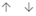

# Training campaigns in Attack simulation training

[!INCLUDE [MDO Trial banner](../includes/mdo-trial-banner.md)]

**Applies to**
 [Microsoft Defender for Office 365 plan 2](defender-for-office-365.md)

In Attack simulation training in Microsoft 365 E5 or Microsoft Defender for Office 365 Plan 2, Training campaigns are a faster, more direct way to provide security training to users. Instead of creating and launching [simulated phishing attacks](attack-simulation-training-simulations.md) that eventually lead to training, you can create and assign Training campaigns directly to users.

A Training campaign contains one or more built-in Training modules that you select. Currently, there are over 70 Training modules to select from. For more information about Training modules, see [Training modules for Training campaigns in Attack simulation training](attack-simulation-training-training-modules.md).

For getting started information about Attack simulation training, see [Get started using Attack simulation training](attack-simulation-training-get-started.md).

To see the existing Training campaigns, open the Microsoft 365 Defender portal at <https://security.microsoft.com>, go to **Email & collaboration** \> **Attack simulation training** \> **Training** tab. To go directly to the **Training** tab, use <https://security.microsoft.com/attacksimulator?viewid=trainingcampaign>.

The **Training campaigns** tab lists the Training campaigns that you've created. The list includes the following information for each Training campaign:

- **Name**
- **Description**
- **Duration (mins)**
- **Date of completion**
- **Training completion**: The number of users who were included in the Training campaign and how many of them completed the training. The information is shown as a fraction (for example, **2/5**) and in a corresponding horizontal bar graph.
- **No. of training modules**: The number of training modules that are included in the Training campaign.
- **Created by**
- **Created time**
- **Status**: One of the following values:
  - **Completed**\*
  - **In progress**\*
  - **Draft**\*
  - **Cancelled**
  - **Deleted**
  - **Failed**\*
  - **Scheduled**\*
- **⋮** (**Actions** control): Take action on the Training campaign. The available actions depend on the **Status** value of the Training campaign as described in the procedure sections. This control always appears at the end of the payload row.

To find a Training campaign in the list, type part of the campaign name in the :::image type="icon" source="../../media/m365-cc-sc-search-icon.png"::: **Search** box and then press the ENTER key.

Select :::image type="icon" source="../../media/m365-cc-sc-filter-icon.png"::: **Filter** to filter the information on the page by the **Status** value of the Training campaign.

\* The total count of Training campaigns with these **Status** values is also shown at the top of the page. But if you filter the information (for example, exclude on of these **Status** values), the count at the top of the page will be **0** for that excluded **Status** value.

## Create Training campaigns

To create a Training campaign, do the following steps:

1. In the Microsoft 365 Defender portal at <https://security.microsoft.com>, go to **Email & collaboration** \> **Attack simulation training** \> **Training** tab. Or, to go directly to the **Training** tab, use <https://security.microsoft.com/attacksimulator?viewid=trainingcampaign>.

2. On the **Training** tab,select :::image type="icon" source="../../media/m365-cc-sc-filter-icon.png"::: **Create new**.

3. The new Training campaign wizard opens. The rest of this section describes the pages and the settings they contain.

### Name Training campaign

On the **Name Training campaign** page, configure the following settings:

- **Name**: Enter a unique name.
- **Description**: Enter an optional description.

When you're finished on the **Name Training campaign** page, click **Next**.

### Target users

On the **Target users** page, select one of the following values:

- **Include all users in my organization**

- **Include only specific users and groups**: When this value is selected, use the following options to find and select the users or groups to include in the Training campaign:
  - :::image type="icon" source="../../media/m365-cc-sc-filter-icon.png"::: **Add users**: In the **Add users** flyout that appears, use the following options to find and select users:
  - **Search for users or groups**: In the :::image type="icon" source="../../media/m365-cc-sc-search-icon.png"::: **Search** box, enter three or more letters of the user or group name, and then press Enter. The results (if any) are shown in the **User list** section that appears.
    - To clear the search results without selecting any users or groups and return to all filters on the **Add users** flyout, select **Add/Edit**.
    - To clear the text from the search box and the entries from the **User list** section but remain in user/group search mode, select :::image type="icon" source="../../media/m365-cc-sc-search-icon.png"::: in the search box.
    - To clear any *selections* in the **User list** section but preserve the text in the search box and the actual entries in the list, select **Clear all selections**.
    - When you're done selecting entries from the **User list** section, select **Add n user(s)**. You'll return to the **Target users** page where the selected users are shown in a list. To return to the **Add users** flyout, select :::image type="icon" source="../../media/m365-cc-sc-filter-icon.png"::: **Add users**.

    Repeat this step as many times as required.

  - **Filter users by categories**: Use the following categories to filter and select users and groups. Multiple selections within the same category use the OR operator (for example, **User tags** equals **Priority account** OR **User tags** equals **High risk profile**). Selections from different categories use the AND operator (for example, **City** equals Redmond AND **Department** equals IT):

    - **Suggested user groups**: Select one or both of the following values:
      - **Users not targeted by a simulation in the last three months**
      - **Repeat offenders**: For more information, see [Configure the repeat offender threshold](attack-simulation-training-settings.md#configure-the-repeat-offender-threshold).

    - **User tags**: Select one or more of the following values. You'll need to click **See all user tags** to see all values, and custom [user tags](user-tags-about.md) aren't available:
      - **Priority accounts**: For more information, see [Priority accounts](../../admin/setup/priority-accounts.md).
        - **High risk profile**
        - **Medium risk profile**
        - **Low risk profile**

    - **City**, **Department**, or **Title** properties: In each section, the following options are available:
      - :::image type="icon" source="../../media/m365-cc-sc-search-icon.png"::: **Search by**: Type the property value and select it from the list of results.
      - The first three values for each property are shown. To see all values for the specific property, select the **All \<property>** link. Select one or more values.
      - Select **All \<property\>** to select all values for the specific property.

    After you select values from one or more categories, select **Apply(n)**. The results (if any) are shown in the **User list** section that appears.

    - To not select any users or groups and return to all filters on the **Add users** flyout, select **Add/Edit**.
    - To clear any *selections* in the **User list** section but preserve the actual entries in the list, select **Clear all selections**.
    - When you're done selecting entries from the **User list** section, select **Add n user(s)**. You'll return to the **Target users** page where the selected users are shown in a list. To return to the **Add users** flyout, select :::image type="icon" source="../../media/m365-cc-sc-filter-icon.png"::: **Add users**.

    Repeat this step as many times as required.

  - :::image type="icon" source="../../media/m365-cc-sc-import-icon.png"::: **Import**: In the dialog that opens, find and select a .csv file.

After you've selected one or more users or groups, the following information is shown for each entry on the **Target users** page:

- **Name**
- **Email**
- **Title**
- **Type**: **User** or **Group**
- **Delete**: Use the :::image type="icon" source="../../media/m365-cc-sc-delete-icon.png"::: **Delete** icon to remove the entry from the list. Select **Confirm** in the confirmation dialog**.

Use the :::image type="icon" source="../../media/m365-cc-sc-search-icon.png"::: **Search** box to find users or groups in the list.

When you're finished on the **Target users** page, select **Next**.

### Exclude users

On the **Exclude users** page, you can exclude some of the previously selected users from the Training campaign by selecting **Exclude some of the target users from this simulation**.

The selection options are identical to the previous step when you select :::image type="icon" source="../../media/m365-cc-sc-filter-icon.png"::: **Add users to exclude** or :::image type="icon" source="../../media/m365-cc-sc-import-icon.png"::: **Import**.

When you're finished on the **Exclude users** page, select **Next**.

### Select courses

On the **Select courses** page, click :::image type="icon" source="../../media/m365-cc-sc-filter-icon.png"::: **Add trainings**.

In the **Add Training** flyout that appears, select one or more Training modules to include in the Training campaign by clicking the blank area next to the module name, and then clicking **Add**.

What you see and what you can do in the **Add Training** flyout is identical to what's available at **Training modules** on the **Content library** tab at <https://security.microsoft.com/attacksimulator?viewid=contentlibrary>. For more information, see [Training modules for Training campaigns in Attack simulation training](attack-simulation-training-training-modules.md).

After you've selected one or more Training modules, the following information is shown for each entry on the **Select courses** page:

- **Training name**
- **Source**
- **Duration (mins)**
- **Delete**: Use the :::image type="icon" source="../../media/m365-cc-sc-delete-icon.png"::: **Delete** icon to remove the entry from the list. Click **Confirm** in the confirmation dialog**.

When you're finished on the **Select courses** page, click **Next**.

### Select end user notification

On the **Select end user notification** page, select from the following notification options:

- **Microsoft default notification (recommended)**: The following additional settings are available on the page:

  - **Select default language**: The available values are: **Chinese (Simplified)**, **Chinese (Traditional)**, **English**, **French**, **German**, **Italian**, **Japanese**, **Korean**, **Portuguese**, **Russian**, **Spanish**, and **Dutch**.

  - By default, the following notifications are included:
    - **Microsoft default training only campaign-training assignment notification**
    - **Microsoft default training only campaign-training reminder notification**

  For each notification, the following information is available:

  - **Notifications**: The name of the notification.
  - **Language**: If the notification contains multiple translations, the first two languages are shown directly. To see the remaining languages, hover over the numeric icon (for example, **+10**).
  - **Type**: **Training assignment notification** or **Training reminder notification**.
  - **Delivery preferences**: For **Training reminder notification** types, the values **Twice a week** and **Weekly** are available.
  - **⋮** (**Actions** control): If you click the :::image type="icon" source="../../media/m365-cc-sc-view-icon.png"::: **View** icon, the **Review notification** page appears with the following information:
    - **Preview** tab: View the notification message as users will see it. To view the message in different languages, use the **Select notification language** box.
    - **Details** tab: View details about the notification:
      - **Notification description**
      - **Source**: For built-in notifications, the value is **Global**.
      - **Notification type**: **Training assignment notification** or **Training reminder notification** based on the notification you originally selected:
      - **Modified by**
      - **Last modified**

    When you're finished, click **Close**.

  You're taken to the **[Schedule](#schedule)** page when you click **Next**.

- **Customized end user notifications**: When you click **Next**, you're taken to the **Training assignment notification** page as described in the next sections.

#### Training assignment notification

The **Training assignment notification** page is available only if you selected **Customized end user notifications** on the **[Select end user notification](#select-end-user-notification)** page.

This page shows the following notifications and their configured languages:

- **Microsoft default training assignment notification**
- **Microsoft default training only campaign-training assignment notification**
- Any custom training assignment notifications that you previously created where the **Type** value is **Training assignment notification**.

  These notifications are also available in **End user notifications** on the **Content library** tab in Attack simulation training at <https://security.microsoft.com/attacksimulator?viewid=contentlibrary>. The built-in notifications are available on the **Global notifications** tab. Custom training assignment notifications are available on the **Tenant notifications** tab. For more information, see [End-user notifications for Attack simulation training](attack-simulation-training-end-user-notifications.md).

You can select an existing training assignment notification or create a new notification to use:

- To select an existing notification, select the check box next to the notification name. If you click on the notification name, the notification is selected and a preview flyout appears. To deselect the notification, clear the check box next to the notification.
- To search for an existing notification on the page, use the :::image type="icon" source="../../media/m365-cc-sc-search-icon.png"::: **Search** box to search for the name.

  Select the notification that you want to use, and then click **Next**.

- To create and use a new notification, select :::image type="icon" source="../../media/m365-cc-sc-create-icon.png"::: **Create new**.

- To edit an existing custom notification, select it and then click the :::image type="icon" source="../../media/m365-cc-sc-edit-icon.png"::: **Edit notification** icon that appears.

##### Training assignment notification wizard

If you select :::image type="icon" source="../../media/m365-cc-sc-create-icon.png"::: **Create new** on the **Training assignment notification** page or select a custom notification and then click :::image type="icon" source="../../media/m365-cc-sc-edit-icon.png"::: **Edit notification**, a new notification wizard opens.

The creation steps are identical as described in [Create end-user notifications](attack-simulation-training-end-user-notifications.md#create-end-user-notifications).

> [!NOTE]
> On the **Define details** page of the new notification wizard, be sure to select the value **Training assignment notification** for the notification type.

When you're finished, you're taken back to the **Training assignment notification** page where the notification that you just created now appears in the list.

Select the notification that you want to use, and then click **Next**.

When you're finished, click **Next**.

#### Training reminder notification

The **Training reminder notification** page is available only if you selected **Customized end user notifications** on the **[Select end user notification](#select-end-user-notification)** page.

- **Set frequency for reminder notification**: Select **Weekly** (default) or **Twice a week**.
  - Reminder notifications will stop at the end of the campaign.

- **Select a reminder notification**: This section shows the following notifications and their configured languages:

  - **Microsoft default training reminder notification**
  - **Microsoft default training only campaign-training reminder notification**
  - Any custom training reminder notifications that you previously created where the **Type** value is **Training reminder notification**.

    These notifications are also available in **End user notifications** on the **Content library** tab in Attack simulation training at <https://security.microsoft.com/attacksimulator?viewid=contentlibrary>. The build-it notifications available on the **Global notifications** tab. Custom training reminder notifications are available on the **Tenant notifications** tab. For more information, see [End-user notifications for Attack simulation training](attack-simulation-training-end-user-notifications.md).

  You can select an existing training reminder notification or create a new notification to use:

- To select an existing notification, select the check box next to the notification name. If you click on the notification name, the notification is selected and a preview flyout appears. To deselect the notification, clear the check box next to the notification.
- To search for an existing notification on the page, use the :::image type="icon" source="../../media/m365-cc-sc-search-icon.png"::: **Search** box to search for the name.

    Select the notification that you want to use, and then select **Next**.

  - To create and use a new notification, click :::image type="icon" source="../../media/m365-cc-sc-create-icon.png"::: **Create new**.

  - To edit an existing custom notification, select it and then click the :::image type="icon" source="../../media/m365-cc-sc-edit-icon.png"::: **Edit notification** icon that appears.

##### Training reminder notification wizard

If you click :::image type="icon" source="../../media/m365-cc-sc-create-icon.png"::: **Create new** on the **Training reminder notification** page or select a custom notification and then click :::image type="icon" source="../../media/m365-cc-sc-edit-icon.png"::: **Edit notification**, a new notification wizard opens.

The creation steps are identical as described in [Create end-user notifications](attack-simulation-training-end-user-notifications.md#create-end-user-notifications).

> [!NOTE]
> On the **Define details** page of the new notification wizard, be sure to select the value **Training reminder notification** for the notification type.

When you're finished, you're taken back to the **Training reminder notification** page where the notification that you created is now listed.

Select the notification that you want to use, and then click **Next**.

### Schedule

On the **Schedule** page, select the start date and end date for the Training campaign using one of the following values:

- **launch this Training campaign as soon as I'm done**
- **Schedule this Training campaign to be launched later**: If this option is selected, **Set the campaign launch date** and **Set launch time** boxes appear for you to configure.

**Send training with an end date** is selected by default, so **Set the campaign end date** and **Set end time** boxes are available for you to configure. If you clear **Send training with an end date**, the boxes disappear.

> [!NOTE]
> If you clear the **Send training with an end date** box, no reminder notifications will be send to the targeted users outside of the initial assignment notice.

When you're finished on the **Schedule** page, click **Next**.

## Review

On the **Review** page, you can review the details of your Training campaign.

You can select **Edit** in each section to modify the settings within the section. Or you can click **Back** or select the specific page in the wizard.

When you're finished on the **Review** page, click **Submit**.

## View details and reports for Training campaigns

To view the details and reports for a Training campaign, do the following steps:

1. In the Microsoft 365 Defender portal at <https://security.microsoft.com>, go to **Email & collaboration** \> **Attack simulation training** \> **Training** tab. Or, to go directly to the **Training** tab, use <https://security.microsoft.com/attacksimulator?viewid=trainingcampaign>.

2. On the **Training** tab, do one of the following steps:
   - Select the Training campaign by selecting the check box next to it, and then click **⋮** (**Actions**) \> :::image type="icon" source="../../media/m365-cc-sc-eye-icon.png"::: **View report**. You might need to scroll to the right to see **⋮** (**Actions**).
   - In the list of Training campaigns, click anywhere in the row without selecting the check box (for example, on the **Name** value).

3. A details page for the Training campaign opens with the following tabs:
   - **Report**
   - **Users**
   - **Details**

These tabs are described in the following sections.

### Report tab

The **Report** tab of the Training campaign shows the following information:

- **Training completion** section:
  - Each Training module that's included in the Training campaign is shown with a bar graph and a fraction that shows how many people have completed the module (number of users / total number of users).
  - Using the previous data, the top of the section shows:
    - The percentage of users who completed all modules in the campaign.
    - The percentage of users who completed some of the modules in the campaign.
    - The percentage of users who haven't started any of the modules in the campaign.

- **All user activity** section:
  - **Successfully received training notification**: A bar graph and a fraction that shows how main people received notifications for the modules in the campaign.

### Users tab

The **Users** tab shows the following information about the users who were assigned the Training campaign:

- **Display name**
- **Training status**: One of the following values:
  - **Not started**: The user hasn't started any Training modules in the campaign.
  - **In progress**: The user has completed some Training modules in the campaign.
  - **Completed**: The user has completed all Training modules in the campaign.
  - **Overdue**: The user hasn't completed all Training modules by the campaign end date/time.
- **Training completion date**
- **Mail**

To add or remove the **Training date status** or **Department** columns, click :::image type="icon" source="../../media/m365-cc-sc-customize-icon.png"::: **Customize columns**.

To download the displayed results to a RecordExport.csv file in the local Downloads folder, click :::image type="icon" source="../../media/m365-cc-sc-download-icon.png"::: **Export**.

If you select a user from the list, the following information appears in a details flyout:

- **User details** section:
  - **Company**
  - **IP address**
  - **Job title**
  - **Department**
  - **Location**
  - **Manager**
- Status information for Training modules in the Training campaign for the user:
  - **Training name**: The training module name.
  - **Training status**: **Not started**, **In progress**, **Completed**, **Training Previously Assigned**, **Overdue**, or **Not Completed**.
  - **Training start date**
  - **Training completed date**

To see details about other users in the Training campaign without leaving the details flyout, use  **Previous item** and **Next item**.

### Details tab

The **Details** tab of the Training campaign shows the following information:

- **Description**
- **Schedule details**: The launch date/time and the end date/time.
- **Notifications**: Whether training assignment notifications and training reminder notifications are enabled, and their delivery frequency.
- **Selected modules**: The Training modules in the Training campaign are listed, along with their durations.

## Delete Training campaigns

To delete an existing Training campaign, do the following steps:

1. In the Microsoft 365 Defender portal at <https://security.microsoft.com>, go to **Email & collaboration** \> **Attack simulation training** \> **Training** tab. Or, to go directly to the **Training** tab, use <https://security.microsoft.com/attacksimulator?viewid=trainingcampaign>.

2. On the **Training** tab, click **⋮** (**Actions**) in the Training \> :::image type="icon" source="../../media/m365-cc-sc-delete-icon.png"::: **Delete**. You might need to scroll to the right to see **⋮** (**Actions**).

3. Click **Confirm** in the warning dialog that opens.

## Set the training threshold time period

The training threshold time period is the number of days for which a training module will not be re-assigned to a user who meets either of the following criteria:

- They've already completed the same training module during the threshold time period.
- They're actively assigned the same training module during the threshold time period.

The training threshold starts from the time of user training module assignment.

We recommend the number of days for the training threshold assignment to be greater than the number of days that a user would have to complete a training module assignment.

In the training campaign user report, a user may have the following **Status** values:

- **Completed**: The user has already completed their training module.
- **In Progress**: The user has started their training module.
- **Not Started**: The user hasn't started their training module.
- **Training Previously Assigned**: The user currently has been assigned the training module within the training threshold time period, but hasn't completed the training. The user can still complete the training module to move it to a **Completed** state.
- **Overdue**: The user hasn't completed the training before the assigned module due date and has not been reassigned the same training module within the training threshold period.
- **Not Completed**: The user hasn't completed the training module within the assigned module due date and/ or is outside the training threshold period and is eligible for the same training module reassignment.

To set the training threshold, do the following steps:

1. In the Microsoft 365 Defender portal at <https://security.microsoft.com>, go to **Email & collaboration** \> **Attack simulation training** \> **Settings** tab. Or, to go directly to the **Settings** tab, use <https://security.microsoft.com/attacksimulator?viewid=setting>.

2. Set the value in days for the training threshold time period. The default value is 90 days. To remove training threshold and always assign training, set value to 0.

3. When you're finished, click **Save**.
