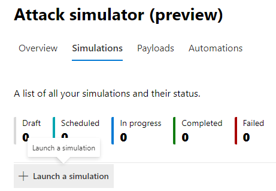
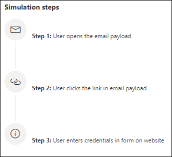
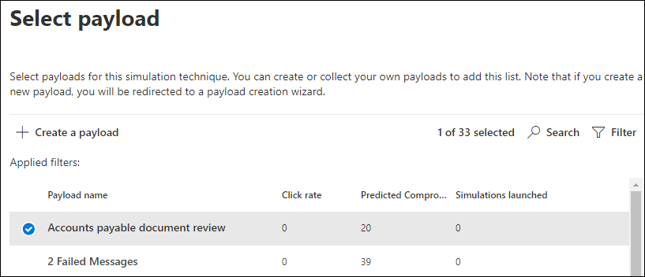
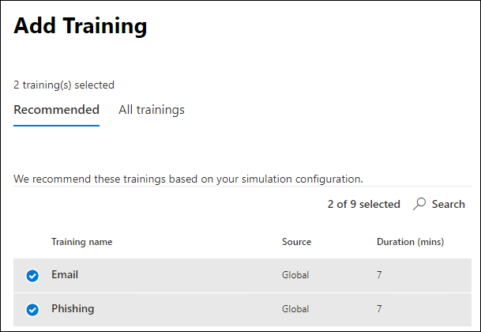

# Simulate a phishing attack

Attack simulation training in Microsoft Defender for Office 365 lets you run benign cyberattack simulations on your organization to test your security policies and practices, as well as train your employees to increase their awareness and decrease their susceptibility to attacks. This article walks you through creating  a simulated phishing attack using attack simulation training.

For getting started information about Attack simulation training, see [Get started using Attack simulation training](attack-simulation-training-get-started.md).

To launch a simulated phishing attack, open the [Microsoft 365 security center](https://security.microsoft.com/), go to **Email & collaboration** \> **Attack simulation training**, and switch to the [**Simulations**](https://security.microsoft.com/attacksimulator?viewid=simulations) tab.

Under **Simulations**, select **+ Launch a simulation**.

> [!NOTE]
> At any point during simulation creation, you can save and close to continue configuring the simulation at a later time.

## Selecting a social engineering technique

Select from 4 different techniques, curated from the [MITRE ATT&CK® framework](https://attack.mitre.org/techniques/enterprise/). Different payloads are available for different techniques:

- **Credential harvest** attempts to collect credentials by taking users to a well-known looking website with input boxes to submit a username and password.
- **Malware attachment** adds a malicious attachment to a message. When the user opens the attachment, arbitrary code is run that will help the attacker compromise the target's device.
- **Link in attachment** is a type of credential harvest hybrid. An attacker inserts a URL into an email attachment. The URL within the attachment follows the same technique as credential harvest.
- **Link to malware** will run some arbitrary code from a file hosted on a well-known file sharing service. The message sent to the user will contain a link to this malicious file. Opening the file and help the attacker compromise the target's device.
- **Drive-by URL** is where the malicious URL in the message takes the user to a familiar-looking website that silently runs and/or installs code code on the user's device.

> [!TIP]
> Clicking on **View details** within the description of each technique will display further information and the simulation steps for the technique.
>
> 

After you've selected the technique and clicked on **Next**, give your simulation a name and optionally a description.

## Selecting a payload

Next, you'll need to either select a payload from the pre-existing payload catalog.

Payloads have a number of data points to help you choose:

- **Click rate** counts how many people clicked this payload.
- **Predicted compromise rate** predicts the percentage of people that will get compromised by this payload based on historical data for the payload across Microsoft Defender for Office 365 customers.
- **Simulations launched** counts the number of times this payload was used in other simulations.
- **Complexity**, available through **filters**, is calculated based on the number of indicators within the payload that clue targets in on it being an attack. More indicators lead to lower complexity.
- **Source**, available through **filters**, indicates whether the payload was created on your tenant or is a part of Microsoft's pre-existing payload catalog (global).

Select a payload from the list to see a preview of the payload with additional information about it.

If you'd like to create your own payload, read [create a payload for attack simulation training](attack-simulation-training-payloads.md).

## Audience targeting

Now it's time to select this simulation's audience. You can choose to **include all users in your organization** or **include only specific users and groups**.

When you choose to **include only specific users and groups** you can either:

- **Add users**, which allows you to leverage search for your tenant, as well as advanced search and filtering capabilities, like targeting users who haven't been targeted by a simulation in the last 3 months.
  
- **Import from CSV** allows you to import a predefined set of users for this simulation.

## Assigning training

We recommend that you assign training for each simulation, as employees who go through training are less susceptible to similar attacks.

You can either choose to have training assigned for you or select training courses and modules yourself.

Select the **training due date** to make sure employees finish their training in a timely manner.

> [!NOTE]
> If you choose to select courses and modules yourself, you'll still be able to see the recommended content as well as all available courses and modules.
>
> 

In the next steps you'll need to **Add trainings** if you opted to select it yourself, and customize your training landing page. You'll be able to preview the training landing page, as well as change the header and body of it.

## Launch details and review

Now that everything is configured, you can launch this simulation immediately or schedule it for a later date. You will also need to choose when to end this simulation. We will stop capturing interaction with this simulation past the selected time.

**Enable region aware timezone delivery** to deliver simulated attack messages to your employees during their working hours based on their region.

Once you're done, click on **Next** and review the details of your simulation. Click on **Edit** on any of the parts to go back and change any details that need changing. Once done, click **Submit**.
