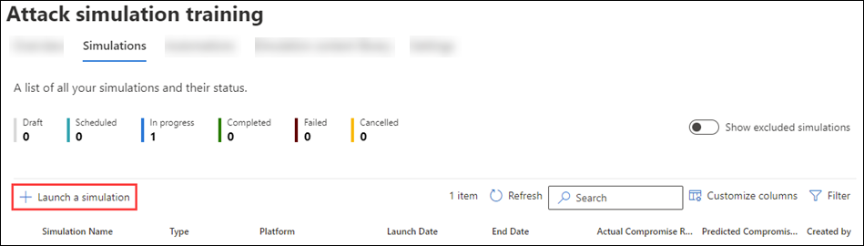
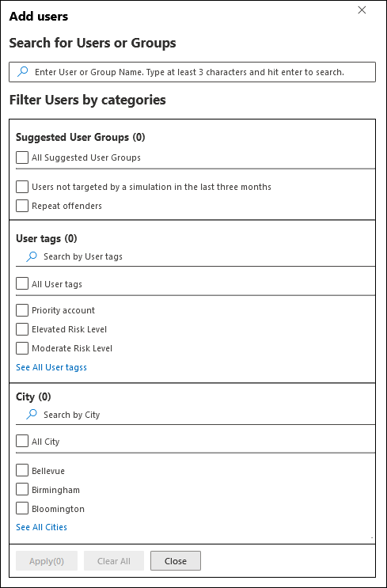

# Simulate a phishing attack in Defender for Office 365

**Applies to**
 [Microsoft Defender for Office 365 plan 2](defender-for-office-365.md)

Attack simulation training in Microsoft Defender for Office 365 Plan 2 or Microsoft 365 E5 lets you run benign cyberattack simulations in your organization. These simulations test your security policies and practices, as well as train your employees to increase their awareness and decrease their susceptibility to attacks. This article walks you through creating a simulated phishing attack using Attack simulation training.

For getting started information about Attack simulation training, see [Get started using Attack simulation training](attack-simulation-training-get-started.md).

To launch a simulated phishing attack, do the following steps:

1. In the Microsoft 365 Defender portal at <https://security.microsoft.com/>, go to **Email & collaboration** \> **Attack simulation training**.

   To go directly to the **Attack simulation training** page, use <https://security.microsoft.com/attacksimulator?viewid=simulations> or use <https://security.microsoft.com/attacksimulator> and select the **Simulations** tab.

2. On the **Attack simulation training** page, select the **Simulations** tab.

3. On the **Simulations** tab, select  **Launch a simulation**.

   

4. The simulation creation wizard opens. The rest of this article describes the pages and the settings they contain.

> [!NOTE]
> At any point during the simulation creation wizard, you can click **Save and close** to save your progress and continue configuring the simulation later. The incomplete simulation has the **Status** value **Draft** on the **Simulations** tab. You can pick up where you left off by selecting the simulation and clicking  **Edit** simulation.

## Select a social engineering technique

On the **Select technique** page, select an available social engineering technique, which was curated from the [MITRE ATT&CK® framework](https://attack.mitre.org/techniques/enterprise/). Different payloads are available for different techniques. The following social engineering techniques are available:

- **Credential harvest**: Attempts to collect credentials by taking users to a well-known looking website with input boxes to submit a username and password.
- **Malware attachment**: Adds a malicious attachment to a message. When the user opens the attachment, arbitrary code is run that will help the attacker compromise the target's device.
- **Link in attachment**: A type of credential harvest hybrid. An attacker inserts a URL into an email attachment. The URL within the attachment follows the same technique as credential harvest.
- **Link to malware**: Runs some arbitrary code from a file hosted on a well-known file sharing service. The message sent to the user will contain a link to this malicious file. Opening the file and help the attacker compromise the target's device.
- **Drive-by URL**: The malicious URL in the message takes the user to a familiar-looking website that silently runs and/or installs code code on the user's device.

If you click the **View details** link in the description, a details flyout opens that describes the technique and the simulation steps that result from the technique.

When you're finished, click **Next**.

## Name and describe the simulation

On the **Name simulation** page, configure the following settings:

- **Name**: Enter a unique, descriptive name for the simulation.
- **Description**: Enter an optional detailed description for the simulation.

When you're finished, click **Next**.

## Select a payload

On the **Select payload** page, you need to select an existing payload from the list, or create a new payload.

The following details are displayed in the list of payloads to help you choose:

- **Name**
- **Language**: The language of the payload content. Microsoft's payload catalog (global) provides payloads in 10+ languages which can also be filtered.
- **Click rate**: How many people have clicked on this payload.
- **Predicted compromise rate**: Historical data for the payload across Microsoft 365 that predicts the percentage of people who will get compromised by this payload.
- **Simulations launched** counts the number of times this payload was used in other simulations.

In the  **Search** box, you can type part of the payload name and press Enter to filter the results.

If you click **Filter**, the following filters are available:

- **Complexity**: Calculated based on the number of indicators in the payload that indicate a possible attack (spelling errors, urgency, etc.). More indicators are easier to identify as an attack and indicate lower complexity. The available values are:
  - **Low**
  - **Medium**
  - **High**
- **Source**: Indicates whether the payload was created in your organization or is a part of Microsoft's pre-existing payload catalog. Valid values are:
  - **Global**
  - **Tenant**
  - **All**
- **Language**: The available values are: **English**, **Spanish**, **German**, **Japanese**, **French**, **Portuguese**, **Dutch**, **Italian**, **Swedish**, **Chinese (Simplified)**, **Norwegian Bokmål**, **Polish**, **Russian**, **Finnish**, **Korean**, **Turkish**, **Hungarian**, **Hebrew**, **Thai**, **Arabic**, **Vietnamese**, **Slovak**, **Greek**, **Indonesian**, **Romanian**, **Slovenian**, **Croatian**, **Catalan**, and **Other**.
- **Add tag(s)**
- **Filter by theme**: The available values are: **Account activation**, **Account verification**, **Billing**, **Clean up mail**, **Document received**, **Expense**, **Fax**, **Finance report**, **Incoming messages**, **Invoice**, **Items received**, **Login alert**, **Mail received**, **Password**, **Payment**, **Payroll**, **Personalized offer**, **Quarantine**, **Remote work**, **Review message**, **Security update**, **Service suspended**, **Signature required**, **Upgrade mailbox storage Verify mailbox**, **Voicemail**, and **Other**.
- **Filter by brand**: The available values are: **American Express**, **Capital One**, **DHL**, **DocuSign**, **Dropbox**, **Facebook**, **First American**, **Microsoft**, **Netflix**, **Scotiabank**, **SendGrid**, **Stewart Title**, **Tesco**, **Wells Fargo**, **Syrinx Cloud**, and **Other**.
- **Filter by industry**: The available values are: **Banking**, **Business services**, **Consumer services**, **Education**, **Energy**, **Construction**, **Consulting**, **Financial services**, **Government**, **Hospitality**, **Insurance**, **Legal**, **Courier services**, **IT**, **Healthcare**, **Manufacturing**, **Retail**, **Telecom**, **Real estate**, and **Other**.
- **Current event**: The available values are **Yes** or **No**.
- **Controversial**: The available values are **Yes** or **No**.

When you're finished configuring the filters, click **Apply**, **Cancel**, or **Clear filters**.

If you select a payload from the list, details about the payload are shown in a flyout:

- The **Overview** contains an example and other details about the payload.
- The **Simulations launched** tab contains the **Simulation name**, **Click rate**, **Compromised rate**, and **Action**.

If you select a payload from the list, a  **Send a test** button appears on the main page where you can send a copy of the payload email to yourself (the currently logged in user) for inspection.

To create your own payload, click  **Create a payload**. For more information, see [Create custom payloads for Attack simulation training](attack-simulation-training-payloads.md).

When you're finished, click **Next**.

## Target users

On the **Target users** page, select who will receive the simulation. Configure one of the following settings:

- **Include all users in your organization**: The affected users are show in lists of 10. You can use the **Next** and **Previous** buttons directly below the list of users to scroll through the list. You can also use the  **Search** icon on the page to find affected users.
- **Include only specific users and groups**: Choose one of the following options:
  -  **Add users**: In the **Add users** flyout that appears, you can find users and groups based on the following criteria:
    - **Users or groups**: In the  **Search for users and groups** box, you can type part of the **Name** or **Email address** of the user or group, and then press Enter. You can select some or all of the results. When you're finished, click **Add x users**.

      > [!NOTE]
      > Clicking the **Add filters** button to return to the **Filter users by categories** options will clear any users or groups that you selected in the search results.

    - **Filter users by categories**: Select from none, some, or all of the following options:
      - **Suggested user groups**: Select from the following values:
        - **All suggested user groups**
        - **Users not targeted by a simulation in the last three months**
        - **Repeat offenders**
      - **Department**: Use the following options:
        - **Search**: In the  **Search by Department** box, you can type part of the Department value, and then press Enter. You can select some or all of the results.
        - Select **All Department**
        - Select existing Department values.
      - **Title**: Use the following options:
        - **Search**: In the  **Search by Title** box, you can type part of the Title value, and then press Enter. You can select some or all of the results.
        - Select **All Title**
        - Select existing Title values.

      

      After you identify your criteria, the affected users are shown in the **User list** section that appears, where you can select some or all of the discovered recipients.

      When you're finished, click **Apply(x)**, and then click **Add x users**.

  Back on the main **Target users** page, you can use the  **Search** box to find affected users. You can also click  **Delete** to remove specific users.

-  **Import**: In the dialog that opens, specify a CSV file that contains one email address per line.

  After you find an select the CSV file, the list of users are imported and shown on the **Targeted users** page. You can use the  **Search** box to find affected users. You can also click  **Delete** to remove specific users.

When you're finished, click **Next**.

## Assign training

On the **Assign training** page, you can assign trainings for the simulation. We recommend that you assign training for each simulation, as employees who go through training are less susceptible to similar attacks. The following settings are available:

- **Select training content preference**: Choose one of the following options:
  - **Microsoft training experience**: This is the default value that has the following associated options to configure:
    - Select one of the following options:
      - **Assign training for me**: This is the default and recommended value. We assign training based on a user's previous simulation and training results, and you can review the selections in the next steps of the wizard.
      - **Select training courses and modules myself**: If you select this value, you'll still be able to see the recommended content as well as all available courses and modules in the next step of the wizard.
    - **Due date**: Choose one of the following values:
      - **30 days after simulation ends**: This is the default value.
      - **15 days after simulation ends**
      - **7 days after simulation ends**
  - **Redirect to a custom URL**: This value has the following associated options to configure:
    - **Custom training URL** (required)
    - **Custom training name** (required)
    - **Custom training description**
    - **Custom training duration (in minutes)**: The default value is 0, which means there is no specified duration for the training.
    - **Due date**: Choose one of the following values:
      - **30 days after simulation ends**: This is the default value.
      - **15 days after simulation ends**
      - **7 days after simulation ends**
  - **No training**: If you select this value, the only option on the page is the **Next** button that takes you to the [**Landing page**](#landing-page) page.

### Training assignment

> [!NOTE]
> The **Training assignment** page is available only if you selected **Microsoft training experience** and **Select training courses and modules myself** on the previous page.

On the **Training assignment** page, select the trainings that you want to add to the simulation.

On the main page, existing custom trainings are shown. These trainings are created if you selected **Redirect to a custom URL** on the previous page and and filled out the required information, even if you changed your mind and selected **Microsoft training experience** and **Select training courses and modules myself** to arrive here. The following information is shown for existing custom trainings:

- **Training name**
- **Source**: The value is **Tenant** (custom).
- **Duration (mins)**
- **Assign to**: Select **All users** or one or more of the following values:
  - **Clicked payload**
  - **Compromised**: This is the default value.

If you don't want to use the custom training that's shown, click  **Delete**.

To assign trainings, click  **Add trainings**.

On the **Add training** flyout that appears, you can select the trainings to use on the following tabs that are available:

- **Recommended**: Shows the recommended built-in trainings based on the simulation configuration. These are the same trainings that would have been assigned if you selected **Assign training for me** on the previous page.
- **All trainings**: Shows all built-in trainings that are available.

The following information is shown for each training:

- **Training name**
- **Source**: The value is **Global**.
- **Duration (mins)**
- **Preview**: Click the **Preview** button to see the training.

In the  **Search** box, you can type part of the training name and press Enter to filter the results.

Select all trainings that you want to include, and then click **Add**.

When you're finished, click **Next**.

### Landing page

On the **Landing page** page, you configure the web page that user are taken to if they open the payload in the simulation.

- **Select landing page preference**: The available values are:
  - **Use Microsoft default landing page**: This is the default value that has the following associated options to configure:
    - **Select landing page layout**: Select one of the available templates.
    - **Add logo**: Click **Browse** to find and select a .png, .jpeg, or .gif file.
    - **Add payload indicators to email**: Select this setting to help users learn how to identify phishing messages.

    You can preview the results by clicking the **Open preview panel** button at the bottom of the page.

  - **Use a custom URL**: If you select this value, you need to add the URL in the **Enter the custom landing page URL** box that appears. No other options are available on the page.
  - **Create your own landing page**: This value has the following associated options to configure:
    - **Add payload indicators to email**: Select this setting to help users learn how to identify phishing messages.
    - Page content: Two tabs are available:
      - **Text**: A rich text editor is available to create your landing page. In addition to the typical font and formatting settings, the following settings are available:
        - **Dynamic tag**: Select from the following tags:
          - **Username**
          - **Email sender name**
          - **Sender email address**
          - **Email subject**
          - **Email content**
        - **Use from default**: Select an available template to start with. You can modify the text and layout in the editing area. To reset the landing page back to the default text and layout of the template, click **Reset to default**.
    - **Code**: You can view and modify the HTML code directly.

    You can preview the results by clicking the **Open preview panel** button in the middle of the page.

When you're finished, click **Next**.

> [!NOTE]
> Certain trademarks, logos, symbols, insignias and other source identifiers receive heightened protection under local, state and federal statutes and laws. Unauthorized use of such indicators can subject the users to penalties, including criminal fines. Though not an extensive list, this includes the Presidential, Vice Presidential, and Congressional seals, the CIA, the FBI, Social Security, Medicare and Medicaid, the United States Internal Revenue Service, and the Olympics. Beyond these categories of trademarks, use and modification of any third-party trademark carries an inherent amount of risk. Using your own trademarks and logos in a payload would be less risky, particularly where your organization permits the use. If you have any further questions about what is or is not appropriate to use when creating or configuring a payload, you should consult with your legal advisors.

## Launch details

On the **Launch details** page, you choose when to launch the simulation and when to end the simulation. We'll stop capturing interaction with this simulation after the end date you specify.

The following settings are available:

- Choose one of the following values:
  - **Launch this simulation as soon as I'm done**
  - **Schedule this simulation to be launched later**: This value has the following associated options to configure:
    - **Select launch date**
    - **Select launch time**
- **Configure number of days to end simulation after**: The default value is 2.
- **Enable region aware time zone delivery**: Deliver simulated attack messages to your employees during their working hours based on their region.

When you're finished, click **Next**.

## Review simulation

On the **Review simulation** page, you can review the details of your simulation.

Click the  **Send a test** button to send a copy of the payload email to yourself (the currently logged in user) for inspection.

You can select **Edit** in each section to modify the settings within the section. Or you can click **Back** or select the specific page in the wizard.

When you're finished, click **Submit**.

