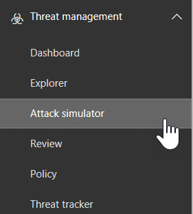

# Attack Simulator in Office 365 ATP

Attack Simulator in Office 365 Advanced Threat Protection Plan 2 (ATP Plan 2) allows you to run realistic, but simulated phishing and password attacks (campaigns) in your organization. The results of these simulations can help you to identify and train vulnerable users.

## What do you need to know before you begin?

- To open the Office 365 Security & Compliance Center, go to <https://protection.office.com/>. Attack simulator is available at **Threat management** \> **Attack simulator**.

  

- You need to be a member of the **Organization Management** or **Security Administrator** role groups. For more information about role groups in the Security & Compliance Center, see [Permissions in the Office 365 Security & Compliance Center](permissions-in-the-security-and-compliance-center.md).

- Your account needs to be configured for multi-factor authentication (MFA). For instructions, see [Set up multi-factor authentication](https://docs.microsoft.com/office365/admin/security-and-compliance/set-up-multi-factor-authentication).

- You can only run campaigns (that is, use Attack Simulator) on users with mailboxes in Exchange Online.

- A campaign will collect and process events for 30 days. Historical campaign data will be available for up to 90 days after you launch the campaign.

- There are no PowerShell cmdlets for Attack Simulator.

## Spear phishing campaigns

*Phishing* is a generic term for email attacks that try to steal sensitive information in messages that appear to be from legitimate or trusted senders. *Spear phishing* is a targeted phishing attack that uses very focused and customized content that's specifically tailored to the targeted recipients (typically, after reconnaissance on the recipients by the attacker).

For more information about phishing and spear phishing, see [Phishing](https://docs.microsoft.com/en-us/windows/security/threat-protection/intelligence/phishing).

In Attack Simulator, two different types of spear phishing campaigns are available:

- **Spear phishing (credentials harvest)**: The attack tries to convince the recipients to click a URL in the message. If they click the link, users are asked to enter their credentials. If they do (even if the credentials are incorrect), they're taken to one of the following locations:

  - A default page that explains this was a just a test, and gives tips for recognizing phishing messages.

    

  - A custom page (URL) that you specify.

- **Spear phishing (attachment)**: The attack tries to convince the recipients to open an attachment in the message. The attachment contains the same default page content from the phishing link (instead, the first sentence starts with "\<username\>, you are seeing this message as a recent email message you opened...").

> [!NOTE]
> Currently, spear phishing campaigns in Attack Simulator never expire.

### Create a spear phishing campaign

An important part of any spear phishing campaign is the look and feel of the email message that's sent to the targeted recipients. To create and configure the email message, you have these options:

- **Use a built-in email template**: Two built-in templates are available: **Prize Giveaway** and **Payroll Update**. You can customize all or none of the email properties from the template when you create and launch the campaign.

- **Create a reusable email template**: After you create and save the email template, you can use it again in future spear phishing campaigns. You can customize all or none of the email properties from the template when you create and launch the campaign.

- **Create the email message in the wizard**: You can create the email message directly in the wizard as you create and launch the spear phishing campaign.

#### Step 1 (Optional): Create a custom email template

If you're going to use one of the built-in templates or create the email message directly in the wizard, you can skip this step.

1. In the Security & Compliance Center, go to **Threat management** \> **Attack simulator**.

2. On the **Simulate attacks** page, in either the **Spear Phishing (Credentials Harvest)** or **Spear Phishing (Attachment)** sections, click **Attack Details**.

3. In the **Attack details** page that opens, in the **Phishing Templates** section, in the **Create Templates** area, click **New Template**.

4. The **Configure Phishing Template** wizard starts in a new flyout. In the **Start** step, enter a unique display name for the template, and then click **Next**.

5. In the **Configure email details** step, configure the following settings:

   - **From (Name)**: The display name that's used for the message sender.

   - **From (Email)**: The sender's email address.

   - **Phishing Login Server URL**: Click the drop down and select one of the available URLs from the list. This is the URL that users will be tempted to click.

   - **Custom Landing Page URL**: Enter an optional landing page where users are taken at the end of a successful attack (after the user clicks the phishing link and enters their credentials) instead of the default link. For example, if you have internal awareness training, you can specify that URL here.

   - **Category**: Currently, this setting isn't used (anything you enter is ignored).

   - **Subject**: The **Subject** field of the email message.

   When you're finished, click **Next**.

6. In the **Compose email** step, create the message body of the email message. You can use the **Email** tab (a rich HTML editor) or the **Source** tab (raw HTML code).

   The HTML formatting can be as simple or complex as you need it to be. You can insert images and text to enhance the believability of the message in the recipient's email client.

   - `${username}` inserts the recipient's name.

   - `${loginserverurl}` inserts the **Phishing Login Server URL** value from the previous step.

   When you're finished, click **Next**.

7. In the **Confirm** step, click **Finish**.

#### Step 2: Create and launch the spear phishing campaign

1. In the Security & Compliance Center, go to **Threat management** \> **Attack simulator**.

2. On the **Simulate attacks** page, make one of the following selections:

   - In the **Spear Phishing (Credentials Harvest)** section, click **Launch Attack**.

   - in the **Spear Phishing (Attachment)** section, click **Launch Attack**.

3. The **Configure Phishing Attack** wizard starts in a new flyout. In the **Start** step, do one of the following steps:

   - In the **Name** box, enter a unique display name for the campaign. Don't click **Use Template**, because you'll create the email message later in the wizard.

   - Click **Use Template** and select a built-in or custom email template. After you select the template, the **Name** box is automatically filled based on the template, but you can change the name.

   

   When you're finished, click **Next**.

4. In the **Target recipients** step, do one of the following steps:

   - Click **Address Book** to select the recipients (users or groups) for the campaign. Each targeted recipient must have an Exchange Online mailbox. If you click **Filter** and **Apply** without entering a search criteria, all recipients are returned and added to the campaign.

   - Click **Import** then **File Import** to import a comma-separated value (CSV) or line-separated file of email addresses. Each line must contain the recipient's email address.

   When you're finished, click **Next**.

5. In the **Configure email details** step, configure the following settings:

   If you selected a template in the **Start** step, most of these values are already configured, but you can change them.

   - **From (Name)**: The display name that's used for the message sender.

   - **From (Email)**: The sender's email address. You can enter a real or fake email address from your organization's email domain (a valid sender will actually resolve in the recipient's email client) or you can enter a real or fake external email address.

   - **Phishing Login Server URL**: Click the drop down and select one of the available URLs from the list. This is the URL that users will be tempted to click.

     For **Spear Phishing (Attachment)** campaigns, you can remove the link from the body of the message in the next step (otherwise, the message will contain both a link **and** an attachment).

   - **Attachment Type**: This setting is only available in **Spear Phishing (Attachment)** campaigns. Click the drop down and select **.DOCX** or **.PDF** from the list for the file type of the attachment.

   - **Attachment Name**: This setting is only available in **Spear Phishing (Attachment)** campaigns. Enter a filename for the attachment.

   - **Custom Landing Page URL**: Enter an optional landing page where users are taken at the end of a successful attack (after the user clicks the phishing link and enters their credentials) instead of the default link. For example, if you have internal awareness training, you can specify that URL here.

   - **Subject**: The **Subject** field of the email message.

   When you're finished, click **Next**.

6. In the **Compose email** step, create the message body of the email message. If you selected a template in the **Start** step, the message body is already configured, but you can it. You can use the **Email** tab (a rich HTML editor) or the **Source** tab (raw HTML code).

   The HTML formatting can be as simple or complex as you need it to be. You can insert images and text to enhance the believability of the message in the recipient's email client.

   - `${username}` inserts the recipient's name.

   - `${loginserverurl}` inserts the **Phishing Login Server URL** value.

   For **Spear Phishing (Attachment)** campaigns, you can remove the link from the body of the message (otherwise, the message will contain both a link **and** an attachment).

   

   When you're finished, click **Next**.

7. In the **Confirm** step, click **Finish** to launch the campaign. The phishing message is delivered to the targeted recipients.

## Password attack campaigns

*Password attacks* attempt to guess passwords for user accounts in an organization, typically after the attacker has determined one or more known, good user accounts.

In Attack Simulator, two different types of password attack campaigns are available for you to test the password complexity of your users:

- **Brute force password (dictionary attack)**: A *brute force** or *dictionary* attack uses a large dictionary file of passwords on a user account with the hope that one of them will work (many passwords against a user account). Incorrect password lock-outs help deter brute force password attacks.

  In Attack Simulator, you can specify one or many passwords to try (manually entered or in an uploaded file), and you can specify one or many users.

- **Password spray attack**: A *password spray* attack tries the same carefully considered password against a list of user accounts (one password against many accounts). Password spray attacks are harder to detect than brute force password attacks (the probability of success increases when an attacker tries one password across dozens or hundreds of accounts without tripping the incorrect password lock-out).

  In Attack Simulator, you can only specify one password to try, but you can specify one or many users.

> [!NOTE]
> For users that have MFA enabled, even if the password attack tries their actual password, the users will always register as unsuccessful attempts (in other words, MFA users never appear in the **Successful attempts** count of the campaign). This is the expected result. MFA is a primary method to help protect against password attacks.

### Create and launch a password attack campaign

1. In the Security & Compliance Center, go to **Threat management** \> **Attack simulator**.

2. On the **Simulate attacks** page, make one of the following selections:

   - In the **Brute Force Password (Dictionary Attack)** section, click **Launch Attack**.

   - in the **Password spray attack** section, click **Launch Attack**.

3. The **Configure Password Attack** wizard starts in a new flyout. In the **Start** step, enter a unique display name for the campaign, and then click **Next**.

4. In the **Target users** step, do one of the following steps:

   - Click **Address Book** to select the recipients (users or groups) for the campaign. Each targeted recipient must have an Exchange Online mailbox. If you click **Filter** and **Apply** without entering a search criteria, all recipients are returned and added to the campaign.

   - Click **Import** then **File Import** to import a comma-separated value (CSV) or line-separated file of email addresses. Each line must contain the recipient's email address.

   When you're finished, click **Next**.

5. In the **Choose attack settings** step, do either of the following steps:

   - **Brute Force Password (Dictionary Attack)**:

     - **Enter passwords manually**: In the **Press enter to add a password** box, type a password and then press ENTER. Repeat this step as many times as necessary.

     - **Upload passwords from a dictionary file**: Upload an existing text file that contains one password on each line and a blank last line by pressing **Upload**. The text file must be 10 MB or less in size, and can't contain more than 30000 passwords.

   - **Password spray attack**: In **The password(s) to use in the attack** box enter one password.

   When you're finished, click **Next**.

6. In the **Confirm** step, click **Finish** to launch the campaign. The passwords you specified are tried on the specified users.

## View the campaign results

After you launch the campaign, you can check the progress and results on the main **Simulate attacks** page.

Active campaigns will show a status bar, percentage vale and "(current users complete) of (total users)" count. Clicking the **Refresh** button will update the progress of any active campaigns. You can also click **Terminate** to stop an active campaign.

When the campaign is finished (**Attack completed**), you can click **View Report** under the name of the campaign. The information that's available for each type of attack campaign is described in the following sections.

### Spear Phishing (Credentials Harvest) campaign results

The following information is available on the **Attack details** page for each campaign:

- The duration (start date/time and end date/time) of the campaign.

- **Total users targeted**

- **Successful attempts**: The number of users who ***did not** click the link.

- **Overall Success Rate**: A percentage that's calculated by **Successful attempts** / **Total users targeted**.

- **Fastest Click**: How long it took the first (fastest) user to click the link after you launched the campaign.

- **Average Click**: The sum of how long it took everyone who clicked the link divided by the number of users who clicked the link.

- **Click Success Rate**: A percentages that calculated by (number of users who clicked the link) / **Total users targeted**.

- **Fastest Credentials**: How long it took the first (fastest) user to enter their credentials after you launched the campaign.

- **Average Credentials**: The sum of how long it took everyone who entered their credentials divided by the number of users who entered their credentials.

- **Credential Success Rate**: A percentages that calculated by (number of users who entered their credentials) / **Total users targeted**.

- A bar graph that shows the **Link clicked** and **Credential supplied** numbers as a percentage of the total.

- A circle graph that shows the **Link clicked**, **Credential supplied**
The **Link clicked** and **Credential supplied** values are shown in a bar graph per day. The percentage of **Credentials supplied**, **Link clicked** and **None** are shown in a circular graph.

- The **Compromised Users** section lists the details of the users who clicked the link:

  - The user's email address

  - The date/time when they clicked the link.

  - The client IP address.

  - Details about the user's version of Windows and web browser.

  You can click **Export** to export the results to a CSV file.

### Spear Phishing (Attachment) campaign results

The following information is available on the **Attack details** page for each campaign:

- The duration (start date/time and end date/time) of the campaign.

- **Total users targeted**

- **Successful attempts**: The number of users who ***did not** open the attachment.

- **Overall Success Rate**: A percentage that's calculated by **Successful attempts** / **Total users targeted**.

- **Fastest attachment open time**

- **Average attachment open time**

- **Attachment open success rate**

### Brute Force Password (Dictionary Attack) campaign results

The following information is available on the **Attack details** page for each campaign:

- The duration (start date/time and end date/time) of the campaign.

- **Total users targeted**

- **Successful attempts**: The number of users who were found to be using one of the specified passwords.

- **Overall Success Rate**: A percentage that's calculated by **Successful attempts** / **Total users targeted**.

- The **Compromised Users** section lists the email addresses of the affected users. You can click **Export** to export the results to a CSV file.

### Password spray attack campaign results

The following information is available on the **Attack details** page for each campaign:

- The duration (start date/time and end date/time) of the campaign.

- **Total users targeted**

- **Successful attempts**: The number of users who were found to be using the specified password.

- **Overall Success Rate**: A percentage that's calculated by **Successful attempts** / **Total users targeted**.
