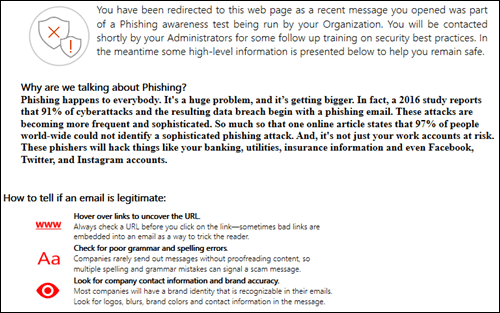
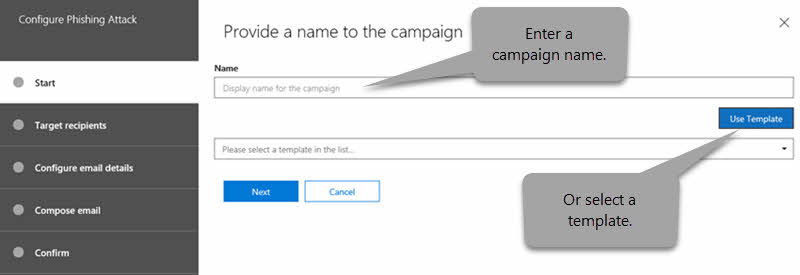
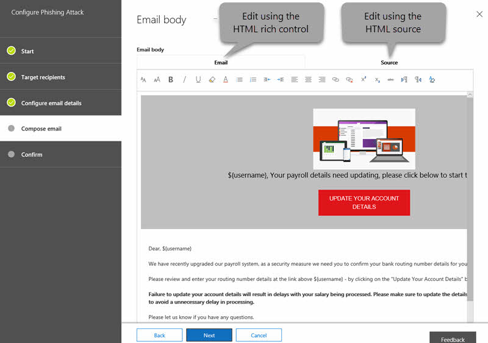

# Attack Simulator in Microsoft Defender for Office 365

[!INCLUDE [Microsoft 365 Defender rebranding](../includes/microsoft-defender-for-office.md)]

**Applies to**
 [Microsoft Defender for Office 365 plan 2](office-365-atp.md)

If your organization has Microsoft Defender for Office 365 Plan 2, which includes [Threat Investigation and Response capabilities](office-365-ti.md), you can use Attack Simulator in the Security & Compliance Center to run realistic attack scenarios in your organization. These simulated attacks can help you identify and find vulnerable users before a real attack impacts your bottom line. Read this article to learn more.

> [!NOTE]
>
> Attack Simulator as described in this article is now read-only and has been replaced by **Attack simulation training** in the **Email & collaboration** node in the [Microsoft 365 security center](https://security.microsoft.com). For more information, see [Get started using Attack simulation training](attack-simulation-training-get-started.md).
>
> The ability to launch new simulations from this version of Attack Simulator has been disabled. However, you can still access reports for up to 90 days from January 24, 2021.

## What do you need to know before you begin?

- To open the Security & Compliance Center, go to <https://protection.office.com/>. Attack simulator is available at **Threat management** \> **Attack simulator**. Go go directly to attack simulator, open <https://protection.office.com/attacksimulator>.

- For more information about the availability of Attack Simulator across different Microsoft 365 subscriptions, see [Microsoft Defender for Office 365 service description](/office365/servicedescriptions/office-365-advanced-threat-protection-service-description).

- You need to be a member of the **Organization Management** or **Security Administrator** role groups. For more information about role groups in the Security & Compliance Center, see [Permissions in the Security & Compliance Center](permissions-in-the-security-and-compliance-center.md).

- Your account needs to be configured for multi-factor authentication (MFA) to create and manage campaigns in Attack Simulator. For instructions, see [Set up multi-factor authentication](../../admin/security-and-compliance/set-up-multi-factor-authentication.md).

- Attack Simulator only works on cloud-based mailboxes.

- Phishing campaigns will collect and process events for 30 days. Historical campaign data will be available for up to 90 days after you launch the campaign.

- Attack simulation and training related data is stored with other customer data for Microsoft 365 services. For more information see [Microsoft 365 data locations](../../enterprise/o365-data-locations.md).

- There are no corresponding PowerShell cmdlets for Attack Simulator.

## Spear phishing campaigns

*Phishing* is a generic term for email attacks that try to steal sensitive information in messages that appear to be from legitimate or trusted senders. *Spear phishing* is a targeted phishing attack that uses focused and customized content that's specifically tailored to the targeted recipients (typically, after reconnaissance on the recipients by the attacker).

In Attack Simulator, two different types of spear phishing campaigns are available:

- **Spear phishing (credentials harvest)**: The attack tries to convince the recipients to click a URL in the message. If they click the link, they're asked to enter their credentials. If they do, they're taken to one of the following locations:

  - A default page that explains that this was a just a test, and gives tips for recognizing phishing messages.

    

  - A custom page (URL) that you specify.

- **Spear phishing (attachment)**: The attack tries to convince the recipients to open a .docx or .pdf attachment in the message. The attachment contains the same content from the default phishing link, but the first sentence starts with "\<Display Name\>, you are seeing this message as a recent email message you opened...".

> [!NOTE]
> Currently, spear phishing campaigns in Attack Simulator don't expire.

### Create a spear phishing campaign

An important part of any spear phishing campaign is the look and feel of the email message that's sent to the targeted recipients. To create and configure the email message, you have these options:

- **Use a built-in email template**: Two built-in templates are available: **Prize Giveaway** and **Payroll Update**. You can further customize some, all, or none of the email properties from the template when you create and launch the campaign.

- **Create a reusable email template**: After you create and save the email template, you can use it again in future spear phishing campaigns. You can further customize some, all, or none of the email properties from the template when you create and launch the campaign.

- **Create the email message in the wizard**: You can create the email message directly in the wizard as you create and launch the spear phishing campaign.

#### Step 1 (Optional): Create a custom email template

If you're going to use one of the built-in templates or create the email message directly in the wizard, you can skip this step.

1. In the Security & Compliance Center, go to **Threat management** \> **Attack simulator**.

2. On the **Simulate attacks** page, in either the **Spear Phishing (Credentials Harvest)** or **Spear Phishing (Attachment)** sections, click **Attack Details**.

   It doesn't matter where you create the template. The available options in the template are the same for both types of phishing attacks.

3. In the **Attack details** page that opens, in the **Phishing Templates** section, in the **Create Templates** area, click **New Template**.

4. The **Configure Phishing Template** wizard starts in a new flyout. In the **Start** step, enter a unique display name for the template, and then click **Next**.

5. In the **Configure email details** step, configure the following settings:

   - **From (Name)**: The display name that's used for the message sender.

   - **From (Email)**: The sender's email address.

   - **Phishing Login Server URL**: Click the drop down and select one of the available URLs from the list. This is the URL that users will be tempted to click. The choices are:

     - <http://portal.docdeliveryapp.com>
     - <http://portal.docdeliveryapp.net>
     - <http://portal.docstoreinternal.com>
     - <http://portal.docstoreinternal.net>
     - <http://portal.hardwarecheck.net>
     - <http://portal.hrsupportint.com>
     - <http://portal.payrolltooling.com>
     - <http://portal.payrolltooling.net>
     - <http://portal.prizegiveaway.net>
     - <http://portal.prizesforall.com>
     - <http://portal.salarytoolint.com>
     - <http://portal.salarytoolint.net>

     > [!NOTE]
     >
     > A URL reputation service might identify one or more of these URLs as unsafe. Check the availability of the URL in your supported web browsers before you use the URL in a phishing campaign.

   - **Custom Landing Page URL**: Enter an optional landing page where users are taken if they click the phishing link and enter their credentials. This link replaces the default landing page. For example, if you have internal awareness training, you can specify that URL here.

   - **Category**: Currently, this setting isn't used (anything you enter is ignored).

   - **Subject**: The **Subject** field of the email message.

   When you're finished, click **Next**.

6. In the **Compose email** step, create the message body of the email message. You can use the **Email** tab (a rich HTML editor) or the **Source** tab (raw HTML code).

   The HTML formatting can be as simple or complex as you need it to be. You can insert images and text to enhance the believability of the message in the recipient's email client.

   - `${username}` inserts the recipient's name.

   - `${loginserverurl}` inserts the **Phishing Login Server URL** value from the previous step.

   When you're finished, click **Next**.

7. In the **Confirm** step, click **Finish**.

#### Step 2: Create and launch the spear phishing campaign

1. In the Security & Compliance Center, go to **Threat management** \> **Attack simulator**.

2. On the **Simulate attacks** page, make one of the following selections based on the type of campaign you want to create:

   - In the **Spear Phishing (Credentials Harvest)** section, click **Launch Attack** or click **Attack Details** \> **Launch Attack**.

   - In the **Spear Phishing (Attachment)** section, click **Launch Attack** or click **Attack Details** \> **Launch Attack**.

3. The **Configure Phishing Attack** wizard starts in a new flyout. In the **Start** step, do one of the following steps:

   - In the **Name** box, enter a unique display name for the campaign. Don't click **Use Template**, because you'll create the email message later in the wizard.

   - Click **Use Template** and select a built-in or custom email template. After you select the template, the **Name** box is automatically filled based on the template, but you can change the name.

   > [!div class="mx-imgBorder"]
   > 

   When you're finished, click **Next**.

4. In the **Target recipients** step, do one of the following steps:

   - Click **Address Book** to select the recipients (users or groups) for the campaign. Each targeted recipient must have an Exchange Online mailbox. If you click **Filter** and **Apply** without entering a search criteria, all recipients are returned and added to the campaign.

   - Click **Import** then **File Import** to import a comma-separated value (CSV) or line-separated file of email addresses. Each line must contain the recipient's email address.

   When you're finished, click **Next**.

5. In the **Configure email details** step, configure the following settings:

   If you selected a template in the **Start** step, most of these values are already configured, but you can change them.

   - **From (Name)**: The display name that's used for the message sender.

   - **From (Email)**: The sender's email address. You can enter a real or fake email address from your organization's email domain, or you can enter a real or fake external email address. A valid sender email address from your organization will actually resolve in the recipient's email client.

   - **Phishing Login Server URL**: Click the drop down and select one of the available URLs from the list. This is the URL that users will be tempted to click. The choices are:

     - <http://portal.docdeliveryapp.com>
     - <http://portal.docdeliveryapp.net>
     - <http://portal.docstoreinternal.com>
     - <http://portal.docstoreinternal.net>
     - <http://portal.hardwarecheck.net>
     - <http://portal.hrsupportint.com>
     - <http://portal.payrolltooling.com>
     - <http://portal.payrolltooling.net>
     - <http://portal.prizegiveaway.net>
     - <http://portal.prizesforall.com>
     - <http://portal.salarytoolint.com>
     - <http://portal.salarytoolint.net>

     > [!NOTE]
     >
     > - All of the URLs are intentionally http, not https.
     >
     > - A URL reputation service might identify one or more of these URLs as unsafe. Check the availability of the URL in your supported web browsers before you use the URL in a phishing campaign.
     >
     > - You are required to select a URL. For **Spear Phishing (Attachment)** campaigns, you can remove the link from the body of the message in the next step (otherwise, the message will contain both a link **and** an attachment).

   - **Attachment Type**: This setting is only available in **Spear Phishing (Attachment)** campaigns. Click the drop down and select **.DOCX** or **.PDF** from the list.

   - **Attachment Name**: This setting is only available in **Spear Phishing (Attachment)** campaigns. Enter a filename for the .docx or .pdf attachment.

   - **Custom Landing Page URL**: Enter an optional landing page where users are taken if they click the phishing link and enter their credentials. This link replaces the default landing page. For example, if you have internal awareness training, you can specify that URL here.

   - **Subject**: The **Subject** field of the email message.

   When you're finished, click **Next**.

6. In the **Compose email** step, create the message body of the email message. If you selected a template in the **Start** step, the message body is already configured, but you can customize it. You can use the **Email** tab (a rich HTML editor) or the **Source** tab (raw HTML code).

   The HTML formatting can be as simple or complex as you need it to be. You can insert images and text to enhance the believability of the message in the recipient's email client.

   - `${username}` inserts the recipient's name.

   - `${loginserverurl}` inserts the **Phishing Login Server URL** value.

   For **Spear Phishing (Attachment)** campaigns, you should remove the link from the body of the message (otherwise, the message will contain both a link **and** an attachment, and link clicks aren't tracked in an attachment campaign).

   > [!div class="mx-imgBorder"]
   > 

   When you're finished, click **Next**.

7. In the **Confirm** step, click **Finish** to launch the campaign. The phishing message is delivered to the targeted recipients.

## Password attack campaigns

A *password attack* tries to guess passwords for user accounts in an organization, typically after the attacker has identified one or more valid user accounts.

In Attack Simulator, two different types of password attack campaigns are available for you to test the complexity of your users' passwords:

- **Brute force password (dictionary attack)**: A *brute force* or *dictionary* attack uses a large dictionary file of passwords on a user account with the hope that one of them will work (many passwords against one account). Incorrect password lock-outs help deter brute force password attacks.

  For the dictionary attack, you can specify one or many passwords to try (manually entered or in an uploaded file), and you can specify one or many users.

- **Password spray attack**: A *password spray* attack uses the same carefully considered password against a list of user accounts (one password against many accounts). Password spray attacks are harder to detect than brute force password attacks (the probability of success increases when an attacker tries one password across dozens or hundreds of accounts without the risk of tripping the user's incorrect password lock-out).

  For the password spray attack, you can only specify one password to try, and you can specify one or many users.

> [!NOTE]
> The password attacks in Attack Simulator pass username and password Basic auth requests to an endpoint, so they also work with other authentication methods (AD FS, password hash sync, pass-through, PingFederate, etc.). For users that have MFA enabled, even if the password attack tries their actual password, the attempt will always register as a failure (in other words, MFA users will never appear in the **Successful attempts** count of the campaign). This is the expected result. MFA is a primary method to help protect against password attacks.

### Create and launch a password attack campaign

1. In the Security & Compliance Center, go to **Threat management** \> **Attack simulator**.

2. On the **Simulate attacks** page, make one of the following selections based on the type of campaign you want to create:

   - In the **Brute Force Password (Dictionary Attack)** section, click **Launch Attack** or click **Attack Details** \> **Launch Attack**.

   - in the **Password spray attack** section, click **Launch Attack** or click **Attack Details** \> **Launch Attack**.

3. The **Configure Password Attack** wizard starts in a new flyout. In the **Start** step, enter a unique display name for the campaign, and then click **Next**.

4. In the **Target users** step, do one of the following steps:

   - Click **Address Book** to select the recipients (users or groups) for the campaign. Each targeted recipient must have an Exchange Online mailbox. If you click **Filter** and **Apply** without entering a search criteria, all recipients are returned and added to the campaign.

   - Click **Import** then **File Import** to import a comma-separated value (CSV) or line-separated file of email addresses. Each line must contain the recipient's email address.

   When you're finished, click **Next**.

5. In the **Choose attack settings** step, choose what to do based on the campaign type:

   - **Brute Force Password (Dictionary Attack)**: Do either of the following steps:

     - **Enter passwords manually**: In the **Press enter to add a password** box, type a password and then press ENTER. Repeat this step as many times as necessary.

     - **Upload passwords from a dictionary file**: Click **Upload** to import an existing text file that contains one password on each line and a blank last line. The text file must be 10 MB or less in size, and can't contain more than 30000 passwords.

   - **Password spray attack**: In **The password(s) to use in the attack** box, enter one password.

   When you're finished, click **Next**.

6. In the **Confirm** step, click **Finish** to launch the campaign. The passwords you specified are tried on users you specified.

## View campaign results

After you launch a campaign, you can check the progress and results on the main **Simulate attacks** page.

Active campaigns will show a status bar, a completed percentage value and "(completed users) of (total users)" count. Clicking the **Refresh** button will update the progress of any active campaigns. You can also click **Terminate** to stop an active campaign.

When the campaign is finished, the status changes to **Attack completed**. You can view the results of the campaign by doing either of the following actions:

- On the main **Simulate attacks** page, click **View Report** under the name of the campaign.

- On the main **Simulate attacks** page, click **Attack Details** in the section for the type of attack. On the **Attack details** page that opens, select the campaign in the **Attack History** section.

Either of the previous actions will take you to a page named **Attack details**. The information that's available on this page for each type of campaign is described in the following sections.

### Spear Phishing (Credentials Harvest) campaign results

The following information is available on the **Attack details** page for each campaign:

- The duration (start date/time and end date/time) of the campaign.

- **Total users targeted**

- **Successful attempts**: The number of users who clicked the link **and** entered their credentials (*any* username and password value).

- **Overall Success Rate**: A percentage that's calculated by **Successful attempts** / **Total users targeted**.

- **Fastest Click**: How long it took the first user to click the link after you launched the campaign.

- **Average Click**: The sum of how long it took everyone to click the link divided by the number of users who clicked the link.

- **Click Success Rate**: A percentage that's calculated by (number of users who clicked the link) / **Total users targeted**.

- **Fastest Credentials**: How long it took the first user to enter their credentials after you launched the campaign.

- **Average Credentials**: The sum of how long it took everyone to enter their credentials divided by the number of users who entered their credentials.

- **Credential Success Rate**: A percentage that's calculated by (number of users who entered their credentials) / **Total users targeted**.

- A bar graph that shows the **Link clicked** and **Credential supplied** numbers per day.

- A circle graph that shows the **Link clicked**, **Credential supplied**, and **None** percentages for the campaign.

- The **Compromised Users** section lists the details of the users who clicked the link:

  - The user's email address

  - The date/time when they clicked the link.

  - The client IP address.

  - Details about the user's version of Windows and web browser.

  You can click **Export** to export the results to a CSV file.

### Spear Phishing (Attachment) campaign results

The following information is available on the **Attack details** page for each campaign:

- The duration (start date/time and end date/time) of the campaign.

- **Total users targeted**

- **Successful attempts**: The number of users who opened or downloaded and opened the attachment (preview doesn't count).

- **Overall Success Rate**: A percentage that's calculated by **Successful attempts** / **Total users targeted**.

- **Fastest attachment open time**: How long it took the first user to open the attachment after you launched the campaign.

- **Average attachment open time**: The sum of how long it took everyone to open the attachment divided by the number of users who opened the attachment.

- **Attachment open success rate**: A percentage that's calculated by (number of users who opened the attachment) / **Total users targeted**.

### Brute Force Password (Dictionary Attack) campaign results

The following information is available on the **Attack details** page for each campaign:

- The duration (start date/time and end date/time) of the campaign.

- **Total users targeted**

- **Successful attempts**: The number of users who were found to be using one of the specified passwords.

- **Overall Success Rate**: A percentage that's calculated by **Successful attempts** / **Total users targeted**.

- The **Compromised Users** section lists the email addresses of the affected users. You can click **Export** to export the results to a CSV file.

### Password spray attack campaign results

The following information is available on the **Attack details** page for each campaign:

- The duration (start date/time and end date/time) of the campaign.

- **Total users targeted**

- **Successful attempts**: The number of users who were found to be using the specified password.

- **Overall Success Rate**: A percentage that's calculated by **Successful attempts** / **Total users targeted**.