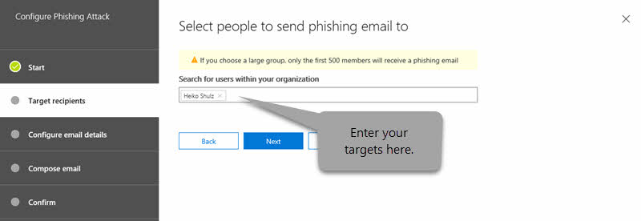

# Attack Simulator in Office 365

**Summary** If you are an Office 365 global administrator or a security administrator and your organization has Office 365 Advanced Threat Protection Plan 2, which includes [Threat Investigation and Response capabilities](office-365-ti.md), you can use Attack Simulator to run realistic attack scenarios in your organization. This can help you identify and find vulnerable users before a real attack impacts your bottom line. Read this article to learn more.

## The Attacks

Three kinds of attack simulations are currently available:

- [Display name spear-phishing attack](#display-name-spear-phishing-attack)

- [Password-spray attack](#password-spray-attack)

- [Brute-force password attack](#brute-force-password-attack)

For an attack to be successfully launched, make sure that the account you are using to run simulated attacks is using multi-factor authentication. In addition, you must be an Office 365 global administrator or a security administrator. (To learn more about roles and permissions, see [Permissions in the Office 365 Security & Compliance Center](permissions-in-the-security-and-compliance-center.md).)

To access Attack Simulator, in the Security &amp; Compliance Center, choose **Threat management** \> **Attack simulator**.

## Before you begin...

Make sure that you and your organization meet the following requirements for Attack Simulator:

- Your organization's email is hosted in Exchange Online. (Attack Simulator is not available for on-premises email servers.)

- You are an Office 365 global administrator or security administrator

- [Multi-factor authentication/Conditional Access](https://docs.microsoft.com/office365/admin/security-and-compliance/set-up-multi-factor-authentication) is turned on, for at least the Office 365 global administrator account and security administrators who will be using Attack Simulator. (Ideally, multi-factor authentication/conditional access is turned on for all users in your organization.)

- Your organization has [Office 365 Advanced Threat Protection Plan 2](office-365-atp.md), with Attack Simulator visible in the Security &amp; Compliance Center (go to **Threat management** \> **Attack simulator**)

    

## Display name spear-phishing attack

Phishing is a generic term for a broad suite of attacks classed as a social engineering style attack. This attack is focused on spear phishing, a more targeted attack that is aimed at a specific group of individuals or an organization. Typically, a customized attack with some reconnaissance performed and using a display name that will generate trust in the recipient, such as an email message that looks like it came from an executive within your organization.

This attack focuses on letting you manipulate who the message appears to have originated from by changing the display name and source address. When spear-phishing attacks are successful, cyberattackers gain access to users' credentials.

### To simulate a spear-phishing attack

You can craft the rich HTML editor directly in the **Email body** field itself or work with HTML source.

1. In the [Security &amp; Compliance Center](https://protection.office.com), choose **Threat management** \> **Attack simulator**.

2. Specify a meaningful campaign name for the attack or select a template.

   

3. Specify the target recipients. This can be individuals or groups in your organization. Each targeted recipient must have an Exchange Online Mailbox in order for the attack to be successful.

   

4. Configure the Phishing email details.

   

   The HTML formatting can be as complex or basic as your campaign needs. As the email format is HTML, you can insert images and text to enhance believability. You have control on what the received message will look like in the receiving email client.

5. Specify text for the **From (Name)** field. This is the field that shows in the **Display Name** in the receiving email client.

6. Specify text or the **From** field. This is the field that shows as the email address of the sender in the receiving email client.

   You can enter an existing email namespace within your organization (doing this will make the email address actually resolve in the receiving client, facilitating a very high trust model), or you can enter an external email address. The email address that you specify does not have to actually exist, but it does need to follow the format of a valid SMTP address, such as `user@domainname.extension`.

7. Using the drop-down selector, select a Phishing Login server URL that reflects the type of content you will have within your attack. Several themed URLs are provided for you to choose from, such as document delivery, technical, payroll etc. This is effectively the URL that targeted users are asked to click.

8. Specify a custom landing page URL. Using this will redirect users to a URL you specify at the end of a successful attack. If you have internal awareness training, for example, you can specify that here.

9. Specify text for the **Subject** field. This is the field that shows as the **Subject Name** in the receiving email client.

10. Compose the **Email body** that the target will receive.

    `${username}` inserts the targets name into the Email body.

    `${loginserverurl}` inserts the URL we want target users to click

11. Choose **Next,** then **Finish** to launch the attack. The spear phishing email message is delivered to your target recipients' mailboxes.

## Password-spray attack

A password spray attack against an organization is typically used after a bad actor has successfully acquired a list of valid users from the tenant. The bad actor knows about common passwords that people use. This is a widely used attack, as it is a cheap attack to run, and harder to detect than brute force approaches.

This attack focuses on letting you specify a common password against a large target base of users.

### To simulate a password-spray attack

1. In the [Security &amp; Compliance Center](https://protection.office.com), choose **Threat management** \> **Attack simulator**.

2. Specify a meaningful campaign name for the attack.

3. Specify the target recipients. This can be individuals or groups in your organization. A targeted recipient must have an Exchange Online mailbox in order for the attack to be successful.

4. Specify a password to use for the attack. For example, one common, relevant password you could try is `Summer2019`. Another might be `Fall2019`, or `Password1`.

5. Choose **Finish** to launch the attack.

## Brute-force password attack

A brute-force password attack against an organization is typically used after a bad actor has successfully acquired a list of key users from the tenant. This attack focuses on trying a set of passwords on a single user's account.

### To simulate a brute-force password attack

1. In the [Security &amp; Compliance Center](https://protection.office.com), choose **Threat management** \> **Attack simulator**.

2. Specify a meaningful campaign name for the attack.

3. Specify the target recipient. A targeted recipient must have an Exchange Online mailbox in order for the attack to be successful.

4. Specify a set of passwords to use for the attack. To do this, you can use a text (.txt) file for your list of passwords. The text file cannot exceed 10 MB in file size. Use one password per line, and make sure to include a hard return after the last password in your list.

5. Choose **Finish** to launch the attack.

## New features in Attack Simulator

New features have recently been added to Attack Simulator. These include:

- Advanced reporting capabilities. The ability to see data such as the fastest (or slowest) time to open an attack simulation email message, the fastest (or slowest) time to click a link in the message, and more visualizations.

- Email template editor. The ability to create a custom, reusable email template's that you can use for future attack simulations.

- CSV Recipient Import. The ability to use a .csv file to import your target recipient list instead of using the address book picker.

More new features are coming soon to Attack Simulator. These include:

- Attachment payload phishing simulation. The ability to use an attachment as the payload for phishing simulation in place of a URL.

Visit the [Microsoft 365 Roadmap](https://www.microsoft.com/microsoft-365/roadmap) to see what's in development, what's rolling out, and what's already launched.

## See also

[Office 365 Advanced Threat Protection Service Description](https://docs.microsoft.com/office365/servicedescriptions/office-365-advanced-threat-protection-service-description)

[Office 365 Advanced Threat Protection](office-365-atp.md)
