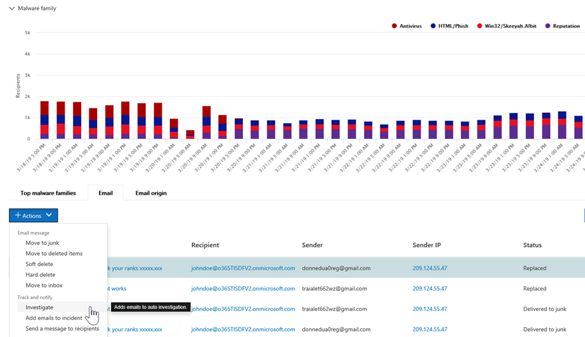

# Automated Investigation and Response (AIR) in Office 365

Automated Investigation and Response (AIR) capabilities enable you to run automated investigation processes in response to well known threats that exist today. AIR can help your security operations team operate more efficiently and effectively.
- To get an overview how AIR works, use this article.
- To get started using AIR, see [Automatically investigate and respond to threats in Office 365](office-365-air.md).

> [!TIP]
> Do you have Microsoft 365 E5 or Microsoft 365 E3 together with Identity & Threat Protection? Consider trying [Microsoft Threat Protection](../mtp/microsoft-threat-protection.md).

## The overall flow of AIR

At a high level, the AIR flow works like this:

|Phase  |What's involved  |
|---------|---------|
|1     |An [alert](#alerts) is triggered by an Office event and a [security playbook](#security-playbooks) initiates an automated investigation for selected alerts.   Alternately, a security analyst can [start an automated investigation manually](#example-a-security-administrator-triggers-an-investigation-from-threat-explorer), from an email from [Explorer](threat-explorer.md).        |
|2     |While an automated investigation runs, it gathers additional data about the email and the entities related to that email – files, URLs, and recipients.  The investigation's scope can increase, as new related alerts are triggered.         |
|3     |During and after an automated investigation, [details and results](#investigation-graph) are available to view. Results include [recommended actions](#recommended-actions) that can be taken to respond and remediate any threats that were found. In addition, an [playbook log](#playbook-log) is available that tracks all investigation activity.  If your organization is using a custom reporting solution or a third-party solution, you can [use the Office 365 Management Activity API](office-365-air.md#use-the-office-365-management-activity-api-for-custom-or-third-party-reporting-solutions) to view information about automated investigations and threats.         |
|4     |Your security operations team reviews the investigation results and recommendations, and approves remediation actions. In Office 365, remediation actions are taken only upon approval by your organization's security team.         |

The following sections provide more details about AIR, including details about alerts, security playbooks, and investigation details. In addition, two examples of how AIR works are included in this article. To get started using AIR, see [Automatically investigate and respond to threats in Office 365](office-365-air.md).

## Alerts

[Alerts](../../compliance/alert-policies.md#viewing-alerts) represent triggers for security operations team workflows for incident response. Prioritizing the right set of alerts for investigation, while making sure no threats are unaddressed is challenging. When investigations into alerts are performed manually, Security Operations teams must hunt and correlate entities (such as content, devices and users) at risk from threats. Such tasks and workflows can be very time consuming and involve multiple tools and systems. With AIR, investigation and response for Office 365 security events are automated by having key security and threat management alerts trigger security response playbooks automatically. 

Currently for AIR, alerts generated from the following kinds of alert policies are auto-investigated:  

- A potentially malicious URL click was detected
- Email reported by user as phish*
- Email messages containing malware removed after delivery*
- Email messages containing phish URLs removed after delivery*
- Suspicious email sending patterns detected#
- User restricted from sending email#

> [!NOTE]
> The alerts marked with an asterisk (*) are assigned an *Informational* severity in the respective alert policies within the Security & Compliance Center, with email notifications turned off. Email notifications can be turned on through [Alert policy configuration](../../compliance/alert-policies.md#alert-policy-settings). Alerts marked with a hash (#) are generally available alerts associated with public preview playbooks.

To view alerts, in the Security & Compliance Center, choose **Alerts** > **View alerts**. Select an alert to view its details, and from there, use the **View investigation** link to go to the corresponding [investigation](#investigation-graph).  

> [!NOTE]
> Informational alerts are hidden in the alert view by default. To see them, change the alert filtering to include informational alerts.

If your organization manages your security alerts through an alert management system, service management system, or Security Information and Event Management (SIEM) system, you can send Office 365 alerts to that system via either email notification or via the [Office 365 Management Activity API](https://docs.microsoft.com/office/office-365-management-api/office-365-management-activity-api-reference). The investigation alert notifications via email or API include links to access the alerts in the Security & Compliance Center, enabling the assigned security administrator to navigate quickly to the investigation.

 

## Security playbooks

Security playbooks are back-end policies that are at the heart of automation in Office Advanced Threat Protection and Microsoft Threat Protection. The security playbooks provided in AIR are based on common real-world security scenarios and developed based on feedback from Security Operations teams. A security playbook is launched automatically when specific alerts are triggered within your organization. Once the alert triggers, the associated playbook is run by the Automated Investigation and Response (AIR) system. The investigation steps through analysis of the alert based on that particular alert's playbook, looking at all the associated metadata (including email messages, users, subjects, senders, etc.). Based on the investigation playbook's findings, AIR recommends a set of actions that your organization's security team can take to control and mitigate the threat. 

The security playbooks you'll get with AIR are designed to tackle the most frequent threats that organizations encounter today with email. They're based on input from Security Operations and Incident Response teams, including those who help defend Microsoft and our customers' assets.

### Security playbooks are rolling out in phases

As part of AIR, security playbooks are rolling out in phases. Phase 1 is now generally available and includes several playbooks that provide recommendations for actions that security administrators can review and approve:
- User-reported phish message
- URL click verdict change
- Malware detected post-delivery (Malware ZAP)
- Phish detected post-delivery ZAP (Phish ZAP)

Phase 1 also includes support for administrator triggered e-mail investigations (using [Threat Explorer](threat-explorer.md)).

Phase 2 is now progress with the following playbooks in **public preview**, providing recommendations for actions and aiding security administrators in investigating issues:
- User reported as compromised (public preview)

Further playbooks will be released as they are completed. Visit the [Microsoft 365 Roadmap](https://www.microsoft.com/microsoft-365/roadmap) to see what else is planned and coming soon.

### Playbooks include investigation and recommendations

In AIR, each security playbook includes: 
- a root investigation of an email's entities (files, URLs, recipients, IP addresses, etc.),
- further hunting for similar emails received by the organization 
- steps taken to identify and correlate other potential threats, and 
- recommended threat remediation actions.

Each high-level step includes a number of substeps that are executed to provide a deep, detailed, and exhaustive response to threats.

## Automated investigations

The automated investigations page shows your organization's investigations and their current states.

 
  
You can:
- Navigate directly to an investigation (select an **Investigation ID**).
- Apply filters. Choose from **Investigation Type**, **Time range**, **Status**, or a combination of these.
- Export the data to a .csv file.

The investigation status indicates the progress of the analysis and actions. As the investigation runs, status changes to indicate whether threats were found, and whether actions have been approved. 

|Status  |What it means  |
|---------|---------|
|Starting | The investigation is queued to begin soon |
|Running | The investigation has started and is conducting its analysis |
|No Threats Found | The investigation has completed its analysis and no threats were found |
|Terminated By System | The investigation was not closed and expired after 7 days |
|Pending Action | The investigation found threats with actions recommended.  The investigation continues running after it's found initial threats and recommended actions, so you should check the log before approving actions to see if analyzers are still in-progress. |
|Threats Found | The investigation found threats, but the threats do not have actions available within AIR.  These are user actions where there is no direction AIR action yet. |
|Remediated | The investigation finished and was fully remediated (all actions were approved) |
|Partially Remediated | The investigation finished and some of the recommended actions were approved |
|Terminated By User | An admin terminated the investigation |
|Failed | An error occurred during the investigation that prevented it from reaching a conclusion on threats |
|Queued By Throttling | The investigation is waiting for analysis due to system processing limitations (to protect service performance) |
|Terminated By Throttling | The investigation could not be completed in sufficient time due to investigation volume and system processing limitations. You can retrigger the investigation by selecting the email in Explorer and selecting the Investigate action. |

### Investigation graph

When you open a specific investigation, you see the investigation graph page. This page shows all the different entities: email messages, users (and their activities), and devices that were automatically investigated as part of the alert that was triggered.

You can:
- Get a visual overview of the current investigation.
- View a summary of the investigation duration.
- Select a node in the visualization to view details for that node.
- Select a tab across the top to view details for that tab.

### Alert investigation

On the **Alerts** tab for an investigation, you can see alerts relevant to the investigation. Details include the alert that triggered the investigation and other correlated alerts, such as risky sign-in, DLP policy violations, etc., that are correlated to the investigation. From this page, a security analyst can also view additional details on individual alerts.

You can:
- Get a visual overview of the current triggering alert and any associated alerts.
- Select an alert in the list to open a fly-out page that shows full alert details.

### Email investigation

On the **Email** tab for an investigation, you can see the original emails and the clusters of similar email identified as part of the investigation. 

Given the sheer volume of email that users in an organization send and receive, plus the multi-user nature of email communications and attacks, the process of 
- clustering email messages based on similar attributes from a message header, body, URL, and attachments; 
- separating malicious email from the good email; and 
- taking action on malicious email messages 

can take significant time. AIR now automates this process, saving your organization's security team time and effort. 

Two different types of email clusters may be identified during the email analysis step: similarity clusters and indicator clusters. 
- Similarity clusters are email messages identified by hunting for emails with similar sender and content attributes. These clusters are evaluated for malicious content based on the original detection findings. Email clusters that contain enough malicious email detections are considered malicious.
- Indicator clusters are email messages that are identified by hunting for the same indicator entity (file hash or URL) from the original email. When the original file/URL entity is identified as malicious, AIR applies the indicator verdict to the entire cluster of email messages containing that entity. A file identified as malware means that the cluster of email messages containing that file are treated as malware email messages.

The goal of clustering is to hunt and find other related email messages that are sent by the same sender as part of an attack or a campaign.  In some cases, legitimate email may trigger an investigation (e.g. a user reports a marketing email).  In these scenarios, the email clustering should identify that email clusters are not malicious – when it appropriately does so, it will **not** indicate a threat nor will it recommend email removal.

The **Email** tab also shows email items related to the investigation, such as the user-reported email details, the original email reported, the email message(s) zapped due to malware/phish, etc.

The email count identified on the email tab currently represents the sum total of all email messages shown on the **Email** tab. Because email messages are present in multiple clusters, the actual total count of email messages identified (and affected by remediation actions) is the count of unique email messages present across all of the clusters and original recipients' email messages. 

Both Explorer and AIR count email messages on a per recipient basis, since the security verdicts, actions, and delivery locations vary on a per recipient basis. Thus an original email sent to three users count as a total of three email messages instead of one email. Note there may be cases where an email gets counted two or more times, since the email may have multiple actions on it and there may be multiple copies of the email once all actions occur. For example, a malware email that is detected at delivery may result in both a blocked (quarantined) email and a replaced email (threat file replaced with a warning file, then delivered to user's mailbox). Since there are literally two copies of the email in the system, both might be counted in cluster counts. 

Email counts are calculated at the time of the investigation and some counts are recalculated when you open investigation flyouts (based on an underlying query). The email counts shown for the email clusters on the email tab and the email quantity value shown on cluster flyout are calculated at the time of investigation and do not change. The email count shown at the bottom of the email tab of the email cluster flyout and the count of email messages shown in Explorer reflect email messages received after the investigation's initial analysis. Thus an email cluster that shows an original quantity of 10 email messages would show an email list total of 15 when five more email messages arrive between the investigation analysis phase and when the admin reviews the investigation.  Likewise old investigations may start having bigger counts than Explorer queries show, since ATP P2 expires data after 7 days for trials and 30 days for paid licenses.  Showing both count historical and current counts in different views is done to indicate the email impact at the time of investigation and the current impact up until the time that remediation is run.

As an example, consider the following scenario. The first cluster of three email messages were deemed to be phish. Another cluster of similar messages with the same IP and subject was found and considered malicious, as some of them were identified as phish during initial detection. 

You can:
- Get a visual overview of the current clustering results and threats found.
- Click a cluster entity or a threat list to open a fly-out page that shows the full alert details.
- Further investigate the email cluster by clicking the 'Open in Explorer' link at the top of the 'Email cluster details' tab

> [!NOTE]
> In the context of email, you may see a volume anomaly threat surface as part of the investigation. A volume anomaly indicates a spike in similar email messages around the investigation event time compared to earlier timeframes. This spike in email traffic with similar characteristics (e.g. subject and sender domain, body similarity and sender IP) is typical of the start of email campaigns or attacks. However, bulk, spam, and legitimate email campaigns commonly share these characteristics. Volume anomalies represent a potential threat, and accordingly could be less severe compared to malware or phish threats that are identified using anti-virus engines, detonation or malicious reputation.

### User investigation

On the **Users** tab, you can see all the users identified as part of the investigation. User accounts appear in the investigation when there is an event or indication that those user accounts might be affected or compromised.

For example, in the following image, AIR has identified indicators of compromise and anomalies based on a new inbox rule that was created. Additional details (evidence) of the investigation are available through detailed views within this tab. Indicators of compromise and anomalies may also include anomaly detections from [Microsoft Cloud App Security](https://docs.microsoft.com/cloud-app-security).

You can:
- Get a visual overview of identified user results and risks found.
- Select a user to open a fly-out page that shows the full alert details.

### Machine investigation

On the **Machines** tab, you can see all the machines identified as part of the investigation. 

As part of some playbooks, AIR correlates email threats to devices (e.g. Zapped malware). For example, an investigation passes a malicious file hash across to [Microsoft Defender ATP](https://docs.microsoft.com/windows/security/threat-protection/microsoft-defender-atp/microsoft-defender-advanced-threat-protection
) to investigate. This allows for automated investigation of relevant machines for your users, to help ensure that threats are addressed both in the cloud and across your endpoints. 

You can:
- Get a visual overview of the current machines and threats found.
- Select a machine to open a view that into the related [Microsoft Defender ATP investigations](https://docs.microsoft.com/windows/security/threat-protection/microsoft-defender-atp/automated-investigations) in the Microsoft Defender Security Center.

### Entity investigation

On the **Entities** tab, you can see the entities identified and analyzed as part of the investigation. 

Here, you can see the investigated entities and details of the types of entities, such as email messages, clusters, IP addresses, users, and more. You can also see how many entities were analyzed, and the threats that were associated with each. 

You can:
- Get a visual overview of the investigation entities and threats found.
- Select an entity to open a fly-out page that shows the related entity details.

### Playbook log

On the **Log** tab, you can see all the playbook steps that have occurred during the investigation. The log captures a complete inventory of all analyzers and actions completed by Office 365 auto-investigation capabilities as part of AIR. It provides a clear view of all the steps taken, including the action itself, a description, and the duration of the actual from start to finish. 

You can:
- Get see a visual overview of the playbook steps taken.
- Export the results to a CSV file.
- Filter the view.

|Analyzer | Description |
|-----|-----|
|DLP violations investigation |Investigate any violations detected by [Office 365 Data Loss Prevention](../../compliance/data-loss-prevention-policies.md) (DLP) |
|Email indicators extraction |Extract indicators from the header, body, and content of an email message for investigation |
|File Hash Reputation |Detect anomalies based on file hashes for users and machines in your organization |
|Mail cluster identification |Email cluster analysis based on header, body, content, and URLs |
|Mail cluster volume analysis |Email cluster analysis based on outbound mail flow volume patterns |
|Mail delegation investigation |Investigate mail delegation access for user mailboxes related to this investigation |
|Mail forwarding rules investigation |Investigate any mail forwarding rules for user mailboxes related to this investigation |
|Missed malware detected |Detect missed malware delivered to user's mailbox in your organization |
|On-demand detonation |On-demand detonation triggered for email messages, attachments, and URLs |
|Outbound mail anomaly investigation |Detect anomalies based on historical mail flow sending patterns for users in your organization |
|Outbound malware and spam anomaly investigation |Detect intra-org and outbound malware, phish, or spam originating from users in your organization |
|Sender domain investigation |On-demand check of domain reputation from the [Microsoft Intelligent Security Graph](https://www.microsoft.com/security/operations/intelligence) and external threat intelligence sources |
|Sender IP investigation | On-demand check of IP reputation from the [Microsoft Intelligent Security Graph](https://www.microsoft.com/security/operations/intelligence) and external threat intelligence sources |
|URL clicks investigation | Investigate clicks  from users protected by [Office 365 ATP Safe Links](atp-safe-links.md) in your organization |
|URL reputation investigation |On-demand check on URL reputation from the [Microsoft Intelligent Security Graph](https://www.microsoft.com/security/operations/intelligence) and external threat intelligence sources |
|User activity investigation |Analyze user activity anomalies in [Microsoft Cloud App Security](https://docs.microsoft.com/cloud-app-security/what-is-cloud-app-security) |
|User-reported emails indicators extraction |Extract indicators from the header, body, and content of [user-reported email](enable-the-report-message-add-in.md) for investigation |

### Recommended actions

On the **Actions** tab, you can see all the playbook actions that are recommended for remediation after the investigation has completed. 

Actions capture the steps Microsoft recommends you take at the end of an investigation. You can take remediation actions here by selecting one or more actions. Clicking **Approve** allows remediation to begin. (Appropriate permissions are needed - the 'Search And Purge' role is required to run actions from Explorer and AIR). For example, a Security Reader can view actions but not approve them. Note: You do not have to approve every action. If you do not agree with the recommended action or your organization does not choose certain types of actions, then you can choose to **Reject** the actions or simply ignore them and take no action. Approving and/or rejecting all actions lets the investigation fully close (status becomes remediated), while leaving some actions incomplete results in the investigation status changing to a partially remediated state.

You can:
- Get a visual overview of the playbook-recommended actions.
- Select a single action or multiple actions.
- Approve or reject recommended actions with comments.
- Export the results to a CSV file.
- Filter the view.

## Remediation actions

When an automated investigation is running or has completed, you will typically see one or more remediation actions. The following table lists possible remediation actions in Office 365 AIR.

|Action | Description |
|-----|-----|
|Block URL (time-of-click) |Protect against emails and documents that contain malicious URLs. This enables the blocking of malicious links and any related webpages via [Safe Links](atp-safe-links.md) when the user clicks a link in an existing Office file or in an older email message. |
|Soft delete email  |Soft delete specific email messages from a user's mailbox|
|Soft delete email clusters  |Soft delete malicious email messages matching a query from all users' mailboxes|
|Turn off external mail forwarding |Removes forwarding rule from a specific end user's mailbox|

## Example: A user-reported phish message launches an investigation playbook

When a user in your organization submits an email message and reports it to Microsoft by using the [Report Message add-in for Outlook or Outlook Web App](enable-the-report-message-add-in.md), the report is also sent to your system and is visible in Explorer in the User-reported view. This user-reported message now triggers a system-based informational alert, which automatically launches the investigation playbook.

During the root investigation phase, various aspects of the email are assessed. These include:
- A determination about what type of threat it might be;
- Who sent it;
- Where the email was sent from (sending infrastructure);
- Whether other instances of the email were delivered or blocked;
- An assessment from our analysts;
- Whether the email is associated with any known campaigns;
- and more.

After the root investigation is complete, the playbook provides a list of recommended actions to take on the original email and entities associated with it.
  
Next, several threat investigation and hunting steps are executed:

- Similar email messages are identified via email cluster searches.
- The signal is shared with other platforms, such as [Microsoft Defender ATP](https://docs.microsoft.com/windows/security/threat-protection/microsoft-defender-atp/microsoft-defender-advanced-threat-protection).
- A determination is made on whether any users have clicked through any malicious links in suspicious email messages.
- A check is done across Office 365 Exchange Online Protection ([EOP](exchange-online-protection-eop.md)) and Office 365 Advanced Threat Protection ([ATP](office-365-atp.md)) to see if there are any other similar messages reported by users.
- A check is done to see if a user has been compromised. This check leverages signals across Office 365, [Microsoft Cloud App Security](https://docs.microsoft.com/cloud-app-security), and [Azure Active Directory](https://docs.microsoft.com/azure/active-directory), correlating any related user activity anomalies. 

During the hunting phase, risks and threats are assigned to various hunting steps. 

Remediation is the final phase of the playbook. During this phase, remediation steps are taken, based on the investigation and hunting phases. 

## Example: A security administrator triggers an investigation from Threat Explorer

In addition to automatic investigations that are triggered by an alert, your organization's security operations team can trigger an automatic investigation from a view in [Threat Explorer](threat-explorer.md).

For example, suppose that you are viewing data in Explorer about user-reported messages. You can select an item in the list of results, and then click **Investigate** from the action menu (assuming you have appropriate remediation permissions).

As another example, suppose you are viewing data about email messages detected as containing malware, and there are several email messages detected as containing malware. You can select the **Email** tab, select one or more email messages, and then, on the **Actions** menu, select **Investigate**. 

Similar to playbooks triggered by an alert, automatic investigations that are triggered from a view in Explorer include a root investigation, steps to identify and correlate threats, and recommended actions to mitigate those threats.

## How to get AIR

Office 365 AIR is included in the following subscriptions:

- Microsoft 365 E5
- Office 365 E5
- Microsoft Threat Protection
- Office 365 Advanced Threat Protection Plan 2

If you don't have any of these subscriptions, [start a free trial](https://go.microsoft.com/fwlink/p/?LinkID=698279&culture=en-US&country=US).

To learn more about feature availability, visit the [Feature availability across Advanced Threat Protection (ATP) plans](https://docs.microsoft.com/office365/servicedescriptions/office-365-advanced-threat-protection-service-description#feature-availability-across-advanced-threat-protection-atp-plans).

## Required permissions to use AIR capabilities

Permissions are granted through certain roles, such as those that are described in the following table: 

|Task |Role(s) required |
|--|--|
|To set up AIR features |One of the following roles:  - **Global Administrator** - **Security Administrator**  These roles can be assigned in [Azure Active Directory](https://docs.microsoft.com/azure/active-directory/users-groups-roles/directory-assign-admin-roles) or in the [Office 365 Security & Compliance Center](https://docs.microsoft.com/microsoft-365/security/office-365-security/permissions-in-the-security-and-compliance-center). |
|To approve or reject recommended actions|One of the following roles, assigned in [Azure Active Directory](https://docs.microsoft.com/azure/active-directory/users-groups-roles/directory-assign-admin-roles) or in the [Office 365 Security & Compliance Center](https://docs.microsoft.com/microsoft-365/security/office-365-security/permissions-in-the-security-and-compliance-center)): - **Global Administrator**  - **Security Administrator** - **Security Reader**  --- and --- - **Search and Purge** (this role is assigned only in the [Office 365 Security & Compliance Center](https://docs.microsoft.com/microsoft-365/security/office-365-security/permissions-in-the-security-and-compliance-center). You might have to create a new role group there and add the Search and Purge role to that new role group.)

## Next steps

- [Get started using AIR in Office 365](office-365-air.md)
- [Learn about AIR in Microsoft Defender ATP](https://docs.microsoft.com/windows/security/threat-protection/microsoft-defender-atp/automated-investigations) 
- [Visit the Microsoft 365 Roadmap to see what's coming soon and rolling out](https://www.microsoft.com/microsoft-365/roadmap?filters=)

## See also

- [Microsoft Threat Protection](../mtp/microsoft-threat-protection.md)
- [Automated investigation and remediation (AIR) in Microsoft Threat Protection](../mtp/mtp-autoir.md)
