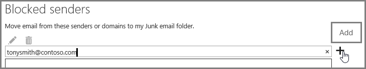

# Customize the Office 365 anti-spam filter with these settings

An Admin can use several Office 365 spam filter settings to help prevent email spam from being sent to a user inbox. The Office 365 spam filter will become better able to block email spam and prevent false negative messages if you use the options listed here. In this context, a false negative refers to email spam or junk messages that are getting sent to a user inbox.

## Block IP addresses with a connection filter

Customize your Office 365 spam filter by adding the sender IP address to the connection filter IP block list:

1. Obtain the headers for the message you want to block in your mail client such as Outlook or Outlook on the web (formerly known as Outlook Web App), as described in [View internet message headers in Outlook](https://support.office.com/article/cd039382-dc6e-4264-ac74-c048563d212c).

2. Search for the IP address following the CIP tag in the X-Forefront-Antispam-Report header using the [message header analyzer](https://testconnectivity.microsoft.com/?tabid=mha) or manually.

3. Add the IP address to the IP Block list by following the steps in "Use the EAC to edit the default connection filter policy" in [Configure the Connection Filter Policy](configure-the-connection-filter-policy.md).

### Block bulk mail with mail flow rules (transport rules) or the spam filter

Is the spam primarily bulk mail, for example, newsletters or promotions? You can customize the spam filter in Office 365 if you [Use mail flow rules to configure bulk email filtering](use-transport-rules-to-configure-bulk-email-filtering.md) or turn on the **Bulk mail** setting in your spam filter's [Advanced Spam Filter (ASF) settings in Office 365](advanced-spam-filtering-asf-options.md). In the Exchange admin center, get started by clicking **Protection** \> **Content filter** and then double click the filter policy you want to adjust. Click **Spam and bulk mail actions** to adjust the settings, as shown here.


### Block email spam using spam filter block lists

[Configure anti-spam policies in Office 365](configure-your-spam-filter-policies.md) to add the sender address to the blocked sender list or domain to the blocked domain list in the spam filter. Emails from a sender or domain on a spam filter block list will marked as spam.

## Email users can also help ensure that false negative and email spam is blocked with Office 365 spam filter

It will help your Office 365 anti-spam efforts to prevent false negatives and junk mail if you tell your users to add the spam sender address to their blocked sender list in [Outlook](https://support.office.com/article/5ae3ea8e-cf41-4fa0-b02a-3b96e21de089) or [Outlook on the web](https://support.office.com/article/db786e79-54e2-40cc-904f-d89d57b7f41d). In Outlook on the web, get started by clicking **Settings** \> **Options** \> **Block or allow**, and then adding the address to the **Blocked senders** list, as shown here.



> [!NOTE]
> For more detailed information about safe sender lists, see [Create safe sender lists in Office 365](create-safe-sender-lists-in-office-365.md).

## EOP-only customers: Set up directory synchronization

It will help you to avoid false negative email spam if you sync user settings with the service via directory synchronization to ensure that your blocked senders are respected. For more information, see "Use directory synchronization to manage mail users" in Manage mail users in EOP.

## EOP-only customers who are not using directory synchronization

The EOP service is designed to honor the user's safe and blocked senders, if the information has been shared with the service. If you are an EOP customer using Outlook, but do not have Directory Synchronization configured to sync your users to Office 365, you can still stop messages from being delivered to your users' inbox using blocked senders. However, you may have to set up some Exchange mail flow rules in the following situations:

- If a message goes through regular spam filtering through EOP and then is delivered to a local on-premises Exchange server, and EOP assigns a spam verdict of SCL 1-4 (non-spam), then your users' local blocked senders list will override the EOP spam filter verdict and deliver it to their junk email folder.

- If a message in EOP is assigned SCL -1 by an Exchange mail flow rule or because the IP address or domain is in your allow list, the SCL is propagated to the on-premises Exchange server using connectors. In this case, your user's blocked senders list will not be enforced. To change this, you can create a local mail flow rule that sets the SCL to 0. This will cause Outlook to enforce your user's local blocked senders list.

### To set up a mail flow rule to stop messages from being delivered to your users' inbox by using the blocked senders list

1. Open the Exchange Management Shell on your on-premises server. To learn how to open the Shell in your on-premises Exchange organization, see [Open the Exchange Management Shell](https://docs.microsoft.com/powershell/exchange/exchange-server/open-the-exchange-management-shell).

2. Run the following command to route content-filtered spam messages to the Junk Email folder in order to update the SCL on every message that was marked with SCL -1:

   ```powershell
   New-TransportRule "NameForRule" -HeaderContainsMessageHeader "X-Forefront-Antispam-Report" -HeaderContainsWords "SCL:-1" -SetSCL 0
   ```

   Because the SCL is 0 in your on-premises Exchange server, non-spam will be delivered to your users' inboxes but still allow for users' local blocked senders list to send them to junk email. If you are using spam quarantine in EOP, it is still possible that senders who are on your user's safe list will be identified as spam and sent to quarantine. If you are using the Junk Mail Folder in your local mailbox, however, this will allow delivery to the Inbox for safe senders.

> [!WARNING]
> If you use a mail flow rule to change the SCL value to 0 (or any value other than -1), then all of the Outlook junk mail options will apply to the message. This means that blocked and safe lists will be honored, but also means that messages that do not have addresses from the blocked or safe lists will potentially be marked as junk by the client side junk mail filter processing. If you want to have Outlook process the blocked and safe lists, but not use the client side junk mail filter, you must set the option to "No Automatic Filtering" in Outlook Junk Mail Options. "No Automatic Filtering" is the default option in the latest versions of Outlook, but you should confirm that the this setting is in place to ensure the client side junk mail filter is not applied to the messages. As an administrator, you can enforce disabling the Outlook Junk Email filtering by following the instructions in [Outlook: Policy setting to disable the Junk E-mail UI and filtering mechanism](https://support.microsoft.com/kb/2180568).

## See Also

<<<<<<< HEAD
[Microsoft Email Anti-Spam Protection](anti-spam-protection.md)

[Prevent false positive email marked as spam with a safelist or other techniques](prevent-email-from-being-marked-as-spam.md)
=======
[Office 365 Email Anti-Spam Protection](anti-spam-protection.md)
>>>>>>> cc1f3200bf63489c8c397aad316ee5a36d6c8d3d
