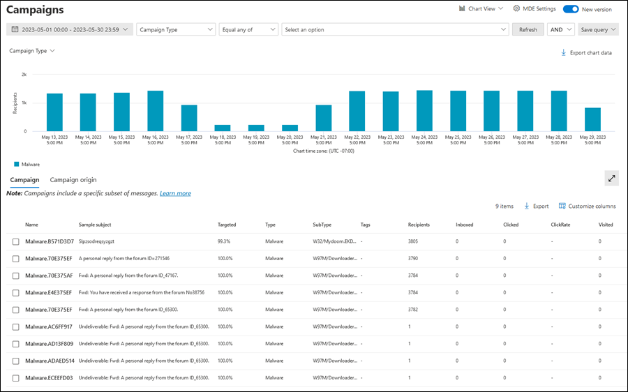
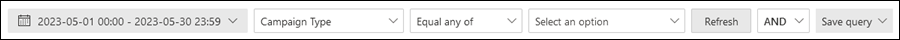
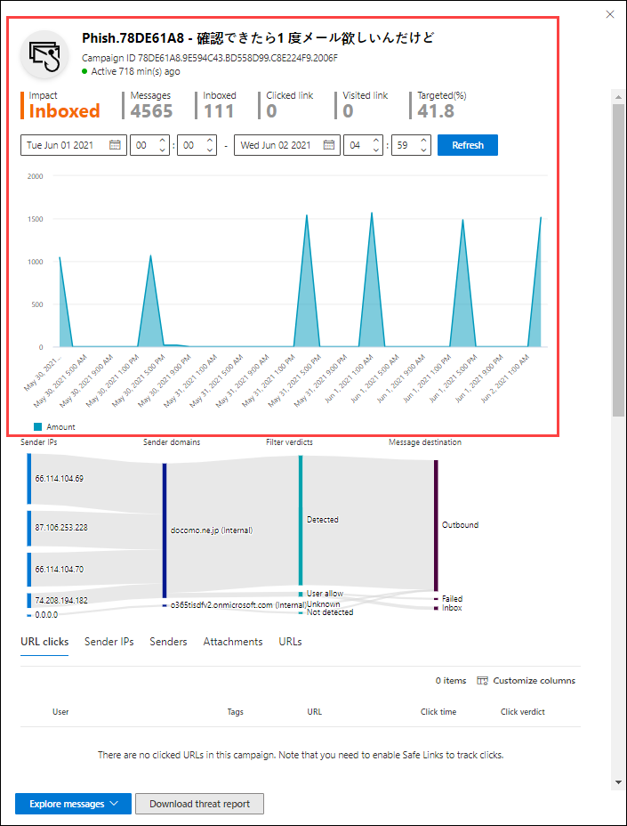
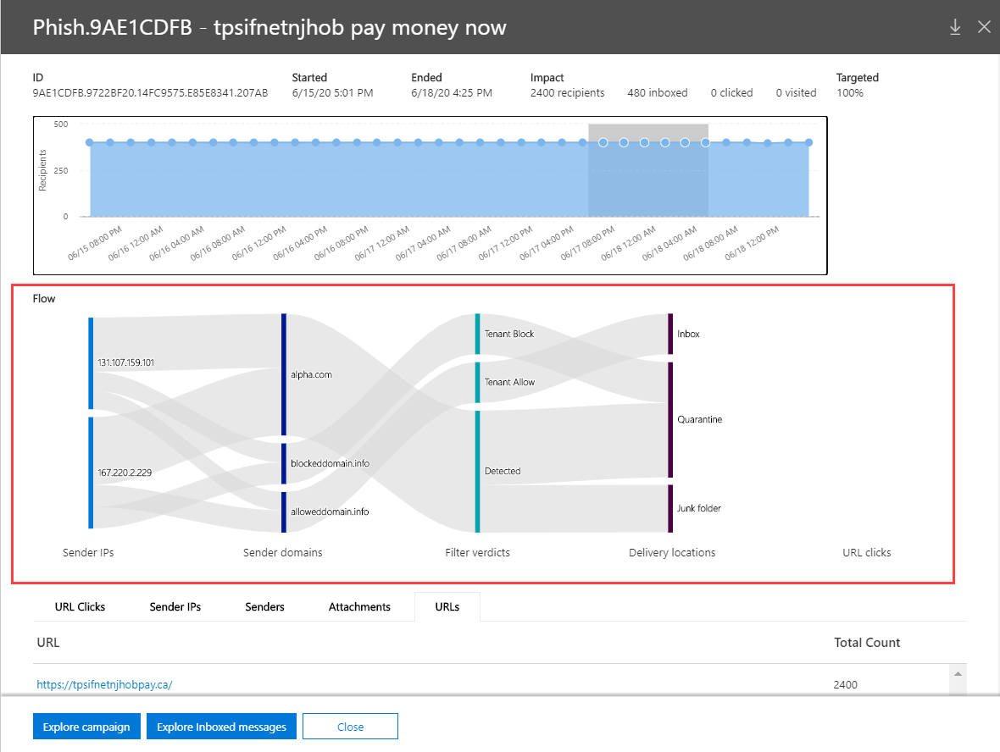

# Campaign Views in Microsoft Defender for Office 365

[!INCLUDE [Microsoft 365 Defender rebranding](../includes/microsoft-defender-for-office.md)]

**Applies to**
- [Microsoft Defender for Office 365 plan 2](https://go.microsoft.com/fwlink/?linkid=2148715)

Campaign Views is a feature in Microsoft Defender for Office 365 Plan 2 (for example Microsoft 365 E5 or organizations with an Defender for Office 365 Plan 2 add-on). Campaign Views in the Security & Compliance Center identifies and categorizes phishing attacks in the service. Campaign Views can help you to:

- Efficiently investigate and respond to phishing attacks.
- Better understand the scope of the attack.
- Show value to decision makers.

Campaign Views lets you see the big picture of an attack faster and more complete than any human.

## What is a campaign?

A campaign is a coordinated email attack against one or many organizations. Email attacks that steal credentials and company data are a large and lucrative industry. As technologies increase in an effort to stop attacks, attackers modify their methods in an effort to ensure continued success.

Microsoft leverages the vast amounts of anti-phishing, anti-spam, and anti-malware data across the entire service to help identify campaigns. We analyze and classify the attack information according to several factors. For example:

- **Attack source**: The source IP addresses and sender email domains.
- **Message properties**: The content, style, and tone of the messages.
- **Message recipients**: How recipients are related. For example, recipient domains, recipient job functions (admins, executives, etc.), company types (large, small, public, private, etc.), and industries.
- **Attack payload**: Malicious links, attachments, or other payloads in the messages.

A campaign might be short-lived, or could span several days, weeks, or months with active and inactive periods. A campaign might be launched against your specific organization, or your organization might be part of a larger campaign across multiple companies.

## Campaign Views in the Security & Compliance Center

Campaign Views is available in the [Security & Compliance Center](https://protection.office.com) at **Threat management** \> **Campaigns**, or directly at <https://protection.office.com/campaigns>.

You can also get to Campaign Views from:

- **Threat management** \> **Explorer** \> **View** \> **Campaigns**
- **Threat management** \> **Explorer** \> **View** \> **All email** \> **Campaign** tab
- **Threat management** \> **Explorer** \> **View** \> **Phish** \> **Campaign** tab
- **Threat management** \> **Explorer** \> **View** \> **Malware** \> **Campaign** tab

To access Campaign Views, you need to be a member of the **Organization Management**, **Security Administrator**, or **Security Reader** role groups in the Security & Compliance Center. For more information, see [Permissions in the Security & Compliance Center](permissions-in-the-security-and-compliance-center.md).

## Campaigns overview

The overview page shows information about all campaigns.

On the default **Campaign** tab, the **Campaign type** area shows a bar graph that shows the number of recipients per day. By default, the graph shows both **Phish** and **Malware** data.

> [!TIP]
> If you don't see any campaign data, try changing the date range or [filters](#filters-and-settings).

The rest of the overview page shows the following information on the **Campaign** tab:

- **Name**

- **Sample subject**: The subject line of one of the messages in the campaign. Note that all messages in the campaign will not necessarily have the same subject.

- **Targeted**: The percentage as calculated by: (the number of campaign recipients in your organization) / (the total number of recipients in the campaign across all organizations in the service). This value indicates the degree to which the campaign is directed only at your organization (a higher value) vs. also directed at other organizations in the service (a lower value).

- **Type**: This value is either **Phish** or **Malware**.

- **Subtype**: This value contains more details about the campaign. For example:
  - **Phish**: Where available, the brand that is being phished by this campaign. For example, `Microsoft`, `365`, `Unknown`, `Outlook`, or `DocuSign`.
  - **Malware**: For example, `HTML/PHISH` or `HTML/<MalwareFamilyName>`.

  Where available, the brand that is being phished by this campaign. When the detection is driven by Defender for Office 365 technology, the prefix **ATP-** is added to the subtype value.

- **Recipients**: The number of users that were targeted by this campaign.

- **Inboxed**: The number of users that received messages from this campaign in their Inbox (not delivered to their Junk Email folder).

- **Clicked**: The number of users that clicked on the URL or opened the attachment in the phishing message.

- **Click rate**: The percentage as calculated by "**Clicked** / **Inboxed**". This value is an indicator of the effectiveness of the campaign. In other words, if the recipients were able to identify the message as phishing, and if they didn't click on the payload URL.

  Note that **Click rate** isn't used in malware campaigns.

- **Visited**: How many users actually made it through to the payload website. If there are **Clicked** values, but Safe Links blocked access to the website, this value will be zero.

The **Campaign origin** tab shows the message sources on a map of the world.

### Filters and settings

At the top of the Campaign Views page, there are several filter and query settings to help you find and isolate specific campaigns.

The most basic filtering that you can do is the start date/time and the end date/time.

To further filter the view, you can do single property with multiple values filtering by clicking the **Campaign type** button, making your selection, and then clicking **Refresh**.

The filterable campaign properties that are available in the **Campaign type** button are described in the following list:

- **Basic**:
  - **Campaign type**: Select **Malware** or **Phish**. Clearing the selections has the same result as selecting both.
  - **Campaign name**
  - **Campaign subtype**
  - **Sender**
  - **Recipients**
  - **Sender domain**
  - **Subject**
  - **Attachment filename**
  - **Malware family**
  - **Tags**: Users or groups that have had the specified user tag applied (including priority accounts). For more information about user tags, see [User tags](user-tags.md).
  - **System overrides**
  - **Delivery action**
  - **Additional action**
  - **Directionality**
  - **Detection technology**
  - **Original delivery location**
  - **Latest delivery location**
  - **System overrides**

- **Advanced**:
  - **Internet message ID**: Available in the **Message-ID** header field in the message header. An example value is `<08f1e0f6806a47b4ac103961109ae6ef@server.domain>` (note the angle brackets).
  - **Network message ID**: A GUID value that's available in the **X-MS-Exchange-Organization-Network-Message-Id** header field in the message header.
  - **Sender IP**
  - **Attachment SHA256**: To find the SHA256 hash value of a file in Windows, run the following command in a Command Prompt: `certutil.exe -hashfile "<Path>\<Filename>" SHA256`.
  - **Cluster ID**
  - **Alert Policy ID**
  - **ZAP URL signal**

- **URLs**:
  - **URL domain**
  - **URL domain and path**
  - **URL**
  - **URL path**
  - **Click verdict**

For more advanced filtering, including filtering by multiple properties, you can click the **Advanced filter** button to build a query. The same campaign properties are available, but with the following enhancements:

- You can click **Add a condition** to select multiple conditions.
- You can choose the **And** or **Or** operator between conditions.
- You can select the **Condition group** item at the bottom of the conditions list to form complex compound conditions.

When you're finished, click the **Query** button.

After you create a basic or advanced filter, you can save it by using **Save query** or **Save query as**. Later, when you return to Campaign Views, you can load a saved filter by clicking **Saved query settings**.

To export the graph or the list of campaigns, click **Export** and select **Export chart data** or **Export campaign list**.

If you have a Microsoft Defender for Endpoint subscription, you can click **MDE Settings** to connect or disconnect the campaigns information with Microsoft Defender for Endpoint. For more information, see [Integrate Microsoft Defender for Office 365 with Microsoft Defender for Endpoint](integrate-office-365-ti-with-wdatp.md).

## Campaign details

When you click on the name of a campaign, the campaign details appear in a flyout.

### Campaign information

At the top of the campaign details view, the following campaign information is available:

- **ID**: The unique campaign identifier.

- **Started** and **Ended**: The start date and end date of the campaign. Note that these dates might extend further than your filter dates that you selected on the overview page.

- **Impact**: This section contains the following data for the date range filter you selected (or that you select in the timeline):
  - The total number of recipients.
  - The number of messages that were "Inboxed" (that is, delivered to the Inbox, not to the Junk Email folder).
  - How many users clicked on the URL payload in the phishing message.
  - Howe many users visited the URL.

- **Targeted**: The percentage as calculated by: (the number of campaign recipients in your organization) / (the total number of recipients in the campaign across all organizations in the service). Note that this value is calculated over the entire lifetime of the campaign, and doesn't change based on date filters.

- An interactive timeline of campaign activity: The timeline shows activity over the entire lifetime of the campaign. By default, the shaded area includes the date range filter that you selected in the overview. You can click and drag to select a specific start point and end point, <u>which will change the data that's displayed in **Impact** area, and on the rest of the page as described in the next sections</u>.

In the title bar, you can click the **Download campaign write-up** button  to download the campaign details to a Word document (by default, named CampaignReport.docx). Note that the download contains details over the entire lifetime of the campaign (not just the filter dates you selected).

### Campaign flow

In the middle of the campaign details view, important details about the campaign are presented in the **Flow** section in a horizontal flow diagram (known as a _Sankey_ diagram). These details will help you to understand the elements of the campaign and the potential impact in your organization.

> [!TIP]
> The information that's displayed in the **Flow** diagram is controlled by the shaded date range in the timeline as described in the previous section.

If you hover over a horizontal band in the diagram, you'll see the number of related messages (for example, messages from a particular source IP, messages from the source IP using the specified sender domain, etc.).

The diagram contains the following information:

- **Sender IPs**
- **Sender domains**
- **Filter verdicts**: Verdict values are related to the available phishing and spam filtering verdicts as described in [Anti-spam message headers](anti-spam-message-headers.md). The available values are described in the following table:

  ****

  |Value|Spam filter verdict|Description|
  |---|---|---|
  |**Allowed**|`SFV:SKN` 
 `SFV:SKI`|The message was marked as not spam and/or skipped filtering before being evaluated by spam filtering. For example, the message was marked as not spam by a mail flow rule (also known as a transport rule). 
 The message skipped spam filtering for other reasons. For example, the sender and recipient appear to be in the same organization.|
  |**Blocked**|`SFV:SKS`|The message was marked as spam before being evaluated by spam filtering. For example, by a mail flow rule.|
  |**Detected**|`SFV:SPM`|The message was marked as spam by spam filtering.|
  |**Not Detected**|`SFV:NSPM`|The message was marked as not spam by spam filtering.|
  |**Released**|`SFV:SKQ`|The message skipped spam filtering because it was released from quarantine.|
  |**Tenant Allow**\*|`SFV:SKA`|The message skipped spam filtering because of the settings in an anti-spam policy. For example, the sender was in the allowed sender list or allowed domain list.|
  |**Tenant Block**\*\*|`SFV:SKA`|The message was blocked by spam filtering because of the settings in an anti-spam policy. For example, the sender was in the allowed sender list or allowed domain list.|
  |**User Allow**\*|`SFV:SFE`|The message skipped spam filtering because the sender was in a user's Safe Senders list.|
  |**User Block**\*\*|`SFV:BLK`|The message was blocked by spam filtering because the sender was in a user's Blocked Senders list.|
  |**ZAP**|n/a|[Zero-hour auto purge (ZAP)](zero-hour-auto-purge.md) moved the delivered message to the Junk Email folder or quarantine. You configure the action in your anti-spam policy.|
  |

  \* Review your anti-spam policies, because the allowed message would have likely been blocked by the service.

  \*\* Review your anti-spam policies, because these messages should be quarantined, not delivered.

- **Delivery locations**: You'll likely want to investigate messages that were delivered to recipients (either to the Inbox or the Junk Email folder), even if users didn't click on the payload URL in the message. You can also remove the quarantined messages from quarantine. For more information, see [Quarantined email messages in EOP](quarantine-email-messages.md).
  - **Deleted folder**
  - **Dropped**
  - **External**: The recipient is located in your on-premises email organization in hybrid environments.
  - **Failed**
  - **Forwarded**
  - **Inbox**
  - **Junk folder**
  - **Quarantine**
  - **Unknown**

- **URL clicks**: These values are described in the next section.

> [!NOTE]
> In all layers that contain more than 10 items, the top 10 items are shown, while the rest are bundled together in **Others**.

#### URL clicks

When a phishing message is delivered to a recipient's Inbox or Junk Email folder, there's always a chance that the user will click on the payload URL. Not clicking on the URL is a small measure of success, but you need to determine why the phishing message was even delivered to the mailbox.

If a user clicked on the payload URL in the phishing message, the actions are displayed in the **URL clicks** area of the diagram in the campaign details view.

- **Allowed**
- **BlockPage**: The recipient clicked on the payload URL, but their access to the malicious website was blocked by a [Safe Links](atp-safe-links.md) policy in your organization.
- **BlockPageOverride**: The recipient clicked on the payload URL in the message, Safe Links tried to stop them, but they were allowed to override the block. Inspect your [Safe Links policies](set-up-atp-safe-links-policies.md) to see why users are allowed to override the Safe Links verdict and continue to the malicious website.
- **PendingDetonationPage**: Safe Attachments in Microsoft Defender for Office 365 is in the process of opening and investigating the payload URL in a virtual computer environment.
- **PendingDetonationPageOverride**: The recipient was allowed to override the payload detonation process and open the URL without waiting for the results.

### Tabs

The tabs in the campaign details view allow you to further investigate the campaign.

> [!TIP]
> The information that's displayed on the tabs is controlled by the shaded date range in the timeline as described in [Campaign information](#campaign-information) section.

- **URL clicks**: If users didn't click on the payload URL in the message, this section will be blank. If a user was able to click on the URL, the following values will be populated:
  - **User**\*
  - **URL**\*
  - **Click time**
  - **Click verdict**

- **Sender IPs**
  - **Sender IP**\*
  - **Total count**
  - **Inboxed**
  - **Not Inboxed**
  - **SPF passed**: The sender was authenticated by the [Sender Policy Framework (SPF)](how-office-365-uses-spf-to-prevent-spoofing.md). A sender that doesn't pass SPF validation indicates an unauthenticated sender, or the message is spoofing a legitimate sender.

- **Senders**
  - **Sender**: This is the actual sender address in the SMTP MAIL FROM command, which is not necessarily the From: email address that users see in their email clients.
  - **Total count**
  - **Inboxed**
  - **Not Inboxed**
  - **DKIM passed**: The sender was authenticated by [Domain Keys Identified Mail (DKIM)](support-for-validation-of-dkim-signed-messages.md). A sender that doesn't pass DKIM validation indicates an unauthenticated sender, or the message is spoofing a legitimate sender.
  - **DMARC passed**: The sender was authenticated by [Domain-based Message Authentication, Reporting, and Conformance (DMARC)](use-dmarc-to-validate-email.md). A sender that doesn't pass DMARC validation indicates an unauthenticated sender, or the message is spoofing a legitimate sender.

- **Attachments**
  - **Filename**
  - **SHA256**
  - **Malware family**
  - **Total count**

- **URL**
  - **URL**\*
  - **Total Count**

\* Clicking on this value opens a new flyout that contains more details about the specified item (user, URL, etc.) on top of the campaign details view. To return to the campaign details view, click **Done** in the new flyout.

### Buttons

The buttons in the campaign details view allow you to use the power of Threat Explorer to further investigate the campaign.

- **Explore campaign**: Opens a new Threat Explorer search tab using the **Campaign ID** value as the search filter.
- **Explore Inboxed messages**: Opens a new Threat Explorer search tab using the **Campaign ID** and **Delivery location: Inbox** as the search filter.
