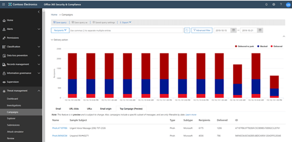
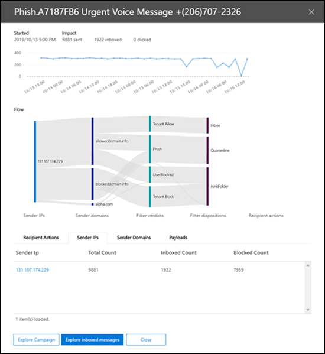
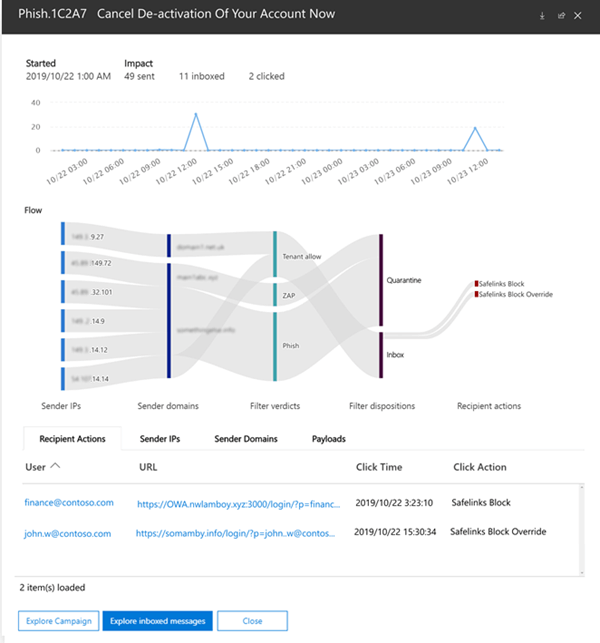

# Campaign Views in Office 365 ATP

Campaign Views is a feature in Advanced Threat Protection (ATP) in the Office 365 Security & Compliance Center that identifies and categorizes phishing attacks in the service. Campaign Views can help you to:

- Efficiently investigate and respond to phishing attacks.

- Better understand the scope of the attack.

- Show value to decision makers.

Campaign Views lets you see the big picture of an attack faster and more complete than any human.

## What is a campaign?

A campaign is a coordinated email attack against one or many organizations. Email attacks that steal credentials and company data are a big and lucrative industry. As technologies increase in an effort to stop attacks, attackers modify their methods in an effort to ensure continued success.

Microsoft leverages the vast amounts of anti-phishing, anti-spam, and anti-malware data and experience across the entire Office 365 service world-wide to help identify campaigns. The attack information is analyzed and classified according to several factors. For example:

- **Attack source**: Source IP addresses and sender email domains.

- **Attack message properties**: The content, style, and tone of the attack messages.

- **Attack recipients**: Recipient domains, recipient job functions (admins, executives, etc.), company types (large, small, public, private, etc.), and industries.

- **Attack payload**: Malicious links, attachments, or other payloads.

## Campaign Views the Office 365 Security & Compliance Center

Campaign Views is available in the [Security & Compliance Center](https://protection.office.com) at the following locations:

- **Threat management** \> **Campaigns** or **Threat management** \> **Explorer** \> **View** \> **Campaigns**

- **Threat management** \> **Explorer** \> **View** \> **All email** \> **Campaign**

> [!TIP]
> Currently, the only filtering that's available is the date range. If you don't see any campaign data, try changing the date range.

The overview page shows the following information about the campaign:

- **Name**

- **Sample subject**: The subject line of one of the messages in the campaign. Note that all messages in the campaign will not necessarily have the same subject line.

- **Type**: Currently, this value will always be **Phish**.

- **Subtype**: Where available, the brand that is being phished by this campaign. When the detection is driven by ATP technology, the prefix **ATP-**is added to the subtype value.

- **Recipients**: The number of users that were targeted by this campaign.

- **Inboxed**: The number of users that received messages from this campaign in their Inbox (not delivered to Junk).

- **Clicked**

- **Click Rate**

- **Visited**

When you click on the name of a campaign, the campaign details appears in a flyout.

## Campaign details

In the campaign details view, a lot of information is available about the campaign:

- Campaign information:

  - **ID**: The unique campaign identifier.

  - **Started** and **Ended**: the date range filter you selected.

  - **Impact**: The following data for the date range filter you selected:
  
    - The total number of recipients.

    - The number of messages that were "Inboxed" (that is, delivered to the Inbox, not to Junk).

    - How many users clicked on the URL payload in the phishing message.

    - Howe many users visited the URL.

  - A timeline of campaign activity: When the campaign started and ended, and the volume of messages over time.

### Campaign flow

Important details about the campaign are presented in a horizontal flow diagram (known as a _Sankey_ diagram) in the **Flow** section. These details will help you to understand the elements of the campaign and the potential impact in your organization.

If you hover over a horizontal band in the diagram, you'll see the number of related messages (for example, messages from a particular source IP, messages from the source IP using the specified sender domain, etc.).

The diagram contains the following information:

- **Sender IPs**

- **Sender domains**

- **Filter verdicts**: The values here are related to the available anti-phishing and anti-spam filter verdicts as described in [Anti-spam message headers](anti-spam-message-headers.md). Of great interest here is the value **Tenant Allow**, which means a configured setting in the organization allowed a message through that would have otherwise been blocked by the service (for example, a domain in the Allowed Senders list).

  - **Tenant Block**: This value indicates that a setting in your organization (for example, a domain entry in the [Blocked Senders list](create-block-sender-lists-in-office-365.md)) both detected the message and determined where it was delivered. For messages that weren't quarantined, review your blocked senders settings to determine why the message was delivered.

  - **Detected**

  - **Tenant Allow**

- **Delivery locations**: You'll likely want to investigate messages that were actually delivered to recipients (either to the Inbox or the Junk Email folder), even if users didn't click on the payload URL in the message. You can also remove the quarantined messages from quarantine. For more information, see [Quarantine email messages in Office 365](quarantine-email-messages.md).

  - **Junk folder**

  - **Quarantine**

  - **Inbox**

#### URL clicks

There's always the chance that messages delivered to the recipient's Inbox or Junk Email folder can be acted upon by the user (that is, user will click on the malicious URL in the message). If they haven't, that's a small measure of success, although you certainly need to determine why the harmful message was delivered to their mailbox in the first place.

If a user has clicked on the malicious URL, the actions are displayed in the **URL clicks** area of the diagram.

- **Safe Links Block**: This value indicates the recipient clicked on the payload URL in the message, but it was blocked by the [ATP Safe Links](atp-safe-links.md) policies in your organization.

- **Safe Links Block Override**: This value also indicates the recipient clicked on the payload URL in the message, ATP Safe Links tried to stop them, but they were allowed to override the block. You need to investigate your [Safe Links policies](set-up-atp-safe-links-policies.md) to see why users are allowed to override the Safe Links verdict and click on malicious URLs.

### Tabs

There are several tabs in the campaign details view that allow you to further investigate the campaign.

- **URL Clicks**: If the payload URL in the phishing message wasn't clicked, this section will be blank. If a user was able to click on the URL, you

  - **User**\*

  - **URL**\*

  - **Click Time**

  - **Click Action**

- **Sender IPs**

  - **Sender IP**\*

  - **Total Count**

  - **Inboxed Count**

  - **Blocked Count**

  - **SPF Passed**

- **Senders**

  - **Sender**

  - **Total Count**

  - **Inboxed**

  - **Not Inboxed**

  - **SPF Passed**

- **Payloads**

  - **URL**\*

  - **Total Count**

\* Clicking on this value opens a new flyout that contains more details about the specified item (user, URL, etc.) on top of the campaign details view. To return to the campaign details view, click **Done** in the new flyout.

### Buttons

The buttons in the campaign details view allow you to use the power of Threat Explorer to further investigate the campaign.

- **Explore campaign**: Opens a new Threat Explorer search tab using the **Campaign ID** value as the search filter.

- **Explore Inboxed messages**: Opens a new Threat Explorer search tab using the **Campaign ID** and **Delivery location: Inbox** as the search filter.
