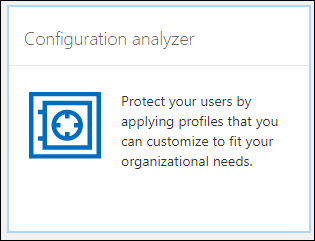
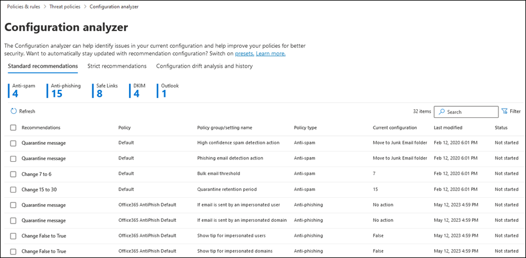
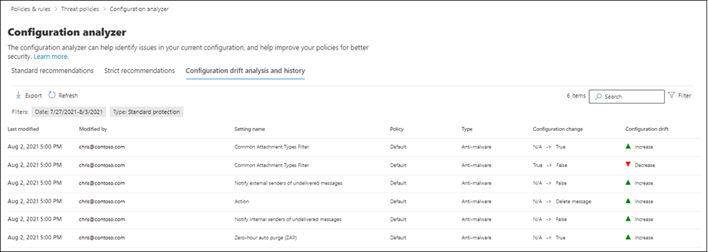

# Configuration analyzer for protection policies in EOP and Microsoft Defender for Office 365

[!INCLUDE [Microsoft 365 Defender rebranding](../includes/microsoft-defender-for-office.md)]

**Applies to**
- [Exchange Online Protection](exchange-online-protection-overview.md)
- [Microsoft Defender for Office 365 plan 1 and plan 2](defender-for-office-365.md)
- [Microsoft 365 Defender](../mtp/microsoft-threat-protection.md)

Configuration analyzer in the Security & Compliance center provides a central location to find and fix security policies where the settings are below the Standard protection and Strict protection profile settings in [preset security policies](preset-security-policies.md).

The following types of policies are analyzed by the configuration analyzer:

- **Exchange Online Protection (EOP) policies**: This includes Microsoft 365 organizations with Exchange Online mailboxes and standalone EOP organizations without Exchange Online mailboxes:

  - [Anti-spam policies](configure-your-spam-filter-policies.md).
  - [Anti-malware policies](configure-anti-malware-policies.md).
  - [EOP Anti-phishing policies](set-up-anti-phishing-policies.md#spoof-settings).

- **Microsoft Defender for Office 365 policies**: This includes organizations with Microsoft 365 E5 or Defender for Office 365 add-on subscriptions:

  - Anti-phishing policies in Microsoft Defender for Office 365, which include:

    - The same [spoof settings](set-up-anti-phishing-policies.md#spoof-settings) that are available in the EOP anti-phishing policies.
    - [Impersonation settings](set-up-anti-phishing-policies.md#impersonation-settings-in-anti-phishing-policies-in-microsoft-defender-for-office-365)
    - [Advanced phishing thresholds](set-up-anti-phishing-policies.md#advanced-phishing-thresholds-in-anti-phishing-policies-in-microsoft-defender-for-office-365)

  - [Safe Links policies](set-up-safe-links-policies.md).

  - [Safe Attachments policies](set-up-safe-attachments-policies.md).

The **Standard** and **Strict** policy setting values that are used as baselines are described in [Recommended settings for EOP and Microsoft Defender for Office 365 security](recommended-settings-for-eop-and-office365.md).

## What do you need to know before you begin?

- You open the Security & Compliance Center at <https://protection.office.com/>. To go directly to the **Configuration analyzer** page, use <https://protection.office.com/configurationAnalyzer>.

- To connect to Exchange Online PowerShell, see [Connect to Exchange Online PowerShell](https://docs.microsoft.com/powershell/exchange/connect-to-exchange-online-powershell).

- You need to be assigned permissions in the Security & Compliance Center before you can do the procedures in this article:
  - To use the configuration analyzer **and** make updates to security policies, you need to be a member of the **Organization Management** or **Security Administrator** role groups.
  - For read-only access to the configuration analyzer, you need to be a member of the **Global Reader** or **Security Reader** role groups.

  For more information, see [Permissions in the Security & Compliance Center](permissions-in-the-security-and-compliance-center.md).

  > [!NOTE]
  >  
  > - Adding users to the corresponding Azure Active Directory role in the Microsoft 365 admin center gives users the required permissions in the Security & Compliance Center _and_ permissions for other features in Microsoft 365. For more information, see [About admin roles](../../admin/add-users/about-admin-roles.md).
  >
  > - The **View-Only Organization Management** role group in [Exchange Online](https://docs.microsoft.com/Exchange/permissions-exo/permissions-exo#role-groups) also gives read-only access to the feature.

## Use the configuration analyzer in the Security & Compliance Center

In the Security & Compliance Center, go to **Threat management** \> **Policy** \> **Configuration analyzer**.

The configuration analyzer has two main tabs:

- **Settings and recommendations**: You pick Standard or Strict and compare those settings to your existing security policies. In the results, you can adjust the values of your settings to bring them up to the same level as Standard or Strict.

- **Configuration drift analysis and history**: This view allows you to track policy changes over time.

### Setting and recommendations tab in the configuration analyzer

By default, the tab opens on the comparison to the Standard protection profile. You can switch to the comparison of the Strict protection profile by clicking **View Strict recommendations**. To switch back, select **View Standard recommendations**.

By default, the **Policy group/setting name** column contains a collapsed view of the different types of security policies and the number of settings that need improvement (if any). The types of policies are:

- **Anti-spam**
- **Anti-phishing**
- **Anti-malware**
- **ATP Safe Attachments** (if your subscription includes Microsoft Defender for Office 365)
- **ATP Safe Links** (if your subscription includes Microsoft Defender for Office 365)

In the default view, everything is collapsed. Next to each policy, there's a summary of comparison results from your policies (which you can modify) and the settings in the corresponding policies for the Standard or Strict protection profiles (which you can't modify). You'll see the following information for the protection profile that you're comparing to:

- **Green**: All settings in all existing policies are at least as secure as the protection profile.
- **Amber**: A small number of settings in the existing policies are not as secure as the protection profile.
- **Red**: A significant number of settings in the existing policies are not as secure as the protection profile. This could be a few settings in many policies or many settings in one policy.

For favorable comparisons, you'll see the text: **All settings follow** \<**Standard** or **Strict**\> **recommendations**. Otherwise, you'll see the number of recommended settings to change.

If you expand **Policy group/setting name**, all of the policies and the associated settings in each specific policy that require attention are revealed. Or, you can expand a specific type of policy (for example, **Anti-spam**) to see just those settings in those types of policies that require your attention.

If the comparison has no recommendations for improvement (green), expanding the policy reveals nothing. If there are any number of recommendations for improvement (amber or red), the settings that require attention are revealed, and corresponding information is revealed in the following columns:

- The name of the setting that requires your attention. For example, in the previous screenshot, it's the **Bulk email threshold** in an anti-spam policy.

- **Policy**: The name of the affected policy that contains the setting.

- **Applied to**: The number of users that the affected policies are applied to.

- **Current configuration**: The current value of the setting.

- **Last modified**: The date that the policy was last modified.

- **Recommendations**: The value of the setting in the Standard or Strict protection profile. To change the value of the setting in your policy to match the recommended value in the protection profile, click **Adopt**. If the change is successful, you'll see the message: **Recommendations successfully adopted**. Click **Refresh** to see the reduced number of recommendations, and the removal of the specific setting/policy row from the results.

### Configuration drift analysis and history tab in the configuration analyzer

This tab allows you to track the changes that you've made to your custom security policies. By default, the following information is displayed:

- **Last modified**
- **Modified by**
- **Setting Name**
- **Policy**
- **Type**

To filter the results, click **Filter**. In the **Filters** flyout that appears, you can select from the following filters:

- **Start time** and **End time** (date)
- **Standard protection** or **Strict protection**

To export the results to a .csv file, click **Export**.

