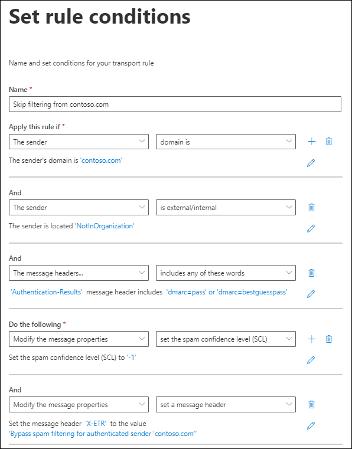

# Create safe sender lists in EOP

[!INCLUDE [Microsoft 365 Defender rebranding](../includes/microsoft-defender-for-office.md)]

**Applies to**
- [Exchange Online Protection](https://go.microsoft.com/fwlink/?linkid=2148611)
- [Microsoft Defender for Office 365 plan 1 and plan 2](https://go.microsoft.com/fwlink/?linkid=2148715)
- [Microsoft 365 Defender](https://go.microsoft.com/fwlink/?linkid=2118804)

If you're a Microsoft 365 customer with mailboxes in Exchange Online or a standalone Exchange Online Protection (EOP) customer without Exchange Online mailboxes, EOP offers multiple ways of ensuring that users will receive email from trusted senders. These options include Exchange mail flow rules (also known as transport rules), Outlook Safe Senders, the IP Allow List (connection filtering), and allowed sender lists or allowed domain lists in anti-spam policies. Collectively, you can think of these options as _safe sender lists_.

The available safe sender lists are described in the following list in order from most recommended to least recommended:

1. Mail flow rules
2. Outlook Safe Senders
3. IP Allow List (connection filtering)
4. Allowed sender lists or allowed domain lists (anti-spam policies)

Mail flow rules allow the most flexibility to ensure that only the right messages are allowed. Allowed sender and allowed domain lists in anti-spam policies aren't as secure as the IP Allow List, because the sender's email domain is easily spoofed. But, the IP Allow List also presents a risk, because email from _any_ domain that's sent from that IP address will bypass spam filtering.

> [!IMPORTANT]
>
> - Be careful to closely monitor *any* exceptions that you make to spam filtering using safe sender lists.
>
> - While you can use safe sender lists to help with false positives (good email marked as bad), you should consider the use of safe sender lists as a temporary solution that should be avoided if possible. We don't recommend managing false positives by using safe sender lists, because exceptions to spam filtering can open your organization to spoofing and other attacks. If you insist on using safe sender lists to manage false positives, you need to be vigilant and keep the topic [Report messages and files to Microsoft](report-junk-email-messages-to-microsoft.md) at the ready.
>
> - To allow a domain to send unauthenticated email (bypass anti-spoofing protection) but not bypass anti-spam and anti-malware checks, you can add it to the [AllowedToSpoof safe sender list](walkthrough-spoof-intelligence-insight.md)
>
> - EOP and Outlook inspect different message properties to determine the sender of the message. For more information, see the [Considerations for bulk email](#considerations-for-bulk-email) section later in this article.

In contrast, you also have several options to block email from specific sources using _blocked sender lists_. For more information, see [Create block sender lists in EOP](create-block-sender-lists-in-office-365.md).

## (Recommended) Use mail flow rules

Mail flow rules in Exchange Online and standalone EOP use conditions and exceptions to identify messages, and actions to specify what should be done to those messages. For more information, see [Mail flow rules (transport rules) in Exchange Online](https://docs.microsoft.com/Exchange/security-and-compliance/mail-flow-rules/mail-flow-rules).

The following example assumes you need email from contoso.com to skip spam filtering. To do this, configure the following settings:

1. **Condition**: **The sender** \> **domain is** \> contoso.com.

2. Configure either of the following settings:

   - **Mail flow rule condition**: **A message header** \> **includes any of these words** \> **Header name**: `Authentication-Results` \> **Header value**: `dmarc=pass` or `dmarc=bestguesspass`.

     This condition checks the email authentication status of the sending email domain to ensure that the sending domain is not being spoofed. For more information about email authentication, see [SPF](set-up-spf-in-office-365-to-help-prevent-spoofing.md), [DKIM](use-dkim-to-validate-outbound-email.md), and [DMARC](use-dmarc-to-validate-email.md).

   - **IP Allow List**: Specify the source IP address or address range in the connection filter policy.

     Use this setting if the sending domain does not use email authentication. Be as restrictive as possible when it comes to the source IP addresses in the IP Allow List. We recommend an IP address range of /24 or less (less is better). Do not use IP address ranges that belong to consumer services (for example, outlook.com) or shared infrastructures.

   > [!IMPORTANT]
   >
   > - Never configure mail flow rules with *only* the sender domain as the condition to skip spam filtering. Doing so will *significantly* increase the likelihood that attackers can spoof the sending domain (or impersonate the full email address), skip all spam filtering, and skip sender authentication checks so the message will arrive in the recipient's Inbox.
   >
   > - Do not use domains you own (also known as accepted domains) or popular domains (for example, microsoft.com) as conditions in mail flow rules. Doing so is considered high risk because it creates opportunities for attackers to send email that would otherwise be filtered.
   >
   > - If you allow an IP address that's behind a network address translation (NAT) gateway, you need to know the servers that are involved in the NAT pool in order to know the scope of your IP Allow List. IP addresses and NAT participants can change. You need to periodically check your IP Allow List entries as part of your standard maintenance procedures.

3. **Optional conditions**:

   - **The sender** \> **is internal/external** \> **Outside the organization**: This condition is implicit, but it's OK to use it to account for on-premises email servers that might not be correctly configured.

   - **The subject or body** \> **subject or body includes any of these words** \> \<keywords\>: If you can further restrict the messages by keywords or phrases in the subject line or message body, you can use those words as a condition.

4. **Action**: Configure both of these actions in the rule:

   a. **Modify the message properties** \> **set the spam confidence level (SCL)** \> **Bypass spam filtering**.

   b. **Modify the message properties** \> **set a message header**: **Set the message header** \<CustomHeaderName\> **to the value** \<CustomHeaderValue\>.

      For example, `X-ETR: Bypass spam filtering for authenticated sender 'contoso.com'`. If you have more than one domain in the rule, you can customize the header text as appropriate.

      When a message skips spam filtering due to a mail flow rule, the value `SFV:SKN` value is stamped in the **X-Forefront-Antispam-Report** header. If the message is from a source that's on the IP Allow List, the value `IPV:CAL` is also added. These values can help you with troubleshooting.

## Use Outlook Safe Senders

> [!CAUTION]
> This method creates a high risk of attackers successfully delivering email to the Inbox that would otherwise be filtered; however, the user's Safe Senders or Safe Domains lists don't prevent malware or high confidence phishing messages from being filtered.

Instead of an organizational setting, users or admins can add the sender email addresses to the Safe Senders list in the mailbox. For instructions, see [Configure junk email settings on Exchange Online mailboxes in Office 365](configure-junk-email-settings-on-exo-mailboxes.md). This is not desirable in most situations since senders will bypass parts of the filtering stack. Although you trust the sender, the sender can still be compromised and send malicious content. It is best that you let our filters do what is needed to check every message and then [report the false positive/negative to Microsoft](report-junk-email-messages-to-microsoft.md) if our filters got it wrong. Bypassing the filtering stack also interferes with [ZAP](zero-hour-auto-purge.md).

When messages skip spam filtering due to a user's Safe Senders list, the **X-Forefront-Antispam-Report** header field will contain the value `SFV:SFE`, which indicates that filtering for spam, spoof, and phishing were bypassed.

## Use the IP Allow List

If you can't use mail flow rules as previously described, the next best option is to add the source email server or servers to the IP Allow List in the connection filter policy. For details, see [Configure connection filtering in EOP](configure-the-connection-filter-policy.md).

**Notes**:

- It's important that you keep the number of allowed IP addresses to a minimum, so avoid using entire IP address ranges whenever possible.

- Do not use IP address ranges that belong to consumer services (for example, outlook.com) or shared infrastructures.

- Regularly review the entries in the IP Allow List and remove the entries that you no longer need.

> [!CAUTION]
> Without additional verification like mail flow rules, email from sources in the IP Allow List skips spam filtering and sender authentication (SPF, DKIM, DMARC) checks. This creates a high risk of attackers successfully delivering email to the Inbox that would otherwise be filtered; however, the IP Allow List doesn't prevent malware or high confidence phishing messages from being filtered.

## Use allowed sender lists or allowed domain lists

The least desirable option is to use the allowed sender list or allowed domain list in anti-spam policies. You should avoid this option *if at all possible* because senders bypass all spam, spoof, and phishing protection, and sender authentication (SPF, DKIM, DMARC). This method is best used for temporary testing only. The detailed steps can be found in [Configure anti-spam policies in EOP](configure-your-spam-filter-policies.md) topic.

The maximum limit for these lists is approximately 1000 entries; although, you will only be able to enter 30 entries into the portal. You must use PowerShell to add more than 30 entries.

> [!CAUTION]
>
> - This method creates a high risk of attackers successfully delivering email to the Inbox that would otherwise be filtered; however, the allowed senders or allowed domains lists don't prevent malware or high confidence phishing messsages from being filtered.
>
> - Do not use domains you own (also known as accepted domains) or popular domains (for example, microsoft.com) in allowed domain lists.

## Considerations for bulk email

A standard SMTP email message consists of a *message envelope* and message content. The message envelope contains information that's required for transmitting and delivering the message between SMTP servers. The message content contains message header fields (collectively called the *message header*) and the message body. The message envelope is described in RFC 5321, and the message header is described in RFC 5322. Recipients never see the actual message envelope because it's generated by the message transmission process, and it isn't actually part of the message.

- The `5321.MailFrom` address (also known as the **MAIL FROM** address, P1 sender, or envelope sender) is the email address that's used in the SMTP transmission of the message. This email address is typically recorded in the **Return-Path** header field in the message header (although it's possible for the sender to designate a different **Return-Path** email address). If the message can't be delivered, it's the recipient for the non-delivery report (also known as an NDR or bounce message).

- The `5322.From` (also known as the **From** address or P2 sender) is the email address in the **From** header field, and is the sender's email address that's displayed in email clients.

Frequently, the `5321.MailFrom` and `5322.From` addresses are the same (person-to-person communication). However, when email is sent on behalf of someone else, the addresses can be different. This happens most often for bulk email messages.

For example, suppose that Blue Yonder Airlines has hired Margie's Travel to send out its email advertising. The message you receive in your Inbox has the following properties:

- The `5321.MailFrom` address is blueyonder.airlines@margiestravel.com.

- The `5322.From` address is blueyonder@news.blueyonderairlines.com, which is what you'll see in Outlook.

Safe sender lists and safe domain lists in anti-spam policies in EOP inspect only the `5322.From` addresses, this is similar to Outlook Safe Senders that uses the `5322.From` address.

To prevent this message from being filtered, you can take the following steps:

- Add blueyonder@news.blueyonderairlines.com (the `5322.From` address) as an Outlook Safe Sender.

- [Use a mail flow rule](#recommended-use-mail-flow-rules) with a condition that looks for messages from blueyonder@news.blueyonderairlines.com (the `5322.From` address, blueyonder.airlines@margiestravel.com (the `5321.MailFrom`), or both.

For more information, see [Create safe sender lists in EOP](create-safe-sender-lists-in-office-365.md).
