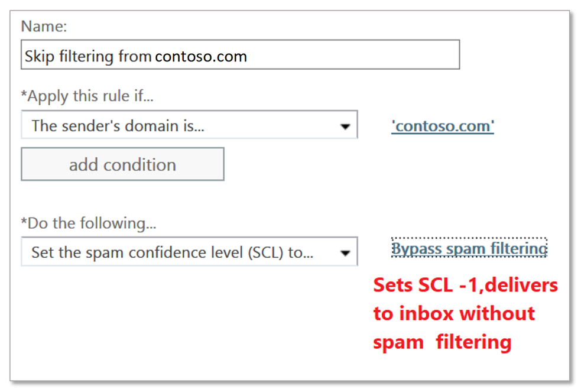

# Create safe sender lists in Office 365

If you want to ensure that users receive emails from a particular sender or senders because you trust them and their messages, there are multiple methods available that you can choose from. These options include Exchange mail flow rules (also known as transport rules), Outlook Safe Senders, IP Allow Lists, Anti-spam Sender/Domain Allow Lists.

> [!IMPORTANT]
> While organization allow lists can be used to address false positives, this should be considered a temporary solution and avoided if possible. Managing false positives by using allow lists is not recommended as it can inadvertently open your organization up to spoofing, impersonation, and other attacks. If you will use an allow list for this purpose, you will need to be vigilant and keep the article for [submitting spam, non-spam, and phishing mails to Microsoft for analysis](submit-spam-non-spam-and-phishing-scam-messages-to-microsoft-for-analysis.md), at the ready.

The recommended method to configure a safe sender list is to use mail flow rules as this presents the most flexibility to ensure that only the right messages get allowed. *Anti-Spam policy email address* and *Domain based allow lists* are not as secure as *IP address-based lists* because domains can easily be spoofed. But anti-spam policy IP based allow lists also present risks as they will allow any domains sent through that IP to bypass spam filtering. Please be careful and monitor *any* exceptions made, carefully.

> [!IMPORTANT]
> • Information on how to create a **Blocked Sender List** is [here](create-block-sender-lists-in-office-365.md).    • To allow a sender domain to send unauthenticated email (bypass anti-spoofing protection) but not bypass anti-spam and anti-malware checks, you can add it to the [AllowedToSpoof safe sender list](walkthrough-spoof-intelligence-insight.md).

## Options from most to least recommended

You should always restrict your Allow lists because they bypass many security measures. You must recheck all Allow lists as a part of your standard maintenance, so that you are aware of who is permitted to bypass. The recommendation is to use restrictive mail flow rules where possible.

- Exchange mail flow rules
- Outlook Safe Senders
- Anti-spam policy: IP Allow Lists
- Anti-spam policy: Sender/Domain Allow Lists

## Using Exchange mail flow rules to allow specific senders (Recommended)

To ensure that only legitimate messages are allowed into your organization the condition should be one of the following:

- Use the sender authentication status of the sending domain. This is done by checking the Authentication-Results header to ensure that it contains "dmarc=pass" or "dmarc=bestguesspass". This ensures that the sending domain has been authenticated and is not being spoofed. Click for more on [SPF](set-up-spf-in-office-365-to-help-prevent-spoofing.md), [DKIM](use-dkim-to-validate-outbound-email.md), and [DMARC](use-dmarc-to-validate-email.md) email authentication.

- Or, if the sending domain does not have authentication, use the sending domain *plus* a sending IP (or IP range). Ensure that you are *as restrictive as possible*, the goal being that you do this as securely as possible. An IP range larger than /24 is *not* recommended. Avoid adding IP address ranges that belong to consumer services or shared infrastructures.

> [!IMPORTANT]
> If you allow an IP address that is NATted, you should know the machines that are involved in that NAT pool in order to know the scope of your Allow. Be aware that IP addresses may change, and NAT participants may too. You must recheck all Allow lists, including IP Allows as part of your standard maintenance.

- *Optionally*, add a condition that the message originates from outside the organization (this is implicit, but it's fine to add it as a condition to account for on-premises servers that may not be correctly configured).

- *Optionally*, if you can identify any unique keywords or phrases in the email Subject or Body use this information as an additional condition to further restrict the email messages allowed by the mail flow rule.

The action on the rule must follow this pattern:

1. Set the spam confidence level (SCL) to -1 (bypass spam filtering).

2. Add an X-Header to say what the rule does. In the example below, you can add a simple header `X-ETR: Bypass spam filtering for authenticated sender 'contoso.com'`. If you have more than one domain in this rule, you can change the header text as appropriate. **When a message skips filtering due to a mail flow rule, it stamps SFV:SKN in the X-Forefront-Antispam-Report header** (**if it's on an IP Allow list, it also stamps IPV:CAL**). This will assist with troubleshooting.

> [!CAUTION]
> Do not configure mail flow rules with only *the sender domain* as a condition to skip spam filtering. This method significantly increases the risk spammers can spoof the sending domain (or impersonate the full email address) skip all spam filtering, sender authentication checks, and the message will arrive in a person's inbox.

Do not add domains you own, or popular domains (e.g. `microsoft.com`) to the mail flow rule as a condition. This is considered high risk since it creates opportunities for bad actors to send you mail that would otherwise be filtered out.

For more information, see [Use mail flow rules to set the SCL in messages](use-mail-flow-rules-to-set-the-spam-confidence-level-scl-in-messages.md).

## Use Outlook Safe Senders (end-user managed)

Instead of authorizing an address, a domain, or an IP address globally, end users can also allow sending addresses through Outlook Safe Senders. The steps to set this up differ between [Outlook on the web](https://support.office.com/article/48c9f6f7-2309-4f95-9a4d-de987e880e46) and the [Outlook client](https://support.office.com/article/5ae3ea8e-cf41-4fa0-b02a-3b96e21de089). **When messages are successfully authorized due to Safe Senders you will see SFV:SFE in the X-Forefront-Antispam-Report** which indicates that Spam/Spoof/Phish filtering will be bypassed.

## Use Anti-Spam Policy IP Allow lists

When it's not possible to use mail flow rules to globally allow a specific sender while validating Sender Authentication, or by tying a domain and IP together, the next best option is to add the sender to the *Anti-Spam Policy IP Allow list*. You can find the detailed steps in [Configure the connection filter policy](configure-the-connection-filter-policy.md). It is important to keep the number of allowed IP addresses to a minimum, so avoid using entire IP address ranges. Also, you should not add IP address ranges that belong to consumer services or shared infrastructures, and also *ensure* that you review the list of allowed IP addresses regularly and remove the ones that are no longer needed.

> [!CAUTION]
> Configuring Anti-Spam polices to Allow based on only sender IP address will result in skipping spam filtering for all messages from that IP address in the allow rule. This creates a high risk of bad actors sending you mail that would otherwise be filtered out. This method also skips all spam filtering, sender authentication checks and the message lands in a user's inbox, increasing risk.

## Use Anti-Spam Policy Sender/Domain Allow lists

The least desirable option is to authorize by sender/domain. This option should be avoided *if at all possible* as it bypasses Spam/Spoof/Phish protection completely and does not evaluate sender authentication. This method increases your risk of receiving mail from bad actors and is best recommended temporarily and only when testing. The detailed steps can be found in [Configure your spam filter policies](configure-your-spam-filter-policies.md) topic.

The maximum limit for these lists is approximately 1000 entries; although, you will only be able to enter 30 entries into the portal. You must use PowerShell to add more than 30 entries.

> [!IMPORTANT]
> • Configuring Anti-Spam polices to *allow sender/allow domain* will result in messages skipping spam filtering for a) messages from senders in the allow list, or b) any senders from an allowed domain. This method significantly increases the risk spammers can spoof the sending domain (or impersonate the full email address) which skips all spam filtering, sender authentication checks, and will send the message directly into a person's inbox.   • Do not add domains you own or popular domains (e.g. `microsoft.com`) to the mail flow rule as a condition. This method is considered high risk since it creates opportunities for bad actors to send you mail that would otherwise be filtered out, increasing risk.   • Information on how to create a **Blocked Sender List** is [here](create-block-sender-lists-in-office-365.md).
