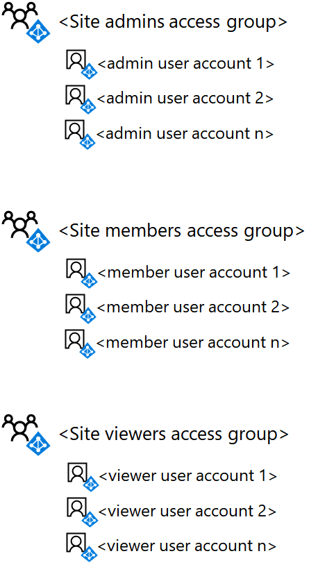

# Deploy an isolated SharePoint Online team site

[!INCLUDE [Microsoft 365 Defender rebranding](../includes/microsoft-defender-for-office.md)]

**Applies to**
- [Microsoft Defender for Office 365 plan 1 and plan 2](office-365-atp.md)
- [Microsoft 365 Defender](../mtp/microsoft-threat-protection.md)

 **Summary:** Deploy a new isolated SharePoint Online team site with these step-by-step instructions.

This article is a step-by-step deployment guide for creating and configuring an isolated SharePoint Online team site in Microsoft Office 365. These steps assume the use of the three default SharePoint groups and corresponding permission levels, with a single Azure Active Directory (AD)-based access group for each level of access.

## Phase 1: Create and populate the team site access groups

In this phase, you create the three Azure AD-based access groups for the three default SharePoint groups and populate them with the appropriate user accounts.

> [!NOTE]
> The following steps assume that all necessary user accounts already exist and are assigned the appropriate licenses. If not, please add them and assign licenses before proceeding to step 1.

### Step 1: List the SharePoint Online admins for the site

Determine the set of user accounts corresponding to the SharePoint Online admins for the isolated team site.

If you are managing user accounts and groups through Microsoft 365 and want to use Windows PowerShell, make a list of their user principal names (UPNs) (example UPN: belindan@contoso.com).

### Step 2: List the members for the site

Determine the set of user accounts corresponding to the members for the isolated team site, those who will be collaborating on resources stored within the site.

If you are managing user accounts and groups through Microsoft 365 and want to use PowerShell, make a list of their UPNs. If there are a lot of site members, you can store the list of UPNs in a text file and add them all with a single PowerShell command.

### Step 3: List the viewers for the site

Determine the set of user accounts corresponding to the viewers of the isolated team site, those who can view the resources stored in the site but not modify them or directly collaborate on their contents.

If you are managing user accounts and groups through Microsoft 365 and want to use PowerShell, make a list of their UPNs. If there are a lot of site members, you can store the list of UPNs in a text file and add them all with a single PowerShell command.

Viewers for the site might include executive management, legal counsel, or inter-departmental stakeholders.

### Step 4: Create the three access groups for the site in Azure AD

You need to create the following access groups in Azure AD:

- Site admins (which will contain the list from step 1)
- Site members (which will contain the list from step 2)
- Site viewers (which will contain the list from step 3)

1. In your browser, go to the Azure portal at <https://portal.azure.com> and sign in with the credentials of an account that has been assigned with User Management Admin or Company Administrator role.

2. In the Azure portal, click **Azure Active Directory > Groups**.

3. On the **Groups - All groups** blade, click **+ New group**.

4. On the **New Group** blade:

   - Select **Security** in **Group type**.

   - Type the group name in **Name**.

   - Type a description of the group in **Group description**.

   - Select **Assigned** in **Membership type**.

5. Click **Create**, and then close the **Group** blade.

6. Repeat steps 3-5 for your additional groups.

> [!NOTE]
> You need to use the Azure portal to create the groups so that they have Office features enabled. If a SharePoint Online isolated site is later configured as a Highly Confidential site with an Azure Information Protection label to encrypt files and assign permission to specific groups, the permitted groups must have been created with Office features enabled. You cannot change the Office features setting of an Azure AD group after it has been created.

Here is your resulting configuration with the three site access groups.


### Step 5. Add the user accounts to the access groups

In this step, do the following:

1. Add the list of users from step 1 to the site admins access group.
2. Add the list of users from step 2 to the site members access group.
3. Add the list of users from step 3 to the site viewers access group.

If you are managing user accounts and groups through Active Directory Domain Services (AD DS), add users to the appropriate access groups using your normal AD DS user and group management procedures and wait for synchronization with your Microsoft 365 subscription.

If you are managing user accounts and groups through Office 365, you can use the Microsoft 365 admin center or PowerShell. If you have duplicate group names for any of the access groups, you should use the Microsoft 365 admin center.

For the Microsoft 365 admin center, sign in with a user account that has been assigned the User Account Administrator or Company Administrator role and use Groups to add the appropriate user accounts and groups to the appropriate access groups.

For PowerShell, first [Connect with the Azure Active Directory PowerShell for Graph module](../../enterprise/connect-to-microsoft-365-powershell.md#connect-with-the-azure-active-directory-powershell-for-graph-module).

Next, use the following command block to add an individual user account to an access group:

```powershell
$userUPN="<UPN of the user account>"
$grpName="<display name of the access group>"
Add-AzureADGroupMember -RefObjectId (Get-AzureADUser | Where { $_.UserPrincipalName -eq $userUPN }).ObjectID -ObjectId (Get-AzureADGroup | Where { $_.DisplayName -eq $grpName }).ObjectID
```

If you stored the UPNs of user accounts for any of the access groups in a text file, you can use the following PowerShell command block to add them all at one time:

```powershell
$grpName="<display name of the access group>"
$fileName="<path and name of the file containing the list of account UPNs>"
$grpID=(Get-AzureADGroup | Where { $_.DisplayName -eq $grpName }).ObjectID
Get-Content $fileName | ForEach { $userUPN=$_; Add-AzureADGroupMember -RefObjectId (Get-AzureADUser | Where { $_.UserPrincipalName -eq $userUPN }).ObjectID -ObjectID $grpID }
```

For PowerShell, use the following command block to add an individual group to an access group:

```powershell
$nestedGrpName="<display name of the group to add to the access group>"
$grpName="<display name of the access group>"
Add-AzureADGroupMember -RefObjectId (Get-AzureADGroup | Where { $_.DisplayName -eq $nestedGrpName }).ObjectID -ObjectID (Get-AzureADGroup | Where { $_.DisplayName -eq $grpName }).ObjectID
```

The results should be the following:

- The site admins Azure AD group contains the site admin user accounts or groups
- The site members Azure AD group contains the site member user accounts or groups
- The site viewers Azure AD group contains the user accounts or groups that can only view the site contents

Validate the list of group members for each access group with the Microsoft 365 admin center or with the following PowerShell command block:

```powershell
$grpName="<display name of the access group>"
Get-AzureADGroupMember -ObjectId (Get-AzureADGroup | Where { $_.DisplayName -eq $grpName }).ObjectID | Sort UserPrincipalName | Select UserPrincipalName,DisplayName,UserType
```

Here is your resulting configuration with the three site access groups populated with user accounts or groups.



## Phase 2: Create and configure the isolated team site

In this phase, you create the isolated SharePoint Online site and configure the permissions for the default SharePoint Online permission levels to use your new Azure AD-based access groups. By default, new team sites include a Microsoft 365 group and other related resources, but in this case, we'll create a team site without a Microsoft 365 group. This allows maintaining permissions entirely through SharePoint.

First, create the SharePoint Online team site with these steps.

1. Sign in to the Microsoft 365 admin center with an account that will also be used to administer the SharePoint Online team site (a SharePoint Online administrator). For help, see [Where to sign in to Office 365](https://support.microsoft.com/office/e9eb7d51-5430-4929-91ab-6157c5a050b4).

2. In the Microsoft 365 admin center, under **Admin centers**, click **SharePoint**.

3. In the SharePoint admin center, expand **Sites** and click **Active sites**.

4. Click **Create**, and then choose **Other options**.

5. In the **Choose a template** list, choose **Team site**.

6. In **Site name**, type a name for the team site.

7. In **Primary administrator**, type the account that you are logged in with.

8. Click **Finish**.

Next, from the new SharePoint Online team site, configure permissions.

1. In the tool bar, click the settings icon, and then click **Site permissions**.

2. Under **Site sharing**, click **Change how members can share**.

3. Choose the **Only site owners can share files, folders, and the site**.

4. Set **Allow access requests** to **Off**.

5. Click **Save**.

6. In the **Permissions** pane, click **Advanced permissions settings**.

7. On the **Permissions** tab of your browser, click **\<site name> Members** in the list.

8. In **People and Groups**, click **New**.

9. In the **Share** dialog box, type the name of the site members access group, select it, and then click **Share**.

10. Click the back button on your browser.

11. Click **\<site name> Owners** in the list.

12. In **People and Groups**, click **New**.

13. In the **Share** dialog box, type the name of the site admins access group, select it, and then click **Share**.

14. Click the back button on your browser.

15. Click **\<site name> Visitors** in the list.

16. In **People and Groups**, click **New**.

17. In the **Share** dialog box, type the name of the site viewers access group, select it, and then click **Share**.

18. Close the **Permissions** tab of your browser.

The results of these permission settings are:

- The **\<site name> Owners** SharePoint group contains the site admins access group, in which all the members have the **Full control** permission level.
- The **\<site name> Members** SharePoint group contains the site members access group, in which all the members have the **Edit** permission level.
- The **\<site name> Visitors** SharePoint group contains the site viewers access group, in which all the members have the **Read** permission level.
- The ability for members to invite other members or for non-members to request access is disabled.

Here is your resulting configuration with the three SharePoint groups for the site configured to use the three access groups, which are populated with user accounts or Azure AD groups.


You and the members of the site, through group membership in one of the access groups, can now collaborate using the resources of the site.

## Next step

When you need to change site access group membership or create a document folder with custom permissions, see [Manage an isolated SharePoint Online team site](manage-an-isolated-sharepoint-online-team-site.md).

## See Also

[Isolated SharePoint Online team sites](isolated-sharepoint-online-team-sites.md)

[Design an isolated SharePoint Online team site](design-an-isolated-sharepoint-online-team-site.md)

[Manage an isolated SharePoint Online team site](manage-an-isolated-sharepoint-online-team-site.md)
