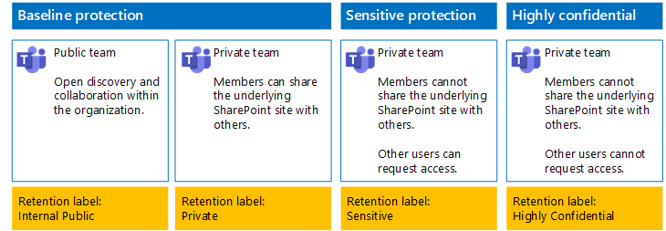
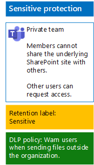

# Protect files in teams with retention labels and DLP

 
Use the steps in this article to design and deploy retention labels and data loss prevention (DLP) policies for baseline, sensitive, and highly confidential teams and their underlying SharePoint sites. For more information about these three tiers of protection, see [Secure files in Microsoft Teams](secure-files-in-teams.md).
  
## How this works

1. Create the desired retention labels and publish these. It can take up to 12 hours for these to be published.
2. For the desired underlying SharePoint sites, edit the document library settings to apply the desired retention labels to items in the library.
3. Create DLP policies to take action based on the retention labels.

When users add a document to the underlying SharePoint site library for the team, the document will receive the assigned retention label by default. Users can change the label, if needed. When a user shares a document outside the organization, DLP will check to see if a label is assigned and take action if a DLP policy matches the label. DLP will look for other policy matches as well, such as protecting files with credit card numbers if this type of policy is configured. 

## Retention labels for your underlying SharePoint sites

There are three phases to creating and then assigning retention labels to underlying SharePoint sites.
  
### Step 1: Determine the retention label names

In this phase, you determine the names of your retention labels for the four levels of information protection applied to underlying SharePoint sites. The following table lists the recommended names for each level.
  
|**underlying SharePoint sites protection level**|**Label name**|
|:-----|:-----|
|Baseline-Public    |Internal public    |
|Baseline-Private    |Private    |
|Sensitive    |Sensitive    |
|Highly Confidential    |Highly Confidential    |
   
### Step 2: Create the retention labels

In this phase, you create and then publish your determined labels for the different levels of information protection.
  
1. Sign in to the [Microsoft 365 compliance portal](https://compliance.microsoft.com) with an account that has the Security Administrator or Company Administrator role.
    
2. From the **Home - Microsoft 365 compliance** tab of your browser, click **Classifications > Labels**.
    
3. Click **Retention labels > Create a label**.
    
4. On the **Name your label** pane, type the name of the label and a description for admins and users, and then click **Next**.

5. On the **File plan descriptors** pane, fill in as needed, and then click **Next**.
    
6. On the **Label settings** pane, if needed, set **Retention** to **On** and configure retention settings. Click **Next**.
    
7. On the **Review your settings** pane, click **Create the label**.
    
8. For your additional labels, click **Create a label**, and then repeat steps 3-7 in this procedure as needed.
    

### Publish your new labels

Next, use these steps to publish the new retention labels.
  
1. From the **Labels** pane, click the **Retention labels** tab, and then click **Publish labels**.
    
2. On the **Choose labels to publish** pane, click **Choose labels to publish**.
    
3. On the **Choose labels** pane, click **Add**, select all four labels, click **Add**.
    
4. Click **Done**.
    
5. On the **Choose labels to publish** pane, click **Next**.
    
6. On the **Choose locations** pane, click **Next**.
    
7. On the **Name your policy** pane, type a name for your set of labels in **Name**, and then click **Next**.
    
8. On the **Review your settings** pane, click **Publish labels**, and then click **Close**.

    
### Step 3: Apply the retention labels to your underlying SharePoint sites

Use these steps to apply the retention labels to the documents folders of your underlying SharePoint sites.
  
1.	From the team, click **Files**, and then click **Open in SharePoint**.

2. In the new SharePoint site tab of your browser, click **Documents**.
    
3. Click the settings icon, and then click **Library settings**.
    
4. Under **Permissions and Management**, click **Apply label to items in this library**.
    
5. In **Settings-Apply Label**, select the appropriate retention label, and then click **Save**.
    
6. Close the tab for the SharePoint site.
    
7. Repeat steps 1-6 to assign retention labels to your additional underlying SharePoint sites.
    
Here is your resulting configuration.
  

  
## DLP policies for your underlying SharePoint sites

Use these steps to configure a DLP policy that notifies users when they share a document on an underlying SharePoint site outside the organization.

1. Sign in to the [Microsoft 365 compliance portal](https://compliance.microsoft.com/) with an account that has the Security Administrator or Company Administrator role.
    
2. On the new **Microsoft 365 compliance** tab in your browser, click **Policies > Data loss prevention**.
    
3. In the **Home > Data loss prevention** pane, click **Create a policy**.
    
4. In the **Start with a template or create a custom policy** pane, click **Custom**, and then click **Next**.
    
5. In the **Name your policy** pane, type the name for the sensitive level DLP policy in **Name**, and then click **Next**.
    
6. In the **Choose locations** pane, click **Let me choose specific locations**, and then click **Next**.
    
7. In the list of locations, disable the **Exchange email**, **OneDrive accounts**, and **Teams chat and channel messages** locations, and then click **Next**.
    
8. In the **Customize the type of content you want to protect** pane, click **Edit**.
    
9. In the **Choose the types of content to protect** pane, click **Add** in the drop-down box, and then click **Retention labels**.
    
10. In the **Retention labels** pane, click **Add**, select the **Sensitive** label, click **Add**, and then click **Done**.
    
11. In the **Choose the types of content to protect** pane, click **Save**.
    
12. In the **Customize the type of content you want to protect** pane, click **Next**.

13. In the **What do you want to do if we detect sensitive info?** pane, click **Customize the tip and email**.
    
14. In the **Customize policy tips and email notifications** pane, click **Customize the policy tip text**.
    
15. In the text box, type or paste in one of the following tips:
    
  - To share with a user outside the organization, download the file and then open it. Click File, then Protect Document, and then Encrypt with Password, and then specify a strong password. Send the password in a separate email or other means of communication.
  - Highly confidential files are protected with encryption. Only external users who are granted permissions to these files by your IT department can read them.
    
    Alternately, type or paste in your own policy tip that instructs users on how to share a file outside your organization.
    
16. Click **OK**.
    
17. In the **What do you want to do if we detect sensitive info?** pane, click **Next**.
    
18. In the **Do you want to turn on the policy or test things out first?** pane, click **Yes, turn it on right away**, and then click **Next**.
    
19. In the **Review your settings** pane, click **Create**, and then click **Close**.
    
Here is your resulting configuration for sensitive teams.
  

  
Next, use these steps to configure a DLP policy that blocks users when they share a document on an underlying SharePoint site outside the organization.
  
1. On the new **Microsoft 365 compliance** tab in your browser, click **Policies > Data loss prevention**.
    
2. In the **Data loss prevention** pane, click **Create a policy**.
    
3. In the **Start with a template or create a custom policy** pane, click **Custom**, and then click **Next**.
    
4. In the **Name your policy** pane, type the name for the highly sensitive level DLP policy in **Name**, and then click **Next**.
    
5. In the **Choose locations** pane, click **Let me choose specific locations**, and then click **Next**.
    
6. In the list of locations, disable the **Exchange email**, **OneDrive accounts**, and **Teams chat and channel messages** locations, and then click **Next**.
    
7. In the **Customize the types of sensitive info you want to protect** pane, click **Edit**.
    
8. In the **Choose the types of content to protect** pane, click **Add** in the drop-down box, and then click **Retention labels**.
    
9. In the **Retention labels** pane, click **Add**, select the **Highly Confidential** label, click **Add**, and then click **Done**.
    
10. In the **Choose the types of content to protect** pane, click **Save**.
    
12. In the **Customize the types of sensitive info you want to protect** pane, click **Next**.
    
13. In the **What do you want to do if we detect sensitive info?** pane, click **Customize the tip and email**.
    
14. In the **Customize policy tips and email notifications** pane, click **Customize the policy tip text**.
    
15. In the text box, type or paste in the following:
    
  - To share with a user outside the organization, download the file and then open it. Click File, then Protect Document, and then Encrypt with Password, and then specify a strong password. Send the password in a separate email or other means of communication.
    
    Alternately, type or paste in your own policy tip that instructs users on how to share a file outside your organization.
    
16. Click **OK**.
    
17. In the **What do you want to do if we detect sensitive info?** pane, under **Detect when a specific amount of sensitive info is being shared at one time**, click **Restrict access or encrypt the content**, and then click **Next**.
    
18. In the **Do you want to turn on the policy or test things out first?** pane, click **Yes, turn it on right away**, and then click **Next**.
    
19. In the **Review your settings** pane, click **Create**, and then click **Close**.
    
Here is your resulting configuration for high confidentiality team.
  

  
## Next step

[Protect files in teams with sensitivity labels](deploy-teams-sensitivity-labels.md)
    
## See Also

[Secure files in Microsoft Teams](secure-files-in-teams.md)
  
[Cloud adoption and hybrid solutions](https://docs.microsoft.com/office365/enterprise/cloud-adoption-and-hybrid-solutions)

