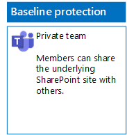
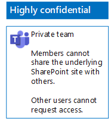

# Deploy teams for three tiers of protection for files

Use the steps in this article to design and deploy baseline, sensitive, and highly confidential teams. For more information about these three tiers of protection, see [Secure files in Microsoft Teams](secure-files-in-teams.md).

## Baseline teams

Baseline protection includes both public and private teams. Public teams can be discovered and accessed by anybody in the organization. Private sites can only be discovered and accessed by members of the Office 365 group associated with the team. Both of these types of teams allow members to share the site with others.

### Public

Follow the instructions in [this article](https://support.office.com/article/174adf5f-846b-4780-b765-de1a0a737e2b) to create a baseline Team with public access and permissions.

Here is your resulting configuration.

### Private

Follow the instructions in [this article](https://support.office.com/article/174adf5f-846b-4780-b765-de1a0a737e2b) to create a baseline Team with private access and permissions.

Here is your resulting configuration.

## Sensitive teams

For a sensitive team, you start by [creating a private team](https://support.office.com/article/174adf5f-846b-4780-b765-de1a0a737e2b).

Next, you configure the underlying SharePoint site to prevent sharing by team members.

1. In the tool bar for the team, click **Files**.

2. Click the ellipsis, and then click **Open in SharePoint**.

3. In the tool bar of the underlying SharePoint site, click the settings icon, and then click **Site permissions**.

4. In the **Site permissions** pane, under **Sharing Settings**, click **Change sharing settings**.

5. Under **Sharing permissions**, choose **Only site owners can share files, folders, and the site**, and then click **Save**.

Here is your resulting configuration.

## Highly confidential teams

With a highly confidential team, you start by [creating a private team](https://support.office.com/article/174adf5f-846b-4780-b765-de1a0a737e2b).

Next, you configure the underlying SharePoint site to prevent sharing by team members and the requesting of access by non-members of the team.

1. In the tool bar for the team, click **Files**.

2. Click the ellipsis, and then click **Open in SharePoint**.

3. In the tool bar of the underlying SharePoint site, click the settings icon, and then click **Site permissions**.

4. In the **Site permissions** pane, under **Sharing Settings**, click **Change sharing settings**.

5. Under **Sharing permissions**, choose **Only site owners can share files, folders, and the site**.

6. Turn off **Allow access requests**, and then click **Save**.

Here is your resulting configuration.

## Next step

[Protect files in teams with retention labels and DLP](deploy-teams-retention-DLP.md)

## See also

[Secure files in Microsoft Teams](secure-files-in-teams.md)

[Cloud adoption and hybrid solutions](https://docs.microsoft.com/office365/enterprise/cloud-adoption-and-hybrid-solutions)
