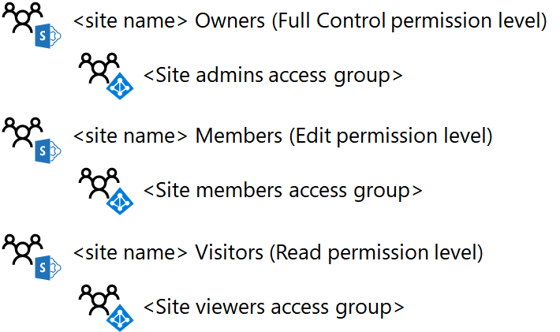

# Design an isolated SharePoint Online team site

[!INCLUDE [Microsoft 365 Defender rebranding](../includes/microsoft-defender-for-office.md)]

 **Summary:** Step through the design process for isolated SharePoint Online team sites.

This article takes you through the key design decisions you must make before creating an isolated SharePoint Online team site.

## Phase 1: Determine your SharePoint groups and permission levels

Every SharePoint Online team site by default is created with the following SharePoint groups:

- \<site name> Members

- \<site name> Visitors

- \<site name> Owners

These groups are separate from Microsoft 365 and Azure Active Directory (AD) groups and are the basis for assigning permissions for the resources of the site.

The set of specific permissions that determines what a member of a SharePoint group can do in a site is a permission level. There are three permission levels by default for a SharePoint Online team site: Edit, Read, and Full control. The following table shows the default correlation of SharePoint groups and assigned permission levels:

****

|SharePoint group|Permission level|
|---|---|
|\<site name> Members|Edit|
|\<site name> Visitors|Read|
|\<site name> Owners|Full control|
|

 **Best practice:** You can create additional SharePoint groups and permission levels. However, we recommend using the default SharePoint groups and permission levels for your isolated SharePoint Online site.

Here are the default SharePoint groups and permission levels.

## Phase 2: Assign permissions to users with access groups

You can assign permissions to users by adding their user account, or a Microsoft 365 or Azure AD group of which the user account is a member, to the SharePoint groups. Once added, the user accounts, either directly or indirectly via membership in a Microsoft 365 or Azure AD group, are assigned the permission level associated with the SharePoint group.

Using the default SharePoint groups as an example:

- Members of the **\<site name> Members** SharePoint group, which can include both user accounts and groups, are assigned the **Edit** permission level

- Members of the **\<site name> Visitors** SharePoint group, which can include both user accounts and groups, are assigned the **Read** permission level

- Members of the **\<site name> Owners** SharePoint group, which can include both user accounts and groups, are assigned the **Full control** permission level

 **Best practice:** Although you can manage permissions through individual user accounts, we recommend that you use a single Azure AD group, known as an access group, instead. This simplifies the management of permissions through membership in the access group, rather than managing the list of user accounts for each SharePoint group.

Azure AD groups for Microsoft 365 are different tha Microsoft 365 groups. Azure AD groups appear in the Microsoft 365 admin center with their **Type** set to **Security** and do not have an email address. Azure AD groups can be managed within:

- Active Directory Domain Services (AD DS)

    These are groups that have been created in your on-premises AD DS infrastructure and synchronized to your Microsoft 365 subscription. In the Microsoft 365 admin center, these groups have a **Status** of **Synched with active directory**.

- Office 365

    These are groups that have been created using either the Microsoft 365 admin center, the Azure portal, or Microsoft PowerShell. In the Microsoft 365 admin center, these groups have a **Status** of **Cloud**.

 **Best practice:** If you are using AD DS on-premises and synchronizing with your Microsoft 365 subscription, perform your user and group management with AD DS.

For isolated SharePoint Online team sites, the recommended group structure looks like this:

****

|SharePoint group|Azure AD-based access group|Permission level|
|---|---|---|
|\<site name> Members|\<site name> Members|Edit|
|\<site name> Visitors|\<site name> Viewers|Read|
|\<site name> Owners|\<site name> Admins|Full control|
|

 **Best practice:** Although you can use either Microsoft 365 or Azure AD groups as members of SharePoint groups, we recommend that you use Azure AD groups. Azure AD groups, managed either through AD DS or Microsoft 365, give you more flexibility to use nested groups to assign permissions.

Here are the default SharePoint groups configured to use Azure AD-based access groups.

When designing the three access groups, keep the following in mind:

- There should be only a few members in the **\<site name> Admins** access group, corresponding to a small number of SharePoint Online administrators who are managing the team site.

- Most of your site members are in the **\<site name> Members** or **\<site name> Viewers** access groups. Because site members in the **\<site name> Members** access group have the ability to delete or modify resources in the site, carefully consider its membership. When in doubt, add the site member to the **\<site name> Viewers** access group.

Here is an example of the SharePoint groups and access groups for an isolated site named ProjectX.

## Phase 3: Use nested Azure AD groups

For a project confined to a small number of people, a single level of Azure AD-based access groups added to the SharePoint groups of the site will fit most scenarios. However, if you have a large number of people and those people are already members of established Azure AD groups, you can more easily assign SharePoint permissions by using nested groups, or groups that contain other groups as members.

For example, you want to create an isolated SharePoint online team site for collaboration among the executives of the sales, marketing, engineering, legal, and support departments and those departments already their own groups with executive user account membership. Rather than creating a new group for the new site members and placing all the individual executive user accounts in it, put the existing executive groups for each department in the new group.

 If you are sharing a Microsoft 365 subscription between multiple organizations, a single level of group membership for an isolated site for an organization might become difficult to manage due to the sheer number of user accounts. In this case, you can use nested Azure AD groups for each organization that contain the groups within their organizations to manage the permissions.

To use nested Azure AD groups:

1. Identify or create the Azure AD groups that will contain user accounts and add the appropriate user accounts as members.

2. Create the container Azure AD-based access group that will contain the other Azure AD groups and add those groups as members.

3. For the appropriate level of access for the container access group, identify the SharePoint group and corresponding permission level.

> [!NOTE]
> You cannot use nested Microsoft 365 groups.

Here is an example of nested Azure AD groups for the ProjectX member access group.

Because all of the user accounts in the Research, Engineering, and Project leads teams are intended to be site members, it is easier to add their Azure AD groups to the ProjectX Members access group.

## Next step

When you are ready to create and configure an isolated site in production, see [Deploy an isolated SharePoint Online team site](deploy-an-isolated-sharepoint-online-team-site.md).

## See Also

[Isolated SharePoint Online team sites](isolated-sharepoint-online-team-sites.md)

[Manage an isolated SharePoint Online team site](manage-an-isolated-sharepoint-online-team-site.md)

[Deploy an isolated SharePoint Online team site](deploy-an-isolated-sharepoint-online-team-site.md)
