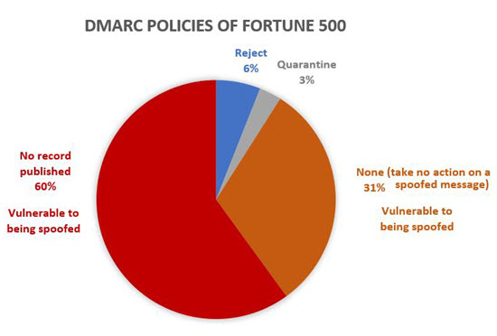
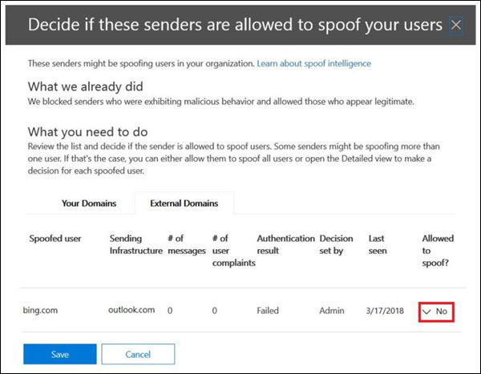

# Email authentication in EOP

[!INCLUDE [Microsoft 365 Defender rebranding](../includes/microsoft-defender-for-office.md)]

**Applies to**
- [Exchange Online Protection](exchange-online-protection-overview.md)
- [Microsoft Defender for Office 365 plan 1 and plan 2](office-365-atp.md)
- [Microsoft 365 Defender](../mtp/microsoft-threat-protection.md)


Email authentication (also known as email validation) is a group of standards that tries to stop spoofing (email messages from forged senders). In all Microsoft 365 organizations, EOP uses these standards to verify inbound email:

- [SPF](set-up-spf-in-office-365-to-help-prevent-spoofing.md)

- [DKIM](use-dkim-to-validate-outbound-email.md)

- [DMARC](use-dmarc-to-validate-email.md)

Email authentication verifies that email messages from a sender (for example, laura@contoso.com) are legitimate and come from expected sources for that email domain (for example, contoso.com.)

The rest of this article explains how these technologies work, and how EOP uses them to check inbound email.

## Use email authentication to help prevent spoofing

DMARC prevents spoofing by examining the **From** address in messages. The **From** address is the sender's email address that users see in their email client. Destination email organizations can also verify that the email domain has passed SPF or DKIM. In other words, the domain has been authenticated and therefore the sender's email address is not spoofed.

However, DNS records for SPF, DKIM, and DMARC (collectively known as email authentication policies) are optional. Domains with strong email authentication policies like microsoft.com and skype.com are protected from spoofing. But domains with weaker email authentication policies, or no policy at all, are prime targets for being spoofed.

As of March 2018, only 9% of domains of companies in the Fortune 500 publish strong email authentication policies. The remaining 91% of companies might be spoofed by an attacker. Unless some other email filtering mechanism is in-place, email from spoofed senders in these domains might be delivered to users.



The proportion of small-to-medium sized companies that publish strong email authentication policies is smaller. And the number is even smaller for email domains outside North America and western Europe.

Lack of strong email authentication policies is a large problem. W while organizations might not understand how email authentication works, attackers fully understand, and they take advantage. Because of phishing concerns and the limited adoption of strong email authentication policies, Microsoft uses *implicit email authentication* to check inbound email.

Implicit email authentication is an extension of regular email authentication policies. These extensions include: sender reputation, sender history, recipient history, behavioral analysis, and other advanced techniques. In the absence of other signals from these extensions, messages sent from domains that don't use email authentication policies will be marked as spoof.

To see Microsoft's general announcement, see [A Sea of Phish Part 2 - Enhanced Anti-spoofing in Microsoft 365](https://techcommunity.microsoft.com/t5/Security-Privacy-and-Compliance/Schooling-A-Sea-of-Phish-Part-2-Enhanced-Anti-spoofing/ba-p/176209).

## Composite authentication

If a domain doesn't have traditional SPF, DKIM, and DMARC records, those record checks don't communicate enough authentication status information. Therefore, Microsoft has developed an algorithm for implicit email authentication. This algorithm combines multiple signals into a single value called _composite authentication_, or `compauth` for short. The `compauth` value is stamped into the **Authentication-Results** header in the message headers.

```text
Authentication-Results:
   compauth=<fail | pass | softpass | none> reason=<yyy>
```

These values are explained at [Authentication-results message header](anti-spam-message-headers.md#authentication-results-message-header).

By examining the message headers, admins or even end users can determine how Microsoft 365 determined that the sender is spoofed.

## Why email authentication is not always enough to stop spoofing

Relying only on email authentication records to determine if an incoming message is spoofed has the following limitations:

- The sending domain might lack the required DNS records, or the records are incorrectly configured.

- The source domain has correctly configured DNS records, but that domain doesn't match the domain in the From address. SPF and DKIM don't require the domain to be used in the From address. Attackers or legitimate services can register a domain, configure SPF and DKIM for the domain, and use a completely different domain in the From address. Messages from senders in this domain will pass SPF and DKIM.

Composite authentication can address these limitations by passing messages that would otherwise fail email authentication checks.

For simplicity, the following examples concentrate on email authentication results. Other back-end intelligence factors could identify messages that pass email authentication as spoofed, or messages that fail email email authentication as legitimate.

For example, the fabrikam.com domain has no SPF, DKIM, or DMARC records. Messages from senders in the fabrikam.com domain can fail composite authentication (note the `compauth` value and reason):

```text
Authentication-Results: spf=none (sender IP is 10.2.3.4)
  smtp.mailfrom=fabrikam.com; contoso.com; dkim=none
  (message not signed) header.d=none; contoso.com; dmarc=none
  action=none header.from=fabrikam.com; compauth=fail reason=001
From: chris@fabrikam.com
To: michelle@contoso.com
```

If fabrikam.com configures an SPF without a DKIM record, the message can pass composite authentication. The domain that passed SPF checks is aligned with the domain in the From address:

```text
Authentication-Results: spf=pass (sender IP is 10.2.3.4)
  smtp.mailfrom=fabrikam.com; contoso.com; dkim=none
  (message not signed) header.d=none; contoso.com; dmarc=bestguesspass
  action=none header.from=fabrikam.com; compauth=pass reason=109
From: chris@fabrikam.com
To: michelle@contoso.com
```

If fabrikam.com configures a DKIM record without an SPF record, the message can pass composite authentication. The domain in the DKIM signature is aligned with the domain in the From address:

```text
Authentication-Results: spf=none (sender IP is 10.2.3.4)
  smtp.mailfrom=fabrikam.com; contoso.com; dkim=pass
  (signature was verified) header.d=outbound.fabrikam.com;
  contoso.com; dmarc=bestguesspass action=none
  header.from=fabrikam.com; compauth=pass reason=109
From: chris@fabrikam.com
To: michelle@contoso.com
```

If the domain in SPF or the DKIM signature doesn't align with the domain in the From address, the message can fail composite authentication:

```text
Authentication-Results: spf=none (sender IP is 192.168.1.8)
  smtp.mailfrom=maliciousdomain.com; contoso.com; dkim=pass
  (signature was verified) header.d=maliciousdomain.com;
  contoso.com; dmarc=none action=none header.from=contoso.com;
  compauth=fail reason=001
From: chris@contoso.com
To: michelle@fabrikam.com
```

## Solutions for legitimate senders who are sending unauthenticated email

Microsoft 365 keeps track of who is sending unauthenticated email to your organization. If the service thinks the sender is not legitimate, it will mark messages from this sender as a composite authentication failure. To avoid this verdict, you can use the recommendations in this section.

### Configure email authentication for domains you own

You can use this method to resolve intra-org spoofing and cross-domain spoofing in cases where you own or interact with multiple tenants. It also helps resolve cross-domain spoofing where you send to other customers within Microsoft 365 or third parties that are hosted by other providers.

- [Configure SPF records](set-up-spf-in-office-365-to-help-prevent-spoofing.md) for your domains.

- [Configure DKIM records](use-dkim-to-validate-outbound-email.md) for your primary domains.

- [Consider setting up DMARC records](use-dmarc-to-validate-email.md) for your domain to determine your legitimate senders.

Microsoft doesn't provide detailed implementation guidelines for SPF, DKIM, and DMARC records. However, there's many information available online. There are also third party companies dedicated to helping your organization set up email authentication records.

#### You don't know all sources for your email

Many domains don't publish SPF records because they don't know all of the email sources for messages in their domain. Start by publishing an SPF record that contains all of the email sources you know about (especially where your corporate traffic is located), and publish the neutral SPF policy `?all`. For example:

```text
fabrikam.com IN TXT "v=spf1 include:spf.fabrikam.com ?all"
```

This example means that email from your corporate infrastructure will pass email authentication, but email from unknown sources will fall back to neutral.

Microsoft 365 will treat inbound email from your corporate infrastructure as authenticated. Email from unidentified sources might still be marked as spoof if it fails implicit authentication. However, this is still an improvement from all email being marked as spoof by Microsoft 365.

Once you've gotten started with an SPF fallback policy of `?all`, you can gradually discover and include more email sources for your messages, and then update your SPF record with a stricter policy.

### Use spoof intelligence to configure permitted senders of unauthenticated email

You can also use [spoof intelligence](learn-about-spoof-intelligence.md) to permit senders to transmit unauthenticated messages to your organization.

For external domains, the spoofed user is the domain in the From address, while the sending infrastructure is either the source IP address (divided up into /24 CIDR ranges), or the organizational domain of the reverse DNS (PTR) record.

In the screenshot below, the source IP might be 131.107.18.4 with the PTR record outbound.mail.protection.outlook.com. This would show up as outlook.com for the sending infrastructure.

To permit this sender to send unauthenticated email, change the **No** to a **Yes**.



### Create an allow entry for the sender/recipient pair

To bypass spam filtering, some parts of filtering for phishing, but not malware filtering for specific senders, see [Create safe sender lists in Microsoft 365](create-safe-sender-lists-in-office-365.md).

### Ask the sender to configure email authentication for domains you don't own

Because of the problem of spam and phishing, Microsoft recommends email authentication for all email organizations. Instead of configuring manual overrides in your organization, you can ask an admin in the sending domain to configure their email authentication records.

- Even if they didn't need to publish email authentication records in the past, they should do so if they send email to Microsoft.

- Set up SPF to publish the domain's sending IP addresses, and set up DKIM (if available) to digitally sign messages. They should also consider setting up DMARC records.

- If they use bulk senders to send email on their behalf, verify that the domain in the From address (if it belongs to them) aligns with the domain that passes SPF or DMARC.

- Verify the following locations (if they use them) are included in the SPF record:

  - On-premises email servers.
  - Email sent from a software-as-a-service (SaaS) provider.
  - Email sent from a cloud-hosting service (Microsoft Azure, GoDaddy, Rackspace, Amazon Web Services, etc.).

- For small domains that are hosted by an ISP, configure the SPF record according to the instructions from the ISP.

While it may be difficult at first to get sending domains to authenticate, over time, as more and more email filters start junking or even rejecting their email, it will cause them to set up the proper records to ensure better delivery. Also, their participation can help in the fight against phishing, and can reduce the possibility of phishing in their organization or organizations that they send email to.

#### Information for infrastructure providers (ISPs, ESPs, or cloud hosting services)

If you host a domain's email or provide hosting infrastructure that can send email, you should do the following steps:

- Ensure your customers have documentation that explains how your customers should configure their SPF records

- Consider signing DKIM-signatures on outbound email, even if the customer doesn't explicitly set it up (sign with a default domain). You can even double-sign the email with DKIM signatures (once with the customer's domain if they have set it up, and a second time with your company's DKIM signature)

Deliverability to Microsoft is not guaranteed even if you authenticate email originating from your platform, but at least it ensures that Microsoft does not junk your email because it isn't authenticated.

## Related links

For more information about service providers best practices, see [M3AAWG Mobile Messaging Best Practices for Service Providers](https://www.m3aawg.org/sites/default/files/m3aawg-mobile-messaging-best-practices-service-providers-2015-08_0.pdf).

Learn how Office 365 uses SPF and supports DKIM validation:

- [More about SPF](how-office-365-uses-spf-to-prevent-spoofing.md)

- [More about DKIM](support-for-validation-of-dkim-signed-messages.md)
