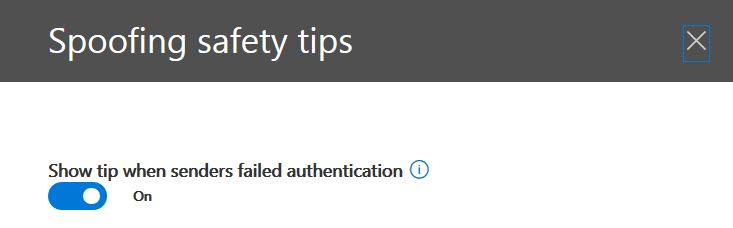
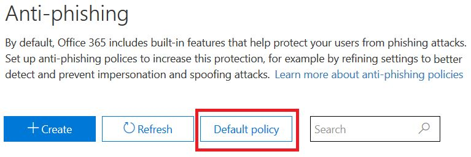
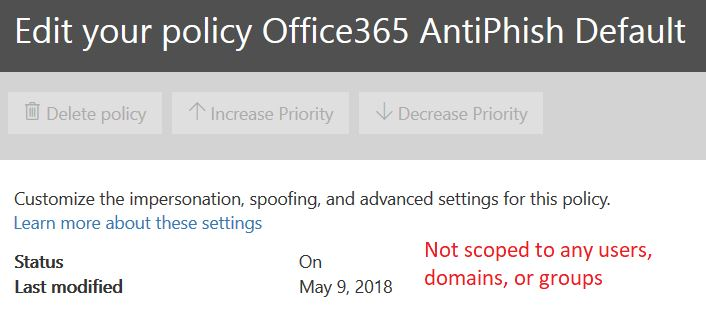
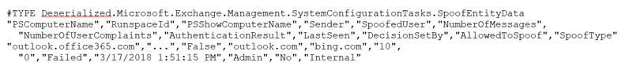

# Email authentication in Office 365

Email authentication (also known as email validation) is a group of standards that tries to stop spoofing (email messages from forged senders). In Office 365 organizations with Exchange Online mailboxes and standalone Exchange Online Protection (EOP) organizations without Exchange Online mailboxes, EOP useses the standards to verify inbound email:

- [SPF](how-office-365-uses-spf-to-prevent-spoofing.md)

- [DKIM](support-for-validation-of-dkim-signed-messages.md)

- [DMARC](use-dmarc-to-validate-email.md)
Email authentication verify email messages are sent by that sender email addresses in messages (for example, laura@contoso.com) are legitimate and come from expected sources for that email domain (for example, contoso.com.)

The rest of this topic explains how these technologies work, and how EOP uses them to check inbound email.

## Use email authentication to help prevent spoofing

DMARC prevents spoofing by examining the **From** address in messages (the sender email address that users see in their email client). Destination email organizations can also verify that the email domain has passed SPF or DKIM, which means that the domain has been authenticated and is therefore not spoofed. 

However, the problem is that SPF, DKIM, and DMARC records in DNS for email authentication (collectively known as email authentication polices) are completely optional. Therefore, while domains with strong email authentication policies like microsoft.com and skype.com are protected from spoofing, domains that publish weaker email authentication policies, or no policy at all, are prime targets for being spoofed.

As of March 2018, only 9% of domains of companies in the Fortune 500 publish strong email authentication policies. The remaining 91% of companies might be spoofed by a attacker. Unless some other email filtering mechanism is in-place, email from spoofed senders in these domains might be delivered to users.


The proportion of small-to-medium sized companies that are not in the Fortune 500 that publish strong email authentication policies is smaller, and smaller still for email domains that are outside of North America and western Europe.

This is a big problem because while enterprises may not be aware of how email authentication works, attackers fully understand and take advantage it. Because phishing is such a problem, and because of the limited adoption of strong email authentication policies, Microsoft uses *implicit email authentication* to check inbound email.

Implicit email authentication is built on numerous extensions to regular email authentication policies. These extensions include sender reputation, sender history, recipient history, behavioral analysis, and other advanced techniques. A message sent from a domain that doesn't use email authentication policies will be marked as spoof unless it contains other signals to indicate that it's legitimate.

To see Microsoft's general announcement, see [A Sea of Phish Part 2 - Enhanced Anti-spoofing in Office 365](https://techcommunity.microsoft.com/t5/Security-Privacy-and-Compliance/Schooling-A-Sea-of-Phish-Part-2-Enhanced-Anti-spoofing/ba-p/176209).

## Composite authentication

While SPF, DKIM, and DMARC are all useful by themselves, they don't communicate enough authentication status in the event a message has no explicit authentication records. Therefore, Microsoft has developed an algorithm for implicit email authentication that combines multiple signals into a single value called _composite authentication_, or compauth for short. The compauth value is stamped into the **Authentication-Results** header in the message headers.

> Authentication-Results:<br/>&nbsp;&nbsp;&nbsp;compauth=\<fail | pass | softpass | none\> reason=\<yyy\>

The values are explained at [Authentication-results message header fields used by Office 365 email authentication](anti-spam-message-headers.md#authentication-results-message-header-fields-used-by-office-365-email-authentication).

By looking at the headers of a message, admins or even end users can determine how Office 365 arrived at the conclusion that the sender is spoofed.

### Differentiate between different types of spoofing

Microsoft differentiates between two different types of spoofed messages:

- **Intra-org spoofing**: Also known as self-to-self spoofing. For example:

  - The sender and recipient are in the same domain. For example:
    > From: chris@contoso.com <br/> To: michelle@contoso.com

  - The sender and the recipient are in subdomains of the same domain:
    > From: laura@marketing.fabrikam.com <br/> To: julia@engineering.fabrikam.com

  - The sender and recipient are in different domains that belong to the same organization (that is, both domains are configured as [accepted domains](https://docs.microsoft.com/exchange/mail-flow-best-practices/manage-accepted-domains/manage-accepted-domains) in the same organization):
    > From: sender @ microsoft.com <br/> To: recipient @ bing.com

    Spaces are used in the email addresses to prevent spambot harvesting.

  Messages that fail composite authentication due to intra-org spoofing contain the following header values:

  `Authentication-Results: ... compauth=fail reason=6xx`

  `X-Forefront-Antispam-Report: ...CAT:SPM/HSPM/PHSH;...SFTY:9.11`

  - `reason=6xx` indicates intra-org spoofing.

  - CAT is the category of the message, and it is normally SPM (spam), but occasionally might be HSPM (high confidence spam) or PHISH (phishing) depending upon what other types of patterns were detected in the message.

  - SFTY is the safety level of the message. 9 indicates phishing, .11 indicates intra-org spoofing.

- **Cross-domain spoofing**: The sender and recipient domains are different, and have no relationship to each other (also known as external domains). For example:
    > From: chris@contoso.com <br/> To: michelle@tailspintoys.com

  Messages that fail composite authentication due to cross-domain spoofing contain the following headers values:

  `Authentication-Results: ... compauth=fail reason=000/001`

  `X-Forefront-Antispam-Report: ...CAT:SPOOF;...SFTY:9.22`

  - `reason=000` value indicates the message failed explicit email authentication. `reason=001` indicates the message failed implicit email authentication.

  - SFTY is the safety level of the message. 9 indicates phishing, .22 indicates cross-domain spoofing.

For both intra-org and cross-domain spoofing, the following red safety tip is stamped on the message:

> The sender failed our fraud detection checks and may not be who they appear to be.

You can only differentiate between intra-org spoofing and cross-domain spoofing when you compare the From address to the recipient's address, or by inspecting the message headers.

## Why email authentication is not always enough to stop spoofing

If a domain has no SPF records or if they're incorrectly configured, messages from senders in the domain will be identified as spoofed unless the destination email service has back-end intelligence that says the message is legitimate.

For example, prior to spoof intelligence, inbound messages from senders in the fabrikam domain would have the following values stamped in the message header if the fabrikam domain has no SPF, DKIM, or DMARC records:

> Authentication-Results: spf=none (sender IP is 10.2.3.4)<br/>&nbsp;&nbsp;&nbsp;smtp.mailfrom=fabrikam.com; contoso.com; dkim=none<br/>&nbsp;&nbsp;&nbsp;(message not signed) header.d=none; contoso.com; dmarc=none<br/>&nbsp;&nbsp;&nbsp;action=none header.from=fabrikam.com;<br/>From: chris@fabrikam.com<br/>To: michelle@ contoso.com

With spoof intelligence and implicit email authentication, the same message is stamped with the additional value `compauth=fail reason=001`.

If fabrikam.com configures an SPF without a DKIM record, the message would pass composite authentication, because the domain that passed SPF is aligned with the domain in the From address:

> Authentication-Results: spf=pass (sender IP is 10.2.3.4)<br/>&nbsp;&nbsp;&nbsp;smtp.mailfrom=fabrikam.com; contoso.com; dkim=none<br/>&nbsp;&nbsp;&nbsp;(message not signed) header.d=none; contoso.com; dmarc=bestguesspass<br/>&nbsp;&nbsp;&nbsp;action=none header.from=fabrikam.com; compauth=pass reason=109<br/>From: chris@fabrikam.com<br/>To: michelle@ contoso.com

If fabrikam.com configures a DKIM record without an SPF record, the message would also pass composite authentication, because the domain in the DKIM-Signature that passed is aligned with the domain in the From address:

> Authentication-Results: spf=none (sender IP is 10.2.3.4)<br/>&nbsp;&nbsp;&nbsp;smtp.mailfrom=fabrikam.com; contoso.com; dkim=pass<br/>&nbsp;&nbsp;&nbsp;(signature was verified) header.d=outbound.fabrikam.com;<br/>&nbsp;&nbsp;&nbsp;contoso.com; contoso.com; dmarc=bestguesspass action=none<br/>&nbsp;&nbsp;&nbsp;action=none<br/>&nbsp;&nbsp;&nbsp;header.from=fabrikam.com; compauth=pass reason=109<br/>From: chris@fabrikam.com<br/>To: michelle@ contoso.com

```text
Authentication-Results: spf=none (sender IP is 10.2.3.4)
  smtp.mailfrom=fabrikam.com; contoso.com; dkim=pass
  (signature was verified) header.d=outbound.fabrikam.com;
  contoso.com; dmarc=bestguesspass action=none
  header.from=fabrikam.com; compauth=pass reason=109
From: chris@fabrikam.com
To: michelle@contoso.com
```

However, a attacker may also set up SPF and DKIM and sign the message with their own domain, but specify a different domain in the From: address. Neither SPF nor DKIM requires the domain to align with the domain in the From: address, so unless fabrikam.com published DMARC records, this would not be marked as a spoof using DMARC:

```text
Authentication-Results: spf=pass (sender IP is 172.17.17.8)
  smtp.mailfrom=maliciousDomain.com; contoso.com; dkim=pass
  (signature was verified) header.d=maliciousDomain.com;
  contoso.com; dmarc=none action=none header.from=fabrikam.com;
From: chris@fabrikam.com
To: michelle@contoso.com
```

In the email client (Outlook, Outlook on the web, or any other email client), only the From: domain is displayed, not the domain in the SPF or DKIM, and that can mislead the user into thinking the message came from fabrikam.com, but actually came from maliciousDomain.com.


For that reason, Office 365 requires that the domain in the From: address aligns with the domain in the SPF or DKIM signature, and if it doesn't, contains some other internal signals that indicates that the message is legitimate. Otherwise, the message would be a compauth fail.

```text
Authentication-Results: spf=none (sender IP is 5.6.7.8)
  smtp.mailfrom=maliciousDomain.com; contoso.com; dkim=pass
  (signature was verified) header.d=maliciousDomain.com;
  contoso.com; dmarc=none action=none header.from=contoso.com;
  compauth=fail reason=001
From: sender@contoso.com
To: someone@fabrikam.com
```

Thus, Office 365 anti-spoofing protects against domains with no authentication, and against domains who set up authentication but mismatch against the domain in the From: address as that is the one that the user sees and believes is the sender of the message. This is true both of domains external to your organization, as well as domains within your organization.

Therefore, if you ever receive a message that failed composite authentication and is marked as spoofed, even though the message passed SPF and DKIM, it's because the domain that passed SPF and DKIM are not aligned with the domain in the From: address.

### Understanding changes in how spoofed emails are treated

Currently, for all organizations in Office 365 - ATP and non-ATP - messages that fail DMARC with a policy of reject or quarantine are marked as spam and usually take the high confidence spam action, or sometimes the regular spam action (depending on whether other spam rules first identify it as spam). Intra-org spoof detections take the regular spam action. This behavior does not need to be enabled, nor can it be disabled.

However, for cross-domain spoofing messages, before this change they would go through regular spam, phish, and malware checks and if other parts of the filter identified them as suspicious, would mark them as spam, phish, or malware respectively. With the new cross-domain spoofing protection, any message that can't be authenticated will, by default, take the action defined in the Anti-phishing \> Anti-spoofing policy. If one is not defined, it will be moved to a users Junk Email folder. In some cases, more suspicious messages will also have the red safety tip added to the message.

This may result in some messages that were previously marked as spam still getting marked as spam but will now also have a red safety tip; in other cases, messages that were previously marked as non-spam will start getting marked as spam (CAT:SPOOF) with a red safety tip added. In still other cases, customers that were moving all spam and phish to the quarantine would now see them going to the Junk Mail Folder (this behavior can be changed, see [Changing your anti-spoofing settings](#changing-your-anti-spoofing-settings)).

There are multiple different ways a message can be spoofed (see  [Differentiating between different types of spoofing](#differentiating-between-different-types-of-spoofing) earlier in this article) but as of March 2018 the way Office 365 treats these messages is not yet unified. The following table is a quick summary, with Cross-domain spoofing protection being new behavior:

|||||
|---|---|---|---|
|**Type of spoof**|**Category**|**Safety tip added?**|**Applies to**|
|DMARC fail (quarantine or reject)|HSPM (default), may also be SPM or PHSH|No (not yet)|All Office 365 customers, Outlook.com|
|Self-to-self|SPM|Yes|All Office 365 organizations, Outlook.com|
|Cross-domain|SPOOF|Yes|Office 365 Advanced Threat Protection and E5 customers|
|

### Changing your anti-spoofing settings

To create or update your (cross-domain) anti-spoofing settings, navigate to the Anti-phishing \> Anti-spoofing settings under the Threat Management \> Policy tab in the Security & Compliance Center. If you have never created any anti-phishing settings, you will need to create one:


If you've already created one, you can select it to modify it:


Select the policy you just created and proceed through the steps as described in [Learn more about spoof intelligence](learn-about-spoof-intelligence.md).




To create a new policy by using PowerShell:

```powershell
$org = Get-OrganizationConfig
$name = "My first anti-phishing policy for " + $org.Name
# Note: The name should not exclude 64 characters, including spaces.
# If it does, you will need to pick a smaller name.
# Next, create a new anti-phishing policy with the default values
New-AntiphishPolicy -Name $Name
# Select the domains to scope it to
# Multiple domains are specified in a comma-separated list
$domains = "domain1.com, domain2.com, domain3.com"
# Next, create the anti-phishing rule, scope it to the anti-phishing rule
New-AntiphishRule -Name $name -AntiphishPolicy $name -RecipientDomainIs $domains
```

You may then modify the anti-phishing policy parameters using PowerShell, following the documentation at [Set-AntiphishPolicy](https://docs.microsoft.com/powershell/module/exchange/advanced-threat-protection/Set-AntiPhishPolicy). You may specify the $name as a parameter:

```powershell
Set-AntiphishPolicy -Identity $name <fill in rest of parameters>
```

Later in 2018, rather than you having to create a default policy, one will be created for you that is scoped to all the recipients in your organization so you don't have to specify it manually (the screenshots below are subject to change before the final implementation).



Unlike a policy that you create, you cannot delete the default policy, modify its priority, or choose which users, domains, or groups to scope it to.



To set up your default protection by using PowerShell:

```powershell
$defaultAntiphishPolicy = Get-AntiphishPolicy | ? {$_.IsDefault -eq $true}
Set-AntiphishPolicy -Identity $defaultAntiphishPolicy.Name -EnableAntispoofEnforcement <$true|$false>
```

You should only disable anti-spoofing protection if you have another mail server or servers in front of Office 365 (see Legitimate scenarios to disable anti-spoofing for more details).

```powershell
$defaultAntiphishPolicy = Get-AntiphishiPolicy | ? {$_.IsDefault $true}
Set-AntiphishPolicy -Identity $defaultAntiphishPolicy.Name -EnableAntispoofEnforcement $false
```

> [!IMPORTANT]
> If the first hop in your email path is Office 365, and you are getting too many legitimate emails marked as spoof, you should first set up your senders that are allowed to send spoofed email to your domain (see the  [Managing legitimate senders who are sending unauthenticated email](#managing-legitimate-senders-who-are-sending-unauthenticated-email) section in this topic. If you are still getting too many false positives (that is, legitimate messages marked as spoof), we do NOT recommend disabling anti-spoofing protection altogether. Instead, we recommend choosing Basic instead of High protection. It is better to work through false positives than to expose your organization to spoofed email which could end up imposing significantly higher costs in the long term.

### Managing legitimate senders who are sending unauthenticated email

Office 365 keeps track of who is sending unauthenticated email to your organization. If the service thinks the sender is not legitimate, it will mark it as a *compauth* failure. This will be classified as SPOOF although it depends on your anti-spoofing policy that was applied to the message.

However, as an administrator, you can specify which senders are permitted to send spoofed email, overriding Office 365's decision.

#### Method 1 - If your organization owns the domain, set up email authentication

This method can be used to resolve intra-org spoofing, and cross-domain spoofing in cases where you own or interact with multiple tenants. It also helps resolve cross-domain spoofing where you send to other customers within Office 365, and also third parties that are hosted in other providers.

For more details, see [Customers of Office 365](#customers-of-office-365).

#### Method 2 - Use Spoof intelligence to configure permitted senders of unauthenticated email

You can also use [spoof intelligence](learn-about-spoof-intelligence.md) to permit senders to transmit unauthenticated messages to your organization.

For external domains, the spoofed user is the domain in the From address, while the sending infrastructure is either the sending IP address (divided up into /24 CIDR ranges), or the organizational domain of the PTR record (in the screenshot below, the sending IP might be 131.107.18.4 whose PTR record is outbound.mail.protection.outlook.com, and this would show up as outlook.com for the sending infrastructure).

To permit this sender to send unauthenticated email, change the **No** to a **Yes**.


You can also use PowerShell to allow specific sender to spoof your domain:

```powershell
$file = "C:\My Documents\Summary Spoofed Internal Domains and Senders.csv"
Get-PhishFilterPolicy -Detailed -SpoofAllowBlockList -SpoofType External | Export-CSV $file
```



In the previous image, additional line breaks have been added to make this screenshot fit. Normally, all the values would appear on a single line.

Edit the file and look for the line that corresponds to outlook.com and bing.com, and change the AllowedToSpoof entry from No to Yes:


Save the file, and then run:

```powershell
$UpdateSpoofedSenders = Get-Content -Raw "C:\My Documents\Spoofed Senders.csv"
Set-PhishFilterPolicy -Identity Default -SpoofAllowBlockList $UpdateSpoofedSenders
```

This will now allow bing.com to send unauthenticated email from \*.outlook.com.

#### Method 3 - Create an allow entry for the sender/recipient pair

You can also choose to bypass all spam filtering for a particular sender. For more details, see [How to securely add a sender to an allow list in Office 365](https://blogs.msdn.microsoft.com/tzink/2017/11/29/how-to-securely-add-a-sender-to-an-allow-list-in-office-365/).

If you use this method, it will skip spam and some of the phish filtering, but not malware filtering.

#### Method 4 - Contact the sender and ask them to set up email authentication

Because of the problem of spam and phishing, Microsoft recommends all senders set up email authentication. If you know an administrator of the sending domain, contact them and request that they set up email authentication records so you do not have to add any overrides. For more information, see [Administrators of domains that are not Office 365 customers](#administrators-of-domains-that-are-not-office-365-customers)" later in this article.

While it may be difficult at first to get sending domains to authenticate, over time, as more and more email filters start junking or even rejecting their email, it will cause them to set up the proper records to ensure better delivery.