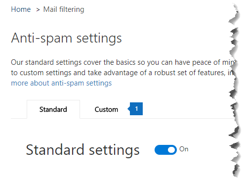
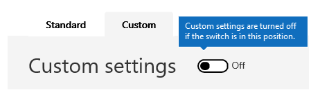

# Enable or disable safety tips

Exchange Online Protection (EOP) adds, or stamps, a safety tip to email messages that it delivers. These safety tips provide recipients with a quick, visual way to determine if a message is from a safe, verified sender, if the message has been marked as spam by Office 365, if the message contains something suspicious such as a phishing scam, or if external images have been blocked. Office 365 and EOP-standalone admins can edit a spam policy setting to enable or disable safety tips from being displayed in email in Outlook and other desktop email clients.

Office 365 enables safety tips by default for your organization and we recommend that you leave them enabled to help combat spam and phishing attacks. You can't disable safety tips for Outlook on the web.

To see examples and to learn about the information displayed in safety tips, see [Safety tips in email messages in Office 365.](safety-tips-in-office-365.md)

In this topic:

- [To enable or disable safety tips by using the Office 365 Security &amp; Compliance Center](enable-or-disable-safety-tips.md#SandCCsafetytip)

- [To enable or disable safety tips by using PowerShell](enable-or-disable-safety-tips.md#pshellsafetytip)

## To enable or disable safety tips by using the Office 365 Security &amp; Compliance Center
<a name="SandCCsafetytip"> </a>

1. Go to [https://protection.office.com](https://protection.office.com).

2. Sign in to Office 365 with your work or school account.

3. Choose **Threat Management** \> **Policy**.

4. On the **Policy** page, choose **Anti-Spam**.

    

5. On the **Anti-spam settings** page choose the **Custom** tab.

    

6. If necessary, choose the **Custom settings** switch to turn on custom settings. If the custom settings switch is set to **Off**, you won't be able to modify spam filter policies.

    

7. Expand the spam policy you want to modify and then choose **Edit policy**. For example, choose the down arrow next to **Default spam filter policy**. Or, if you want, you can create a new policy by choosing **Add a policy**.

8. Expand **Spam and bulk** actions.

9. To enable safety tips, under **Safety Tips**, check the **On** checkbox. To disable safety tips, clear the **On** checkbox.

10. Choose **Save**.

## To enable or disable safety tips by using PowerShell
<a name="pshellsafetytip"> </a>

Admins can use Exchange Online PowerShell to enable or disable safety tips. Use the Set-HostedContentFilterPolicy cmdlet to enable or disable safety tips in a spam filter policy.

1. Connect to Exchange Online PowerShell. For information, see [Connect to Exchange Online PowerShell](https://docs.microsoft.com/powershell/exchange/exchange-online/connect-to-exchange-online-powershell/connect-to-exchange-online-powershell).

2. Run the Set-HostedContentFilterPolicy cmdlet to enable or disable safety tips:

   ```powershell
   Set-HostedContentFilterPolicy -Identity "policy name " -InlineSafetyTipsEnabled <$true | $false>
   ```

Where:

- *policy name*  is the name of the policy you want to modify, for example **default**.

- `$true` enables safety tips for the spam filter policy.

- `$false` disables safety tips for the spam filter policy.

For example, to disable safety tips for the default spam filter policy, run the following command:

```powershell
Set-HostedContentFilterPolicy -Identity "default" -InlineSafetyTipsEnabled $false
```

For more information about this cmdlet, see [Set-HostedContentFilterPolicy](https://docs.microsoft.com/powershell/module/exchange/antispam-antimalware/set-hostedcontentfilterpolicy).

## Still need help?
<a name="pshellsafetytip"> </a>

If you disabled safety tips but are still seeing them in your email messages, check these things:

- You can't disable safety tips for Outlook on the web. Try viewing the same email in another client, such as Outlook.

- Safety tips are on by default for every one who uses EOP, this includes everyone who has Office 365. In order to disable safety tips from showing up in email, you must disable them by using a spam filter policy as described in this topic. Once you've set up the policy, ensure that it is enabled. For information on enabling spam filter policies, see [Configure your spam filter policies](configure-your-spam-filter-policies.md).

For more ways to combat spam and phishing, see [Microsoft Email Anti-Spam Protection](anti-spam-protection.md).
