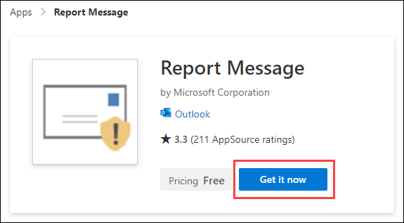
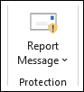
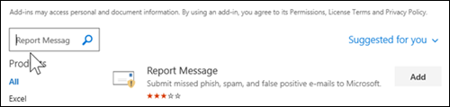
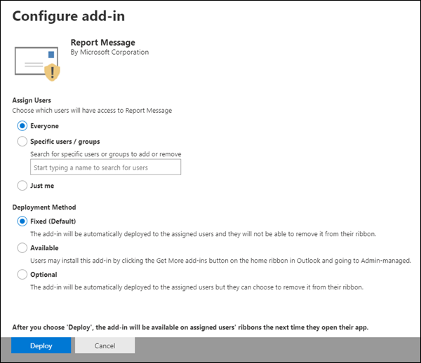
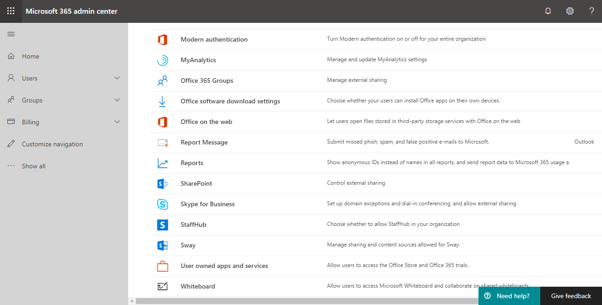
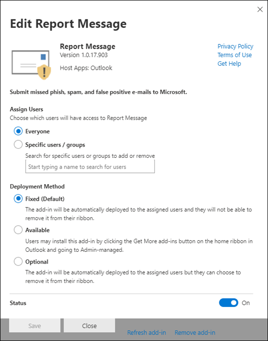

# Enable the Report Message add-in

> [!NOTE]
> The Report Message add-in for Outlook and Outlook on the web is not exactly the same thing as the [Outlook Junk Email Filter](configure-junk-email-settings-on-exo-mailboxes.md#about-junk-email-settings-in-outlook)[Outlook Junk Email Filter](https://support.office.com/article/5ae3ea8e-cf41-4fa0-b02a-3b96e21de089), although both can be used to mark email as junk, not junk, or a phishing attempt. The difference is, the Report Message add-in for Outlook and Outlook on the web notifies Microsoft about misclassified email, whereas the Outlook Junk Email Filter is used to organize email messages in a user's mailbox.

## Overview

The Report Message add-in for Outlook and Outlook on the web (formerly known as Outlook Web App) enables people to easily report misclassified email, whether safe or malicious, to Microsoft and its affiliates for analysis. Microsoft uses these submissions to improve the effectiveness of email protection technologies. In addition, if your organization is using [Office 365 Advanced Threat Protection Plan 1](office-365-atp.md) or [Plan 2](office-365-ti.md), the Report Message add-in provides your organization's security team with useful information they can use to review and update security policies.

For example, suppose that people are reporting a lot of messages as phishing. This information surfaces in the [Security Dashboard](security-dashboard.md) and other reports. Your organization's security team can use this information as an indication that anti-phishing policies might need to be updated. Or, if people are reporting a lot of messages that were flagged as junk mail as Not Junk by using the Report Message add-in, your organization's security team might need to adjust [anti-spam policies](configure-your-spam-filter-policies.md).

The Report Message add-in works with most Office 365 subscriptions and the following products:

- Outlook on the web
- Outlook 2013 SP1 or later
- Outlook 2016 for Mac
- Outlook included with Office 365 ProPlus

The Report Message add-in is currently not available for:

- Mailboxes in on-premises Exchange organizations
- GCC, GCC HIGH, or DoD subscriptions

Your existing web browser should work with the Report Message add-in; however, if you notice the add-in is not available or not working as expected, try a different browser.

If you're an individual user, you can [enable the Report Message add-in for yourself](#get-the-report-message-add-in-for-yourself).

If you're an Office 365 global administrator or an Exchange Online administrator, and Exchange is configured to use OAuth authentication, you can [enable the Report Message add-in for your organization](#get-and-enable-the-report-message-add-in-for-your-organization). The Report Message Add-In is now available through [Centralized Deployment](https://docs.microsoft.com/office365/admin/manage/centralized-deployment-of-add-ins).

## Get the Report Message add-in for yourself

1. In [Microsoft AppSource](https://appsource.microsoft.com/marketplace/apps), search for the [Report Message add-in](https://appsource.microsoft.com/product/office/wa104381180).

2. Choose **GET IT NOW**.

   

3. Review the terms of use and privacy policy. Then choose **Continue**.

4. Sign in to Office 365 using your work or school account (for business use) or your Microsoft account (for personal use).

After the add-in is installed and enabled, you'll see the following icons:

- In Outlook, the icon looks like this:

  

- In Outlook on the web, the icon looks like this:

  

> [!TIP]
> As a next step, learn how to [Use the Report Message add-in](https://support.office.com/article/b5caa9f1-cdf3-4443-af8c-ff724ea719d2).

## Get and enable the Report Message add-in for your organization

These procedures have the following requirements:

- You need to be a member of the **Global admins** group. For more information, see [Permissions in the Office 365 Security & Compliance Center](permissions-in-the-security-and-compliance-center.md).

- Exchange must be configured to use OAuth authentication To learn more, see [Exchange requirements (Centralized Deployment of add-ins)](https://docs.microsoft.com/office365/admin/manage/centralized-deployment-of-add-ins).

1. In the Microsoft 365 admin center, go to the **Services & add-ins** page at <https://admin.microsoft.com/AdminPortal/Home#/Settings/ServicesAndAddIns> and click **Deploy Add-In**.

2. In the **Deploy a new add-in** flyout that appears, review the information, and then click **Next**.

3. On the next page, click **Choose from the store**, and then click **Next**.

4. On the **Select add-in** page that appears, click in the **Search** box, type Report Message and then click **Search** . Find **Report Message** in the results, and then click **Add**.

   

5. In the dialog that appears review the license terms and privacy policy, and then click **Continue**.

6. In the **Configure add-in** page that appears, configure the following settings:

   - **Assigned users**: Select one of the following values:

     - **Everyone** (default)
     - **Specific users / groups**

   - **Deployment method**: Select one of the following values:

     - **Fixed (Default)**: The add-in is automatically deployed to the specified users and they can't remove it.
     - **Available**: Users can install the add-in at **Home** \> **Get add-ins** \> **Admin-managed**.
     - **Optional**: The add-in is automatically deployed to the specified users, but they can choose to remove it.

   

   When you're finished, click **Deploy**.

> [!TIP]
> To be notified when users report messages, see [Use mail flow rules to filter bulk email in Office 365](use-transport-rules-to-configure-bulk-email-filtering.md).

## Learn how to use the Report Message add-in

Depending on your previous selections, people in your organization will see the following icons:

- In Outlook, the icon looks like this:

  

- In Outlook on the web, the icon looks like this:

  

When you notify users about the Report Message add-in, include a link to [Use the Report Message add-in](https://support.office.com/article/b5caa9f1-cdf3-4443-af8c-ff724ea719d2).

## Review or edit settings for the Report Message add-in

You can review and edit the default settings for the Report Message add-in on the [Services & Add-Ins page](https://admin.microsoft.com/AdminPortal/Home#/Settings/ServicesAndAddIns).

> [!IMPORTANT]
> You must be an Office 365 global administrator or an Exchange Online Administrator to complete this task.

1. Go to the [Services & add-ins page](https://admin.microsoft.com/AdminPortal/Home#/Settings/ServicesAndAddIns) in the Microsoft 365 admin center.

   

2. Find and select the Report Message add-in.

   

3. On the Report Message screen, review and edit settings as appropriate for your organization.

   
