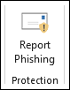
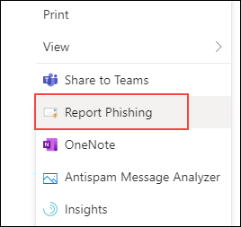
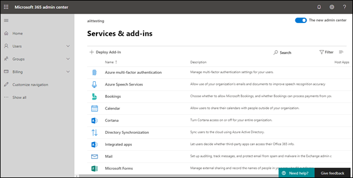
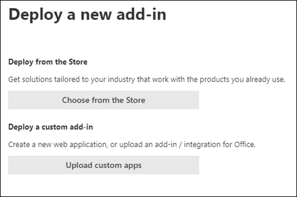

# Enable the Report Phishing add-in

[!INCLUDE [Microsoft 365 Defender rebranding](../includes/microsoft-defender-for-office.md)]

> [!NOTE]
> If you're an admin in a Microsoft 365 organization with Exchange Online mailboxes, we recommend that you use the Submissions portal in the Security & Compliance Center. For more information, see [Use Admin Submission to submit suspected spam, phish, URLs, and files to Microsoft](admin-submission.md).

The Report Message and Report Phishing add-ins for Outlook and Outlook on the web (formerly known as Outlook Web App) enable people to easily report false positives (good email marked as bad) or false negatives (bad email allowed) to Microsoft and its affiliates for analysis.

Microsoft uses these submissions to improve the effectiveness of email protection technologies. For example, suppose that people are reporting many messages using the Report Phishing add-in. This information surfaces in the [Security Dashboard](security-dashboard.md) and other reports. Your organization's security team can use this information as an indication that anti-phishing policies might need to be updated.

You can install either the Report Message or Report Phishing add-in. If you want your users to report both spam and phishing messages, deploy the Report Message add-in in your organization. For more information, see [Enable the Report Message add-in](enable-the-report-message-add-in.md).

The Report Phishing add-in provides the option to report only phishing messages. Admins can enable the Report Phishing add-in for the organization, and individual users can install it for themselves.

If you're an individual user, you can [enable the Report Phishing add-in for yourself](#get-the-report-phishing-add-in-for-yourself).

If you're a global administrator or an Exchange Online administrator, and Exchange is configured to use OAuth authentication, you can [enable the Report Phishing add-in for your organization](#get-and-enable-the-report-phishing-add-in-for-your-organization). The Report Phishing Add-In is now available through [Centralized Deployment](../../admin/manage/centralized-deployment-of-add-ins.md).

## What do you need to know before you begin?

- The Report Phishing add-in works with most Microsoft 365 subscriptions and the following products:

  - Outlook on the web
  - Outlook 2013 SP1 or later
  - Outlook 2016 for Mac or later
  - Outlook included with Microsoft 365 apps for Enterprise
  - Outlook app for iOS and Android

- The Report Phishing add-in is not available for shared mailboxes or mailboxes in on-premises Exchange organizations.

- You can configure reported messages to be copied or redirected to a mailbox that you specify. For more information, see [User submissions policies](user-submission.md).

- Your existing web browser should work with the Report Phishing add-in. But, if you notice the add-in is not available or not working as expected, try a different browser.

- For organizational installs, the organization needs to be configured to use OAuth authentication. For more information, see [Determine if Centralized Deployment of add-ins works for your organization](../../admin/manage/centralized-deployment-of-add-ins.md).

- Admins need to be a member of the Global admins role group. For more information, see [Permissions in the Security & Compliance Center](permissions-in-the-security-and-compliance-center.md).

## Get the Report Phishing add-in for yourself

1. Go to the Microsoft AppSource at <https://appsource.microsoft.com/marketplace/apps> and search for the Report Phishing add-in.

2. Click **GET IT NOW**.

3. In the dialog that appears, review the terms of use and privacy policy, and then click **Continue**.

4. Sign in using your work or school account (for business use) or your Microsoft account (for personal use).

After the add-in is installed and enabled, you'll see the following icons:

- In Outlook, the icon looks like this:

  

- In Outlook on the web, the icon looks like this:

  

## Get and enable the Report Phishing add-in for your organization

> [!NOTE]
> It could take up to 12 hours for the add-in to appear in your organization.

1. In the Microsoft 365 admin center, go to the go to the **Settings** \> **Add-ins** page at <https://admin.microsoft.com/AdminPortal/Home#/Settings/AddIns>, If you don't see the **Add-in** Page, go to the **Settings** \> **Integrated apps** \> **Add-ins** link on the top of the **Integrated apps** page.

2. Select **Deploy Add-in** at the top of the page, and then select **Next**.

   

3. In the **Deploy a new add-in** flyout that appears, review the information, and then click **Next**.

4. On the next page, click **Choose from the Store**.

   

5. In the **Select add-in** page that appears, click in the **Search** box, enter **Report Phishing**, and then click **Search** . In the list of results, find **Report Phishing** and then click **Add**.

6. In the dialog that appears, review the licensing and privacy information, and then click **Continue**.

7. In the **Configure add-in** page that appears, configure the following settings:

   - **Assigned users**: Select one of the following values:

     - **Everyone** (default)
     - **Specific users / groups**
     - **Just me**

   - **Deployment method**: Select one of the following values:

     - **Fixed (Default)**: The add-in is automatically deployed to the specified users and they can't remove it.
     - **Available**: Users can install the add-in at **Home** \> **Get add-ins** \> **Admin-managed**.
     - **Optional**: The add-in is automatically deployed to the specified users, but they can choose to remove it.

   When you're finished, click **Deploy**.

8. In the **Deploy Report Phishing** page that appears, you'll see a progress report followed by a confirmation that the add-in was deployed. After you read the information, click **Next**.

9. On the **Announce add-in** page that appears, review the information, and then click **Close**.

## Learn how to use the Report Phishing add-in

People who have the add-in assigned to them will see the following icons:

- In Outlook, the icon looks like this:

  

- In Outlook on the web, the icon looks like this:

  

## Review or edit settings for the Report Phishing add-in

1. In the Microsoft 365 admin center, go to the go to the **Settings** \> **Add-ins** page at <https://admin.microsoft.com/AdminPortal/Home#/Settings/AddIns>, If you don't see the **Add-in** Page, go to the **Settings** \> **Integrated apps** \> **Add-ins** link on the top of the **Integrated apps** page.

2. Find and select the **Report Phishing** add-in.

3. In the **Edit Report Phishing** flyout that appears, review, and edit settings as appropriate for your organization. When you're finished, click **Save**.

## View and review reported messages

To review messages that users report to Microsoft, you have these options:

- Use the Admin Submissions portal. For more information, see [View user submissions to Microsoft](admin-submission.md#view-user-submissions-to-microsoft).

- Create a mail flow rule (also known as a transport rule) to send copies of reported messages. For instructions, see [Use mail flow rules to see what users are reporting to Microsoft](/exchange/security-and-compliance/mail-flow-rules/use-rules-to-see-what-users-are-reporting-to-microsoft).
