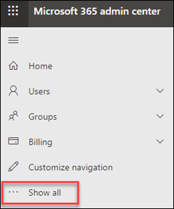
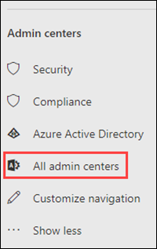
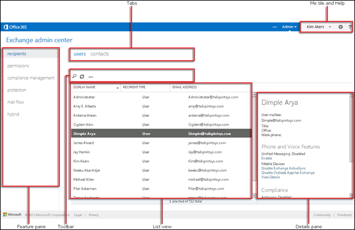

# Exchange admin center in standalone EOP

[!INCLUDE [Microsoft 365 Defender rebranding](../includes/microsoft-defender-for-office.md)]

**Applies to**
-  [Exchange Online Protection standalone](exchange-online-protection-overview.md)

The Exchange admin center (EAC) is a web-based management console for standalone Exchange Online Protection (EOP).

Looking for the Exchange Online version of this topic? See [Exchange admin center in Exchange Online](/exchange/exchange-admin-center).

## Open the EAC in EOP

Standalone EOP customers can access the EAC by using the following methods:

- **From the Microsoft 365 admin center**:

  1. Go to <https://admin.microsoft.com> and click **Show all**.

     

  2. In the **Admin centers** section that appears, click **All admin centers**.

     

  3. On the **All admin centers** page that appears, click **Exchange Online Protection**.

- Go directly to `https://admin.protection.outlook.com/ecp/`.

## Common user interface elements in the EAC in EOP

This section describes the user interface elements that are found in the EAC.

### Feature Pane

This is the first level of navigation for most of the tasks you'll perform in the EAC. The feature pane is organized by feature areas.

- **Recipients**: This is where you'll view groups and external contacts.

- **Permissions**: This where you'll manage admin roles.

- **Compliance Management**: This is where you'll find the administrator role group report and the admin audit log report.

- **Protection**: This is where you can manage anti-malware policies, the default connection filter policy, and DKIM.

  > [!NOTE]
  > You should manage anti-malware policies and the default connection filter policy in the Security & Compliance Center. For more information, see [Configure anti-malware policies in EOP](configure-anti-malware-policies.md) and [Configure connection filtering in EOP](configure-the-connection-filter-policy.md).

- **Mail Flow**: This is where you'll manage mail flow rules (also known as transport rules), accepted domains, and connectors, as well as where you can go to run message trace.

- **Hybrid**: This is where you can run the [Hybrid Configuration Wizard](/Exchange/hybrid-configuration-wizard), and where you can install the [Exchange Online PowerShell module](/powershell/exchange/mfa-connect-to-exchange-online-powershell).

### Tabs

The tabs are your second level of navigation. Each of the feature areas contains various tabs, each representing a feature.

### Toolbar

When you click most tabs, you'll see a toolbar. The toolbar has icons that perform a specific action. The following table describes the icons and their actions.

****

|Icon|Name|Action|
|---|---|---|
||Add, New|Use this icon to create a new object. Some of these icons have an associated down arrow you can click to show additional objects you can create.|
||Edit|Use this icon to edit an object.|
||Delete|Use this icon to delete an object. Some delete icons have a down arrow you can click to show additional options.|
||Search|Use this icon to open a search box in which you can type the search phrase for an object you want to find.|
||Refresh|Use this icon to refresh the list view.|
||More options|Use this icon to view more actions you can perform for that tab's objects. For example, in **Recipients \> Users** clicking this icon shows the option to perform an **Advanced Search**.|
||Up arrow and down arrow|Use these icons to move an object's priority up or down.|
||Remove|Use this icon to remove objects from a list.|
|

### List View

When you select a tab, in most cases you'll see a list view. The viewable limit with the EAC list view is approximately 10,000 objects. In addition, paging is included so that you can page to results.

### Details Pane

When you select an object from the list view, information about that object is displayed in the details pane. In some cases the details pane includes management tasks.

### Me tile and Help

The **Me** tile allows you to sign out the EAC and sign in as a different user. From the **Help** drop-down menu, you can do the following actions:

- **Help**: Click  to view the online help content.
- **Feedback**: Leave feedback.
- **Community**: Post a question for find answers in the community forums.
- **Disable Help bubble**: The Help bubble displays contextual help for fields when you create or edit an object. You can turn off the Help bubble or turn it on if it has been disabled.
- **Show Command Logging**: A new window opens that shows the equivalent PowerShell commands based on what you configured in EAC.

## Supported Browsers

For the best experience using the EAC, we recommend that you always use the latest browsers, Office clients, and apps. We also recommend that you install software updates when they become available. For more information about the supported browsers and system requirements for the service, see [System requirements for Office](https://products.office.com/office-system-requirements).

## Supported languages

The following languages are supported and available for the EAC in standalone EOP.

- Amharic
- Arabic
- Basque (Basque)
- Bengali (India)
- Bulgarian
- Catalan
- Chinese (Simplified)
- Chinese (Traditional)
- Croatian
- Czech
- Danish
- Dutch
- English
- Estonian
- Filipino (Philippines)
- Finnish
- French
- Galician
- German
- Greek
- Gujarati
- Hebrew
- Hindi
- Hungarian
- Icelandic
- Indonesian
- Italian
- Japanese
- Kannada
- Kazakh
- Kiswahili
- Korean
- Latvian
- Lithuanian
- Malay (Brunei Darussalam)
- Malay (Malaysia)
- Malayalam
- Marathi
- Norwegian (Bokmål)
- Norwegian (Nynorsk)
- Oriya
- Persian
- Polish
- Portuguese (Brazil)
- Portuguese (Portugal)
- Romanian
- Russian
- Serbian (Cyrillic, Serbia)
- Serbian (Latin)
- Slovak
- Slovenian
- Spanish
- Swedish
- Tamil
- Telugu
- Thai
- Turkish
- Ukrainian
- Urdu
- Vietnamese
- Welsh