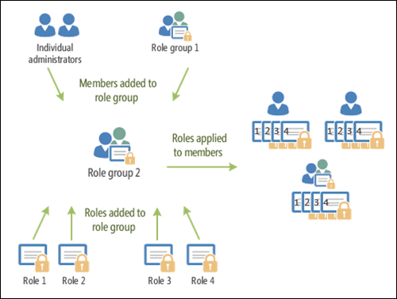

# Permissions in standalone EOP

[!INCLUDE [Microsoft 365 Defender rebranding](../includes/microsoft-defender-for-office.md)]


Standalone Exchange Online Protection (EOP) without Exchange Online mailboxes uses the Role Based Access Control (RBAC) permissions model to easily grant permissions to your admins. You can use the permission features in standalone EOP to get your new organization up and running quickly.

To grant permissions to users, see [Manage admin role groups in EOP](manage-admin-role-group-permissions-in-eop.md).

For more information about permissions across Microsoft 365, see [About admin roles](https://docs.microsoft.com/microsoft-365/admin/add-users/about-admin-roles).

## Role-based permissions

The admin permissions that you grant to users are based on management roles. A management role defines the cmdlets that are available for a set of given tasks. Because the Exchange admin center (EAC) and standalone EOP PowerShell both use cmdlets, granting access to a cmdlet gives the user permission to do the related tasks in the EAC or in standalone EOP PowerShell. For example, the Mail Recipients role defines the cmdlets that are required to modify mail users.

In standalone EOP, administrative roles are the only type of management role that's available (there are no end-user roles or role assignment policies).

## Role groups

To make it easier to assign roles to users, standalone EOP uses role groups. Management roles are assigned to role groups, and the role group members get the permissions that are associated with the roles. In other words, management roles aren't directly assigned to users; they're assigned to role group. This model allows you to assign many roles to many role group members at once. Role group members can be mail users, mail-enabled security groups, users from the Microsoft 365 admin center, and other role groups.

The following figure shows the relationship between users, role groups, and roles.



The available role groups in standalone EOP are described in the following table.

****

|Role group|Description|Default roles assigned|
|---|---|---|
|ComplianceManagement|Configure and manage compliance settings within the organization, including data loss prevention (DLP) if your subscription has DLP capabilities. <p> Members of the [Compliance Administrator](https://docs.microsoft.com/azure/active-directory/users-groups-roles/directory-assign-admin-roles#compliance-administrator) role in Azure AD automatically get the permissions of this role group.|Audit Logs <p> Compliance Administration <p> Information Rights Management <p> Retention Management <p> View-Only Audit Logs <p> View-Only Configuration <p> View-Only Recipients|
|ContentExplorerContentViewer|Not used.|Data Classification Content Viewer|
|ContentExplorerListViewer|Not used.|Data Classification List Viewer|
|HelpDesk|View and manage mail users.|Reset Password <p> User Options <p> View-Only Recipients|
|HygieneManagement|Manage protection features (anti-spam, anti-malware, etc.).|Transport Hygiene <p> View-Only Configuration <p> View-Only Recipients|
|MailFlowAdministrator|View and manage accepted domains and connectors|Remote and Accepted Domains <p> View-Only Recipients|
|OrganizationManagement|Admin access to the entire organization and the ability to perform almost any task. <p> Members of the [Global Administrator](https://docs.microsoft.com/azure/active-directory/users-groups-roles/directory-assign-admin-roles#global-administrator--company-administrator) role in Azure AD automatically get the permissions of this role group. <p> **Important**: Because the OrganizationManagement role group is a powerful role, only users that perform organizational-level administrative tasks should be members of this role group.|AntiMalware <p> AntiSpam <p> Audit Logs <p> Compliance Administrator <p> Distribution Groups <p> Information Rights Management <p> Mail Recipient Creation <p> Mail Recipients <p> Message Tracking <p> Migration <p> Organization Client Access <p> Organization Configuration <p> Organization Transport Settings <p> Quarantine <p> Recipient Policies <p> Remote and Accepted Domains <p> Reset Password <p> Retention Management <p> Role Management <p> Security Administrator <p> Security Group Creation and Membership <p> Security Reader <p> Sensitivity Label Administrator <p> Supervision <p> Transport Hygiene <p> Transport Rules <p> User Options <p> View-Only AntiMalware <p> View-Only AntiSpam <p> View-Only Audit Logs <p> View-Only Configuration <p> View-Only Quarantine <p> View-Only Recipients <p> View-Only Threat Intelligence|
|QuarantineAdministrator|Manage quarantined messages for all recipients.|Quarantine|
|RecipientManagement|Create, manage, and remove recipient objects in the organization.|Distribution Groups <p> Mail Recipient Creation <p> Mail Recipients <p> Message Tracking <p> Migration <p> Recipient Policies <p> Reset Password|
|RecordsManagement|Configure compliance features, such as retention policy tags, message classifications, and mail flow rules (also known as transport rules).|Message Tracking <p> Retention Management <p> Transport Rules|
|SecurityAdministrator|Configure all aspects of protection in the organization (anti-spam, anti-malware, anti-spoofing, quarantine, etc.). <p> Members of the [Security Administrator](https://docs.microsoft.com/azure/active-directory/users-groups-roles/directory-assign-admin-roles#security-administrator) role in Azure AD automatically get the permissions of this role group.|AntiMalware <p> AntiSpam <p> Audit Logs <p> Quarantine <p> Security Administrator <p> Sensitivity Label Administrator <p> View-Only AntiMalware <p> View-Only AntiSpam <p> View-Only Audit Logs <p> View-Only Quarantine <p> View-Only Threat Intelligence|
|SecurityReader|View-only access to all aspects of protection in the organization (anti-spam, anti-malware, anti-spoofing, quarantine, etc.). <p> Members of the [Security Reader](https://docs.microsoft.com/azure/active-directory/users-groups-roles/directory-assign-admin-roles#security-reader) role in Azure AD automatically get the permissions of this role group.|Security Reader <p> View-Only AntiMalware <p> View-Only AntiSpam <p> View-Only Quarantine <p> View-Only Threat Intelligence|
|TenantAdmins|Membership in this role group is synchronized across services and managed centrally. By default, this role group is not assigned any roles. However, it will be a member of the Organization Management role group and will inherit those permissions.|none|
|ViewOnlyOrganizationManagement|View recipient, protection, and configuration objects and their properties in the organization.|Compliance Administrator <p> Security Administrator <p> Security Reader <p> Sensitivity Label Administrator <p> View-Only Configuration <p> View-Only Recipients|
|

If you work in a small organization that has only a few admins, you might need to add those users to the Organization Management role group only, and you may never need to use the other role groups. If you work in a larger organization, you might have admins who perform specific tasks, such as recipient configuration. In those cases, you might add one admin to the Recipient Management role group, and another admin to the Organization Management role group. Those admins can then manage their specific areas, but they won't have permissions to manage areas they're not responsible for.

If the built-in role groups in Exchange Online don't match the job function of your administrators, you can create role groups and add roles to them. For more information, see [Manage role groups in standalone EOP](manage-admin-role-group-permissions-in-eop.md).

## Roles

The built-in roles that are available in standalone EOP are described in the following table.

****

|Role**|Description|Default role group assignments|
|---|---|---|
|AntiMalware|View and modify the configuration and reports for anti-malware features.|OrganizationManagement <p> SecurityAdministrator|
|AntiSpam|View and modify the configuration and reports for anti-spam features.|OrganizationManagement <p> SecurityAdministrator|
|Audit Logs|Search the administrator audit log and view the results.|ComplianceManagement <p> OrganizationManagement <p> SecurityAdministrator|
|Compliance Administrator<sup>\*</sup>||ComplianceManagement <p> OrganizationManagement <p> ViewOnlyOrganizationManagement|
|Data Classification Content Viewer<sup>\*</sup>||ContentExplorerContentViewer|
|Data Classification List Viewer<sup>\*</sup>||
|Distribution Groups|Create and manage all distribution groups, mail-enabled security groups, and members.|OrganizationManagement <p> RecipientManagement|
|Information Rights Management<sup>\*</sup>||ComplianceManagement <p> OrganizationManagement|
|Mail Recipient Creation|Create and remove mail users.|OrganizationManagement <p> RecipientManagement|
|Mail Recipients|Modify existing mail users.|OrganizationManagement <p> RecipientManagement|
|Message Tracking<sup>\*</sup>||OrganizationManagement <p> RecipientManagement <p> Records Management|
|Migration<sup>\*</sup>||OrganizationManagement <p> RecipientManagement|
|MyBaseOptions|Allows users to view their own quarantined messages. <p> This role is automatically assigned to users, and you can't assign it manually.|none|
|Organization Client Access<sup>\*</sup>||OrganizationManagement|
|Organization Configuration|View reports.|OrganizationManagement|
|Organization Transport Settings<sup>\*</sup>||OrganizationManagement|
|Quarantine|Manage all types of quarantined message for all recipients.|OrganizationManagement <p> QuarantineAdministrator <p> SecurityAdministrator|
|Recipient Policies<sup>\*</sup>||OrganizationManagement <p> RecipientManagement|
|Remote and Accepted Domains|Manage remote domains, accepted domains, and connectors.|MailFlowAdministrator <p> OrganizationManagement|
|Reset Password<sup>\*</sup>||HelpDesk <p> OrganizationManagement <p> RecipientManagement|
|Retention Management<sup>\*</sup>||ComplianceManagement <p> OrganizationManagement <p> RecordsManagement|
|Role Management|Create and manage role groups.|OrganizationManagement|
|Security Administrator|Manage the configuration and reports for all security and protection features.|OrganizationManagement <p> SecurityAdministrator <p> ViewOnlyOrganizationManagement|
|Security Group Creation and Membership|Create and manage mail-enabled security groups.|OrganizationManagement|
|Security Reader|View the configuration and reports for security and protection features.|Organization Management <p> SecurityReader <p> ViewOnlyOrganizationManagement|
|Sensitivity Label Administrator<sup>\*</sup>||OrganizationManagement <p> SecurityAdministrator <p> ViewOnlyOrganizationManagement|
|Supervision<sup>\*</sup>||OrganizationManagement|
|Transport Hygiene|Manage anti-malware, anti-spam features, and anti-spoofing features.|HygieneManagement <p> OrganizationManagement|
|Transport Rules|Create and manage mail flow rules (also known as transport rules).|OrganizationManagement <p> RecordsManagement|
|User Options|Modify existing mail users.|HelpDesk <p> OrganizationManagement|
|View-Only AntiMalware|View the configuration and reports for anti-malware features.|OrganizationManagement <p> SecurityAdministrator <p> SecurityReader|
|View-Only AntiSpam|View the configuration and reports for anti-spam features.|OrganizationManagement <p> SecurityAdministrator <p> SecurityReader|
|View-Only Audit Logs|Search the administrator audit log and view the results.|ComplianceManagement <p> OrganizationManagement <p> SecurityAdministrator|
|View-Only Configuration|View all of the organization and mail flow (non-recipient) settings in the organization.|ComplianceManagement <p> HygieneManagement <p> OrganizationManagement <p> ViewOnlyOrganizationManagement|
|View-Only Quarantine|View all quarantined messages for all recipients.|OrganizationManagement <p> SecurityAdministrator <p> SecurityReader|
|View-Only Recipients|View recipient properties and run message trace.|ComplianceManagement <p> HelpDesk <p> HygieneManagement <p> MailFlowAdministrator <p>  OrganizationManagement <p> ViewOnlyOrganizationManagement|
|View-Only Threat Intelligence<sup>\*</sup>||OrganizationManagement <p> SecurityAdministrator <p> SecurityReader|
|

<sup>\*</sup> Although this role is available, it basically does nothing useful in standalone EOP.

## Microsoft 365 permissions in standalone EOP

When you create a user in the Microsoft 365 admin center, you can choose whether to assign various administrative roles, such as Global admin, Service admin, Password admin, and so on, to the user. Some, but not all, Microsoft 365 roles grant the user administrative permissions in EOP.

> [!NOTE]
> The account you used to create your standalone EOP organization is automatically assigned to the Global admin role.

The following table lists the Microsoft 365 roles and the standalone EOP role groups that they correspond to. For more information about these roles, see [About admin roles](https://docs.microsoft.com/microsoft-365/admin/add-users/about-admin-roles).

****

|Microsoft 365 role|EOP role group|
|---|---|
|Exchange admin|OrganizationManagement|
|Global admin|OrganizationManagement <p> **Note**: The Global admin role and the OrganizationManagement role group are tied together using a special Company Administrator role group. The Company Administrator role group is managed internally and can't be modified directly.|
|Password admin|HelpDesk|
|Global reader|ViewOnlyOrganizationManagement|
|Security admin|SecurityAdministrator|
|Security reader|SecurityReader|
|

Other Microsoft 365 roles don't have a corresponding EOP role group and won't grant administrative permissions in EOP. For more information about assigning a Microsoft 365 role to a user, see [Assign admin roles](https://docs.microsoft.com/microsoft-365/admin/add-users/assign-admin-roles).

Users can be granted administrative rights in EOP without adding them to Microsoft 365 roles. You do this by adding the user as a member of an EOP role group. The user will get permissions in EOP, but they won't get permissions in other Microsoft 365 workloads.

### How do you know this worked?

To verify that you've successfully copied a role group, do either of the following steps:

- In the EAC, go to **Permissions** \> **Admin Roles**, and verify the role group is listed (or not listed). Select the role group, and verify the settings in the Details pane or click **Edit**  to verify the settings.

- In Exchange Online PowerShell, replace \<Role Group Name\> with the name of the role group, and run the following command to verify the role group exists (or doesn't exist) and verify the settings:

  ```PowerShell
  Get-RoleGroup -Identity "<Role Group Name>" | Format-List
  ```
