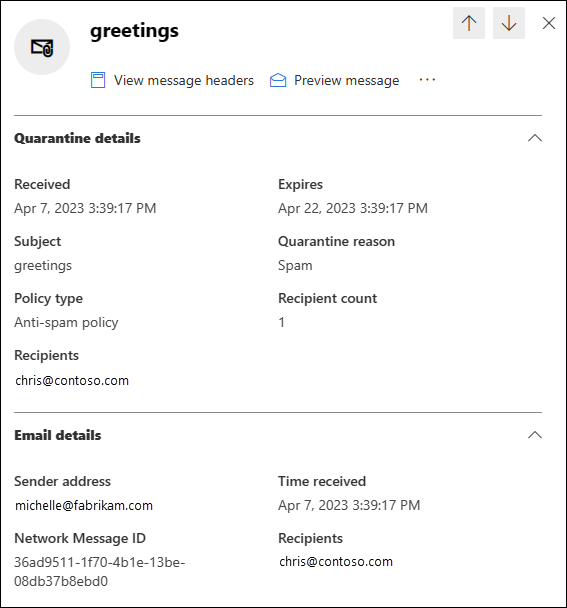
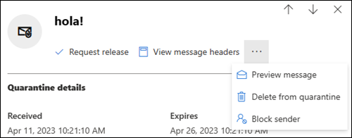
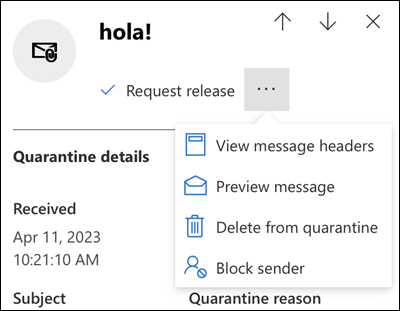

# Find and release quarantined messages as a user in EOP

[!INCLUDE [Microsoft 365 Defender rebranding](../includes/microsoft-defender-for-office.md)]

**Applies to**
- [Exchange Online Protection](exchange-online-protection-overview.md)
- [Microsoft Defender for Office 365 plan 1 and plan 2](defender-for-office-365.md)
- [Microsoft 365 Defender](../defender/microsoft-365-defender.md)

In Microsoft 365 organizations with mailboxes in Exchange Online or standalone Exchange Online Protection (EOP) organizations without Exchange Online mailboxes, quarantine holds potentially dangerous or unwanted messages. For more information, see [Quarantine in EOP](quarantine-email-messages.md).

As a recipient of a quarantined message, what you can do to the message as an ordinary user (not an admin) is described in the following table:

 

****

|Quarantine reason|View|Release|Delete|
|---|:---:|:---:|:---:|
|Bulk||||
|Spam||||
|Phishing (not high confidence phishing)||||
|

You view and manage your quarantined messages in the Microsoft 365 Defender portal or (if an admin has set this up) in [end-user spam notifications](use-spam-notifications-to-release-and-report-quarantined-messages.md).

## What do you need to know before you begin?

- To open the Microsoft 365 Defender portal, go to <https://security.microsoft.com>. To open the **Quarantine** page directly, use <https://security.microsoft.com/quarantine>.

- Admins can configure how long messages are kept in quarantine before they're permanently deleted in anti-spam policies. Messages that have expired from quarantine are unrecoverable. For more information, see [Configure anti-spam policies in EOP](configure-your-spam-filter-policies.md).

- Admins can also [enable end-user spam notifications](configure-your-spam-filter-policies.md#configure-end-user-spam-notifications) in anti-spam policies. Original message recipients can *release* quarantined spam messages directly from these notifications. Original message recipients can *review* quarantined phishing messages (not high confidence phishing messages) directly from these notifications. For more information, see [End-user spam notifications in EOP](use-spam-notifications-to-release-and-report-quarantined-messages.md).

- Messages that were quarantined for high confidence phishing, malware, or by mail flow rules (also known as transport rules) are only available to admins, and aren't visible to users. For more information, see [Manage quarantined messages and files as an admin in EOP](manage-quarantined-messages-and-files.md).

- You can only release a message and report it as a false positive (not junk) once.

## View your quarantined messages

1. In the Microsoft 365 Defender portal, go to **Email & collaboration** \> **Review** \> **Quarantine**.
2. On the **Quarantine** page, you can sort the results by clicking on an available column header. Click **Customize columns**  to change the columns that are shown. The default values are marked with an asterisk (\*):

   - **Time received**\*
   - **Subject**\*
   - **Sender**\*
   - **Quarantine reason**\*
   - **Release status**\*
   - **Policy type**\*
   - **Expires**\*
   - **Recipient**
   - **Message ID**
   - **Policy name**
   - **Message size**
   - **Mail direction**

   When you're finished, click **Apply**.

3. To filter the results, click **Filter**. The following filters are available in the **Filters** flyout that appears:
   - **Message ID**: The globally unique identifier of the message.
   - **Sender address**
   - **Recipient address**
   - **Subject**
   - **Time received**: Enter a **Start time** and **End time** (date).
   - **Expires**: Filter messages by when they will expire from quarantine:
     - **Today**
     - **Next 2 days**
     - **Next 7 days**
     - **Custom**: Enter a **Start time** and **End time** (date).
   - **Quarantine reason**:
     - **Bulk**
     - **Spam**
     - **Phishing**: The spam filter verdict was **Phishing** or anti-phishing protection quarantined the message ([spoof settings](set-up-anti-phishing-policies.md#spoof-settings) or [impersonation protection](set-up-anti-phishing-policies.md#impersonation-settings-in-anti-phishing-policies-in-microsoft-defender-for-office-365)).
     - **High confidence phishing**
   - **Release status**: Any of the following values:
     - **Needs review**
     - **Approved**
     - **Denied**
     - **Release requested**
     - **Released**
   - **Policy Type**: Filter messages by policy type:
     - **Anti-malware policy**
     - **Safe Attachments policy**
     - **Anti-phishing policy**
     - **Anti-spam policy**

   When you're finished, click **Apply**. To clear the filters, click  **Clear filters**.

4. Use **Search** box and a corresponding value to find specific messages. Wildcards aren't supported. You can search by the following values:
   - Message ID
   - Sender email address
   - Recipient email address
   - Subject. Use the entire subject of the message. The search is not case-sensitive.
   - Policy name. Use the entire policy name. The search is not case-sensitive.

   After you've entered the search criteria, press ENTER to filter the results.

After you find a specific quarantined message, select the message to view details about it, and to take action on it (for example, view, release, download, or delete the message).

### View quarantined message details

When you select quarantined message from the list, the following information is available in the details flyout that appears.

When you select an email message in the list, the following message details appear in the **Details** flyout pane:

- **Message ID**: The globally unique identifier for the message.
- **Sender address**
- **Received**: The date/time when the message was received.
- **Subject**
- **Quarantine reason**: Shows if a message has been identified as **Spam**, **Bulk** or **Phish**.
- **Policy type**: The type of policy. For example, **Anti-spam policy**.
- **Recipient count**
- **Recipients**: If the message contains multiple recipients, you need to click **Preview message** or **View message header** to see the complete list of recipients.
- **Expires**: The date/time when the message will be automatically and permanently deleted from quarantine.

To take action on the message, see the next section.

> [!NOTE]
> To remain in the details flyout, but change the quarantined message that you're looking at, use the up and down arrows at the top of the flyout.
>
> 

### Take action on quarantined email

After you select a quarantined message from the list, the following actions are available in the details flyout:

-  **Release email**\*: Delivers the message to your Inbox.

-  **View message headers**: Choose this link to see the message header text. The **Message header** flyout appears with the following links:
- **Copy message header**: Click this link to copy the message header (all header fields) to your clipboard.
- **Microsoft Message Header Analyzer**: To analyze the header fields and values in depth, click this link to go to the Message Header Analyzer. Paste the message header into the **Insert the message header you would like to analyze** section (CTRL+V or right-click and choose **Paste**), and then click **Analyze headers**.

The following actions are available after you click  **More actions**:

-  **Preview message**: In the flyout that appears, choose one of the following tabs:
  - **Source**: Shows the HTML version of the message body with all links disabled.
  - **Plain text**: Shows the message body in plain text.

-  **Remove from quarantine**: After you click **Yes** in the warning that appears, the message is immediately deleted without being sent to the original recipients.

-  **Download email**: In the flyout that appears, select **I understand the risks from downloading this message**, and then click **Download** to save a local copy of the message in .eml format.

-  **Block sender**: Add the sender to the Blocked Senders list in **your** mailbox. For more information, see [Block a mail sender](https://support.microsoft.com/office/b29fd867-cac9-40d8-aed1-659e06a706e4).

\* This option is not available for messages that have already been released (the **Released status** value is **Released**).

If you don't release or remove the message, it will be deleted after the default quarantine retention period expires (as shown in the **Expires** column).

> [!NOTE]
> On a mobile device, the description text isn't available on the action icons.
>
> 
>
> The icons in order and their corresponding descriptions are summarized in the following table:
>
> |Icon|Description|
> |---:|---|
> ||**Release email**|
> ||**View message headers**|
> ||**Preview message**|
> ||**Remove from quarantine**|
> ||**Block sender**|

#### Take action on multiple quarantined email messages

When you select multiple quarantined messages in the list (up to 100) by clicking in the blank area to the left of the first column, the **Bulk actions** drop down list appears where you can take the following actions:

-  **Release messages**: Delivers the messages to your Inbox.
-  **Delete messages**:  After you click **Yes** in the warning that appears, the messages are immediately removed from quarantine without being sent to the original recipients.
