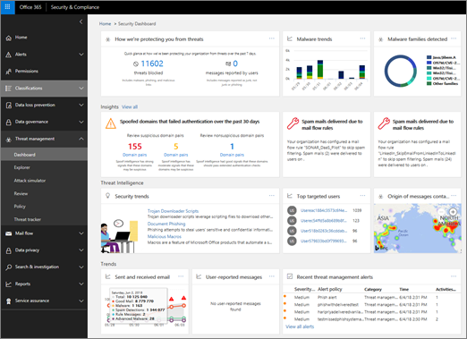
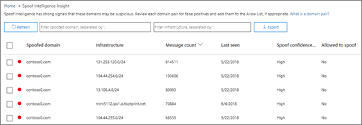

# Walkthrough - From a dashboard to an insight

If you're new to [reports and insights in the Security &amp; Compliance Center](reports-and-insights-in-security-and-compliance.md), it might help to see how you can easily navigate from a dashboard to an insight and recommended actions. 
  
This is one of several walkthroughs for the Security &amp; Compliance Center. To see additional walkthroughs, see the [Related topics](#related-topics) section. 
  
## Walkthrough: From a dashboard to an insight

Let's walk through the flow from a dashboard to a report to an insight and action. (This is a brief [spoof intelligence](learn-about-spoof-intelligence.md) example.) 
  
1. We begin with the Security dashboard in the [Security &amp; Compliance Center](https://protection.office.com). (Go to **Threat management** \> **Dashboard**.)  
  
2. In the **Insights** row, we notice an insight indicating we need to review some domains that might be suspicious. (In the **Insights** row, click **Domain pairs**.)  
  
3. We get a list of activities related to spoof intelligence. These are instances where email messages were sent that look like they came from our organization but were, in fact, sent from another organization. The goal is to determine whether the spoofed messages are authorized or not.  In this list, we can sort the information by message count, date the spoofing was last detected, and more. (Click column headings, such as **Message count** or **Last seen** to see how sorting works.) 
    
4. Selecting an item in the list opens a details pane where we can see additional information, including similar email messages that were detected. (Click an item in the list, and review the information and recommendations.)  
  
5. Notice that at the top of the pane, we have the option to add the sender to our organization's allowed senders list. (Do not select **Add to 'AllowedtoSpoof' sender allow list** until you are sure you want to do this. [Learn more about spoof intelligence](learn-about-spoof-intelligence.md).) 
  
In this way, we can move from a dashboard to insights and recommended actions.
  
## Related topics

[Walkthrough: From an insight to a detailed report](from-an-insight-to-a-detailed-report.md)
  
[Walkthrough: From a detailed report to an insight](from-a-detailed-report-to-an-insight.md)
  

