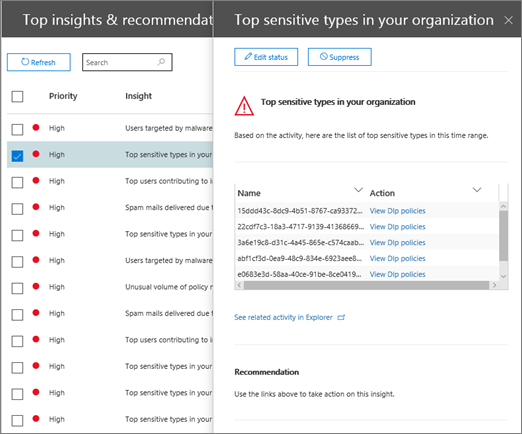

# Walkthrough - From an insight to a detailed report

If you're new to [reports and insights in the Security &amp; Compliance Center](reports-and-insights-in-security-and-compliance.md), it might help to see how you can easily navigate from an insight to a detailed report. 
  
This is one of several walkthroughs for the [Security &amp; Compliance Center](https://protection.office.com). To see additional walkthroughs, see the [Related topics](#related-topics) section. 
  
## From an insight to a detailed report

Let's walk through the flow from the dashboard to an insight to a detailed report for data exploration. (This is a brief [data loss prevention](../../compliance/data-loss-prevention-policies.md) example.) 
  
1. We begin with a dashboard in the [Security &amp; Compliance Center](https://protection.office.com). (Go to **Reports** \> **Dashboard**.) 
  
2. In the upper left corner of the dashboard, next to **Top insights &amp; recommendations**, we have a link. (Click **View all**.)  This takes us to a list of insights for our organization. 
  
3. Selecting an item in the list opens a pane where we can view more details about that item. (Click an item.)  We see recommended actions we should consider, such as reviewing policies. ([Learn more about data loss prevention policies](../../compliance/data-loss-prevention-policies.md).)
    
4. We also have a link to view more details. (Click **See related activity in Explorer**.) This takes us to a report type called [Threat Explorer (and real-time detections)](threat-explorer.md), where we can apply filters and drill into specific details. 
  
In this way, we can move easily from an insight into its underlying details, and make more informed decisions about data loss prevention for an organization.
  
## Related topics

[Walkthrough: From a detailed report to an insight](from-a-detailed-report-to-an-insight.md)
  
[Walkthrough: From a dashboard to an insight](from-a-dashboard-to-an-insight.md)
  

