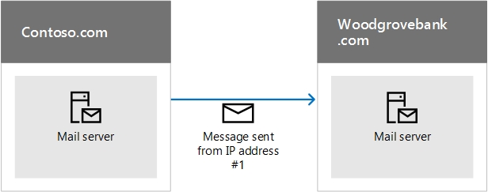
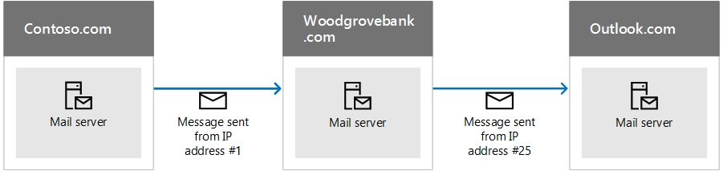

# How Microsoft 365 uses Sender Policy Framework (SPF) to prevent spoofing

[!INCLUDE [Microsoft 365 Defender rebranding](../includes/microsoft-defender-for-office.md)]

**Applies to**
- [Exchange Online Protection](https://go.microsoft.com/fwlink/?linkid=2148611)
- [Microsoft Defender for Office 365 plan 1 and plan 2](https://go.microsoft.com/fwlink/?linkid=2148715)
- [Microsoft 365 Defender](https://go.microsoft.com/fwlink/?linkid=2118804)

 **Summary:** This article describes how Microsoft 365 uses the Sender Policy Framework (SPF) TXT record in DNS to ensure that destination email systems trust messages sent from your custom domain. This applies to outbound mail sent from Microsoft 365. Messages sent from Microsoft 365 to a recipient within Microsoft 365 will always pass SPF.

An SPF TXT record is a DNS record that helps prevent spoofing and phishing by verifying the domain name from which email messages are sent. SPF validates the origin of email messages by verifying the IP address of the sender against the alleged owner of the sending domain.

> [!NOTE]
> SPF record types were deprecated by the Internet Engineering Task Force (IETF) in 2014. Instead, ensure that you use TXT records in DNS to publish your SPF information. The rest of this article uses the term SPF TXT record for clarity.

Domain administrators publish SPF information in TXT records in DNS. The SPF information identifies authorized outbound email servers. Destination email systems verify that messages originate from authorized outbound email servers. If you are already familiar with SPF, or you have a simple deployment, and just need to know what to include in your SPF TXT record in DNS for Microsoft 365, you can go to [Set up SPF in Microsoft 365 to help prevent spoofing](set-up-spf-in-office-365-to-help-prevent-spoofing.md). If you do not have a deployment that is fully-hosted in Microsoft 365, or you want more information about how SPF works or how to troubleshoot SPF for Microsoft 365, keep reading.

> [!NOTE]
> Previously, you had to add a different SPF TXT record to your custom domain if you also used SharePoint Online. This is no longer required. This change should reduce the risk of SharePoint Online notification messages ending up in the Junk Email folder. You do not need to make any changes immediately, but if you receive the "too many lookups" error, modify your SPF TXT record as described in [Set up SPF in Microsoft 365 to help prevent spoofing](set-up-spf-in-office-365-to-help-prevent-spoofing.md).

## How SPF works to prevent spoofing and phishing in Microsoft 365
<a name="HowSPFWorks"> </a>

SPF determines whether or not a sender is permitted to send on behalf of a domain. If the sender is not permitted to do so, that is, if the email fails the SPF check on the receiving server, the spam policy configured on that server determines what to do with the message.

Each SPF TXT record contains three parts: the declaration that it is an SPF TXT record, the IP addresses that are allowed to send mail from your domain and the external domains that can send on your domain's behalf, and an enforcement rule. You need all three in a valid SPF TXT record. This article describes how you form your SPF TXT record and provides best practices for working with the services in Microsoft 365. Links to instructions on working with your domain registrar to publish your record to DNS are also provided.

### SPF basics: IP addresses allowed to send from your custom domain
<a name="SPFBasicsIPaddresses"> </a>

Take a look at the basic syntax for an SPF rule:

v=spf1 \<IP\> \<enforcement rule\>

For example, let's say the following SPF rule exists for contoso.com:

v=spf1 \<IP address #1\> \<IP address #2\> \<IP address #3\> \<enforcement rule\>

In this example, the SPF rule instructs the receiving email server to only accept mail from these IP addresses for the domain contoso.com:

- IP address #1

- IP address #2

- IP address #3

This SPF rule tells the receiving email server that if a message comes from contoso.com, but not from one of these three IP addresses, the receiving server should apply the enforcement rule to the message. The enforcement rule is usually one of these options:

- **Hard fail.** Mark the message with 'hard fail' in the message envelope and then follow the receiving server's configured spam policy for this type of message.

- **Soft fail.** Mark the message with 'soft fail' in the message envelope. Typically, email servers are configured to deliver these messages anyway. Most end users do not see this mark.

- **Neutral.** Do nothing, that is, do not mark the message envelope. This is usually reserved for testing purposes and is rarely used.

The following examples show how SPF works in different situations. In these examples, contoso.com is the sender and woodgrovebank.com is the receiver.

### Example 1: Email authentication of a message sent directly from sender to receiver
<a name="spfExample1"> </a>

SPF works best when the path from sender to receiver is direct, for example:



When woodgrovebank.com receives the message, if IP address #1 is in the SPF TXT record for contoso.com, the message passes the SPF check and is authenticated.

### Example 2: Spoofed sender address fails the SPF check
<a name="spfExample2"> </a>

Suppose a phisher finds a way to spoof contoso.com:


Since IP address #12 is not in contoso.com's SPF TXT record, the message fails the SPF check and the receiver may choose to mark it as spam.

### Example 3: SPF and forwarded messages
<a name="spfExample3"> </a>

One drawback of SPF is that it doesn't work when an email has been forwarded. For example, suppose the user at woodgrovebank.com has set up a forwarding rule to send all email to an outlook.com account:



The message originally passes the SPF check at woodgrovebank.com but it fails the SPF check at outlook.com because IP #25 is not in contoso.com's SPF TXT record. Outlook.com might then mark the message as spam. To work around this problem, use SPF in conjunction with other email authentication methods such as DKIM and DMARC.

### SPF basics: Including third-party domains that can send mail on behalf of your domain
<a name="SPFBasicsIncludes"> </a>

In addition to IP addresses, you can also configure your SPF TXT record to include domains as senders. These are added to the SPF TXT record as "include" statements. For example, contoso.com might want to include all of the IP addresses of the mail servers from contoso.net and contoso.org which it also owns. To do this, contoso.com publishes an SPF TXT record that looks like this:

```text
v=spf1 include:contoso.net include:contoso.org -all
```

When the receiving server sees this record in DNS, it also performs a DNS lookup on the SPF TXT record for contoso.net and then for contoso.org. If it finds an additional include statement within the records for contoso.net or contoso.org, it will follow those too. In order to help prevent denial of service attacks, the maximum number of DNS lookups for a single email message is 10. Each include statement represents an additional DNS lookup. If a message exceeds the 10 limit, the message fails SPF. Once a message reaches this limit, depending on the way the receiving server is configured, the sender may get a message that says the message generated "too many lookups" or that the "maximum hop count for the message has been exceeded" (which can happen when the lookups loop and surpass the DNS timeout). For tips on how to avoid this, see [Troubleshooting: Best practices for SPF in Microsoft 365](how-office-365-uses-spf-to-prevent-spoofing.md#SPFTroubleshoot).

## Requirements for your SPF TXT record and Microsoft 365
<a name="SPFReqsinO365"> </a>

If you set up mail when you set up Microsoft 365, you already created an SPF TXT record that identifies the Microsoft messaging servers as a legitimate source of mail for your domain. This record probably looks like this:

```text
v=spf1 include:spf.protection.outlook.com -all
```

If you're a fully-hosted customer, that is, you have no on-premises mail servers that send outbound mail, this is the only SPF TXT record that you need to publish for Office 365.

If you have a hybrid deployment (that is, you have some mailboxes on-premises and some hosted in Microsoft 365), or if you're an Exchange Online Protection (EOP) standalone customer (that is, your organization uses EOP to protect your on-premises mailboxes), you should add the outbound IP address for each of your on-premises edge mail servers to the SPF TXT record in DNS.

## Form your SPF TXT record for Microsoft 365
<a name="FormYourSPF"> </a>

Use the syntax information in this article to form the SPF TXT record for your custom domain. Although there are other syntax options that are not mentioned here, these are the most commonly used options. Once you have formed your record, you need to update the record at your domain registrar.

For information about the domains you will need to include for Microsoft 365, see [External DNS records required for SPF](https://docs.microsoft.com/microsoft-365/enterprise/external-domain-name-system-records). Use the [step-by-step instructions](https://docs.microsoft.com/microsoft-365/admin/get-help-with-domains/create-dns-records-at-any-dns-hosting-provider#add-a-txt-record-for-spf-to-help-prevent-email-spam) for updating SPF (TXT) records for your domain registrar.

### SPF TXT record syntax for Microsoft 365
<a name="SPFSyntaxO365"> </a>

A typical SPF TXT record for Microsoft 365 has the following syntax:

```text
v=spf1 [<ip4>|<ip6>:<IP address>] [include:<domain name>] <enforcement rule>
```

For example:

```text
v=spf1 ip4:192.168.0.1 ip4:192.168.0.2 include:spf.protection.outlook.com -all
```

where:

- **v=spf1** is required. This defines the TXT record as an SPF TXT record.

- **ip4** indicates that you are using IP version 4 addresses. **ip6** indicates that you are using IP version 6 addresses. If you are using IPv6 IP addresses, replace **ip4** with **ip6** in the examples in this article. You can also specify IP address ranges using CIDR notation, for example **ip4:192.168.0.1/26**.

- _IP address_ is the IP address that you want to add to the SPF TXT record. Usually, this is the IP address of the outbound mail server for your organization. You can list multiple outbound mail servers. For more information, see [Example: SPF TXT record for multiple outbound on-premises mail servers and Microsoft 365](how-office-365-uses-spf-to-prevent-spoofing.md#ExampleSPFMultipleMailServerO365).

- _domain name_ is the domain you want to add as a legitimate sender. For a list of domain names you should include for Microsoft 365, see [External DNS records required for SPF](https://docs.microsoft.com/microsoft-365/enterprise/external-domain-name-system-records).

- Enforcement rule is usually one of the following:

  - -all

    Indicates hard fail. If you know all of the authorized IP addresses for your domain, list them in the SPF TXT record and use the -all (hard fail) qualifier. Also, if you are only using SPF, that is, you are not using DMARC or DKIM, you should use the -all qualifier. We recommend that you use always this qualifier.

  - ~all

    Indicates soft fail. If you're not sure that you have the complete list of IP addresses, then you should use the ~all (soft fail) qualifier. Also, if you are using DMARC with p=quarantine or p=reject, then you can use ~all. Otherwise, use -all.

  - ?all

    Indicates neutral. This is used when testing SPF. We do not recommend that you use this qualifier in your live deployment.

### Example: SPF TXT record to use when all of your mail is sent by Microsoft 365
<a name="ExampleSPFNoSP"> </a>

If all of your mail is sent by Microsoft 365, use this in your SPF TXT record:

```text
v=spf1 include:spf.protection.outlook.com -all
```

### Example: SPF TXT record for a hybrid scenario with one on-premises Exchange Server and Microsoft 365
<a name="ExampleSPFHybridOneExchangeServer"> </a>

In a hybrid environment, if the IP address of your on-premises Exchange Server is 192.168.0.1, in order to set the SPF enforcement rule to hard fail, form the SPF TXT record as follows:

```text
v=spf1 ip4:192.168.0.1 include:spf.protection.outlook.com -all
```

### Example: SPF TXT record for multiple outbound on-premises mail servers and Microsoft 365
<a name="ExampleSPFMultipleMailServerO365"> </a>

If you have multiple outbound mail servers, include the IP address for each mail server in the SPF TXT record and separate each IP address with a space followed by an "ip4:" statement. For example:

```text
v=spf1 ip4:192.168.0.1 ip4:192.168.0.2 ip4:192.168.0.3 include:spf.protection.outlook.com -all
```

## Next steps: Set up SPF for Microsoft 365
<a name="SPFNextSteps"> </a>

Once you have formulated your SPF TXT record, follow the steps in [Set up SPF in Microsoft 365 to help prevent spoofing](set-up-spf-in-office-365-to-help-prevent-spoofing.md) to add it to your domain.

Although SPF is designed to help prevent spoofing, but there are spoofing techniques that SPF cannot protect against. In order to protect against these, once you have set up SPF, you should also configure DKIM and DMARC for Microsoft 365. To get started, see [Use DKIM to validate outbound email sent from your custom domain in Microsoft 365](use-dkim-to-validate-outbound-email.md). Next, see [Use DMARC to validate email in Microsoft 365](use-dmarc-to-validate-email.md).

## Troubleshooting: Best practices for SPF in Microsoft 365
<a name="SPFTroubleshoot"> </a>

You can only create one SPF TXT record for your custom domain. Creating multiple records causes a round robin situation and SPF will fail. To avoid this, you can create separate records for each subdomain. For example, create one record for contoso.com and another record for bulkmail.contoso.com.

If an email message causes more than 10 DNS lookups before it is delivered, the receiving mail server will respond with a permanent error, also called a  _permerror_, and cause the message to fail the SPF check. The receiving server may also respond with a non-delivery report (NDR) that contains an error similar to these:

- The message exceeded the hop count.

- The message required too many lookups.

## Avoiding the "too many lookups" error when you use third-party domains with Microsoft 365
<a name="SPFTroubleshoot"> </a>

Some SPF TXT records for third-party domains direct the receiving server to perform a large number of DNS lookups. For example, at the time of this writing, Salesforce.com contains 5 include statements in its record:

```text
v=spf1 include:_spf.google.com
include:_spfblock.salesforce.com
include:_qa.salesforce.com
include:_spfblock1.salesforce.com
include:spf.mandrillapp.com mx ~all
```

To avoid the error, you can implement a policy where anyone sending bulk email, for example, has to use a subdomain specifically for this purpose. You then define a different SPF TXT record for the subdomain that includes the bulk email.

 In some cases, like the salesforce.com example, you have to use the domain in your SPF TXT record, but in other cases, the third-party may have already created a subdomain for you to use for this purpose. For example, exacttarget.com has created a subdomain that you need to use for your SPF TXT record:

```text
cust-spf.exacttarget.com
```

When you include third-party domains in your SPF TXT record, you need to confirm with the third-party which domain or subdomain to use in order to avoid running into the 10 lookup limit.

## How to view your current SPF TXT record and determine the number of lookups that it requires
<a name="SPFTroubleshoot"> </a>

You can use nslookup to view your DNS records, including your SPF TXT record. Or, if you prefer, there are a number of free, online tools available that you can use to view the contents of your SPF TXT record. By looking at your SPF TXT record and following the chain of include statements and redirects, you can determine how many DNS lookups the record requires. Some online tools will even count and display these lookups for you. Keeping track of this number will help prevent messages sent from your organization from triggering a permanent error, called a permerror, from the receiving server.

## For more information
<a name="SPFTroubleshoot"> </a>

Need help adding the SPF TXT record? Read the article [Create DNS records at any DNS hosting provider for Microsoft 365](https://docs.microsoft.com/microsoft-365/admin/get-help-with-domains/create-dns-records-at-any-dns-hosting-provider#add-a-txt-record-for-spf-to-help-prevent-email-spam) for detailed information about usage of Sender Policy Framework with your custom domain in Microsoft 365. [Anti-spam message headers](anti-spam-message-headers.md) includes the syntax and header fields used by Microsoft 365 for SPF checks.


