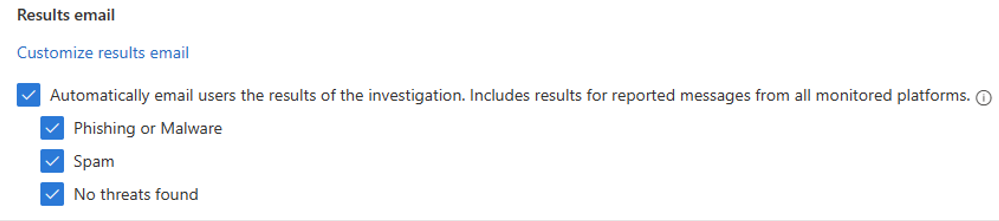
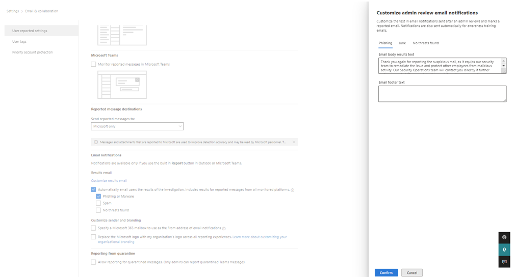
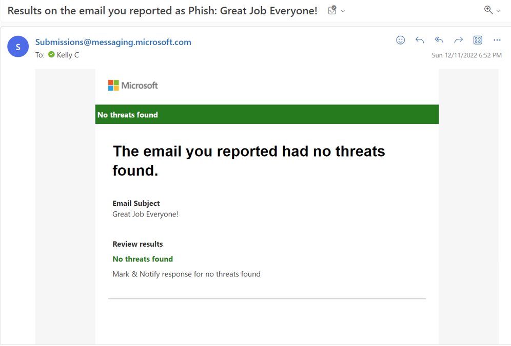
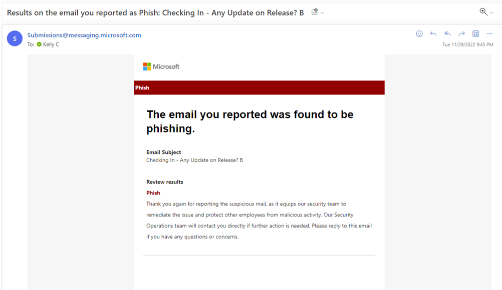
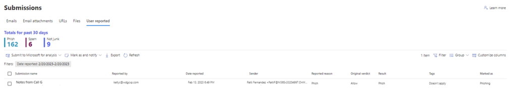

---
# Required metadata
# For more information, see https://review.learn.microsoft.com/en-us/help/platform/learn-editor-add-metadata?branch=main
# For valid values of ms.service, ms.prod, and ms.topic, see https://review.learn.microsoft.com/en-us/help/platform/metadata-taxonomies?branch=main

title:       Automatic end user feedback response # 
description: How to automatically response to end user submissions of phish using MDO automated investigations. #
author:      KCrider14 # GitHub alias
ms.author:   kellycrider # Microsoft alias
ms.service:  ms.service # ms.service
# ms.prod:   # To use ms.prod, uncomment it and delete ms.service
ms.topic:    AIR, Automated investigations, User submissions # AIR
ms.date:     12/08/2023
---

# How to automatically response to end user submissions of phish

The user submission automatic feedback response feature in Microsoft Defender for Office 365 (MDO) enables organizations to automatically respond to end user submissions of phish based on the verdict from the automated investigation. To learn more about automated investigation and response (AIR) in Microsoft Defender for Office 365 visit [Automated investigation and response in Microsoft Defender for Office 365 - Office 365 | Microsoft Learn](/microsoft-365/security/office-365-security/air-about?view=o365-worldwide).

## Configuration

Settings > Email & collaboration > User reported settings > Automatically email users the results of the investigation. Includes results for reported messages from all monitored platforms.

The ability to automatically respond to end user submissions of phish is configurable and can be turned on from the user reported settings page (Settings > Email & collaboration > User reported settings). On this page, the first step to enabling this feature is to check the box to “Automatically email users the results of the investigation. Includes results for reported messages from all monitored platforms”. Upon making this selection three additional checkboxes will appear titled “Phishing or Malware”, “Spam” and “No threats found”. These three checkboxes represent the options for the user submission automatic feedback response and allow organizations to dictate in which threat scenarios they would like end users to receive feedback emails. At least one of these options should be selected to enable this feature.

 

_User submission automatic feedback response configuration found in settings > email & collaboration > user reported settings > automatically email users the results of the investigation:_

 

- __Phishing or Malware:__ Selecting this box indicates that the organization would like end users to receive an automatic response email on email submissions of phish when the associated user submission investigation identifies a threat of normal phish, high confidence phish or malware.

- __Spam:__ Selecting this box indicates that the organization would like end users to receive an automatic response email on email submissions of phish when the associated user submission investigation shows the threat of spam.

- __No threats found:__ Selecting this box indicates that the organization would like end users to receive an automatic response email on email submissions of phish when the associated user submission investigation finds no threats.

## Response Timing

The automated end user feedback response is sent at the conclusion of the investigation when the investigation hits a final status. This means investigations in pending approval status must be approved before the response will be sent.

## Email Template

The email that is sent to the end users utilizes the same email template as the organization’s Mark & Notify email template and allows the customization of the email body for the respective threats of Phishing, Junk and No threats found (corresponding to the Phishing or Malware, Spam, and No threats found settings above respectively). Learn more about Mark & Notify on this page: [Admin review for reported messages - Office 365 | Microsoft Learn](/microsoft-365/security/office-365-security/admin-review-reported-message?view=o365-worldwide).

 

_User submission automatic feedback response configuration of email message using customize admin review email notification:_

 

## Function

Once enabled, Microsoft Defender for Office 365 (MDO) will automatically respond to end user submissions based on the investigation verdict and the configured settings. For example, if an organization has enabled the user feedback response for emails with no threats found, if a user reported a message as phish it would trigger automated investigation and response (AIR) and begin an investigation on the user reported message. If that investigation concludes with no threats found and the organization had enabled the automatic feedback response for no threats found, then the end user who submitted the message would receive an email stating there were no threats found on the submitted message. The message would resemble the below, but the body of the message and footers would contain what the organization has put in for admin review for reported messages for the no threats found option.

 

_Sample user submission automatic feedback response for no threats found:_

 

If an organization has enabled the user feedback response for emails with Phishing or Malware, if a user reported a message as phish it would begin an investigation on the user reported message. If that investigation discovers high confidence phish or malware the investigation would be looking for these to be remediated either with the approval of recommend actions, shown as pending actions in the investigation, incident and action center, or remediation through other means such as explorer. Once the high confidence phish or malware threats found in the investigation have been remediated, the investigation would close as “Remediated” or “Partially Remediated” at which point the user submission feedback email would automatically be sent to the user who reported the message. If only a threat of normal phish was identified for a message, the investigation would not produce pending actions however the end user would still receive a response indicating the message was phish. The message would resemble the below, but the body of the message and footers would contain what the organization has put in for admin review for reported messages for the phishing option.

 

_Sample user submission automatic feedback response for high confidence phish or malware:_

 

__Note:__ The response is not sent to end users until any discovered high confidence phish or malware threats are remediated, meaning responses will not be sent when the investigation is pending action. The investigation must reach “Remediated” or “Partially Remediated” status in order for the response to be triggered.

## Display

When users receive an automatic feedback response, this will be reflected in the submission queue as “Marked as” similar to other submissions that may have manually received a response.

 

_User submission automatic feedback response reflected on submissions queue marked as:_

 

Learn More

To learn more about submissions and investigations in MDO please visit the following pages:

[Automated investigation and response in Microsoft Defender for Office 365 - Office 365 | Microsoft Learn](/microsoft-365/security/office-365-security/air-about?view=o365-worldwide)

[View the results of an automated investigation in Microsoft 365 - Office 365 | Microsoft Learn](/microsoft-365/security/office-365-security/air-view-investigation-results?view=o365-worldwide)

[Admin review for reported messages - Office 365 | Microsoft Learn](/microsoft-365/security/office-365-security/admin-review-reported-message?view=o365-worldwide)

[How automated investigation and response works in Microsoft Defender for Office 365 - Office 365 | Microsoft Learn](/microsoft-365/security/office-365-security/air-about-office?view=o365-worldwide)

 

